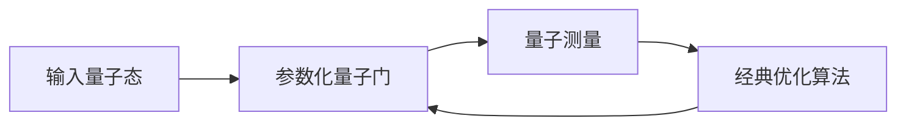

# 一切皆是映射：量子深度学习：下一代AI技术

## 1. 背景介绍
### 1.1 人工智能的发展历程
#### 1.1.1 经典人工智能阶段
#### 1.1.2 机器学习阶段 
#### 1.1.3 深度学习阶段
### 1.2 量子计算的兴起
#### 1.2.1 量子计算的概念
#### 1.2.2 量子计算的优势
#### 1.2.3 量子计算与人工智能的结合
### 1.3 量子深度学习的提出
#### 1.3.1 量子深度学习的定义
#### 1.3.2 量子深度学习的研究现状
#### 1.3.3 量子深度学习的应用前景

## 2. 核心概念与联系
### 2.1 量子位与量子门
#### 2.1.1 量子位的定义与性质
#### 2.1.2 量子门的类型与作用
#### 2.1.3 量子电路的构建
### 2.2 张量网络
#### 2.2.1 张量的基本概念
#### 2.2.2 张量网络的定义与表示
#### 2.2.3 张量网络在量子深度学习中的应用
### 2.3 变分量子电路
#### 2.3.1 变分量子电路的结构
#### 2.3.2 变分量子电路的参数化
#### 2.3.3 变分量子电路的优化算法

## 3. 核心算法原理具体操作步骤
### 3.1 量子神经网络
#### 3.1.1 量子感知机
#### 3.1.2 量子卷积神经网络
#### 3.1.3 量子循环神经网络
### 3.2 量子生成对抗网络
#### 3.2.1 量子生成器
#### 3.2.2 量子判别器
#### 3.2.3 量子GAN的训练过程
### 3.3 量子变分自编码器
#### 3.3.1 量子编码器
#### 3.3.2 量子解码器
#### 3.3.3 量子VAE的训练过程

## 4. 数学模型和公式详细讲解举例说明
### 4.1 量子态的数学表示
#### 4.1.1 Dirac符号
#### 4.1.2 密度矩阵
#### 4.1.3 纯态与混合态
### 4.2 量子电路的数学描述
#### 4.2.1 幺正算符
#### 4.2.2 量子门的矩阵表示
#### 4.2.3 量子电路的矩阵乘积状态
### 4.3 量子测量的数学模型
#### 4.3.1 投影测量
#### 4.3.2 POVM测量
#### 4.3.3 测量对量子态的影响

## 5. 项目实践：代码实例和详细解释说明
### 5.1 使用Qiskit实现量子电路
#### 5.1.1 安装与环境配置
#### 5.1.2 构建量子电路
#### 5.1.3 运行与测量结果分析
### 5.2 使用PennyLane实现量子机器学习
#### 5.2.1 量子数据的编码
#### 5.2.2 构建量子神经网络模型
#### 5.2.3 模型训练与评估
### 5.3 使用TensorFlow Quantum实现量子-经典混合模型
#### 5.3.1 量子电路层的构建
#### 5.3.2 与经典神经网络的结合
#### 5.3.3 端到端的训练与推理

## 6. 实际应用场景
### 6.1 量子化学与药物发现
#### 6.1.1 分子的量子模拟
#### 6.1.2 药物分子的筛选与优化
#### 6.1.3 量子计算在新药研发中的应用
### 6.2 量子金融与风险管理
#### 6.2.1 量子随机数生成
#### 6.2.2 量子加速的蒙特卡洛模拟
#### 6.2.3 量子机器学习在金融领域的应用
### 6.3 量子图像处理与计算机视觉
#### 6.3.1 量子图像表示
#### 6.3.2 量子卷积神经网络在图像分类中的应用
#### 6.3.3 量子生成对抗网络在图像生成中的应用

## 7. 工具和资源推荐
### 7.1 量子计算平台
#### 7.1.1 IBM Quantum Experience
#### 7.1.2 Google Quantum AI
#### 7.1.3 Microsoft Quantum Development Kit
### 7.2 量子软件开发工具包
#### 7.2.1 Qiskit
#### 7.2.2 Cirq
#### 7.2.3 Q#
### 7.3 量子机器学习资源
#### 7.3.1 PennyLane
#### 7.3.2 TensorFlow Quantum
#### 7.3.3 Quantum Machine Learning Toolbox

## 8. 总结：未来发展趋势与挑战
### 8.1 量子深度学习的发展趋势
#### 8.1.1 量子-经典混合模型的探索
#### 8.1.2 量子机器学习的硬件实现
#### 8.1.3 量子深度学习在更多领域的应用
### 8.2 量子深度学习面临的挑战
#### 8.2.1 量子噪声与错误纠正
#### 8.2.2 量子电路的编译与优化
#### 8.2.3 量子机器学习的可解释性
### 8.3 量子深度学习的未来展望
#### 8.3.1 量子人工智能的实现
#### 8.3.2 量子计算与经典计算的融合
#### 8.3.3 量子深度学习在科学发现中的作用

## 9. 附录：常见问题与解答
### 9.1 量子深度学习与经典深度学习的区别
### 9.2 量子深度学习的硬件要求
### 9.3 量子深度学习的学习资源推荐
### 9.4 量子深度学习的应用领域与案例分析
### 9.5 量子深度学习的开源项目与社区

量子深度学习是人工智能领域的一个新兴方向,它将量子计算与深度学习相结合,旨在利用量子计算的独特优势来解决传统深度学习面临的瓶颈和挑战。量子深度学习的核心思想是将量子电路作为神经网络的一部分,通过量子位的叠加和纠缠效应来实现更高效、更强大的信息处理和学习能力。

在量子深度学习中,最基本的单元是量子位(qubit),它可以同时处于 $|0\rangle$ 和 $|1\rangle$ 两个状态的叠加,表示为:

$$|\psi\rangle = \alpha|0\rangle + \beta|1\rangle$$

其中,$\alpha$ 和 $\beta$ 是复数,满足归一化条件 $|\alpha|^2 + |\beta|^2 = 1$。通过量子门(quantum gate)对量子位进行操作,可以实现各种量子计算和信息处理。常见的量子门包括 Hadamard 门、CNOT 门、Pauli-X 门等。

量子深度学习的一个重要概念是张量网络(tensor network),它是一种用于表示和处理量子态的数学工具。张量网络将量子态分解为多个局部张量的乘积,通过连接这些张量来表示量子态之间的纠缠关系。张量网络在处理高维量子态和构建量子电路方面具有独特的优势。

变分量子电路(variational quantum circuit)是量子深度学习中广泛使用的一种模型。它由可调参数的量子门组成,通过优化这些参数来最小化损失函数,实现对量子态的学习和拟合。变分量子电路可以与经典的优化算法(如梯度下降)结合,形成量子-经典混合模型。

下面是一个简单的变分量子电路的示意图:



在量子深度学习中,常见的模型包括量子神经网络(QNN)、量子生成对抗网络(QGAN)和量子变分自编码器(QVAE)等。这些模型通过将量子电路与经典的深度学习架构相结合,实现了量子态的表示学习、生成建模和特征提取等任务。

以量子卷积神经网络(QCNN)为例,它将量子卷积层和量子池化层交替堆叠,形成类似于经典 CNN 的层次结构。量子卷积通过对输入量子态应用一系列参数化的量子门来提取特征,量子池化则通过测量部分量子位来实现下采样。QCNN 在图像分类、语音识别等任务中展现出了优异的性能。

下面是一个使用 Qiskit 实现的简单量子电路的代码示例:

```python
from qiskit import QuantumCircuit, execute, Aer

# 创建量子电路
qc = QuantumCircuit(2, 2)

# 应用量子门
qc.h(0)
qc.cx(0, 1)

# 测量量子位
qc.measure([0,1], [0,1])

# 运行量子电路
backend = Aer.get_backend('qasm_simulator')
result = execute(qc, backend, shots=1024).result()
counts = result.get_counts(qc)

print(counts)
```

上述代码创建了一个包含两个量子位和两个经典位的量子电路,应用了 Hadamard 门和 CNOT 门,然后对量子位进行测量。通过在模拟器上运行量子电路,我们可以得到测量结果的统计分布。

量子深度学习在许多领域都有广泛的应用前景,如量子化学、药物发现、金融风险管理、图像处理等。通过利用量子计算的并行性和干涉效应,量子深度学习有望突破经典深度学习的限制,实现更高效、更智能的人工智能系统。

然而,量子深度学习的发展也面临着诸多挑战。量子噪声和错误是当前量子计算面临的主要障碍,需要开发有效的量子纠错方案。此外,量子电路的编译和优化、量子机器学习模型的可解释性等问题也亟待解决。

未来,量子深度学习有望与经典深度学习实现更紧密的融合,形成量子-经典混合的人工智能范式。通过量子计算的加速和经典算法的鲁棒性,这种混合范式将在复杂问题的求解和科学发现中发挥重要作用。

总之,量子深度学习代表了人工智能发展的新方向和新希望。它将量子计算的优势与深度学习的灵活性相结合,为我们开启了通往智能未来的大门。随着量子硬件的不断进步和量子算法的日益成熟,量子深度学习必将在各个领域掀起新的革命浪潮,推动人工智能迈向更高的台阶。

作者：禅与计算机程序设计艺术 / Zen and the Art of Computer Programming