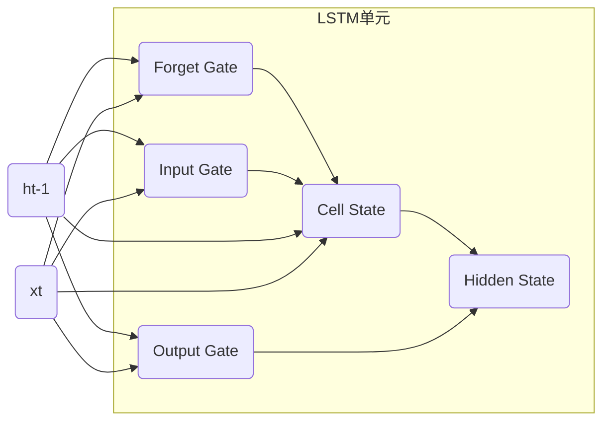

# 一切皆是映射：长短时记忆网络(LSTM)与文本生成

## 1.背景介绍

### 1.1 序列数据处理的挑战

在自然语言处理、语音识别、时间序列预测等领域中,我们经常会遇到需要处理序列数据的情况。序列数据指的是一系列按时间顺序排列的数据,如语音信号、文本等。处理这种数据存在一些固有的挑战:

1. **长期依赖性**:序列数据中的每个元素都可能与其他远处的元素存在依赖关系。例如,在一个句子中,后面的词语可能会受到前面词语的影响。传统的神经网络难以有效地捕捉这种长期依赖性。

2. **数据维度的差异**:不同的序列数据可能具有不同的长度,这给模型的设计和训练带来了挑战。

3. **数据的时间特性**:序列数据具有明显的时间特性,即数据是按时间顺序排列的,这需要模型能够捕捉数据的这种时间动态特征。

### 1.2 循环神经网络(RNN)的局限性

为了解决序列数据处理的挑战,循环神经网络(Recurrent Neural Network, RNN)应运而生。RNN通过引入循环连接,使得网络在处理序列数据时能够捕捉前后元素之间的依赖关系。然而,传统的RNN在处理长序列时存在一些局限性:

1. **梯度消失/爆炸问题**:在反向传播过程中,梯度值会随着时间步的增加而呈指数级衰减或爆炸,这使得RNN难以学习到长期依赖关系。

2. **记忆能力有限**:RNN的隐藏状态只能存储有限的信息,当序列长度增加时,它难以有效地捕捉长期依赖关系。

为了解决这些问题,研究人员提出了长短时记忆网络(Long Short-Term Memory, LSTM),作为RNN的一种改进变体。

## 2.核心概念与联系

### 2.1 LSTM的核心思想

LSTM的核心思想是引入一种称为"细胞状态"(Cell State)的概念,它可以被看作是一条传输带,负责将信息流传递到序列的后续步骤。与此同时,LSTM还设计了一系列专门的门控机制,用于控制信息的流动,从而解决传统RNN存在的梯度消失/爆炸问题,并提高了模型捕捉长期依赖关系的能力。

LSTM中的门控机制包括:

1. **遗忘门(Forget Gate)**: 决定了细胞状态中有多少信息需要被遗忘或保留下来。

2. **输入门(Input Gate)**: 决定了当前时间步的输入信息有多大的权重被更新到细胞状态中。

3. **输出门(Output Gate)**: 决定了细胞状态中的信息有多大的权重被用作当前时间步的输出。

通过这些精心设计的门控机制,LSTM可以灵活地控制信息的流动,从而更好地捕捉长期依赖关系。

### 2.2 LSTM与其他序列模型的关系

除了LSTM之外,还有一些其他的序列模型被广泛使用,如门控循环单元(Gated Recurrent Unit, GRU)、注意力机制(Attention Mechanism)等。

GRU与LSTM有着类似的设计思路,但它的结构更加简单,参数更少。注意力机制则是一种不同的思路,它允许模型在处理序列数据时,动态地关注序列中的不同部分,从而更好地捕捉长期依赖关系。

这些模型各有优缺点,在不同的应用场景下表现也不尽相同。LSTM由于其强大的建模能力,在自然语言处理、语音识别等领域得到了广泛的应用。

## 3.核心算法原理具体操作步骤

### 3.1 LSTM的数学表示

为了更好地理解LSTM的工作原理,我们需要了解其数学表示。LSTM在每个时间步 $t$ 的计算过程可以表示为:

$$
\begin{aligned}
f_t &= \sigma(W_f \cdot [h_{t-1}, x_t] + b_f) \\
i_t &= \sigma(W_i \cdot [h_{t-1}, x_t] + b_i) \\
\tilde{C}_t &= \tanh(W_C \cdot [h_{t-1}, x_t] + b_C) \\
C_t &= f_t \odot C_{t-1} + i_t \odot \tilde{C}_t \\
o_t &= \sigma(W_o \cdot [h_{t-1}, x_t] + b_o) \\
h_t &= o_t \odot \tanh(C_t)
\end{aligned}
$$

其中:

- $f_t$ 表示遗忘门,决定了有多少信息需要从细胞状态中遗忘。
- $i_t$ 表示输入门,决定了有多少新的信息需要被更新到细胞状态中。
- $\tilde{C}_t$ 是一个候选值,表示基于当前输入和前一个隐藏状态计算出的新的细胞状态信息。
- $C_t$ 是最终的细胞状态,由上一个细胞状态 $C_{t-1}$ 和当前候选值 $\tilde{C}_t$ 计算得到。
- $o_t$ 表示输出门,决定了细胞状态中有多少信息被用作当前时间步的输出。
- $h_t$ 是当前时间步的隐藏状态,由细胞状态 $C_t$ 和输出门 $o_t$ 计算得到。

其中,  $\sigma$ 表示sigmoid激活函数,  $\odot$ 表示元素wise乘积操作。 $W$ 和 $b$ 分别表示权重矩阵和偏置向量,是LSTM的可训练参数。

通过上述门控机制和细胞状态的设计,LSTM能够有效地捕捉长期依赖关系,并避免了梯度消失/爆炸问题。

### 3.2 LSTM的前向传播过程

LSTM的前向传播过程可以用以下伪代码表示:

```python
for each time step t:
    # 计算遗忘门
    ft = sigmoid(Wf * [ht-1, xt] + bf)
    
    # 计算输入门
    it = sigmoid(Wi * [ht-1, xt] + bi)
    
    # 计算候选细胞状态
    ct_candidate = tanh(Wc * [ht-1, xt] + bc)
    
    # 更新细胞状态
    ct = ft * ct-1 + it * ct_candidate
    
    # 计算输出门
    ot = sigmoid(Wo * [ht-1, xt] + bo)
    
    # 计算隐藏状态
    ht = ot * tanh(ct)
```

这个过程可以被可视化为以下流程图:



在这个过程中,LSTM单元根据当前输入 $x_t$ 和上一时间步的隐藏状态 $h_{t-1}$ 计算出各个门的值,然后更新细胞状态 $C_t$ 和隐藏状态 $h_t$。这种设计使得LSTM能够灵活地控制信息的流动,从而更好地捕捉长期依赖关系。

## 4.数学模型和公式详细讲解举例说明

在上一节中,我们介绍了LSTM的数学表示和前向传播过程。现在,让我们通过一个具体的例子来更深入地理解LSTM的工作原理。

假设我们有一个简单的序列数据 $X = [x_1, x_2, x_3, x_4]$,其中每个 $x_i$ 是一个向量,表示该时间步的输入。我们将使用一个单层LSTM来处理这个序列数据。

### 4.1 初始化

在开始计算之前,我们需要初始化LSTM的状态,包括细胞状态 $C_0$ 和隐藏状态 $h_0$。通常,我们将它们初始化为全零向量。

$$
C_0 = \vec{0}, \quad h_0 = \vec{0}
$$

### 4.2 时间步 $t=1$

在第一个时间步,我们将输入 $x_1$ 和初始状态 $C_0$, $h_0$ 传入LSTM单元,计算各个门的值和新的状态:

$$
\begin{aligned}
f_1 &= \sigma(W_f \cdot [h_0, x_1] + b_f) \\
i_1 &= \sigma(W_i \cdot [h_0, x_1] + b_i) \\
\tilde{C}_1 &= \tanh(W_C \cdot [h_0, x_1] + b_C) \\
C_1 &= f_1 \odot C_0 + i_1 \odot \tilde{C}_1 \\
o_1 &= \sigma(W_o \cdot [h_0, x_1] + b_o) \\
h_1 &= o_1 \odot \tanh(C_1)
\end{aligned}
$$

在这个过程中,LSTM单元根据输入 $x_1$ 和初始状态计算出各个门的值,然后更新细胞状态 $C_1$ 和隐藏状态 $h_1$。

### 4.3 时间步 $t=2$

在第二个时间步,我们将输入 $x_2$ 和上一时间步的状态 $C_1$, $h_1$ 传入LSTM单元,计算新的状态:

$$
\begin{aligned}
f_2 &= \sigma(W_f \cdot [h_1, x_2] + b_f) \\
i_2 &= \sigma(W_i \cdot [h_1, x_2] + b_i) \\
\tilde{C}_2 &= \tanh(W_C \cdot [h_1, x_2] + b_C) \\
C_2 &= f_2 \odot C_1 + i_2 \odot \tilde{C}_2 \\
o_2 &= \sigma(W_o \cdot [h_1, x_2] + b_o) \\
h_2 &= o_2 \odot \tanh(C_2)
\end{aligned}
$$

在这个时间步,LSTM单元根据输入 $x_2$ 和上一时间步的状态 $C_1$, $h_1$ 计算出新的状态 $C_2$, $h_2$。

### 4.4 后续时间步

对于后续的时间步 $t=3, 4, \dots$,我们按照相同的方式计算新的状态:

$$
\begin{aligned}
f_t &= \sigma(W_f \cdot [h_{t-1}, x_t] + b_f) \\
i_t &= \sigma(W_i \cdot [h_{t-1}, x_t] + b_i) \\
\tilde{C}_t &= \tanh(W_C \cdot [h_{t-1}, x_t] + b_C) \\
C_t &= f_t \odot C_{t-1} + i_t \odot \tilde{C}_t \\
o_t &= \sigma(W_o \cdot [h_{t-1}, x_t] + b_o) \\
h_t &= o_t \odot \tanh(C_t)
\end{aligned}
$$

通过这种递归的方式,LSTM能够逐步处理整个序列数据,并在每个时间步更新细胞状态和隐藏状态。最终,我们可以获得整个序列的隐藏状态表示 $[h_1, h_2, h_3, h_4]$,这些隐藏状态可以被用于下游任务,如文本生成、机器翻译等。

通过上述例子,我们可以更好地理解LSTM的工作原理。LSTM通过引入细胞状态和门控机制,能够有效地捕捉长期依赖关系,并避免了传统RNN存在的梯度消失/爆炸问题。

## 5.项目实践:代码实例和详细解释说明

为了更好地理解LSTM的实现,我们将使用Python和PyTorch框架来构建一个简单的LSTM模型,用于文本生成任务。

### 5.1 数据准备

首先,我们需要准备一些文本数据