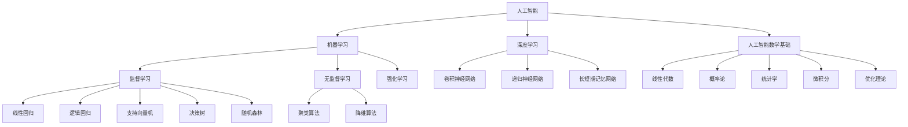

# 人工智能数学基础原理与代码实战案例讲解

## 1. 背景介绍

### 1.1 人工智能的兴起

人工智能(Artificial Intelligence, AI)是当代科技领域最具革命性和颠覆性的技术之一。近年来,AI的发展如火如荼,在多个领域取得了突破性进展,引发了科技界和社会的广泛关注和热议。

### 1.2 人工智能的重要性

人工智能技术的快速发展正在深刻影响和改变着我们的生活、工作和社会。它在诸如计算机视觉、自然语言处理、决策系统、机器人技术等领域发挥着越来越重要的作用,为解决复杂问题提供了新的思路和方法。

### 1.3 数学在人工智能中的作用

数学是人工智能的基石,是理解和掌握AI核心原理和算法的关键。许多人工智能算法和模型的基础都植根于数学理论,如概率论、统计学、线性代数、微积分、优化理论等。掌握人工智能数学基础,有助于更深入地理解AI技术的本质,提高对算法和模型的洞察力。

## 2. 核心概念与联系

### 2.1 机器学习

机器学习(Machine Learning)是人工智能的核心子领域,旨在使计算机系统能够从数据中自动学习和提高性能,而无需显式编程。常见的机器学习算法包括监督学习、无监督学习和强化学习等。

#### 2.1.1 监督学习

监督学习(Supervised Learning)是机器学习中最常见的一种范式。它使用带有标签的训练数据,通过学习输入和输出之间的映射关系,建立预测模型。常见的监督学习算法包括线性回归、逻辑回归、支持向量机、决策树、随机森林等。

#### 2.1.2 无监督学习

无监督学习(Unsupervised Learning)则不需要标签数据,它从未标记的数据中发现内在结构和模式。常见的无监督学习算法包括聚类算法(如K-Means聚类)和降维算法(如主成分分析)。

#### 2.1.3 强化学习

强化学习(Reinforcement Learning)是一种基于奖励或惩罚的学习范式,代理通过与环境交互并获得反馈来学习最优策略。强化学习在游戏AI、机器人控制等领域有广泛应用。

### 2.2 深度学习

深度学习(Deep Learning)是机器学习的一个子集,它利用深层神经网络模型来学习数据特征,并应用于各种任务,如计算机视觉、自然语言处理等。常见的深度学习模型包括卷积神经网络(CNN)、递归神经网络(RNN)、长短期记忆网络(LSTM)等。

### 2.3 人工智能数学基础

人工智能数学基础包括多个分支,如线性代数、概率论、统计学、微积分、优化理论等。这些数学理论为机器学习和深度学习算法奠定了坚实的理论基础,是理解和掌握AI技术的必备知识。

## 3. 核心算法原理具体操作步骤

### 3.1 线性回归

线性回归是监督学习中最基本和常用的算法之一,用于预测连续型目标变量。它假设目标变量和特征变量之间存在线性关系,并尝试找到最佳拟合直线。

线性回归算法的核心步骤如下:

1. **数据预处理**: 对输入数据进行标准化或归一化处理,使特征值在相似的数量级。
2. **定义代价函数**: 通常使用最小二乘法定义代价函数,即目标是最小化预测值与实际值之间的平方误差之和。
3. **梯度下降**: 使用梯度下降优化算法,迭代更新模型参数(权重和偏置),最小化代价函数。
4. **模型评估**: 在测试数据集上评估模型性能,使用指标如均方根误差(RMSE)或决定系数(R^2)。

线性回归虽然简单,但在许多实际问题中仍然有效,并为更复杂的机器学习模型奠定了基础。

### 3.2 逻辑回归

逻辑回归是监督学习中常用的分类算法,用于预测离散型目标变量(如二元分类)。它通过对数几率(logit)函数将线性回归的输出值映射到0到1之间的概率值。

逻辑回归算法的核心步骤如下:

1. **数据预处理**: 对输入数据进行标准化或归一化处理。
2. **定义代价函数**: 通常使用交叉熵(Cross-Entropy)作为代价函数。
3. **梯度下降**: 使用梯度下降优化算法,迭代更新模型参数,最小化代价函数。
4. **模型评估**: 在测试数据集上评估模型性能,使用指标如准确率、精确率、召回率等。
5. **概率阈值调整**: 根据实际需求调整分类阈值,平衡精确率和召回率。

逻辑回归简单且可解释性强,在许多二元分类问题中表现良好,如垃圾邮件检测、疾病诊断等。

### 3.3 支持向量机

支持向量机(Support Vector Machine, SVM)是一种强大的监督学习模型,可用于分类和回归任务。它的基本思想是在高维空间中找到一个超平面,将不同类别的数据点分开,并最大化边界的间隔。

SVM算法的核心步骤如下:

1. **数据预处理**: 对输入数据进行标准化或归一化处理。
2. **选择核函数**: 选择合适的核函数(如线性核、多项式核、高斯核等),将数据映射到高维特征空间。
3. **求解对偶问题**: 通过求解对偶问题(Dual Problem)来找到最优超平面,这涉及到求解一个二次规划(Quadratic Programming)问题。
4. **模型评估**: 在测试数据集上评估模型性能,使用指标如准确率、F1分数等。

SVM在高维空间中寻找最优超平面,具有良好的泛化能力,尤其适用于小样本数据集。它还可以通过核技巧(Kernel Trick)有效地处理非线性问题。

### 3.4 K-Means聚类

K-Means是一种常用的无监督学习算法,用于对未标记的数据进行聚类。它将数据划分为K个簇,每个数据点被分配到与其最近的簇中心。

K-Means算法的核心步骤如下:

1. **初始化簇中心**: 随机选择K个数据点作为初始簇中心。
2. **分配数据点**: 计算每个数据点与各个簇中心的距离,将其分配到最近的簇中心所在的簇。
3. **更新簇中心**: 计算每个簇中所有数据点的均值,将簇中心移动到该均值位置。
4. **迭代优化**: 重复步骤2和3,直到簇中心不再发生显著变化或达到最大迭代次数。

K-Means算法简单且高效,但存在一些局限性,如对初始簇中心的选择敏感、难以处理非凸形状的簇等。因此,在实际应用中需要结合具体问题进行调整和优化。

### 3.5 主成分分析

主成分分析(Principal Component Analysis, PCA)是一种常用的无监督学习技术,用于降维和数据可视化。它通过线性变换将原始高维数据投影到一个低维子空间,同时尽可能保留数据的方差。

PCA算法的核心步骤如下:

1. **中心化数据**: 将数据的均值减去,使其均值为0。
2. **计算协方差矩阵**: 计算数据的协方差矩阵。
3. **求解特征值和特征向量**: 对协方差矩阵进行特征值分解,得到特征值和对应的特征向量。
4. **选择主成分**: 选择具有最大特征值的前K个特征向量作为主成分。
5. **投影数据**: 将原始数据投影到由主成分构成的低维子空间中。

PCA常用于数据压缩、噪声去除和可视化等任务。它通过保留最大方差的主成分,有效地捕捉了数据的主要结构和特征。

## 4. 数学模型和公式详细讲解举例说明

### 4.1 线性回归模型

线性回归模型假设目标变量 $y$ 和特征变量 $\mathbf{x}$ 之间存在线性关系,可以表示为:

$$y = \mathbf{w}^T\mathbf{x} + b$$

其中 $\mathbf{w}$ 是权重向量, $b$ 是偏置项。

我们通常使用最小二乘法来估计模型参数 $\mathbf{w}$ 和 $b$,即最小化以下代价函数:

$$J(\mathbf{w}, b) = \frac{1}{2m}\sum_{i=1}^m(y^{(i)} - \mathbf{w}^T\mathbf{x}^{(i)} - b)^2$$

其中 $m$ 是训练样本数量。

通过梯度下降法,我们可以迭代更新参数:

$$\mathbf{w} := \mathbf{w} - \alpha\frac{\partial J}{\partial \mathbf{w}}$$
$$b := b - \alpha\frac{\partial J}{\partial b}$$

其中 $\alpha$ 是学习率,决定了每次更新的步长。

### 4.2 逻辑回归模型

逻辑回归模型用于二元分类问题,它将线性回归的输出值映射到0到1之间的概率值。

给定输入特征向量 $\mathbf{x}$,逻辑回归模型计算目标变量为1的概率为:

$$P(y=1|\mathbf{x}) = \sigma(\mathbf{w}^T\mathbf{x} + b)$$

其中 $\sigma(z) = \frac{1}{1 + e^{-z}}$ 是sigmoid函数。

我们通常使用交叉熵作为代价函数:

$$J(\mathbf{w}, b) = -\frac{1}{m}\sum_{i=1}^m[y^{(i)}\log(P(y=1|\mathbf{x}^{(i)})) + (1 - y^{(i)})\log(1 - P(y=1|\mathbf{x}^{(i)}))]$$

同样使用梯度下降法迭代更新参数。

### 4.3 支持向量机模型

支持向量机(SVM)是一种有监督学习模型,用于分类和回归任务。它的基本思想是在高维空间中找到一个最优超平面,将不同类别的数据点分开,并最大化边界的间隔。

对于线性可分的二元分类问题,SVM模型可以表示为:

$$\min_{\mathbf{w}, b} \frac{1}{2}\|\mathbf{w}\|^2$$
$$\text{subject to } y^{(i)}(\mathbf{w}^T\mathbf{x}^{(i)} + b) \geq 1, i = 1, \dots, m$$

其中 $\mathbf{w}$ 是权重向量, $b$ 是偏置项,约束条件确保每个训练样本都被正确分类,且距离超平面的距离至少为 $\frac{1}{\|\mathbf{w}\|}$。

对于非线性问题,我们可以引入核函数 $K(\mathbf{x}, \mathbf{x}')$,将数据映射到高维特征空间,从而实现非线性分类或回归。

### 4.4 K-Means聚类模型

K-Means聚类算法的目标是将 $m$ 个数据点 $\{\mathbf{x}^{(1)}, \mathbf{x}^{(2)}, \dots, \mathbf{x}^{(m)}\}$ 划分为 $K