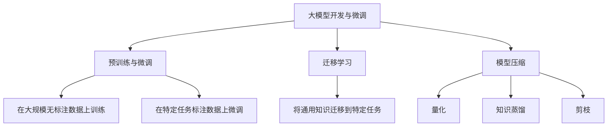
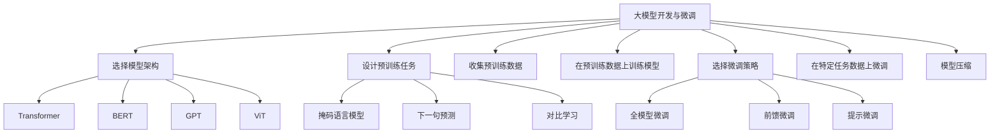

# 从零开始大模型开发与微调：模型的设计

## 1. 背景介绍

在当前的人工智能领域,大型语言模型已经成为了炙手可热的技术。这些模型通过在海量数据上进行预训练,学习到了丰富的语义和世界知识,展现出了惊人的泛化能力。无论是在自然语言处理、计算机视觉还是其他领域,大模型都取得了令人瞩目的成就。

然而,训练这样的大模型需要耗费大量的计算资源,对于普通开发者而言,从头开始训练一个大模型是一个巨大的挑战。因此,如何在有限的资源下开发和微调大模型,成为了一个亟待解决的问题。本文将探讨大模型开发的关键环节——模型设计,并提供一些实用的技巧和最佳实践。

## 2. 核心概念与联系

在深入探讨模型设计之前,我们需要先了解一些核心概念:

### 2.1 预训练与微调

预训练(Pre-training)是指在大规模无标注数据上训练模型,使其学习到通用的语义和世界知识。而微调(Fine-tuning)则是在特定任务的标注数据上,对预训练模型进行进一步的调整和优化。

预训练和微调的分离使得我们可以在有限的资源下,快速开发针对特定任务的大模型。我们只需要在预训练的基础上进行微调,就可以获得性能出色的模型,而无需从头开始训练。

### 2.2 迁移学习

迁移学习(Transfer Learning)是指将在一个领域学习到的知识应用到另一个领域。在大模型开发中,我们可以利用预训练模型在通用数据上学习到的知识,并将其迁移到特定任务中。

迁移学习可以极大地提高模型的训练效率,降低对标注数据的需求。同时,它也为我们提供了一种快速开发新模型的途径,而不必从头开始训练。

### 2.3 模型压缩

由于大模型通常包含数十亿甚至上千亿个参数,因此它们的存储和推理成本都非常高。模型压缩(Model Compression)技术旨在减小模型的size,从而降低其存储和推理开销。

常见的模型压缩技术包括量化(Quantization)、知识蒸馏(Knowledge Distillation)和剪枝(Pruning)等。通过这些技术,我们可以在保持模型性能的同时,大幅减小其size,从而使其更易于部署和应用。

## 3. 核心算法原理具体操作步骤

在设计大模型时,我们需要考虑多个关键因素,包括模型架构、预训练任务、微调策略等。下面我们将逐一探讨这些因素,并给出具体的操作步骤。

### 3.1 模型架构选择

模型架构直接决定了模型的表现能力和效率。常见的大模型架构包括Transformer、BERT、GPT、ViT等。在选择架构时,我们需要权衡模型的性能、参数量和推理速度等因素。

一般来说,对于自然语言处理任务,Transformer和BERT是较好的选择;对于计算机视觉任务,ViT则更加合适。同时,我们也可以根据具体需求,设计定制的模型架构。

### 3.2 预训练任务设计

预训练任务的设计直接影响着模型学习到的知识类型和质量。常见的预训练任务包括掩码语言模型(Masked Language Modeling)、下一句预测(Next Sentence Prediction)、对比学习(Contrastive Learning)等。

在设计预训练任务时,我们需要考虑任务与下游应用的相关性,以及任务本身的难度和有效性。通常,组合多种预训练任务可以获得更好的效果。

此外,预训练数据的质量和规模也至关重要。我们应该尽可能收集高质量、多样化的数据,以确保模型学习到丰富的知识。

### 3.3 微调策略选择

微调是将预训练模型应用到特定任务的关键步骤。常见的微调策略包括全模型微调(Full Model Fine-tuning)、前馈微调(Prefix-tuning)、提示微调(Prompt-tuning)等。

全模型微调是最直接的方式,但也是最耗费资源的。前馈微调和提示微调则只需要微调模型的一小部分参数,因此更加高效。在选择微调策略时,我们需要权衡性能和效率之间的平衡。

同时,我们还需要确定合适的微调超参数,如学习率、批量大小、训练轮数等,以获得最佳的模型性能。

### 3.4 算法步骤总结

1. 选择合适的模型架构,如Transformer、BERT、GPT或ViT等。
2. 设计预训练任务,如掩码语言模型、下一句预测或对比学习等,并收集高质量的预训练数据。
3. 在预训练数据上训练模型,获得预训练模型。
4. 选择合适的微调策略,如全模型微调、前馈微调或提示微调等。
5. 在特定任务的标注数据上,对预训练模型进行微调,获得针对该任务的模型。
6. 根据需要,对微调后的模型进行模型压缩,以降低其存储和推理开销。

## 4. 数学模型和公式详细讲解举例说明

在大模型中,数学模型和公式扮演着至关重要的角色。它们不仅描述了模型的内部结构和运作机制,也为我们优化和改进模型提供了理论基础。下面我们将详细讲解一些常见的数学模型和公式。

### 4.1 Transformer模型

Transformer是当前最流行的序列到序列(Sequence-to-Sequence)模型架构之一。它完全基于注意力机制(Attention Mechanism),摒弃了传统的循环神经网络和卷积神经网络结构。

Transformer的核心思想是通过自注意力(Self-Attention)机制,捕捉输入序列中任意两个位置之间的依赖关系。自注意力的计算公式如下:

$$\mathrm{Attention}(Q, K, V) = \mathrm{softmax}(\frac{QK^T}{\sqrt{d_k}})V$$

其中,$$Q$$、$$K$$和$$V$$分别表示查询(Query)、键(Key)和值(Value),它们都是通过线性变换得到的。$$d_k$$是缩放因子,用于防止点积过大导致梯度消失。

在实际应用中,我们通常使用多头注意力(Multi-Head Attention),将注意力机制应用于不同的子空间,从而捕捉更丰富的依赖关系。多头注意力的计算公式如下:

$$\mathrm{MultiHead}(Q, K, V) = \mathrm{Concat}(\mathrm{head}_1, \ldots, \mathrm{head}_h)W^O$$
$$\mathrm{head}_i = \mathrm{Attention}(QW_i^Q, KW_i^K, VW_i^V)$$

其中,$$W_i^Q$$、$$W_i^K$$和$$W_i^V$$是不同头的线性变换矩阵,$$W^O$$是最终的线性变换矩阵。

除了自注意力机制,Transformer还引入了位置编码(Positional Encoding)来捕捉序列的位置信息。位置编码的公式如下:

$$\mathrm{PE}_{(pos, 2i)} = \sin(pos / 10000^{2i / d_\mathrm{model}})$$
$$\mathrm{PE}_{(pos, 2i+1)} = \cos(pos / 10000^{2i / d_\mathrm{model}})$$

其中,$$pos$$表示位置索引,$$i$$表示维度索引,$$d_\mathrm{model}$$是模型的embedding维度。

通过上述机制,Transformer能够有效地建模序列数据,并在诸多自然语言处理和计算机视觉任务中取得卓越的表现。

### 4.2 BERT模型

BERT(Bidirectional Encoder Representations from Transformers)是一种基于Transformer的双向编码器模型,被广泛应用于各种自然语言处理任务中。

BERT的核心思想是通过掩码语言模型(Masked Language Modeling)和下一句预测(Next Sentence Prediction)两个预训练任务,学习到双向的上下文表示。

在掩码语言模型中,我们随机将输入序列中的一些词替换为特殊的[MASK]标记,然后让模型预测这些被掩码的词。这个过程可以用下式表示:

$$\mathcal{L}_\mathrm{MLM} = -\mathbb{E}_{x \sim X_\mathrm{masked}}\left[\sum_{t=1}^T \log P(x_t | x_{\backslash t})\right]$$

其中,$$X_\mathrm{masked}$$表示包含[MASK]标记的输入序列,$$x_t$$表示第$$t$$个位置的词,$$x_{\backslash t}$$表示除了$$x_t$$之外的其他词。

在下一句预测任务中,我们给定两个句子$$A$$和$$B$$,让模型预测$$B$$是否为$$A$$的下一句。这个过程可以用下式表示:

$$\mathcal{L}_\mathrm{NSP} = -\mathbb{E}_{(A, B) \sim D}\left[\log P(y | A, B)\right]$$

其中,$$D$$表示句子对的数据分布,$$y$$表示$$B$$是否为$$A$$的下一句的标签。

通过组合这两个预训练任务,BERT能够学习到双向的上下文表示,并在诸多自然语言处理任务中取得了卓越的表现。

### 4.3 GPT模型

GPT(Generative Pre-trained Transformer)是一种基于Transformer的自回归语言模型,被广泛应用于文本生成、机器翻译等任务中。

与BERT不同,GPT采用了单向的语言模型预训练,即只考虑当前词的左侧上下文。这种设计使得GPT能够更好地捕捉语言的顺序性,从而在文本生成任务中表现出色。

GPT的预训练目标是最大化下式中的对数似然:

$$\mathcal{L}_\mathrm{LM} = -\mathbb{E}_{x \sim D}\left[\sum_{t=1}^T \log P(x_t | x_{<t})\right]$$

其中,$$D$$表示文本数据的分布,$$x_t$$表示第$$t$$个位置的词,$$x_{<t}$$表示该词之前的所有词。

在预训练过程中,GPT通过自回归的方式,逐个预测序列中的每个词,从而学习到语言的顺序性和语义信息。

除了原始的GPT模型,还有一些改进版本,如GPT-2和GPT-3等,它们在预训练数据规模和模型规模上都有所提升,展现出了更强大的文本生成能力。

### 4.4 ViT模型

ViT(Vision Transformer)是一种基于Transformer的视觉模型,被广泛应用于图像分类、目标检测等计算机视觉任务中。

与传统的卷积神经网络不同,ViT直接将图像分割为一系列patches(图像块),并将这些patches序列化输入到Transformer编码器中。通过自注意力机制,ViT能够有效地捕捉图像中任意两个patches之间的长程依赖关系。

在预训练过程中,ViT采用了掩码图像编码(Masked Image Encoding)的策略,即随机将一部分patches替换为特殊的[MASK]标记,然后让模型