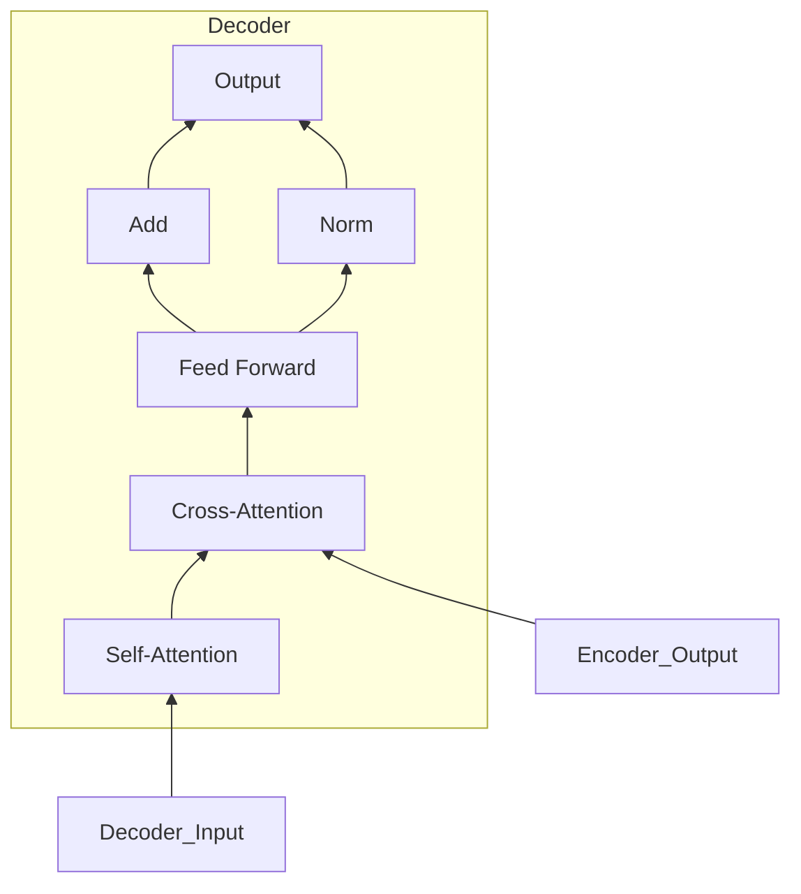

# 从零开始大模型开发与微调：解码器的核心—注意力模型

## 1. 背景介绍
### 1.1 大模型概述
近年来,随着深度学习技术的快速发展,大规模预训练语言模型(Large Pre-trained Language Models,PLMs)在自然语言处理(Natural Language Processing,NLP)领域取得了突破性进展。这些大模型通过在海量无标注文本数据上进行自监督预训练,可以学习到丰富的语言知识和通用语义表征,在下游NLP任务中表现出优异的性能。代表性的大模型包括BERT、GPT、T5、BART等。

### 1.2 大模型的应用
大模型强大的语言理解和生成能力,使其在机器翻译、对话系统、问答系统、文本摘要等诸多NLP应用中得到广泛使用。通过在特定领域数据上微调大模型,可以快速构建高质量的定制化NLP系统,大大降低了开发成本。同时,大模型还为探索更加通用和鲁棒的人工智能系统提供了新的思路。

### 1.3 注意力模型在大模型中的重要性
注意力机制(Attention Mechanism)是深度学习中一种广泛使用的技术,尤其在序列建模任务中表现出色。它允许模型根据输入序列的不同位置,自适应地分配不同的注意力权重,从而捕捉序列中的长距离依赖关系。在大模型的架构设计中,注意力模型是其核心组件之一。作为解码器的关键模块,注意力模型在生成高质量的输出序列方面发挥着至关重要的作用。

本文将深入探讨注意力模型在大模型中的原理和应用,从数学模型到工程实践,全面解析这一关键技术。通过本文,读者将掌握注意力模型的核心概念,了解其在大模型中的实现细节,并学会如何在实际项目中应用注意力模型构建高性能的NLP系统。

## 2. 核心概念与联系
### 2.1 注意力机制
注意力机制的核心思想是,在处理输入序列时,模型不是平等地对待每个位置的信息,而是根据任务的需要,有选择性地关注序列中的不同部分。形式化地,对于输入序列 $\mathbf{x}=(x_1,\dots,x_n)$,注意力机制会产生一个权重向量 $\mathbf{a}=(a_1,\dots,a_n)$,其中 $a_i$ 表示模型在当前步骤对位置 $i$ 的关注程度。注意力权重 $\mathbf{a}$ 通常由模型基于输入序列自适应计算得到。

### 2.2 Seq2Seq模型
Seq2Seq(Sequence-to-Sequence)模型是一种广泛用于序列生成任务的神经网络架构,由编码器(Encoder)和解码器(Decoder)两部分组成。编码器将输入序列编码为一个固定长度的向量表示,解码器根据该表示生成目标输出序列。Seq2Seq模型最初采用RNN(Recurrent Neural Network)实现,后来发展出了基于注意力机制的改进版本。

### 2.3 Transformer模型
Transformer是一种完全基于注意力机制的序列建模架构,摒弃了传统的RNN结构。它同样由编码器和解码器组成,但两者都采用了自注意力(Self-Attention)和多头注意力(Multi-Head Attention)机制。自注意力允许序列中的每个位置都能与其他位置建立直接的依赖关系;多头注意力则通过并行计算多个注意力函数,增强了模型的表达能力。Transformer在机器翻译等任务上取得了显著的性能提升。

### 2.4 预训练语言模型
预训练语言模型的思路是,先在大规模无标注文本数据上进行自监督预训练,学习通用的语言表征;然后在特定任务的标注数据上进行微调,使模型适应下游任务。这种预训练-微调范式允许模型充分利用无标注数据,显著提升了模型的性能和泛化能力。代表性的预训练语言模型包括BERT、GPT、XLNet等,它们在多个NLP任务上取得了state-of-the-art的结果。

### 2.5 大模型的解码器
在大模型的Seq2Seq架构中,解码器负责根据编码器的输出表示,自回归地生成目标序列。传统的解码器采用RNN实现,每一步的输出都依赖于之前的隐状态。而基于注意力机制的解码器,如Transformer解码器,则通过注意力机制直接建模输出序列内部的依赖关系。解码器中的注意力模型通过计算当前生成位置与输入序列和已生成序列的注意力权重,实现了对输入信息的选择性利用和对历史信息的记忆。

下图展示了注意力模型在Transformer解码器中的示意图:

从上到下依次经过自注意力层、交叉注意力层和前馈神经网络,最终产生解码器的输出。自注意力层捕捉输出序列内部的依赖,交叉注意力层建立输出序列与编码器表示的联系,前馈网络进行非线性变换。

综上,注意力模型作为解码器的核心组件,与预训练语言模型、Seq2Seq结构等一起,构成了大模型的关键技术基础。深入理解注意力模型的原理和应用,对于掌握大模型的开发与优化至关重要。

## 3. 核心算法原理与具体操作步骤
本节将详细介绍注意力模型的核心算法原理,并给出具体的操作步骤。我们以Transformer中的注意力机制为例进行说明。

### 3.1 Scaled Dot-Product Attention
Transformer采用了Scaled Dot-Product Attention作为基本的注意力计算单元。其输入包括三个矩阵:Query矩阵 $\mathbf{Q}$、Key矩阵 $\mathbf{K}$ 和 Value矩阵 $\mathbf{V}$。注意力函数的计算过程如下:

$$
\text{Attention}(\mathbf{Q}, \mathbf{K}, \mathbf{V}) = \text{softmax}(\frac{\mathbf{Q}\mathbf{K}^T}{\sqrt{d_k}})\mathbf{V}
$$

其中,$d_k$ 是Query和Key向量的维度。具体操作步骤如下:

1. 将Query矩阵 $\mathbf{Q}$ 与Key矩阵 $\mathbf{K}$ 的转置进行矩阵乘法,得到注意力分数矩阵。
2. 将注意力分数矩阵除以 $\sqrt{d_k}$ 进行缩放,以提高梯度稳定性。
3. 对缩放后的注意力分数矩阵应用softmax函数,得到注意力权重矩阵。
4. 将注意力权重矩阵与Value矩阵 $\mathbf{V}$ 相乘,得到注意力输出。

直观地理解,注意力分数矩阵衡量了Query向量与每个Key向量之间的相似度,经过softmax归一化后得到注意力权重,表示了Query对不同Value的关注程度。最终的注意力输出是Value的加权求和,权重由注意力权重决定。

### 3.2 Multi-Head Attention
Multi-Head Attention通过并行计算多个独立的注意力函数,增强了模型的表达能力。其计算过程如下:

$$
\begin{aligned}
\text{MultiHead}(\mathbf{Q}, \mathbf{K}, \mathbf{V}) &= \text{Concat}(\text{head}_1, \dots, \text{head}_h)\mathbf{W}^O \\
\text{where head}_i &= \text{Attention}(\mathbf{Q}\mathbf{W}_i^Q, \mathbf{K}\mathbf{W}_i^K, \mathbf{V}\mathbf{W}_i^V)
\end{aligned}
$$

其中,$\mathbf{W}_i^Q$,$\mathbf{W}_i^K$,$\mathbf{W}_i^V$ 和 $\mathbf{W}^O$ 是可学习的权重矩阵。具体操作步骤如下:

1. 使用不同的权重矩阵将Query、Key、Value映射到 $h$ 个子空间,得到 $h$ 组子Query、子Key、子Value矩阵。
2. 对每组子Query、子Key、子Value矩阵应用Scaled Dot-Product Attention,得到 $h$ 个注意力头(head)。
3. 将 $h$ 个注意力头拼接(Concat)起来,并乘以输出权重矩阵 $\mathbf{W}^O$,得到最终的Multi-Head Attention输出。

Multi-Head Attention允许模型在不同的子空间中捕捉输入序列的不同方面的信息,提高了注意力机制的效果。

### 3.3 Self-Attention与Masked Self-Attention
在Transformer的编码器中,使用Self-Attention来捕捉输入序列内部的依赖关系。此时,Query、Key、Value矩阵都来自同一个输入序列的嵌入表示。

在解码器中,为了避免在生成第 $t$ 个token时利用到未来的信息,需要对Self-Attention进行掩码(mask)操作。具体地,在计算注意力分数矩阵时,将未来位置(即 $i>t$ )的注意力分数设置为负无穷大,经过softmax后,这些位置的注意力权重就会变为0,从而实现了对未来信息的掩蔽。

### 3.4 Position-wise Feed-Forward Network
在Transformer的编码器和解码器中,注意力层之后都会接一个Position-wise Feed-Forward Network(FFN)。FFN对每个位置的向量分别应用两层全连接网络,增强了模型的非线性表达能力。FFN的计算公式为:

$$
\text{FFN}(\mathbf{x}) = \text{ReLU}(\mathbf{x}\mathbf{W}_1 + \mathbf{b}_1)\mathbf{W}_2 + \mathbf{b}_2
$$

其中,$\mathbf{W}_1$,$\mathbf{W}_2$,$\mathbf{b}_1$,$\mathbf{b}_2$ 是可学习的参数。

### 3.5 残差连接与Layer Normalization
为了促进梯度的反向传播和训练的稳定性,Transformer在每个子层(Self-Attention、FFN)之后都会加入残差连接(Residual Connection)和Layer Normalization。

残差连接将子层的输入与输出相加,使得梯度可以直接流向前面的层。Layer Normalization在批次维度上对向量进行归一化,加速了模型的收敛。二者的结合形式为:

$$
\text{Output} = \text{LayerNorm}(\mathbf{x} + \text{Sublayer}(\mathbf{x}))
$$

其中,$\text{Sublayer}(\cdot)$ 表示Self-Attention或FFN子层。

通过以上核心算法和操作步骤,Transformer解码器中的注意力模型可以高效地建模输出序列的内部依赖和与输入序列的交互,生成高质量的目标序列。在实际应用中,我们还需要考虑位置编码、训练策略、推断加速等工程细节,以进一步提升模型的性能。

## 4. 数学模型与公式详解
本节将深入解析注意力模型中涉及的关键数学概念和公式,帮助读者更好地理解其内在原理。

### 4.1 Softmax函数
Softmax函数是注意力模型中的核心操作,用于将注意力分数转化为归一化的概率分布。对于一个实值向量 $\mathbf{z}=(z_1,\dots,z_n)$,Softmax函数的定义为:

$$
\text{softmax}(\mathbf{z})_i = \frac{\exp(z_i)}{\sum_{j=1}^n \exp(z_j)}
$$

其中,$\text{softmax}(\mathbf{z})_i$ 表示第 $i$ 个元素的Softmax值。Softmax函数具有以下性质:

1. 单调性:如果 $z_i > z_j$,则 $\text{softmax}(\mathbf{z})_i > \text{softmax}(\mathbf{z})_j$。
2. 归一化:$\sum_{i=1}^n \text{softmax}(\mathbf{z})_i = 1$,即Softmax值构成一个合法的概率分布。
3. 饱和性:当 $z_i$