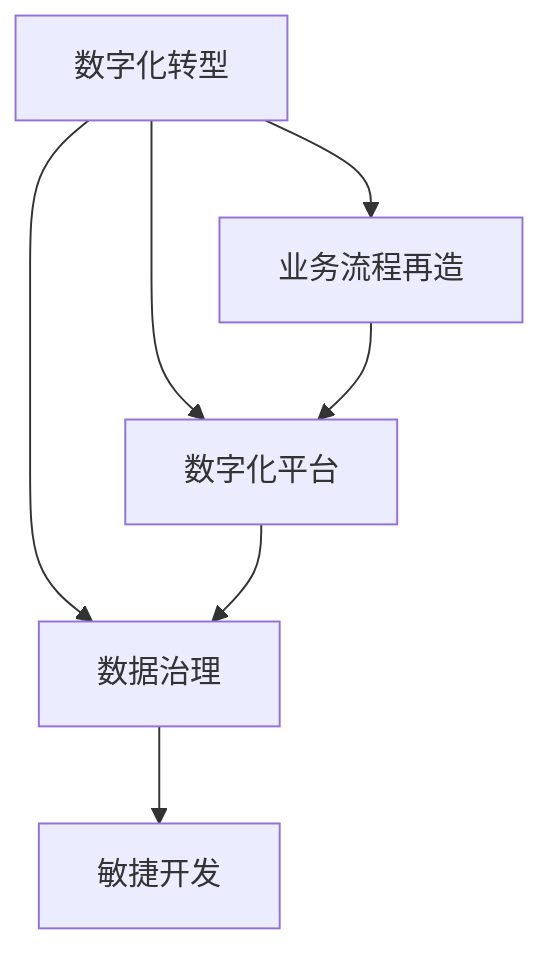

# 企业数字化项目从1-10建设方案

## 1. 背景介绍

随着信息技术的快速发展和数字化浪潮的席卷全球,企业数字化转型已成为大势所趋。数字化转型不仅能够帮助企业提高运营效率、降低成本,还能够为企业创造新的商业模式和收入来源。然而,对于许多企业而言,数字化转型并非易事。它需要企业在战略、组织、流程、技术等多个方面进行全方位的变革和创新。本文将从1到10,全面阐述企业数字化项目的建设方案,为企业的数字化转型提供参考和指导。

## 2. 核心概念与联系

在探讨企业数字化项目建设方案之前,我们首先需要了解一些核心概念及其之间的联系。

### 2.1 数字化转型

数字化转型是指企业利用数字技术,对其业务模式、组织结构、运营流程等进行全面变革,从而实现业务创新和价值提升的过程。它涉及到企业的方方面面,需要企业从战略高度来统筹规划和推进。

### 2.2 业务流程再造

业务流程再造(Business Process Reengineering,BPR)是指企业对现有业务流程进行系统性的分析、设计和优化,从而实现流程的简化、自动化和智能化。BPR是数字化转型的重要抓手,通过流程的数字化改造,可以显著提升企业的运营效率和敏捷性。

### 2.3 数字化平台

数字化平台是支撑企业数字化运营的技术基础设施,通常包括云计算、大数据、人工智能、物联网等新兴技术。通过构建数字化平台,企业可以实现数据的采集、存储、分析和应用,为业务创新提供强大的技术支撑。

### 2.4 数据治理

数据治理是指企业对数据进行有效管理和利用的一系列政策、流程和技术手段。在数字化时代,数据已成为企业的核心资产。通过加强数据治理,企业可以提高数据质量,挖掘数据价值,为决策分析提供可靠依据。

### 2.5 敏捷开发

敏捷开发是一种迭代、增量式的软件开发方法,强调快速交付、持续改进和紧密协作。在数字化项目建设中,采用敏捷开发可以加快项目进度,提高交付质量,更好地满足业务需求的快速变化。

下面是这些核心概念之间的联系:



## 3. 核心算法原理具体操作步骤

在企业数字化项目建设中,需要用到一些核心算法来支撑关键业务场景。下面以推荐系统中常用的协同过滤算法为例,介绍其原理和具体操作步骤。

### 3.1 协同过滤算法原理

协同过滤(Collaborative Filtering)是一种常用的推荐算法,其基本思想是利用用户之间的相似性,为用户推荐其感兴趣的内容。协同过滤算法主要分为两类:基于用户的协同过滤和基于物品的协同过滤。

#### 3.1.1 基于用户的协同过滤

基于用户的协同过滤的基本假设是:相似的用户会对相似的物品感兴趣。因此,该算法首先计算用户之间的相似度,然后根据用户的历史行为和相似用户的偏好,为其推荐物品。

#### 3.1.2 基于物品的协同过滤

基于物品的协同过滤的基本假设是:用户会对与其已喜欢物品相似的其他物品感兴趣。因此,该算法首先计算物品之间的相似度,然后根据用户的历史行为和相似物品,为其推荐物品。

### 3.2 协同过滤算法操作步骤

下面以基于用户的协同过滤为例,介绍其具体操作步骤:

#### 步骤1:收集用户偏好数据

收集用户对不同物品的偏好数据,通常以用户-物品评分矩阵的形式表示。矩阵中的每个元素表示用户对物品的评分,如果用户没有对物品评分,则相应位置为空值。

#### 步骤2:计算用户相似度

利用用户-物品评分矩阵,计算用户之间的相似度。常用的相似度度量方法有欧几里得距离、皮尔逊相关系数等。以皮尔逊相关系数为例,其计算公式如下:

$$sim(u,v) = \frac{\sum_{i \in I_{uv}}(r_{ui} - \bar{r_u})(r_{vi} - \bar{r_v})}{\sqrt{\sum_{i \in I_{uv}}(r_{ui} - \bar{r_u})^2}\sqrt{\sum_{i \in I_{uv}}(r_{vi} - \bar{r_v})^2}}$$

其中,$u$和$v$表示两个用户,$I_{uv}$表示两个用户共同评分的物品集合,$r_{ui}$和$r_{vi}$分别表示用户$u$和$v$对物品$i$的评分,$\bar{r_u}$和$\bar{r_v}$分别表示用户$u$和$v$的平均评分。

#### 步骤3:生成推荐列表

对于目标用户$u$,根据其与其他用户的相似度,选取$Top-K$个最相似的用户,然后基于这些用户对物品的评分,为用户$u$生成推荐列表。物品$i$对用户$u$的推荐得分计算公式如下:

$$p_{ui} = \frac{\sum_{v \in S_u}sim(u,v) \cdot r_{vi}}{\sum_{v \in S_u}sim(u,v)}$$

其中,$S_u$表示与用户$u$最相似的$Top-K$用户集合。

最后,根据推荐得分从高到低排序,生成$Top-N$推荐列表。

## 4. 数学模型和公式详细讲解举例说明

在上一节中,我们介绍了协同过滤算法的原理和操作步骤。本节将重点讲解其中涉及的两个关键数学公式:皮尔逊相关系数和推荐得分公式。

### 4.1 皮尔逊相关系数

皮尔逊相关系数是一种常用的相似度度量方法,用于计算两个变量之间的线性相关性。在协同过滤算法中,我们利用皮尔逊相关系数来计算用户之间的相似度。

设有两个用户$u$和$v$,他们共同评分的物品集合为$I_{uv}$,用户$u$对物品$i$的评分为$r_{ui}$,用户$v$对物品$i$的评分为$r_{vi}$,两个用户的平均评分分别为$\bar{r_u}$和$\bar{r_v}$。则皮尔逊相关系数的计算公式为:

$$sim(u,v) = \frac{\sum_{i \in I_{uv}}(r_{ui} - \bar{r_u})(r_{vi} - \bar{r_v})}{\sqrt{\sum_{i \in I_{uv}}(r_{ui} - \bar{r_u})^2}\sqrt{\sum_{i \in I_{uv}}(r_{vi} - \bar{r_v})^2}}$$

其中,分子部分计算了两个用户评分偏差的乘积之和,分母部分则是两个用户评分偏差平方和的乘积的开方。这样可以消除评分尺度的影响,得到一个[-1,1]范围内的相关系数值。相关系数越接近1,表示两个用户越相似;越接近-1,表示两个用户越不相似;接近0则表示两个用户没有线性相关性。

举例说明:

假设用户$u$和$v$对5部电影的评分如下:

| 电影 | 用户$u$评分 | 用户$v$评分 |
|-----|------------|------------|
| A   | 4          | 4.5        |
| B   | 3          | 3.5        |
| C   | 5          | 4          |
| D   | 2          | 2.5        |
| E   | 3          | 3          |

用户$u$的平均评分$\bar{r_u} = \frac{4+3+5+2+3}{5} = 3.4$
用户$v$的平均评分$\bar{r_v} = \frac{4.5+3.5+4+2.5+3}{5} = 3.5$

根据皮尔逊相关系数公式,计算得到:

$sim(u,v) = \frac{(4-3.4)(4.5-3.5) + (3-3.4)(3.5-3.5) + ... + (3-3.4)(3-3.5)}{\sqrt{(4-3.4)^2 + (3-3.4)^2 + ... + (3-3.4)^2} \cdot \sqrt{(4.5-3.5)^2 + (3.5-3.5)^2 + ... + (3-3.5)^2}} \approx 0.975$

可见,用户$u$和$v$的皮尔逊相关系数非常接近1,说明他们的评分偏好非常相似。

### 4.2 推荐得分公式

在生成推荐列表时,我们需要计算每个物品对目标用户的推荐得分。推荐得分公式综合考虑了相似用户的评分和相似度,得分越高,表示目标用户可能越喜欢该物品。

设目标用户为$u$,物品为$i$,与用户$u$最相似的$Top-K$用户集合为$S_u$,用户$v$对物品$i$的评分为$r_{vi}$,用户$u$和$v$的相似度为$sim(u,v)$。则物品$i$对用户$u$的推荐得分计算公式为:

$$p_{ui} = \frac{\sum_{v \in S_u}sim(u,v) \cdot r_{vi}}{\sum_{v \in S_u}sim(u,v)}$$

公式的分子部分计算了相似用户评分与相似度的乘积之和,分母部分则是相似度之和。这样可以得到一个归一化的推荐得分,得分越高,表示物品$i$越可能被用户$u$喜欢。

举例说明:

假设用户$u$最相似的3个用户为$v1$,$v2$,$v3$,他们对物品$i$的评分和相似度如下:

| 用户 | 物品$i$评分 | 与用户$u$的相似度 |
|-----|------------|-----------------|
| $v1$ | 4          | 0.8             |
| $v2$ | 5          | 0.6             |
| $v3$ | 3          | 0.9             |

根据推荐得分公式,计算得到:

$p_{ui} = \frac{0.8 \cdot 4 + 0.6 \cdot 5 + 0.9 \cdot 3}{0.8 + 0.6 + 0.9} \approx 3.87$

可见,物品$i$对用户$u$的推荐得分为3.87,综合考虑了三个相似用户的评分和相似度。最终推荐列表将根据推荐得分从高到低排序生成。

## 5. 项目实践:代码实例和详细解释说明

在理解了协同过滤算法的原理和数学公式后,本节将通过一个简单的Python代码实例,演示如何实现基于用户的协同过滤推荐。

### 5.1 数据准备

首先,我们需要准备用户-物品评分矩阵数据。这里使用一个字典来表示,键为用户ID,值为另一个字典,表示用户对不同物品的评分。

```python
# 用户-物品评分矩阵
ratings = {
    'A': {'a': 4, 'b': 3, 'c': 5, 'd': 2, 'e': 3},
    'B': {'a': 5, 'b': 4, 'c': 4, 'd': 3, 'e': 4}, 
    'C': {'b': 4, 'c': 3, 'd': 5, 'e': 2},
    'D': {'a': 2, 'b': 1, 'c': 3, 'e': 4}
}
```

### 5.2 相似度计算

接下来,我们实现皮尔逊相关系数的计算函数。

```python
from math import sqrt

def pearson_similarity(ratings, user1, user2):
    """计算两个用户的皮尔逊相关系数"""
    common_items = [item for item in ratings[user1] if item in ratings[user2]]
    
    if len(common_items) == 0:
        return 0
    
    sum1 = sum([ratings[user1