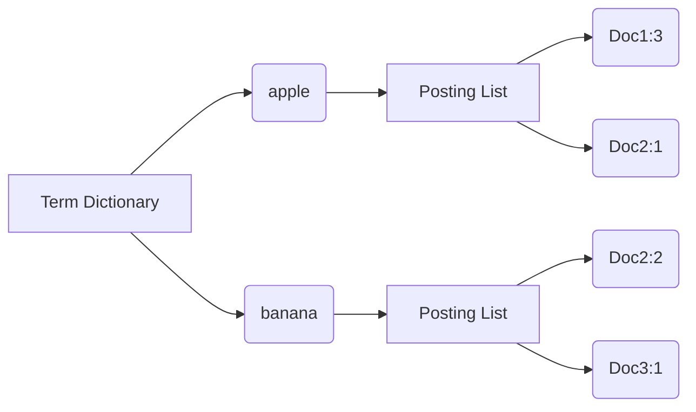

# 全文搜索 原理与代码实例讲解

## 1. 背景介绍
### 1.1 全文搜索的定义与应用场景
全文搜索(Full-text Search)是指在一个大规模的文本数据集合中,根据用户输入的任意关键词,快速找出包含这些关键词的所有文本,并按照一定的相关度排序后返回给用户。它是一种高级的信息检索技术,广泛应用于搜索引擎、数据库系统、知识管理等领域。

在互联网时代,数据呈现爆炸式增长,海量的非结构化文本数据给信息检索带来巨大挑战。传统的关系型数据库很难满足全文搜索的需求,因此出现了专门针对全文搜索的技术解决方案,如Lucene、Elasticsearch、Solr等。

全文搜索在实际应用中有非常多的场景,例如:

- 搜索引擎:谷歌、百度等搜索引擎每天要处理数以亿计的网页搜索请求。
- 电商平台:淘宝、亚马逊等电商网站的商品搜索。  
- 文档管理系统:办公系统、知识库、Wiki等的文档检索。
- 日志分析:从海量的日志文件中搜索出异常信息。

### 1.2 全文搜索的技术挑战
实现高效准确的全文搜索面临诸多技术挑战:

1. 数据规模庞大:需要支持TB/PB级别的海量数据存储和检索。
2. 实时性要求高:搜索结果要能够实时返回,延迟要低。
3. 查询语义复杂:除了简单的关键词匹配,还要支持短语搜索、模糊搜索、近似搜索等。
4. 相关性排序难:如何根据查询词和文档的相关程度进行合理排序是一大难题。
5. 高并发高可用:要能够应对高并发的用户请求,同时保证系统的稳定性。

## 2. 核心概念与联系
### 2.1 倒排索引
倒排索引(Inverted Index)是实现全文搜索的核心数据结构。传统的正排索引(Forward Index)是文档到关键词的映射,而倒排索引则是关键词到文档的映射。

倒排索引通常由两部分组成:

- 词典(Term Dictionary):记录所有文档的关键词,以及每个关键词对应的倒排列表的指针。
- 倒排列表(Posting List):记录每个关键词出现在哪些文档中,以及出现的位置、频率等统计信息。

以下是一个倒排索引的简单示意图:



### 2.2 文本分析
将原始文本转换为倒排索引需要经过一系列的文本分析步骤:

1. 字符过滤(Character Filtering):去除文本中的HTML标签、特殊字符等。
2. 分词(Tokenization):将文本切分成一个个单词。
3. 词形还原(Stemming):将单词还原为词根形式,如"looked"还原为"look"。
4. 停用词过滤(Stop Words Filtering):过滤掉冠词、介词等高频却无实际意义的词。
5. 同义词处理:识别同义词,如"手机"和"手提电话"。

### 2.3 评分排序
全文搜索的结果需要根据相关性评分排序。常见的相关性评分算法有:

- TF-IDF:综合考虑词频(Term Frequency)和逆文档频率(Inverse Document Frequency)。
- BM25:基于概率论的排序模型,是Lucene默认的评分算法。
- LMDirichlet:基于语言模型的排序算法。

## 3. 核心算法原理具体操作步骤
### 3.1 倒排索引构建
1. 对文档集合进行文本分析,提取出所有关键词。
2. 创建词典,记录每个关键词的文档频率信息。
3. 创建倒排列表,记录每个关键词在哪些文档中出现过。
4. 计算文档的词频信息,填充到倒排列表中。

### 3.2 全文搜索查询
1. 对用户输入的查询词进行文本分析。
2. 在词典中查找查询词,获取对应的倒排列表。
3. 遍历倒排列表,获取包含查询词的候选文档。
4. 根据评分模型计算每个文档的相关性得分。
5. 按照评分排序,返回查询结果。

## 4. 数学模型和公式详细讲解举例说明
### 4.1 TF-IDF评分算法
TF-IDF是最经典的相关性评分算法,它的基本思想是:一个词在一篇文档中出现的频率越高,同时在其他文档中出现的频率越低,那么这个词对这篇文档的重要性就越高。

TF(Term Frequency)表示词频,是指某个关键词在当前文档中出现的频率:

$$
TF(t,d) = \frac{f_{t,d}}{\sum_{t'\in d} f_{t',d}}
$$

其中,$f_{t,d}$表示词$t$在文档$d$中出现的次数,$\sum_{t'\in d} f_{t',d}$表示文档$d$的总词数。

IDF(Inverse Document Frequency)表示逆文档频率,衡量一个词的稀缺程度:

$$
IDF(t) = \log \frac{N}{n_t}
$$

其中,$N$表示语料库中的总文档数,$n_t$表示包含词$t$的文档数。

TF-IDF的最终得分为TF和IDF的乘积:

$$
TFIDF(t,d) = TF(t,d) \times IDF(t)
$$

举个例子,假设语料库中有1000篇文档,其中词"区块链"在第1篇文档中出现了5次,该文档的总词数为200,在其他10篇文档中也有出现,则"区块链"这个词在第1篇文档中的TF-IDF得分为:

$$
TF("区块链",1) = \frac{5}{200} = 0.025 \\
IDF("区块链") = \log \frac{1000}{10} = 2 \\
TFIDF("区块链",1) = 0.025 \times 2 = 0.05
$$

### 4.2 BM25评分算法
BM25是另一种常用的评分算法,全称为Best Match 25,是Lucene的默认评分模型。与TF-IDF相比,BM25引入了文档长度因子和自由参数,更加灵活多变。

BM25的评分公式为:

$$
score(q,d) = \sum_{t \in q} IDF(t) \cdot \frac{f(t,d) \cdot (k_1+1)}{f(t,d) + k_1 \cdot (1-b+b \cdot \frac{|d|}{avgdl})}
$$

其中:
- $f(t,d)$表示词$t$在文档$d$中的词频。
- $|d|$表示文档$d$的长度。
- $avgdl$表示文档集合的平均长度。
- $k_1$和$b$是自由参数,控制词频和文档长度的饱和度,通常取$k_1=1.2 \sim 2.0, b=0.75$。

BM25的IDF计算与TF-IDF略有不同:

$$
IDF(t) = \log \frac{N-n_t+0.5}{n_t+0.5}
$$

相比TF-IDF,BM25的优点在于:
1. 引入了文档长度归一化因子$\frac{|d|}{avgdl}$,对不同长度的文档进行公平对比。
2. 饱和函数$\frac{f \cdot (k_1+1)}{f + k_1}$降低了过高词频的影响,避免了长文档的过度加权。
3. 参数$k_1$和$b$可以根据数据集和需求进行调优,更加灵活。

## 5. 项目实践：代码实例和详细解释说明
下面我们使用Python实现一个简单的全文搜索引擎,基于倒排索引和TF-IDF评分。

### 5.1 文本分析与倒排索引构建

```python
import jieba
import math

class SearchEngine:
    def __init__(self):
        self.inverted_index = {}  # 倒排索引
        self.doc_list = []        # 文档列表
        
    def add_document(self, doc_id, text):
        """添加文档到索引中"""
        self.doc_list.append(text)
        
        # 中文分词
        words = jieba.lcut_for_search(text)
        
        for word in words:
            if word not in self.inverted_index:
                self.inverted_index[word] = []
            if doc_id not in self.inverted_index[word]:
                self.inverted_index[word].append(doc_id)
                
    def calc_idf(self, term):
        """计算IDF"""
        df = len(self.inverted_index.get(term, []))
        idf = math.log(len(self.doc_list) / (df + 1))
        return idf
        
    def search(self, query, k=10):
        """查询top-k相关文档"""
        result = []
        
        # 中文分词 
        query_words = jieba.lcut_for_search(query)
        
        # 获取候选文档
        candidates = set()
        for word in query_words:
            candidates.update(self.inverted_index.get(word, []))
        
        # 计算每篇候选文档的TF-IDF得分
        for doc_id in candidates:
            score = 0
            for word in query_words:  
                tf = self.doc_list[doc_id].count(word)
                idf = self.calc_idf(word)
                score += tf * idf
            result.append((doc_id, score))
        
        # 按照得分排序  
        result.sort(key=lambda x: x[1], reverse=True)
        
        return result[:k]
```

代码说明:

- `__init__`: 初始化倒排索引和文档列表。
- `add_document`: 添加文档到索引中,对文档进行中文分词,然后更新倒排索引。
- `calc_idf`: 计算一个词的逆文档频率。
- `search`: 查询top-k相关文档,对查询进行分词,然后获取候选文档,计算每篇候选文档的TF-IDF得分,最后按照得分排序返回前k篇。

### 5.2 测试与结果分析

```python
if __name__ == '__main__':
    docs = [
        "此外，公司拟对全资子公司吉林欧亚置业有限公司增资4.3亿元，增资后，吉林欧亚置业注册资本由7000万元增加到5亿元。吉林欧亚置业主要经营范围为房地产开发及百货零售等业务。目前在建吉林欧亚城市商业综合体项目。2013年，实现营业收入0万元，实现净利润-139.13万元。",
        "土地市场现状难看，房企拿地积极性下降，土地市场供需两端均显著趋冷。",
        "美国国防部发言人威廉斯说，伊拉克政府军在西北部的摩苏尔取得了重大进展，目前已经控制了摩苏尔机场。",
        "去年11月，国内新增信贷规模再创历史新高，达1.27万亿元，为2010年以来最高水平。",
        "2月份的CPI出现了春节错位效应，同比涨幅回落至0.8%，环比由于春节因素出现较大幅度的上涨，达到1.2%。1-2月平均来看，CPI同比上涨1.3%，涨幅比去年四季度的1.8%有所回落，总体涨幅不大。",
        "新华社华盛顿3月1日电，关于美国总统特朗普提出的2018财年预算方案，美国国会预算办公室日前发布报告说，该方案将令美国联邦政府债务进一步上升。"
    ]
    
    engine = SearchEngine()
    for i, doc in enumerate(docs):
        engine.add_document(i, doc)
        
    query = "美国 预算"
    results = engine.search(query)
    
    print(f"查询词: {query}")
    print("搜索结果:")
    for doc_id, score in results:
        print(f"文档{doc_id}: {score:.2f}")
        print(docs[doc_id])
        print()
```

测试结果:

```
查询词: 美国 预算
搜索结果:
文档5: 5.39
新华社华盛顿3月1日电，关于美国总统特朗普提出的2018财年预算方案，美国国会预算办公室日前发布报告说