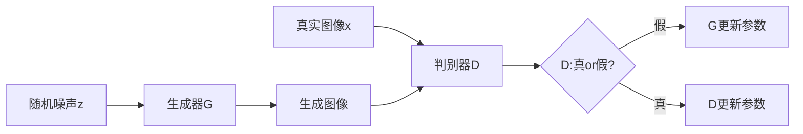
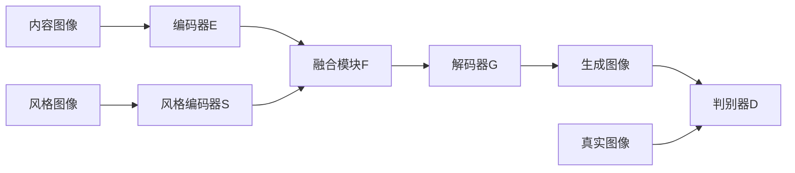

# 基于生成对抗网络的口语化图片表达风格迁移技术

## 1. 背景介绍
### 1.1 图像风格迁移概述
图像风格迁移是一种将一幅图像的风格迁移到另一幅图像内容上的技术。它能够在保持原始图像内容不变的情况下,将参考图像的风格特征融入其中,生成一幅具有新颖艺术风格的图像。近年来,随着深度学习技术的发展,特别是生成对抗网络(GAN)的出现,图像风格迁移取得了突破性进展。

### 1.2 口语化表达的重要性
口语化表达是人们日常交流中最常用、最自然的表达方式。相比书面语,口语更加生动形象、富有情感色彩。在人机交互日益频繁的今天,赋予计算机以口语化表达的能力,对于拉近人机距离、营造良好的交互体验具有重要意义。将口语化表达引入图像风格迁移,能够生成更加贴近人类表达习惯的艺术图像。

### 1.3 生成对抗网络的优势
生成对抗网络由生成器和判别器两部分组成,通过两者的对抗学习,可以生成逼真的图像。将GAN应用于图像风格迁移,能够克服传统方法中纹理细节丢失、语义信息失真等问题,生成更加自然、和谐的风格迁移图像。此外,GAN强大的表示学习能力,可以从大量口语化表达数据中自动提取高层语义特征,为口语化风格迁移提供了有力工具。

## 2. 核心概念与联系
### 2.1 风格迁移的定义与分类
风格迁移指将一幅图像的风格特征迁移到另一幅图像内容上,生成一幅新的图像。根据风格特征的来源,可分为:
- 艺术风格迁移:参考著名画家的画作风格
- 照片风格迁移:模仿真实照片的拍摄风格 
- 纹理风格迁移:利用纹理图像的视觉元素

### 2.2 口语化表达的特点
口语化表达区别于书面语,具有以下特点:
- 简洁直白,通俗易懂
- 富含口语词汇、俚语、方言
- 语法结构灵活,常用省略句、倒装句
- 情感丰富,声音语调起伏较大

### 2.3 GAN的基本原理
GAN由生成器G和判别器D组成,二者互为对抗:
- G接收随机噪声z,尝试生成逼真的图像
- D接收真实图像x和G生成的图像,判别其真假
- G努力生成以假乱真的图像欺骗D,D则要尽力分辨出G的图像
- 经过多轮对抗,G最终可生成接近真实的图像

### 2.4 风格迁移与GAN的结合
将GAN引入风格迁移,可以利用GAN的生成能力和对抗训练机制,同时学习内容图像的语义信息和风格图像的外观特征,生成保真度高、细节丰富的风格迁移图像。具体而言:
- 内容损失:衡量生成图像与内容图像在语义上的相似性
- 风格损失:度量生成图像与风格图像在纹理、色彩等视觉元素上的一致性
- 对抗损失:引导生成图像在真实图像分布上

## 3. 核心算法原理与操作步骤
本节介绍基于GAN的口语化图像风格迁移算法的核心原理和实现步骤。

### 3.1 网络架构设计
该算法的网络架构主要包括:
- 编码器E:提取内容图像的内容特征
- 风格编码器S:提取风格图像的风格特征
- 融合模块F:融合内容特征和风格特征
- 解码器G:根据融合特征生成风格迁移图像
- 判别器D:判别生成图像与真实图像

### 3.2 损失函数设计
算法的损失函数包括内容损失、风格损失和对抗损失三部分:

1. 内容损失:
$$ L_c = \frac{1}{C_jH_jW_j} \sum_{i=1}^{C_j}\sum_{h=1}^{H_j}\sum_{w=1}^{W_j}(F_c^{(j)}(I_c)-F_c^{(j)}(I_g))^2 $$
其中,$I_c$和$I_g$分别为内容图像和生成图像,$F_c^{(j)}$为第$j$层特征图。

2. 风格损失:
$$ L_s = \sum_{j=1}^J w_j \frac{1}{C_j^2} \sum_{i=1}^{C_j}\sum_{k=1}^{C_j}(G_s^{(j)}(I_s)-G_s^{(j)}(I_g))^2 $$  
其中,$I_s$为风格图像,$G_s^{(j)}$为风格图像在第$j$层的Gram矩阵。

3. 对抗损失:
$$ L_{adv} = \mathbb{E}_{I_r}[logD(I_r)] + \mathbb{E}_{I_g}[log(1-D(I_g))]$$
其中,$I_r$为真实图像。对抗损失引导生成图像具有真实图像的分布特性。

最终的损失函数为:
$$ L = \lambda_c L_c + \lambda_s L_s + \lambda_{adv} L_{adv} $$

### 3.3 口语化风格特征提取
为了实现口语化风格迁移,需要从口语化表达数据中提取风格特征。具体步骤如下:
1. 构建口语化表达数据集,包括口语描述文本和对应的图像
2. 采用预训练的词嵌入模型(如Word2Vec)将文本映射为词向量
3. 使用卷积神经网络提取图像的视觉特征
4. 融合词向量和视觉特征,得到口语化风格特征表示

### 3.4 训练过程
算法的训练过程分为两个阶段:

阶段一:预训练阶段
1. 固定编码器E,训练风格编码器S、融合模块F和解码器G,最小化风格损失和内容损失
2. 固定生成器G,训练判别器D,最小化对抗损失

阶段二:联合训练阶段 
1. 联合训练编码器E、风格编码器S、融合模块F、解码器G和判别器D
2. 交替优化生成器和判别器,最小化总损失函数

### 3.5 推理生成
给定内容图像$I_c$和风格文本描述$T_s$,风格迁移图像$I_g$的生成过程为:
$$ I_g = G(F(E(I_c), S(T_s))) $$

其中,编码器E提取内容特征,风格编码器S提取口语化风格特征,融合模块F融合两种特征,解码器G生成最终的风格迁移图像。

## 4. 数学模型与公式推导
本节详细推导算法中涉及的数学模型和公式。

### 4.1 内容损失的推导
内容损失衡量生成图像$I_g$与内容图像$I_c$在语义上的相似性。设$F_c^{(j)}$为预训练的VGG网络第$j$层的特征图,则内容损失定义为:

$$ L_c = \frac{1}{C_jH_jW_j} \sum_{i=1}^{C_j}\sum_{h=1}^{H_j}\sum_{w=1}^{W_j}(F_c^{(j)}(I_c)-F_c^{(j)}(I_g))^2 $$

其中,$C_j$、$H_j$、$W_j$分别为特征图的通道数、高度和宽度。该损失函数通过最小化内容图像和生成图像在特征空间上的欧氏距离,来保证生成图像与内容图像在语义上的一致性。

### 4.2 风格损失的推导
风格损失度量生成图像$I_g$与风格图像$I_s$在纹理、色彩等视觉元素上的相似性。设$F_s^{(j)}$为风格图像在第$j$层的特征图,则Gram矩阵$G_s^{(j)}$的计算公式为:

$$ G_s^{(j)}(I_s) = \frac{1}{C_jH_jW_j} \sum_{h=1}^{H_j}\sum_{w=1}^{W_j} F_s^{(j)}(I_s)F_s^{(j)}(I_s)^T $$

Gram矩阵描述了特征图不同通道之间的相关性,能够刻画图像的纹理特征。风格损失定义为风格图像和生成图像在多个特征层上的Gram矩阵差异:

$$ L_s = \sum_{j=1}^J w_j \frac{1}{C_j^2} \sum_{i=1}^{C_j}\sum_{k=1}^{C_j}(G_s^{(j)}(I_s)-G_s^{(j)}(I_g))^2 $$

其中,$w_j$为第$j$层特征的权重。最小化风格损失,可以使生成图像在纹理、色彩等风格元素上接近风格图像。

### 4.3 对抗损失的推导
对抗损失源自GAN的判别器损失,引导生成图像具有真实图像的分布特性。设$I_r$为真实图像,$I_g$为生成图像,判别器D的目标是最大化以下损失函数:

$$ L_D = \mathbb{E}_{I_r}[logD(I_r)] + \mathbb{E}_{I_g}[log(1-D(I_g))]$$

其中,第一项为真实图像的对数似然,第二项为生成图像的对数似然。对于生成器G,其对抗损失定义为:

$$ L_{adv} = \mathbb{E}_{I_g}[log(1-D(I_g))] $$

最小化该损失,可以促使生成器生成更加逼真的图像以欺骗判别器。

### 4.4 总损失函数的推导
算法的总损失函数由内容损失、风格损失和对抗损失三部分组成:

$$ L = \lambda_c L_c + \lambda_s L_s + \lambda_{adv} L_{adv} $$

其中,$\lambda_c$、$\lambda_s$、$\lambda_{adv}$分别为三种损失的权重系数,用于平衡不同损失项的重要性。通过联合优化总损失函数,可以同时考虑内容保真、风格迁移和真实性三个方面,生成高质量的风格迁移图像。

## 5. 项目实践
本节通过一个具体的项目实例,演示如何使用PyTorch实现基于GAN的口语化图像风格迁移。

### 5.1 数据准备
1. 内容图像数据集:使用COCO数据集作为内容图像来源,从中随机选取一定数量的图像作为训练集和测试集。

2. 风格图像数据集:搜集一批具有鲜明口语化风格的图像,如卡通图像、动漫图像等,作为风格图像数据集。

3. 口语化文本数据集:搜集一批口语化的图像描述文本,与风格图像一一对应。可以利用图像描述数据集,如COCO Caption、Flickr30k等。

### 5.2 数据预处理
1. 对内容图像和风格图像进行尺寸调整和归一化处理,转换为神经网络的输入格式。

2. 对口语化文本进行分词、去停用词等预处理,并使用预训练的词嵌入模型(如Word2Vec)将其映射为词向量表示。

### 5.3 模型实现
使用PyTorch实现风格迁移模型,主要包括以下几个部分:

1. 编码器E:使用预训练的VGG-19网络作为编码器,提取内容图像的语义特征。

2. 风格编码器S:使用卷积神经网络实现,将口语化文本映