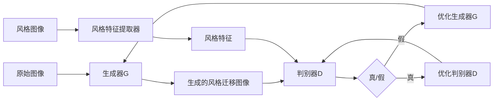

# 基于生成对抗网络的抽象艺术图像风格迁移机制

## 1. 背景介绍

### 1.1 抽象艺术的魅力

抽象艺术是一种独特的艺术形式,它突破了传统艺术对现实世界的模仿和再现,而是通过色彩、形状、线条等纯粹的视觉元素来表达艺术家的内心世界和情感。抽象艺术作品常常给人一种神秘、梦幻、超现实的感觉,激发人们的想象力和思考。

### 1.2 计算机视觉与艺术的结合 

随着计算机视觉技术的发展,人们开始探索将其应用于艺术创作领域。计算机视觉可以分析、理解、生成图像,为艺术创作提供新的工具和思路。特别是深度学习的兴起,使得计算机能够学习和模仿人类艺术家的创作风格,生成富有艺术感的图像。

### 1.3 图像风格迁移的应用前景

图像风格迁移是计算机视觉与艺术结合的一个典型应用。它指的是将一幅图像的风格特征迁移到另一幅图像上,使其呈现出特定的艺术风格。图像风格迁移不仅可以用于艺术创作,还可以应用于游戏、电影、设计等领域,为视觉内容创作提供更多的可能性。

## 2. 核心概念与联系

### 2.1 卷积神经网络(CNN)

卷积神经网络是一种广泛应用于图像识别和处理的深度学习模型。它通过卷积、池化等操作提取图像的多层次特征,可以有效地学习图像的内容和风格特征。在图像风格迁移任务中,卷积神经网络常被用作特征提取器和生成器。

### 2.2 生成对抗网络(GAN)

生成对抗网络由生成器(Generator)和判别器(Discriminator)两部分组成。生成器试图生成逼真的图像去欺骗判别器,而判别器则试图区分真实图像和生成图像。通过两者的对抗学习,生成器可以生成越来越逼真的图像。GAN 在图像生成、风格迁移等任务中表现出色。

### 2.3 风格迁移损失函数

为了实现图像风格迁移,需要定义合适的损失函数来引导模型学习。通常使用内容损失(content loss)和风格损失(style loss)的加权组合。内容损失衡量生成图像与原始图像在内容特征上的相似性,风格损失则衡量生成图像与风格图像在风格特征上的相似性。

### 2.4 Mermaid 流程图

下面是基于生成对抗网络的图像风格迁移的核心流程:



## 3. 核心算法原理与具体步骤

### 3.1 预训练的 VGG 网络

VGG 网络是一种经典的卷积神经网络结构,在 ImageNet 图像分类任务上取得了很好的效果。在图像风格迁移中,我们可以使用预训练的 VGG 网络作为特征提取器,提取图像的内容特征和风格特征。

具体步骤如下:
1. 加载预训练的 VGG 网络模型
2. 选择 VGG 网络中的某些卷积层作为特征提取层
3. 分别将原始图像、风格图像输入 VGG 网络,提取相应的特征图

### 3.2 生成器网络

生成器网络用于生成风格迁移后的图像。常见的生成器网络结构有 U-Net、ResNet 等。生成器接收原始图像作为输入,经过一系列卷积、上采样操作,生成与原始图像大小相同的风格迁移图像。

具体步骤如下:
1. 设计生成器网络结构,如 U-Net
2. 将原始图像输入生成器,得到生成的风格迁移图像
3. 计算生成图像与原始图像的内容损失
4. 计算生成图像与风格图像的风格损失
5. 将内容损失和风格损失加权求和,得到总损失
6. 优化生成器网络参数,最小化总损失

### 3.3 判别器网络 

判别器网络用于区分真实图像和生成图像。常见的判别器网络结构有 PatchGAN。判别器接收一幅图像作为输入,输出该图像为真实图像的概率。

具体步骤如下:
1. 设计判别器网络结构,如 PatchGAN  
2. 将风格图像、生成的风格迁移图像输入判别器
3. 计算判别器在真实图像和生成图像上的损失
4. 优化判别器网络参数,最小化判别器损失

### 3.4 对抗训练

生成器和判别器通过对抗训练不断优化,最终使生成器能生成逼真的风格迁移图像。

具体步骤如下:
1. 初始化生成器 G 和判别器 D 的网络参数
2. 重复以下步骤直到模型收敛:
   a. 固定 G,训练 D 识别真实图像和生成图像
   b. 固定 D,训练 G 生成更逼真的风格迁移图像以欺骗 D
3. 输出训练好的生成器 G

## 4. 数学模型与公式详解

### 4.1 内容损失

内容损失衡量生成图像与原始图像在内容特征上的相似性。令 $F_l(x)$ 表示原始图像 $x$ 在第 $l$ 层特征图,$F_l(\hat{x})$ 表示生成图像 $\hat{x}$ 在第 $l$ 层特征图,则内容损失可以定义为:

$$L_{content}(\hat{x},x) = \frac{1}{C_lH_lW_l}\sum_{i,j}(F_l(\hat{x})-F_l(x))^2$$

其中 $C_l,H_l,W_l$ 分别为第 $l$ 层特征图的通道数、高度、宽度。

### 4.2 风格损失

风格损失衡量生成图像与风格图像在风格特征上的相似性。令 $G_l(x)$ 表示风格图像 $x$ 在第 $l$ 层的 Gram 矩阵,$G_l(\hat{x})$ 表示生成图像 $\hat{x}$ 在第 $l$ 层的 Gram 矩阵,则风格损失可以定义为:

$$L_{style}(\hat{x},x) = \sum_{l=0}^L w_l \frac{1}{C_l^2H_lW_l}\sum_{i,j}(G_l(\hat{x})-G_l(x))^2$$

其中 $w_l$ 为第 $l$ 层的权重,控制不同层对风格损失的贡献。Gram 矩阵 $G_l(x)$ 的计算公式为:

$$G_l(x)_{ij} =  \frac{1}{C_lH_lW_l}\sum_k F_l(x)_{ik}F_l(x)_{jk}$$

### 4.3 总变差正则化

为了使生成的风格迁移图像更加平滑,可以加入总变差(Total Variation)正则化项。总变差损失定义为:

$$L_{tv}(\hat{x}) = \sum_{i,j}[(\hat{x}_{i,j+1}-\hat{x}_{i,j})^2+(\hat{x}_{i+1,j}-\hat{x}_{i,j})^2]$$

它惩罚了相邻像素之间的差异,使生成图像更加平滑。

### 4.4 生成器损失

生成器的目标是生成逼真的风格迁移图像以欺骗判别器。生成器损失可以定义为:

$$L_G = -\mathbb{E}_{\hat{x}\sim p_g}[\log D(\hat{x})] + \lambda_c L_{content}(\hat{x},x) + \lambda_s L_{style}(\hat{x},s) + \lambda_{tv} L_{tv}(\hat{x})$$

其中 $D(\hat{x})$ 为判别器输出的生成图像 $\hat{x}$ 为真实图像的概率,$\lambda_c,\lambda_s,\lambda_{tv}$ 为内容损失、风格损失、总变差损失的权重。

### 4.5 判别器损失

判别器的目标是正确区分真实图像和生成图像。判别器损失可以定义为:

$$L_D = -\mathbb{E}_{x\sim p_{data}}[\log D(x)] - \mathbb{E}_{\hat{x}\sim p_g}[\log (1-D(\hat{x}))]$$

其中 $x$ 为真实图像,$\hat{x}$ 为生成图像。

## 5. 项目实践:代码实例与详解

下面给出基于 PyTorch 实现图像风格迁移的核心代码:

```python
import torch
import torch.nn as nn
import torchvision.models as models

# 内容损失
class ContentLoss(nn.Module):
    def __init__(self, target):
        super(ContentLoss, self).__init__()
        self.target = target.detach()
        
    def forward(self, input):
        self.loss = F.mse_loss(input, self.target)
        return input

# 风格损失  
class StyleLoss(nn.Module):
    def __init__(self, target_feature):
        super(StyleLoss, self).__init__()
        self.target = gram_matrix(target_feature).detach()
        
    def forward(self, input):
        G = gram_matrix(input)
        self.loss = F.mse_loss(G, self.target)
        return input

# 计算 Gram 矩阵    
def gram_matrix(input):
    a, b, c, d = input.size()
    features = input.view(a * b, c * d) 
    G = torch.mm(features, features.t())
    return G.div(a * b * c * d)

# 生成器网络
class GeneratorNet(nn.Module):
    def __init__(self):
        super(GeneratorNet, self).__init__()
        # 定义生成器网络结构
        # ...
        
    def forward(self, x):
        # 前向传播过程
        # ...
        return out

# 判别器网络  
class DiscriminatorNet(nn.Module): 
    def __init__(self):
        super(DiscriminatorNet, self).__init__()
        # 定义判别器网络结构 
        # ...
        
    def forward(self, x):  
        # 前向传播过程
        # ...    
        return out
        
# 加载 VGG 网络
vgg = models.vgg19(pretrained=True).features

# 指定内容层和风格层
content_layers = ['conv_4']  
style_layers = ['conv_1', 'conv_2', 'conv_3', 'conv_4', 'conv_5']

# 创建损失网络
model = nn.Sequential()
model = copy.deepcopy(vgg)

content_losses = []
style_losses = []

i = 0
for layer in vgg:
    if isinstance(layer, nn.Conv2d):
        i += 1
        name = 'conv_{}'.format(i)
    elif isinstance(layer, nn.ReLU):  
        name = 'relu_{}'.format(i)
        layer = nn.ReLU(inplace=False)
    elif isinstance(layer, nn.MaxPool2d):
        name = 'pool_{}'.format(i)
    elif isinstance(layer, nn.BatchNorm2d):
        name = 'bn_{}'.format(i)
    else:
        raise RuntimeError('Unrecognized layer: {}'.format(layer.__class__.__name__))

    model.add_module(name, layer)

    if name in content_layers:
        target = model(content_img).detach()
        content_loss = ContentLoss(target)
        model.add_module("content_loss_{}".format(i), content_loss)
        content_losses.append(content_loss)

    if name in style_layers:
        target_feature = model(style_img).detach()
        style_loss = StyleLoss(target_feature)
        model.add_module("style_loss_{}".format(i), style_loss)
        style_losses.append(style_loss)

# 初始化生成器和判别器        
generator = GeneratorNet()
discriminator = DiscriminatorNet()

# 定义优化器
g_optimizer = torch.optim.Adam(generator.parameters(), lr=learning_rate) 
d_optimizer = torch.optim.Adam(discriminator.parameters(), lr=learning_rate)

# 训练循环
for epoch in range(num_epochs):
    for i, (imgs, _) in enumerate(dataloader):
        # 训练判别器
        discriminator.zero_grad()
        real_validity = discriminator(imgs)
        fake_imgs = generator(imgs)
        fake_validity = discriminator(fake_imgs.detach())
        d_loss = d_criterion(real_validity, fake_validity)
        d_loss.backward()
        d_optimizer.step()