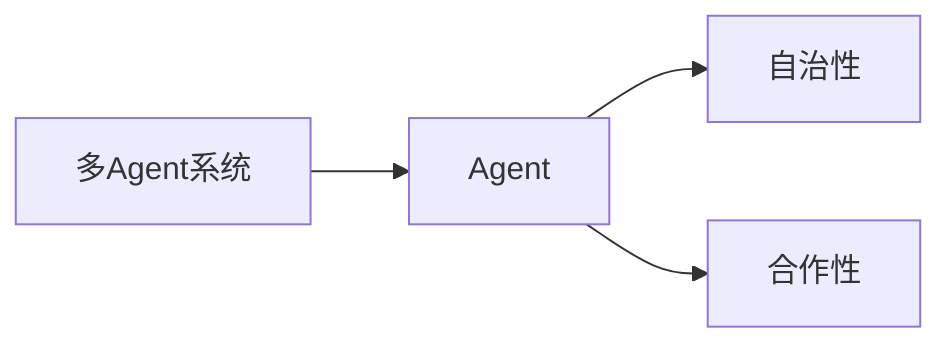
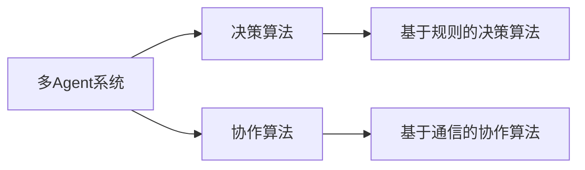

## 1.背景介绍

在计算机科学的世界里，我们经常会遇到需要多个独立实体共同协作以完成某项任务的情况。这种情况在现实生活中也十分常见，比如足球比赛中的球队，每个球员都是一个独立的实体，但他们需要共同协作才能赢得比赛。这就是我们今天要讨论的主题：多Agent系统（Multi-Agent System）。

## 2.核心概念与联系

多Agent系统是一种由多个独立的Agent组成的系统，这些Agent可以是计算机程序，也可以是现实世界中的实体。每个Agent都有自己的目标，他们可以通过交流和协作来共同完成任务。

在多Agent系统中，一个重要的概念是Agent的自治性，即每个Agent都有自己的行为模式和决策能力。另一个重要的概念是Agent的合作性，即Agent之间可以通过交流和协作来共同完成任务。这两个概念是多Agent系统的核心。



## 3.核心算法原理具体操作步骤

在多Agent系统中，Agent的行为是由一系列算法决定的。这些算法可以分为两类：决策算法和协作算法。

决策算法是用来决定Agent的行为的，比如在什么情况下应该做什么。最常见的决策算法是基于规则的决策算法，即根据当前的情况和预设的规则来决定行为。

协作算法是用来协调Agent之间的行为的，比如在什么情况下应该与其他Agent合作。最常见的协作算法是基于通信的协作算法，即通过交流信息来协调行为。



## 4.数学模型和公式详细讲解举例说明

在多Agent系统中，我们可以使用数学模型来描述Agent的行为。比如，我们可以使用马尔可夫决策过程（Markov Decision Process，MDP）来描述Agent的决策过程。

马尔可夫决策过程是一种随机过程，它由一个状态集合，一个动作集合，一个状态转移概率函数和一个奖励函数组成。在每个时刻，Agent根据当前的状态和选择的动作，会转移到一个新的状态，并获得一定的奖励。Agent的目标是选择一种策略，使得从任何状态开始，按照这种策略行动，可以获得的总奖励最大。

马尔可夫决策过程的定义如下：

设$S$是状态集合，$A$是动作集合，$P(s'|s,a)$是状态转移概率函数，$R(s,a,s')$是奖励函数，那么马尔可夫决策过程可以表示为一个四元组$(S,A,P,R)$。

## 5.项目实践：代码实例和详细解释说明

在Python中，我们可以使用`mesa`库来实现多Agent系统。下面是一个简单的例子：

```python
from mesa import Agent, Model

class MyAgent(Agent):
    def __init__(self, unique_id, model):
        super().__init__(unique_id, model)

    def step(self):
        # Agent's behavior goes here

class MyModel(Model):
    def __init__(self, N):
        self.num_agents = N
        self.schedule = RandomActivation(self)
        for i in range(self.num_agents):
            a = MyAgent(i, self)
            self.schedule.add(a)

    def step(self):
        self.schedule.step()
```

在这个例子中，我们定义了一个`MyAgent`类和一个`MyModel`类。`MyAgent`类表示一个Agent，它有一个`step`方法，表示Agent的行为。`MyModel`类表示一个多Agent系统，它有一个`step`方法，表示系统的行为。

## 6.实际应用场景

多Agent系统在许多领域都有应用，比如自动驾驶，无人机群控制，机器人足球等。在这些领域中，多Agent系统可以帮助我们解决一些复杂的问题，比如如何协调多个自动驾驶汽车的行为，以避免交通事故。

## 7.工具和资源推荐

如果你对多Agent系统感兴趣，我推荐你使用Python的`mesa`库来实现多Agent系统。`mesa`库是一个专门用于模拟多Agent系统的库，它提供了许多方便的工具，比如Agent的调度器，数据收集器等。

## 8.总结：未来发展趋势与挑战

随着科技的发展，多Agent系统的应用领域将会越来越广泛。然而，多Agent系统也面临着许多挑战，比如如何设计有效的决策算法和协作算法，如何处理Agent之间的冲突等。这些问题需要我们进行深入的研究和探索。

## 9.附录：常见问题与解答

1. 问题：什么是Agent？

   答：在多Agent系统中，Agent是一个独立的实体，它有自己的目标，可以通过交流和协作来共同完成任务。

2. 问题：什么是多Agent系统？

   答：多Agent系统是一种由多个独立的Agent组成的系统，这些Agent可以通过交流和协作来共同完成任务。

作者：禅与计算机程序设计艺术 / Zen and the Art of Computer Programming