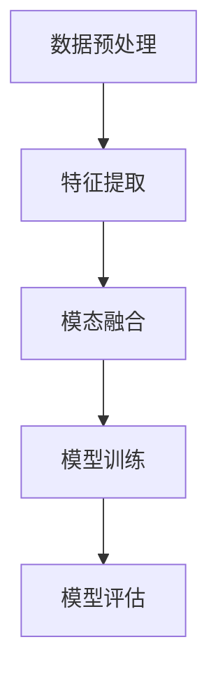

# 多模态大模型：技术原理与实战 多模态大模型在金融领域中的应用

## 1.背景介绍

在人工智能领域，多模态大模型（Multimodal Large Models, MLMs）正逐渐成为研究和应用的热点。多模态大模型能够处理和理解多种类型的数据，如文本、图像、音频和视频等，从而在多个领域展现出强大的应用潜力。特别是在金融领域，多模态大模型的应用前景广阔，可以用于风险评估、市场预测、客户服务等多个方面。

## 2.核心概念与联系

### 2.1 多模态数据

多模态数据是指来自不同来源和形式的数据，如文本、图像、音频和视频等。这些数据类型各自包含丰富的信息，但单一模态的数据往往无法全面反映复杂的现实世界。

### 2.2 大模型

大模型通常指的是具有大量参数和复杂结构的深度学习模型，如Transformer、BERT、GPT等。这些模型通过大规模数据训练，能够捕捉复杂的模式和关系。

### 2.3 多模态大模型

多模态大模型结合了多模态数据和大模型的优势，能够同时处理和理解多种类型的数据，从而在多个任务中表现出色。

### 2.4 多模态大模型在金融领域的联系

在金融领域，多模态大模型可以整合文本（如新闻、报告）、图像（如图表、图像识别）、音频（如电话录音）和视频（如会议记录）等多种数据源，从而提供更全面和准确的分析和预测。

## 3.核心算法原理具体操作步骤

### 3.1 数据预处理

数据预处理是多模态大模型的第一步。不同模态的数据需要进行不同的预处理步骤，如文本的分词和向量化，图像的归一化和增强，音频的特征提取等。

### 3.2 特征提取

特征提取是将原始数据转换为模型可以处理的特征向量。对于文本，可以使用词嵌入（Word Embedding）技术；对于图像，可以使用卷积神经网络（CNN）；对于音频，可以使用梅尔频谱图（Mel-spectrogram）。

### 3.3 模态融合

模态融合是多模态大模型的核心步骤。常见的模态融合方法包括早期融合、晚期融合和中期融合。早期融合将不同模态的数据在输入层进行融合；晚期融合在输出层进行融合；中期融合在中间层进行融合。

### 3.4 模型训练

模型训练是通过大规模数据和计算资源，对多模态大模型进行优化。常用的优化算法包括随机梯度下降（SGD）、Adam等。

### 3.5 模型评估

模型评估是通过一系列指标（如准确率、召回率、F1-score等）来评估多模态大模型的性能。



## 4.数学模型和公式详细讲解举例说明

### 4.1 文本特征提取

文本特征提取常用的方法是词嵌入（Word Embedding），如Word2Vec、GloVe等。假设有一个词汇表 $V$，每个词 $w_i$ 被映射到一个 $d$ 维向量 $\mathbf{v}_i$。

$$
\mathbf{v}_i = \text{Word2Vec}(w_i)
$$

### 4.2 图像特征提取

图像特征提取常用的方法是卷积神经网络（CNN）。假设输入图像为 $\mathbf{X}$，通过卷积层和池化层的操作，得到特征图 $\mathbf{F}$。

$$
\mathbf{F} = \text{CNN}(\mathbf{X})
$$

### 4.3 音频特征提取

音频特征提取常用的方法是梅尔频谱图（Mel-spectrogram）。假设输入音频信号为 $\mathbf{A}$，通过短时傅里叶变换（STFT）和梅尔滤波器组，得到梅尔频谱图 $\mathbf{M}$。

$$
\mathbf{M} = \text{Mel-spectrogram}(\mathbf{A})
$$

### 4.4 模态融合

模态融合可以通过拼接（Concatenation）的方法实现。假设有文本特征 $\mathbf{v}_t$，图像特征 $\mathbf{v}_i$ 和音频特征 $\mathbf{v}_a$，融合后的特征向量 $\mathbf{v}$ 为：

$$
\mathbf{v} = [\mathbf{v}_t; \mathbf{v}_i; \mathbf{v}_a]
$$

### 4.5 模型训练

模型训练的目标是最小化损失函数 $L$。常用的损失函数包括交叉熵损失（Cross-Entropy Loss）和均方误差（Mean Squared Error, MSE）。

$$
L = -\sum_{i=1}^{N} y_i \log(\hat{y}_i)
$$

## 5.项目实践：代码实例和详细解释说明

### 5.1 数据预处理

```python
import numpy as np
import pandas as pd
from sklearn.preprocessing import StandardScaler
from keras.preprocessing.text import Tokenizer
from keras.preprocessing.sequence import pad_sequences

# 文本数据预处理
texts = ["金融市场波动", "股票价格上涨"]
tokenizer = Tokenizer(num_words=10000)
tokenizer.fit_on_texts(texts)
sequences = tokenizer.texts_to_sequences(texts)
word_index = tokenizer.word_index
data = pad_sequences(sequences, maxlen=100)

# 图像数据预处理
from keras.preprocessing.image import ImageDataGenerator
datagen = ImageDataGenerator(rescale=1./255)
image_data = datagen.flow_from_directory('path_to_images', target_size=(150, 150), batch_size=32, class_mode='binary')

# 音频数据预处理
import librosa
audio_path = 'path_to_audio.wav'
y, sr = librosa.load(audio_path, sr=None)
mel_spectrogram = librosa.feature.melspectrogram(y=y, sr=sr, n_mels=128)
```

### 5.2 特征提取

```python
from keras.models import Model
from keras.layers import Input, Embedding, LSTM, Dense, Conv2D, MaxPooling2D, Flatten

# 文本特征提取
text_input = Input(shape=(100,), dtype='int32', name='text')
embedded_text = Embedding(input_dim=10000, output_dim=128, input_length=100)(text_input)
lstm_text = LSTM(128)(embedded_text)

# 图像特征提取
image_input = Input(shape=(150, 150, 3), name='image')
conv_image = Conv2D(32, (3, 3), activation='relu')(image_input)
pool_image = MaxPooling2D((2, 2))(conv_image)
flat_image = Flatten()(pool_image)

# 音频特征提取
audio_input = Input(shape=(128, 128), name='audio')
conv_audio = Conv2D(32, (3, 3), activation='relu')(audio_input)
pool_audio = MaxPooling2D((2, 2))(conv_audio)
flat_audio = Flatten()(pool_audio)
```

### 5.3 模态融合

```python
from keras.layers import concatenate

# 模态融合
merged = concatenate([lstm_text, flat_image, flat_audio])
dense_merged = Dense(128, activation='relu')(merged)
output = Dense(1, activation='sigmoid')(dense_merged)

# 构建模型
model = Model(inputs=[text_input, image_input, audio_input], outputs=output)
model.compile(optimizer='adam', loss='binary_crossentropy', metrics=['accuracy'])
```

### 5.4 模型训练

```python
# 模型训练
model.fit([data, image_data, mel_spectrogram], labels, epochs=10, batch_size=32, validation_split=0.2)
``