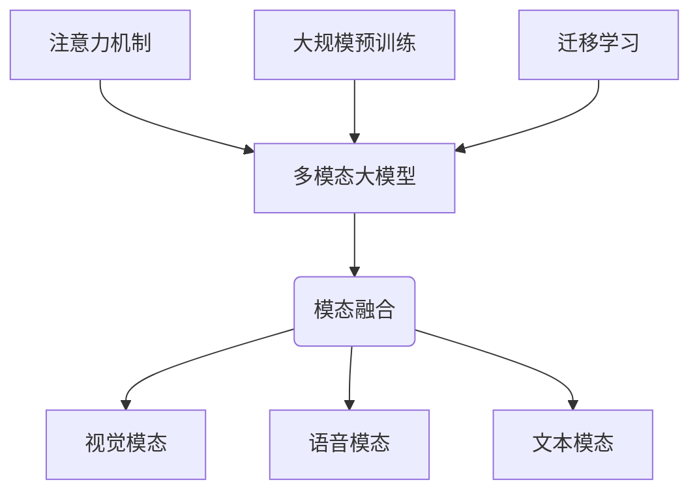
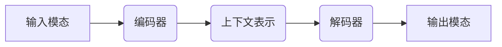

# 多模态大模型：技术原理与实战 部署环境准备

## 1.背景介绍

### 1.1 人工智能发展简史

人工智能(Artificial Intelligence, AI)是当代科技发展的重要领域,自20世纪50年代问世以来,经历了多个发展阶段。最初的人工智能系统主要基于符号主义和逻辑推理,如专家系统、规则引擎等。20世纪80年代,机器学习和神经网络的兴起,使得人工智能系统能够从数据中自动学习模式和规律。

### 1.2 深度学习的兴起

21世纪初,benefiting from大量数据、强大算力和优化算法,深度学习在多个领域取得突破性进展,如计算机视觉、自然语言处理等,成为人工智能发展的主流技术范式。然而,深度学习模型存在训练数据量大、泛化能力弱等局限性。

### 1.3 大模型时代的到来

2018年,Transformer模型在自然语言处理任务中表现出色,并衍生出GPT、BERT等大型语言模型。2021年,OpenAI推出DALL-E等大型多模态模型,展现了在视觉和语义理解方面的强大能力,开启了人工智能的大模型时代。

### 1.4 多模态大模型的重要意义

相较于单一模态,多模态大模型能够融合视觉、语音、文本等不同模态的信息,在认知智能、人机交互等领域具有广阔的应用前景。多模态大模型有望突破人工智能系统的局限性,实现通用人工智能(Artificial General Intelligence, AGI)的目标。

## 2.核心概念与联系

### 2.1 多模态大模型

多模态大模型指的是能够处理多种模态(视觉、语音、文本等)输入的大规模人工智能模型。它们通常包含数十亿甚至上万亿参数,在大规模数据集上进行预训练,获得对各种模态的理解能力。

### 2.2 模态融合

模态融合是多模态大模型的核心,它将不同模态的信息融合在一起,捕捉模态间的相关性和联系。常见的融合方法有早期融合、晚期融合和融合注意力等。

### 2.3 视觉模态

视觉模态指的是图像、视频等视觉信息。多模态大模型需要对视觉模态进行编码,提取视觉特征,并与其他模态进行关联。

### 2.4 语音模态 

语音模态指的是语音信号。多模态大模型需要对语音进行处理,如语音识别、语音合成等,并将语音信息与视觉、文本等模态相结合。

### 2.5 文本模态

文本模态是多模态大模型中最常见的一种模态,包括自然语言文本、知识库等结构化文本信息。

### 2.6 注意力机制

注意力机制是多模态大模型的关键技术之一,它能够自适应地分配不同模态特征的权重,捕捉模态间的相关性。

### 2.7 大规模预训练

多模态大模型通常需要在大规模多模态数据集上进行预训练,获得初始的多模态理解能力,为下游任务做准备。

### 2.8 迁移学习

在大规模预训练的基础上,多模态大模型可以通过迁移学习的方式,将预训练模型应用于下游任务,提高性能和泛化能力。

## 3.核心算法原理具体操作步骤

多模态大模型的核心算法主要包括以下几个方面:

### 3.1 模态编码

对于每种输入模态,都需要将其编码为对应的特征表示,以便后续的融合和建模。常见的编码方法有:

1. **视觉模态编码**:使用卷积神经网络(CNN)对图像进行编码,提取视觉特征。
2. **语音模态编码**:使用声学模型(如TDNN、LSTM等)对语音信号进行编码,提取语音特征。
3. **文本模态编码**:使用词向量(Word Embedding)、预训练语言模型(如BERT)等方法对文本进行编码,提取文本特征。

$$
\begin{aligned}
\mathbf{v} &= \text{CNN}(\text{image}) \\
\mathbf{a} &= \text{AcousticModel}(\text{audio}) \\
\mathbf{t} &= \text{TextEncoder}(\text{text})
\end{aligned}
$$

其中$\mathbf{v}$、$\mathbf{a}$、$\mathbf{t}$分别表示视觉、语音和文本模态的特征表示。

### 3.2 模态融合

将不同模态的特征表示融合在一起,捕捉模态间的相关性和联系。常见的融合方法有:

1. **早期融合**:在编码阶段就将不同模态的特征拼接在一起,送入后续的模型进行建模。
2. **晚期融合**:对每个模态单独建模,然后将不同模态的特征在后期进行融合。
3. **融合注意力**:使用注意力机制动态地分配不同模态特征的权重,实现自适应融合。

$$
\mathbf{h} = \text{Fusion}(\mathbf{v}, \mathbf{a}, \mathbf{t})
$$

其中$\mathbf{h}$表示融合后的多模态特征表示。

### 3.3 多头注意力

多头注意力机制是Transformer模型的核心,它能够同时关注输入序列中不同位置的信息,捕捉长距离依赖关系。在多模态大模型中,多头注意力被广泛应用于模态内和模态间的建模。

$$
\begin{aligned}
\text{MultiHead}(\mathbf{Q}, \mathbf{K}, \mathbf{V}) &= \text{Concat}(\text{head}_1, \dots, \text{head}_h)\mathbf{W^O} \\
\text{where}\  \text{head}_i &= \text{Attention}(\mathbf{QW}_i^Q, \mathbf{KW}_i^K, \mathbf{VW}_i^V)
\end{aligned}
$$

其中$\mathbf{Q}$、$\mathbf{K}$、$\mathbf{V}$分别表示查询(Query)、键(Key)和值(Value)矩阵。$\mathbf{W}_i^Q$、$\mathbf{W}_i^K$、$\mathbf{W}_i^V$和$\mathbf{W^O}$是可学习的线性变换矩阵。

### 3.4 自注意力层

自注意力层是Transformer编码器的核心组件,它能够捕捉输入序列中元素之间的相关性。在多模态大模型中,自注意力层被用于对单个模态的特征进行建模。

$$
\text{SelfAttention}(\mathbf{X}) = \text{MultiHead}(\mathbf{X}, \mathbf{X}, \mathbf{X})
$$

其中$\mathbf{X}$表示单个模态的特征序列。

### 3.5 交叉注意力层

交叉注意力层是Transformer解码器的核心组件,它能够捕捉输入序列和输出序列之间的相关性。在多模态大模型中,交叉注意力层被用于对不同模态特征之间的关系进行建模。

$$
\text{CrossAttention}(\mathbf{X}, \mathbf{Y}) = \text{MultiHead}(\mathbf{X}, \mathbf{Y}, \mathbf{Y})
$$

其中$\mathbf{X}$和$\mathbf{Y}$分别表示两个不同模态的特征序列。

### 3.6 前馈网络

前馈网络是Transformer模型中的另一个重要组件,它能够对输入特征进行非线性变换,提高模型的表示能力。

$$
\text{FFN}(\mathbf{x}) = \max(0, \mathbf{xW}_1 + \mathbf{b}_1)\mathbf{W}_2 + \mathbf{b}_2
$$

其中$\mathbf{W}_1$、$\mathbf{W}_2$、$\mathbf{b}_1$、$\mathbf{b}_2$是可学习的参数。

### 3.7 编码器-解码器架构

编码器-解码器架构是多模态大模型的常见架构之一,它将输入模态的特征编码为上下文表示,然后使用解码器根据上下文表示生成目标输出。

### 3.8 序列到序列建模

序列到序列建模是多模态大模型的另一种常见范式,它将输入模态和输出模态都视为序列,使用编码器-解码器架构或纯Transformer架构对输入序列和输出序列进行建模。

## 4.数学模型和公式详细讲解举例说明

在多模态大模型中,常用的数学模型和公式包括:

### 4.1 注意力机制

注意力机制是多模态大模型的核心技术之一,它能够自适应地分配不同特征的权重,捕捉特征之间的相关性。

对于查询$\mathbf{q}$、键$\mathbf{K}$和值$\mathbf{V}$,注意力机制的计算过程如下:

$$
\begin{aligned}
\text{Attention}(\mathbf{q}, \mathbf{K}, \mathbf{V}) &= \text{softmax}(\frac{\mathbf{qK}^\top}{\sqrt{d_k}})\mathbf{V} \\
&= \sum_{i=1}^n \alpha_i \mathbf{v}_i \\
\text{where}\ \alpha_i &= \frac{\exp(\mathbf{q}\mathbf{k}_i^\top / \sqrt{d_k})}{\sum_{j=1}^n \exp(\mathbf{q}\mathbf{k}_j^\top / \sqrt{d_k})}
\end{aligned}
$$

其中$d_k$是缩放因子,用于防止点积过大导致的梯度饱和问题。$\alpha_i$表示查询对第$i$个键值对的注意力权重。

**举例**:假设我们有一个视觉问答任务,需要根据图像和问题生成答案。我们可以使用注意力机制捕捉图像特征和问题特征之间的相关性。

- 查询$\mathbf{q}$:问题的特征表示
- 键$\mathbf{K}$:图像的特征表示
- 值$\mathbf{V}$:图像的特征表示

通过注意力机制,我们可以获得一个加权求和的上下文向量,它融合了与问题相关的图像信息,有助于生成正确的答案。

### 4.2 交叉熵损失

交叉熵损失是多模态大模型中常用的损失函数,它衡量了模型预测和真实标签之间的差异。

对于一个样本,交叉熵损失的计算公式如下:

$$
\begin{aligned}
\mathcal{L}(\mathbf{y}, \hat{\mathbf{y}}) &= -\sum_{i=1}^n y_i \log \hat{y}_i \\
&= -\log p(y|\mathbf{x})
\end{aligned}
$$

其中$\mathbf{y}$是真实标签的一热编码,即只有一个位置为1,其余位置为0;$\hat{\mathbf{y}}$是模型预测的概率分布;$n$是类别数量;$p(y|\mathbf{x})$是模型预测的条件概率。

**举例**:假设我们有一个图像分类任务,需要将图像分为猫、狗和其他三类。真实标签是[0, 1, 0, 0, 0],模型预测的概率分布是[0.1, 0.7, 0.05, 0.1, 0.05]。则交叉熵损失为:

$$
\mathcal{L}([0, 1, 0, 0, 0], [0.1, 0.7, 0.05, 0.1, 0.05]) = -\log 0.7 = 0.357
$$

在训练过程中,我们需要最小化交叉熵损失,使模型的预测逐渐逼近真实标签。

### 4.3 对比损失

对比损失是自监督学习中常用的损失函数,它鼓励相似样本的表示靠