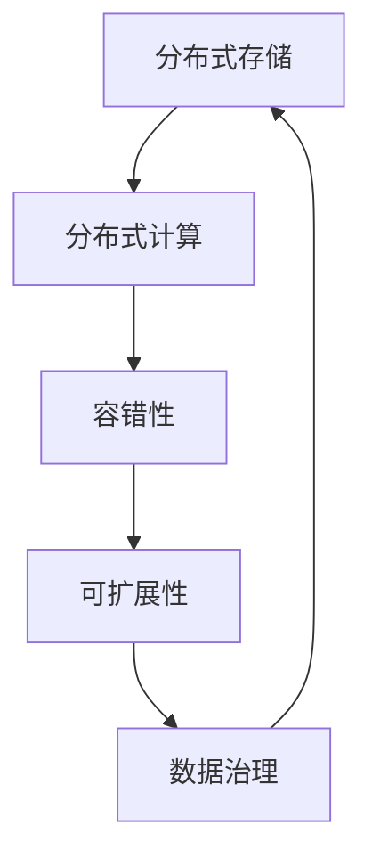
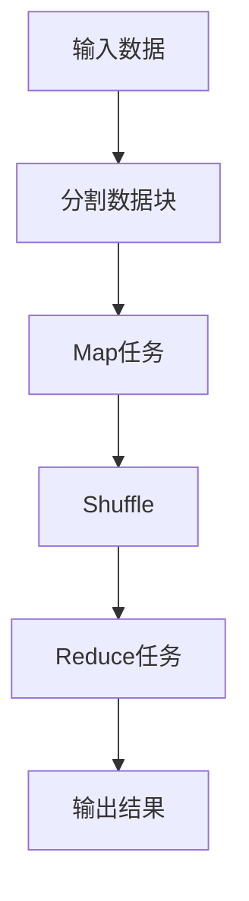
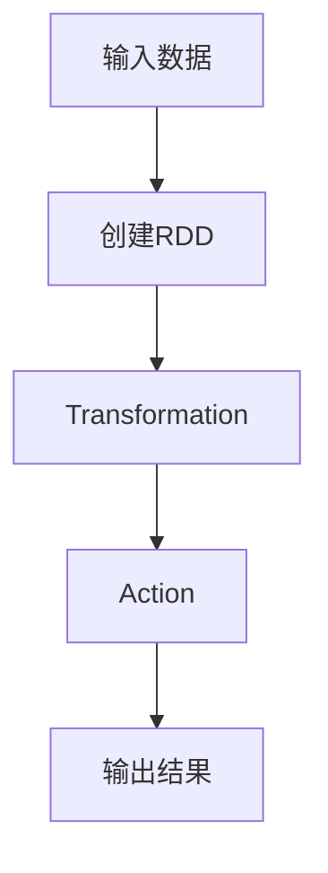

# 大数据处理框架原理与代码实战案例讲解

## 1.背景介绍

### 1.1 大数据时代的到来

随着互联网、物联网、云计算等新兴技术的飞速发展,数据正以前所未有的规模和速度不断积累。据统计,2020年全球数据总量已经达到59ZB(1ZB=1万亿GB),预计到2025年将超过175ZB。这种海量的数据不仅包括结构化数据(如关系型数据库),还包括非结构化数据(如网页、图像、视频等)。传统的数据处理方式已无法满足当前大数据时代的需求,迫切需要新的大数据处理框架来应对这一挑战。

### 1.2 大数据处理框架的重要性

大数据处理框架是一种用于存储、管理和分析大规模数据集的软件系统。它们具有高度的可扩展性、容错性和并行处理能力,可以有效地处理海量数据,从中发现隐藏的价值和洞见。大数据处理框架在各个领域都有着广泛的应用,如金融风险分析、网络安全监控、推荐系统、基因组学研究等。掌握大数据处理框架的原理和实践技能,对于数据科学家、软件工程师和IT专业人员来说至关重要。

## 2.核心概念与联系

### 2.1 大数据处理框架的核心概念

1. **分布式存储**:大数据处理框架通常采用分布式存储系统,如HDFS、Ceph、Amazon S3等,将海量数据分散存储在多个节点上,提高数据可靠性和可用性。

2. **分布式计算**:利用多个计算节点并行处理数据,提高计算效率。常见的分布式计算模型包括MapReduce、Spark、Flink等。

3. **容错性**:大数据处理框架具有容错性,能够自动检测和处理节点故障,确保数据处理的可靠性。

4. **可扩展性**:大数据处理框架可以通过添加更多的计算节点来线性扩展计算能力,满足不断增长的数据处理需求。

5. **数据治理**:包括数据质量管理、元数据管理、数据安全和隐私保护等,确保数据的完整性、一致性和安全性。

### 2.2 核心概念之间的关系

上述核心概念相互关联,共同构建了大数据处理框架的基础架构。分布式存储为海量数据提供了可靠的存储空间;分布式计算利用多个节点的计算资源,高效地处理存储的数据;容错性和可扩展性则确保了框架的稳定性和灵活性;而数据治理则贯穿整个数据生命周期,保证数据质量和安全。只有这些核心概念相互配合,才能构建出高效、可靠的大数据处理框架。



## 3.核心算法原理具体操作步骤

大数据处理框架中常用的核心算法包括MapReduce、Spark等,下面将分别介绍它们的原理和具体操作步骤。

### 3.1 MapReduce算法

MapReduce是一种分布式计算模型,由Google提出,适用于大规模数据集的并行处理。它将计算过程分为两个阶段:Map阶段和Reduce阶段。

1. **Map阶段**:输入数据被分割为多个数据块,每个数据块由一个Map任务处理。Map任务将输入数据转换为中间的<key,value>对,并将结果写入本地磁盘。

2. **Shuffle阶段**:框架收集各个Map任务的输出结果,并按key进行分组和排序,作为Reduce任务的输入。

3. **Reduce阶段**:框架为每个不同的key创建一个Reduce任务。Reduce任务获取相同key的所有value值,对它们进行用户自定义的操作,并输出最终结果。

MapReduce算法的操作步骤如下:



1. 将输入数据切分为多个数据块。
2. 为每个数据块启动一个Map任务,并行执行Map操作。
3. 收集Map任务的输出结果,按key进行分组和排序。
4. 为每个key启动一个Reduce任务,并行执行Reduce操作。
5. 将Reduce任务的输出结果写入最终输出文件。

### 3.2 Spark算法

Spark是一种基于内存计算的分布式数据处理框架,比MapReduce更高效。它采用了RDD(Resilient Distributed Dataset)的数据抽象,支持多种高级数据处理操作。

Spark算法的核心是RDD,它是一种分布式内存数据集,支持两种操作:transformation和action。

1. **Transformation**:对RDD进行转换操作,生成新的RDD,如map、filter、join等。这些操作是延迟执行的,只有在需要计算结果时才会真正执行。

2. **Action**:触发RDD的计算,并返回结果,如count、collect、save等。

Spark算法的操作步骤如下:



1. 从输入数据源(如HDFS、HBase等)创建初始RDD。
2. 对RDD执行一系列Transformation操作,生成新的RDD。
3. 触发Action操作,计算RDD的结果。
4. 将计算结果输出或保存到外部数据源。

## 4.数学模型和公式详细讲解举例说明

在大数据处理框架中,常常需要使用一些数学模型和公式来描述和优化算法。下面将介绍两个常见的数学模型:数据划分模型和数据局部性模型。

### 4.1 数据划分模型

数据划分是大数据处理框架中的一个关键问题。合理的数据划分策略可以提高计算效率和数据局部性。常用的数据划分模型包括哈希划分和范围划分。

#### 4.1.1 哈希划分

哈希划分是将数据根据key的哈希值划分到不同的分区。假设有N个分区,数据的key为k,则数据划分到第i个分区的条件为:

$$
i = hash(k) \bmod N
$$

其中,hash()是一个哈希函数,可以将key映射为一个整数值。

哈希划分的优点是计算简单、数据分布均匀;缺点是无法保证相邻的key被划分到相邻的分区,从而影响数据局部性。

#### 4.1.2 范围划分

范围划分是将数据根据key的范围划分到不同的分区。假设有N个分区,数据的key为k,分区的范围为[min_i,max_i),则数据划分到第i个分区的条件为:

$$
min_i \leq k < max_i
$$

范围划分的优点是可以保证相邻的key被划分到相邻的分区,提高数据局部性;缺点是数据分布可能不均匀,导致负载不均衡。

### 4.2 数据局部性模型

数据局部性是大数据处理框架中的另一个重要概念。由于数据传输的开销远大于计算的开销,因此应尽量减少数据传输,提高数据局部性。常用的数据局部性模型包括数据并行度模型和任务调度模型。

#### 4.2.1 数据并行度模型

数据并行度模型描述了如何将数据划分为多个分区,并在多个计算节点上并行处理。假设有N个计算节点,M个数据分区,则每个节点需要处理M/N个分区。为了提高数据局部性,应尽量将相关的数据分区分配到同一个计算节点上处理。

数据并行度可以用下式表示:

$$
D_p = \frac{M}{N}
$$

其中,D_p表示每个节点需要处理的数据分区数量。

#### 4.2.2 任务调度模型

任务调度模型描述了如何将计算任务分配到不同的计算节点上执行。为了提高数据局部性,应尽量将计算任务调度到存储相关数据的节点上执行,减少数据传输开销。

任务调度可以用下式表示:

$$
T_i = f(D_i, C_i)
$$

其中,T_i表示第i个计算节点上的任务数量,D_i表示该节点上的数据分区数量,C_i表示该节点的计算能力。调度算法的目标是在满足数据局部性的前提下,实现任务数量与计算能力的匹配,从而提高整体计算效率。

## 5.项目实践:代码实例和详细解释说明

为了更好地理解大数据处理框架的原理和实践,下面将通过一个基于Spark的电影评分数据分析项目,展示具体的代码实例和详细解释。

### 5.1 项目背景

本项目的目标是分析一个包含大量电影评分数据的数据集,统计每部电影的平均评分、评分人数等信息。数据集存储在HDFS上,格式如下:

```
movieId,rating,timestamp
```

其中,movieId表示电影ID,rating表示评分(1-5分),timestamp表示评分时间戳。

### 5.2 代码实例

```scala
import org.apache.spark.sql.SparkSession

object MovieRatingAnalyzer {

  def main(args: Array[String]): Unit = {
    // 创建SparkSession
    val spark = SparkSession.builder()
      .appName("MovieRatingAnalyzer")
      .getOrCreate()

    // 读取数据
    val ratingsDF = spark.read
      .option("inferSchema", "true")
      .csv("hdfs://namenode:9000/ratings.csv")
      .toDF("movieId", "rating", "timestamp")

    // 计算每部电影的平均评分和评分人数
    val movieRatingsDF = ratingsDF
      .groupBy("movieId")
      .agg(
        count("rating").alias("ratingCount"),
        avg("rating").alias("avgRating")
      )
      .orderBy(desc("ratingCount"))

    // 显示结果
    movieRatingsDF.show(10, false)

    // 停止SparkSession
    spark.stop()
  }
}
```

### 5.3 代码解释

1. 首先创建一个SparkSession对象,作为程序的入口点。

2. 使用SparkSession的read方法从HDFS读取电影评分数据,并将其转换为DataFrame。

3. 对DataFrame执行groupBy和agg操作,按movieId分组,计算每部电影的评分人数(ratingCount)和平均评分(avgRating)。

4. 使用orderBy操作,按评分人数降序排列结果。

5. 调用show方法,显示前10条结果记录。

6. 最后,停止SparkSession,释放资源。

该程序的输出结果类似于:

```
movieId|ratingCount|avgRating
+-------+------------+------------------+
|858|209663|3.8185463562751677
|593|194613|3.5773621031811635
|1193|192718|3.8771296295952312
|...
```

可以看到,程序成功统计出了每部电影的评分人数和平均评分,并按评分人数降序排列。这个简单的示例展示了如何使用Spark进行大数据处理和分析。

## 6.实际应用场景

大数据处理框架在现实世界中有着广泛的应用场景,下面列举了几个典型的应用案例。

### 6.1 网络日志分析

网站和应用程序会产生大量的访问日志数据,这些数据包含了用户行为、流量模式等宝贵信息。通过大数据处理框架对这些日志数据进行分析,可以发现用户行为模式、优化网站性能、检测安全威胁等。例如,电商网站可以分析用户浏览和购买记录,为用户提供个性化推荐;网络安全公司可以分析网络流量日志,及时发现恶意攻击行为。

### 6.2 推荐系统

推荐系统是大数据处理框架的一个重要应用领域。电商网站、视频网站、社交媒体等平台都会根据用户的浏览历史、购买记录、社交关系等数据,为用户推荐感兴趣的商品、视频或好友。推荐算法通常需要处理海量的用户数据和商品数据,因此需要利用大数据处理框架的并行计算能力。

### 6.3 金融风险分析

金融行业积