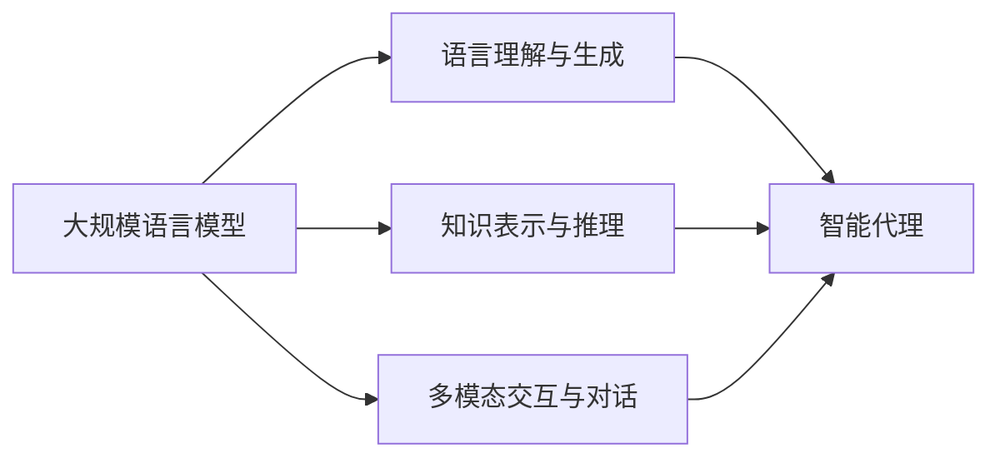

# 大规模语言模型从理论到实践 智能代理的组成

## 1. 背景介绍
### 1.1 人工智能的发展历程
#### 1.1.1 早期人工智能
#### 1.1.2 专家系统时代 
#### 1.1.3 机器学习与深度学习

### 1.2 自然语言处理的演进
#### 1.2.1 基于规则的方法
#### 1.2.2 统计机器学习方法
#### 1.2.3 神经网络与深度学习方法

### 1.3 大规模语言模型的兴起
#### 1.3.1 Transformer 模型的提出
#### 1.3.2 预训练语言模型的发展
#### 1.3.3 GPT、BERT等大规模语言模型

## 2. 核心概念与联系
### 2.1 大规模语言模型
#### 2.1.1 定义与特点
#### 2.1.2 训练数据与模型规模
#### 2.1.3 应用领域与挑战

### 2.2 智能代理
#### 2.2.1 定义与特点
#### 2.2.2 组成部分与架构
#### 2.2.3 应用场景与挑战

### 2.3 大规模语言模型与智能代理的关系
#### 2.3.1 语言理解与生成能力
#### 2.3.2 知识表示与推理能力
#### 2.3.3 多模态交互与对话能力



## 3. 核心算法原理具体操作步骤
### 3.1 Transformer 模型
#### 3.1.1 自注意力机制
#### 3.1.2 多头注意力
#### 3.1.3 前馈神经网络

### 3.2 预训练与微调
#### 3.2.1 无监督预训练
#### 3.2.2 有监督微调
#### 3.2.3 领域适应与迁移学习

### 3.3 生成式预训练
#### 3.3.1 自回归语言模型
#### 3.3.2 去噪自编码器
#### 3.3.3 BERT与GPT的区别

## 4. 数学模型和公式详细讲解举例说明
### 4.1 Transformer 中的自注意力机制
给定一个输入序列 $\mathbf{x} = (x_1, \dots, x_n)$，自注意力机制首先将其转换为三个矩阵：查询矩阵 $\mathbf{Q}$、键矩阵 $\mathbf{K}$ 和值矩阵 $\mathbf{V}$。然后计算注意力分数：

$$
\text{Attention}(\mathbf{Q}, \mathbf{K}, \mathbf{V}) = \text{softmax}(\frac{\mathbf{Q}\mathbf{K}^T}{\sqrt{d_k}})\mathbf{V}
$$

其中 $d_k$ 是查询和键向量的维度。

### 4.2 多头注意力
多头注意力将自注意力扩展为多个并行的注意力头，每个头独立地计算注意力分数，然后将结果拼接起来并线性变换：

$$
\text{MultiHead}(\mathbf{Q}, \mathbf{K}, \mathbf{V}) = \text{Concat}(\text{head}_1, \dots, \text{head}_h)\mathbf{W}^O
$$

其中 $\text{head}_i = \text{Attention}(\mathbf{Q}\mathbf{W}_i^Q, \mathbf{K}\mathbf{W}_i^K, \mathbf{V}\mathbf{W}_i^V)$，$\mathbf{W}_i^Q$、$\mathbf{W}_i^K$、$\mathbf{W}_i^V$ 和 $\mathbf{W}^O$ 是可学习的权重矩阵。

### 4.3 语言模型的目标函数
给定一个文本序列 $\mathbf{x} = (x_1, \dots, x_n)$，语言模型的目标是最大化下一个单词的条件概率：

$$
\mathcal{L}(\theta) = \sum_{i=1}^n \log P(x_i | x_1, \dots, x_{i-1}; \theta)
$$

其中 $\theta$ 是模型参数。对于 BERT，目标函数还包括遮蔽语言模型和下一句预测任务。

## 5. 项目实践：代码实例和详细解释说明
下面是使用 PyTorch 实现 Transformer 编码器层的示例代码：

```python
import torch
import torch.nn as nn

class TransformerEncoderLayer(nn.Module):
    def __init__(self, d_model, nhead, dim_feedforward=2048, dropout=0.1):
        super(TransformerEncoderLayer, self).__init__()
        self.self_attn = nn.MultiheadAttention(d_model, nhead, dropout=dropout)
        self.linear1 = nn.Linear(d_model, dim_feedforward)
        self.dropout = nn.Dropout(dropout)
        self.linear2 = nn.Linear(dim_feedforward, d_model)
        self.norm1 = nn.LayerNorm(d_model)
        self.norm2 = nn.LayerNorm(d_model)
        self.dropout1 = nn.Dropout(dropout)
        self.dropout2 = nn.Dropout(dropout)
        
    def forward(self, src, src_mask=None, src_key_padding_mask=None):
        src2 = self.self_attn(src, src, src, attn_mask=src_mask,
                              key_padding_mask=src_key_padding_mask)[0]
        src = src + self.dropout1(src2)
        src = self.norm1(src)
        src2 = self.linear2(self.dropout(torch.relu(self.linear1(src))))
        src = src + self.dropout2(src2)
        src = self.norm2(src)
        return src
```

这段代码定义了一个 `TransformerEncoderLayer` 类，它包含了多头自注意力机制、前馈神经网络以及残差连接和层归一化。`forward` 方法定义了编码器层的前向传播过程，首先通过自注意力机制更新表示，然后通过前馈神经网络进一步转换，最后通过残差连接和层归一化得到最终的输出表示。

## 6. 实际应用场景
### 6.1 智能客服
#### 6.1.1 客户问题理解与意图识别
#### 6.1.2 个性化回复生成
#### 6.1.3 多轮对话管理

### 6.2 智能写作助手
#### 6.2.1 文本生成与续写
#### 6.2.2 文本改写与润色
#### 6.2.3 创意写作支持

### 6.3 智能搜索与推荐
#### 6.3.1 查询理解与扩展
#### 6.3.2 相关性排序与匹配
#### 6.3.3 个性化推荐生成

## 7. 工具和资源推荐
### 7.1 开源工具包
- PyTorch：https://pytorch.org
- TensorFlow：https://www.tensorflow.org
- Hugging Face Transformers：https://huggingface.co/transformers

### 7.2 预训练模型
- BERT：https://github.com/google-research/bert
- GPT-2：https://github.com/openai/gpt-2
- T5：https://github.com/google-research/text-to-text-transfer-transformer

### 7.3 数据集
- Wikipedia：https://dumps.wikimedia.org
- Common Crawl：https://commoncrawl.org
- BooksCorpus：https://yknzhu.wixsite.com/mbweb

## 8. 总结：未来发展趋势与挑战
### 8.1 模型效率与可解释性
#### 8.1.1 模型压缩与加速
#### 8.1.2 可解释性与可控性

### 8.2 领域知识融合
#### 8.2.1 结构化知识的表示与推理
#### 8.2.2 跨模态信息的融合与对齐

### 8.3 安全与伦理
#### 8.3.1 隐私保护与数据安全
#### 8.3.2 公平性与去偏见
#### 8.3.3 可控生成与防止滥用

## 9. 附录：常见问题与解答
### 9.1 如何选择合适的预训练模型？
根据具体任务和场景，选择合适的模型架构（如 BERT、GPT、T5 等）和预训练数据。对于特定领域的任务，可以在通用预训练模型的基础上进行领域适应和微调。

### 9.2 如何处理训练大规模语言模型的计算资源瓶颈？
可以采用模型并行、数据并行、混合精度训练等技术来加速训练过程。同时，可以利用模型压缩技术（如知识蒸馏、量化、剪枝等）来减小模型体积，提高推理效率。

### 9.3 如何评估大规模语言模型的性能？
可以使用 GLUE、SuperGLUE 等标准基准测试集来评估模型在不同自然语言理解任务上的性能。对于生成任务，可以使用 BLEU、ROUGE、METEOR 等指标来评估生成文本的质量。同时，还需要考虑模型的鲁棒性、公平性等非功能性需求。

作者：禅与计算机程序设计艺术 / Zen and the Art of Computer Programming