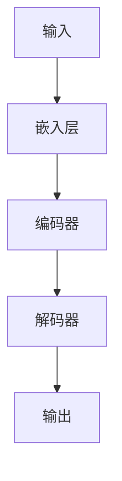

# 大语言模型原理与工程实践：大语言模型的推理能力

## 1.背景介绍

大语言模型（Large Language Model, LLM）是近年来人工智能领域的一个重要突破。它们通过训练在大量文本数据上，能够生成高质量的自然语言文本，进行复杂的推理和回答问题。大语言模型的推理能力使其在多个领域中得到了广泛应用，如自然语言处理、机器翻译、对话系统等。

大语言模型的推理能力不仅仅依赖于其庞大的参数量和复杂的架构，还依赖于其在训练过程中所学习到的丰富的语言知识和语义理解能力。本文将深入探讨大语言模型的推理能力，从核心概念、算法原理、数学模型、项目实践、实际应用场景、工具和资源推荐等多个方面进行详细讲解。

## 2.核心概念与联系

### 2.1 大语言模型的定义

大语言模型是指那些具有数十亿甚至数千亿参数的深度学习模型，通常基于Transformer架构。它们通过在大规模文本数据上进行训练，能够生成高质量的自然语言文本，并具备一定的推理能力。

### 2.2 推理能力的定义

推理能力是指模型在给定输入的情况下，能够通过逻辑推理和知识迁移，生成合理的输出。这种能力不仅依赖于模型的参数量，还依赖于其在训练过程中所学习到的知识和语义理解能力。

### 2.3 大语言模型与推理能力的联系

大语言模型的推理能力主要体现在以下几个方面：

1. **语义理解**：模型能够理解输入文本的语义，并基于此生成合理的输出。
2. **知识迁移**：模型能够将训练过程中学习到的知识应用到新的问题中。
3. **逻辑推理**：模型能够进行一定程度的逻辑推理，生成符合逻辑的输出。

## 3.核心算法原理具体操作步骤

### 3.1 Transformer架构

大语言模型通常基于Transformer架构，该架构由Vaswani等人在2017年提出。Transformer架构通过自注意力机制（Self-Attention）和多头注意力机制（Multi-Head Attention）实现了高效的并行计算和长距离依赖的捕捉。



### 3.2 自注意力机制

自注意力机制是Transformer架构的核心，通过计算输入序列中每个位置的注意力权重，模型能够捕捉到序列中不同位置之间的依赖关系。

### 3.3 多头注意力机制

多头注意力机制通过并行计算多个自注意力机制，增强了模型的表达能力。每个头（Head）可以关注输入序列中的不同部分，从而捕捉到更多的语义信息。

### 3.4 训练过程

大语言模型的训练过程通常包括以下几个步骤：

1. **数据预处理**：对大规模文本数据进行预处理，包括分词、去除停用词等。
2. **模型初始化**：初始化模型参数，通常使用随机初始化或预训练模型。
3. **模型训练**：使用大规模文本数据对模型进行训练，优化目标函数（如交叉熵损失）。
4. **模型评估**：使用验证集对模型进行评估，调整超参数和模型结构。

## 4.数学模型和公式详细讲解举例说明

### 4.1 自注意力机制的数学公式

自注意力机制的核心是通过计算输入序列中每个位置的注意力权重，捕捉序列中不同位置之间的依赖关系。具体公式如下：

$$
\text{Attention}(Q, K, V) = \text{softmax}\left(\frac{QK^T}{\sqrt{d_k}}\right)V
$$

其中，$Q$、$K$、$V$分别表示查询（Query）、键（Key）和值（Value）矩阵，$d_k$表示键的维度。

### 4.2 多头注意力机制的数学公式

多头注意力机制通过并行计算多个自注意力机制，增强了模型的表达能力。具体公式如下：

$$
\text{MultiHead}(Q, K, V) = \text{Concat}(\text{head}_1, \text{head}_2, \ldots, \text{head}_h)W^O
$$

其中，$\text{head}_i = \text{Attention}(QW_i^Q, KW_i^K, VW_i^V)$，$W_i^Q$、$W_i^K$、$W_i^V$和$W^O$是可训练的权重矩阵。

### 4.3 训练目标函数

大语言模型的训练目标通常是最小化交叉熵损失函数，具体公式如下：

$$
\mathcal{L} = -\sum_{i=1}^N \log P(y_i | x_i)
$$

其中，$N$表示训练样本的数量，$P(y_i | x_i)$表示模型在给定输入$x_i$的情况下，生成正确输出$y_i$的概率。

## 5.项目实践：代码实例和详细解释说明

### 5.1 数据预处理

在项目实践中，首先需要对大规模文本数据进行预处理。以下是一个简单的Python代码示例，使用NLTK库进行分词和去除停用词：

```python
import nltk
from nltk.corpus import stopwords
from nltk.tokenize import word_tokenize

# 下载停用词列表
nltk.download('stopwords')
nltk.download('punkt')

# 示例文本
text = "大语言模型是近年来人工智能领域的一个重要突破。"

# 分词
words = word_tokenize(text)

# 去除停用词
filtered_words = [word for word in words if word not in stopwords.words('ch