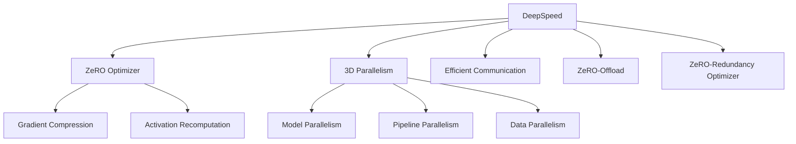

# 大语言模型原理与工程实践：大语言模型训练工程实践DeepSpeed架构

## 1.背景介绍

### 1.1 大语言模型的兴起

近年来,大型语言模型(Large Language Model, LLM)在自然语言处理(NLP)领域取得了令人瞩目的成就。这些模型通过在大规模语料库上进行预训练,学习了丰富的语言知识和上下文信息,从而能够生成高质量的文本、回答复杂问题、进行多语种翻译等。

代表性的大语言模型包括GPT-3、BERT、XLNet、RoBERTa等,它们在各种NLP任务上展现出了超越人类的性能。然而,训练这些庞大的模型需要耗费大量的计算资源,给硬件设施和算力带来了巨大压力。

### 1.2 大模型训练的挑战

训练大语言模型面临着以下主要挑战:

1. **计算资源需求巨大**: 大模型通常包含数十亿甚至上百亿个参数,训练过程需要大量GPU资源。单机无法满足如此庞大的计算需求。

2. **内存容量受限**: 单GPU显存有限,难以容纳大规模模型和训练数据。这限制了批量大小,影响训练效率。

3. **通信开销庞大**: 在多GPU训练中,需要频繁在GPU之间传输数据,产生巨大通信开销。

4. **内存利用率低下**: 由于模型和数据分布在多个GPU上,每个GPU的内存利用率往往较低。

5. **训练时间过长**: 由于参数众多,收敛到最优模型需要极长的训练时间,成本高昂。

为了解决这些挑战,需要高效的分布式训练系统和优化策略,DeepSpeed就是一种革命性的解决方案。

## 2.核心概念与联系 

### 2.1 DeepSpeed概述

DeepSpeed是微软于2020年推出的一个用于加速大模型训练的开源库。它提供了多种优化技术,旨在充分利用现有的硬件资源,大幅提高训练效率和扩展性。

DeepSpeed的核心思想是通过模型并行化、数据并行化、流水线并行化等策略,将大模型和训练数据分布到多个GPU上,实现高效的分布式训练。同时,它还包含了多种优化技术,如梯度压缩、激活重计算、3D并行等,进一步提升了性能和内存利用率。

### 2.2 DeepSpeed的关键组件

DeepSpeed主要包含以下几个关键组件:

1. **ZeRO优化器(ZeRO Optimizer)**: 通过多种技术(如梯度压缩、激活重计算等)减少内存占用,支持超大模型训练。

2. **3D并行化(3D Parallelism)**: 将模型划分到多个GPU上,实现模型并行、流水线并行和数据并行。

3. **高效通信(Efficient Communication)**: 采用优化的通信算法,减少GPU间数据传输开销。

4. **ZeRO-Offload**: 将部分模型参数和优化器状态卸载到CPU或NVMe,进一步节省GPU内存。

5. **ZeRO-Redundancy Optimizer**: 通过冗余参数和梯度,消除通信开销,提高训练速度。

这些组件相互协作,为大模型训练提供了高效、可扩展的解决方案。

## 3.核心算法原理具体操作步骤

### 3.1 ZeRO优化器

ZeRO(Zero Redundancy Optimizer)优化器是DeepSpeed的核心组件之一,它通过多种技术优化内存使用,使得GPU能够训练超大规模模型。

#### 3.1.1 梯度压缩

在分布式训练中,每个GPU需要将本地计算的梯度传输给其他GPU,以便进行参数更新。梯度压缩技术可以显著减小梯度的内存占用,从而降低通信开销。

DeepSpeed支持多种梯度压缩算法,如FP16压缩、FP16+静态缩放、FP16+动态缩放等。其中,动态缩放算法根据梯度的实际分布动态调整缩放因子,在保证精度的同时获得更高的压缩率。

#### 3.1.2 激活重计算

在训练过程中,前向传播会产生大量的中间激活值(activations),这些值需要在反向传播时重新计算,从而占用大量内存。激活重计算技术通过在反向传播时重新计算激活值,而不是存储它们,从而节省了大量内存。

DeepSpeed提供了多种激活重计算策略,包括始终重计算、按需重计算和固定内存预算重计算等。用户可以根据模型大小和硬件资源进行灵活配置。

#### 3.1.3 常量缓冲区优化

在模型推理和训练过程中,存在大量的常量数据(如embedding表、规范化参数等),这些数据通常占用大量内存。DeepSpeed通过将这些常量数据存储在单独的只读缓冲区中,并在多个GPU之间共享,从而节省了内存使用。

#### 3.1.4 优化器状态分片

在大模型训练中,优化器(如Adam)需要为每个参数维护一些状态变量(如动量、方差等),这些状态变量的内存占用也是巨大的。DeepSpeed采用分片技术,将这些状态变量划分到不同的GPU上,从而减少单个GPU的内存压力。

### 3.2 3D并行化

3D并行化是DeepSpeed的另一个核心技术,它将大模型划分到多个GPU上,实现模型并行、流水线并行和数据并行,从而支持超大模型的高效训练。

#### 3.2.1 模型并行

模型并行将模型的不同层或块划分到不同的GPU上,每个GPU只需要处理模型的一部分。这种方式可以有效突破单GPU内存限制,支持更大的模型。

DeepSpeed提供了多种模型并行策略,包括张量并行、层并行、行并行等。用户可以根据模型结构和硬件资源进行灵活配置。

#### 3.2.2 流水线并行

流水线并行将模型划分为多个阶段,每个阶段由一个或多个GPU执行。在前向传播时,不同阶段的计算可以并行执行,从而提高吞吐量。反向传播过程也采用类似的流水线方式进行。

DeepSpeed支持多种流水线策略,如自动流水线分区、序列流水线、交错流水线等,可以根据模型结构和硬件拓扑进行优化。

#### 3.2.3 数据并行

数据并行是分布式训练中最常见的策略,将训练数据划分到多个GPU上,每个GPU处理一部分数据。DeepSpeed在数据并行的基础上,结合了其他优化技术(如梯度压缩、激活重计算等),进一步提高了训练效率。

### 3.3 高效通信

在分布式训练中,GPU之间需要频繁传输数据(如梯度、激活值等),这会产生巨大的通信开销。DeepSpeed采用了多种优化策略,以减少通信开销。

#### 3.3.1 通信算法优化

DeepSpeed优化了多种通信算法,如环形AllReduce、双向环形AllReduce、分层AllReduce等,根据集群拓扑和数据特征选择最优算法,降低通信延迟。

#### 3.3.2 通信调度优化

DeepSpeed采用智能通信调度策略,将多个通信操作合并为一个操作,减少通信开销。同时,它还支持通信/计算重叠,在GPU进行计算时同时进行通信,提高效率。

#### 3.3.3 通信压缩

DeepSpeed支持多种通信压缩技术,如FP16压缩、梯度压缩等,将需要传输的数据压缩后再进行通信,从而减小通信带宽需求。

### 3.4 ZeRO-Offload

即使采用了上述优化技术,在训练超大模型时,GPU内存依然可能不足。DeepSpeed提供了ZeRO-Offload功能,将部分模型参数和优化器状态卸载到CPU或NVMe上,进一步节省GPU内存。

在前向传播时,ZeRO-Offload会根据需求动态地将所需参数加载到GPU上。在反向传播时,则将相应的梯度和优化器状态写回CPU或NVMe。这种按需加载和卸载策略,可以最大限度地利用GPU内存,支持更大的模型。

### 3.5 ZeRO-Redundancy Optimizer

ZeRO-Redundancy Optimizer是DeepSpeed的另一项创新技术,它通过在多个GPU之间冗余参数和梯度,消除了通信开销,从而进一步提高了训练速度。

在传统的数据并行方式中,每个GPU需要将本地计算的梯度传输给其他GPU,以便进行参数更新。而在ZeRO-Redundancy Optimizer中,每个GPU不仅存储了模型参数的一部分,还冗余存储了所有参数的副本。在前向传播时,每个GPU使用本地参数副本进行计算;在反向传播时,每个GPU直接使用本地梯度对本地参数副本进行更新,无需进行通信。

这种方式消除了通信开销,大幅提高了训练速度。同时,由于每个GPU都拥有完整的参数副本,模型也可以在单GPU上进行推理,无需额外的参数集合操作。

## 4.数学模型和公式详细讲解举例说明

在深入探讨DeepSpeed的核心算法之前,我们先介绍一些相关的数学模型和公式。

### 4.1 梯度压缩

梯度压缩是DeepSpeed中一项重要的优化技术,它通过压缩梯度数据,减小通信开销。常见的梯度压缩算法包括:

#### 4.1.1 FP16压缩

FP16压缩是最简单的梯度压缩方法,将原始的FP32梯度数据转换为FP16格式进行传输。数学表达式如下:

$$
g_{compressed} = \text{FP16}(g)
$$

其中,$$g$$表示原始FP32梯度,$$g_{compressed}$$表示压缩后的FP16梯度。

虽然FP16压缩可以将数据大小减小一半,但是由于FP16精度较低,可能会影响模型收敛。

#### 4.1.2 FP16+静态缩放

为了提高FP16压缩的精度,DeepSpeed引入了静态缩放技术。具体做法是,在压缩前先对梯度进行缩放,在解压后再进行反缩放。数学表达式如下:

$$
g_{compressed} = \text{FP16}(\alpha \cdot g)
$$
$$
\hat{g} = \frac{1}{\alpha} \cdot g_{compressed}
$$

其中,$$\alpha$$是一个静态的缩放因子,通常取值为2^{16}或2^{24}。$$\hat{g}$$表示解压后的梯度近似值。

静态缩放可以有效提高FP16压缩的精度,但是由于缩放因子是静态的,无法适应梯度数据的动态变化。

#### 4.1.3 FP16+动态缩放

为了进一步提高压缩精度,DeepSpeed采用了动态缩放算法。在动态缩放中,缩放因子$$\alpha$$不再是静态的,而是根据当前梯度的实际分布动态计算得到。具体做法是:

1. 计算当前梯度的绝对最大值$$M = \max_{i} |g_i|$$。
2. 选择一个合适的缩放因子$$\alpha$$,使得$$\alpha \cdot M$$接近FP16的最大值(通常为2^{16}-1)。
3. 对梯度进行缩放压缩:$$g_{compressed} = \text{FP16}(\alpha \cdot g)$$。
4. 在解压后进行反缩放:$$\hat{g} = \frac{1}{\alpha} \cdot g_{compressed}$$。

动态缩放算法可以根据梯度的实际分布自适应地选择缩放因子,从而最大限度地利用FP16的动态范围,在保证精度的同时获得更高的压缩率。

### 4.2 激活重计算

激活重计算是DeepSpee