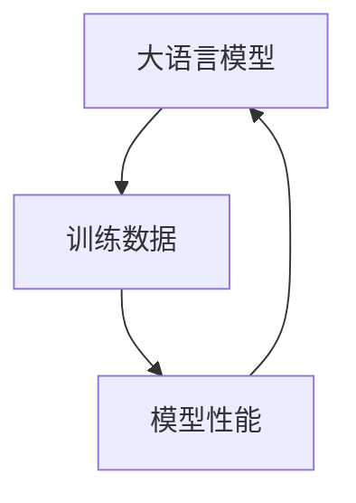

# 大语言模型原理与工程实践：数据瓶颈

## 1. 背景介绍
### 1.1 大语言模型概述
#### 1.1.1 定义与特点
大语言模型(Large Language Model, LLM)是一类基于海量文本数据训练的深度神经网络模型,具有强大的自然语言理解和生成能力。它们通过学习大规模语料库中的语言模式和知识,可以完成诸如对话、问答、摘要、翻译等复杂的自然语言处理任务。LLM的显著特点包括:

1. 模型参数量巨大,通常在数十亿到上万亿之间。
2. 训练数据规模庞大,涵盖了广泛的领域和主题。  
3. 具备强大的语言理解和生成能力,在多项NLP任务上取得了显著的性能提升。
4. 展现出一定程度的常识推理、few-shot学习等智能行为。

#### 1.1.2 发展历程
LLM的发展可以追溯到2018年GPT-1的提出,此后该领域进入了飞速发展阶段:

- 2018年,OpenAI发布GPT-1,首次展示了Transformer在语言模型上的强大能力。
- 2019年,GPT-2、BERT等模型相继问世,刷新多项NLP任务记录。 
- 2020年,GPT-3、T5等百亿级别参数模型出现,few-shot学习能力引发广泛关注。
- 2021年,PaLM、Chinchilla等千亿级别模型发布,进一步拓展了LLM的能力边界。
- 2022年,ChatGPT、LLaMA等instructGPT范式模型走红,引爆LLM商业化浪潮。

可以看到,LLM正以惊人的速度突破性能上限,展现出通用人工智能的雏形。

### 1.2 数据瓶颈问题
#### 1.2.1 数据规模与模型性能的关系
大语言模型的成功很大程度上归功于海量的训练数据。研究表明,在模型架构不变的情况下,增大训练数据量可以持续提升LLM的性能[1]。以GPT-3为例,其在零样本(zero-shot)设置下的性能就显著优于参数量相近但数据量较小的模型[2]。因此,数据规模被视为影响LLM性能的关键因素之一。

#### 1.2.2 数据质量与多样性不足
然而,随着模型参数量和数据规模的持续增长,高质量训练数据的获取日益成为一个瓶颈[3]。一方面,开源的高质量文本数据有限,很多LLM不得不依赖网络爬取的低质数据。另一方面,训练数据在领域、体裁、语言等方面的多样性不足,导致模型在特定垂直领域的表现不佳,并面临公平性问题[4]。因此,如何获取高质量、广覆盖的训练语料,成为LLM发展所面临的重大挑战。

#### 1.2.3 数据安全与隐私风险
与此同时,大规模数据收集也引发了隐私泄露和数据滥用等安全隐患[5]。LLM模型可能记忆训练数据中的敏感信息,在应用中存在隐私泄露风险。而且,部分数据的版权归属存在争议,使用这些数据训练商业化模型面临法律风险。如何在保护数据安全隐私的同时,最大化利用有限的数据资源,是一个亟待解决的问题。

## 2. 核心概念与联系
### 2.1 大语言模型的核心概念
#### 2.1.1 Transformer架构
Transformer是大语言模型的核心架构,由Vaswani等人于2017年提出[6]。与传统的RNN、CNN等序列模型不同,Transformer完全基于注意力机制(Attention),通过自注意力(Self-Attention)机制捕捉词与词之间的长距离依赖关系。Transformer包含编码器(Encoder)和解码器(Decoder)两个部分,分别用于特征提取和语言生成。其中,多头注意力(Multi-head Attention)和前馈神经网络(Feed Forward Network)是构建Transformer的关键模块。

#### 2.1.2 预训练和微调
预训练(Pre-training)和微调(Fine-tuning)是大语言模型的两阶段训练范式。在第一阶段,模型在大规模无标注语料上以自监督学习的方式进行预训练,习得通用的语言知识和表征。第二阶段在特定任务的标注数据上微调预训练模型,使其适应下游任务。这种范式有效缓解了标注数据稀缺的问题,大大提升了LLM的泛化性能。常见的预训练目标包括语言模型、去噪自编码、对比学习等[7]。

#### 2.1.3 Zero-shot和Few-shot学习
Zero-shot和Few-shot学习是评估大语言模型泛化能力的重要指标。Zero-shot学习要求模型在没有训练数据的情况下直接预测目标任务,考验其迁移学习能力。Few-shot学习则在给定少量示例的情况下评估模型的快速学习能力。GPT-3等大模型展现出惊人的Zero-shot和Few-shot性能,表明LLM具备一定的常识推理和快速学习能力[2]。提示工程(Prompt Engineering)被广泛用于优化LLM在这两种设置下的表现[8]。

### 2.2 训练数据的核心概念
#### 2.2.1 语料库
语料库(Corpus)是构建大语言模型的文本数据集合,通常由大量网页、书籍、文章等文本文档组成。一个理想的语料库应该具备以下特点:规模大、质量高、覆盖面广、噪声少。常用的LLM语料库包括:

- Common Crawl:一个开源的网页数据集,包含数百亿个网页。很多LLM使用其作为主要数据来源。
- Wikipedia:免费的在线百科全书,提供结构化、高质量的文本数据。
- Books Corpus:由无版权的书籍组成的语料库,广泛用于训练早期的语言模型如GPT-1/2。
- C4:由Google发布的清洗版Common Crawl数据集,被用于T5等模型的训练。

#### 2.2.2 数据清洗
原始的爬取语料通常包含大量噪声和无效信息,需要进行数据清洗(Data Cleaning)。常见的数据清洗步骤包括:

1. 去除HTML标签、URL、脚本等非自然语言文本。
2. 过滤掉低质、重复、错误的文本。
3. 规范化文本格式,如统一编码、分句分词等。
4. 平衡语料的领域、体裁、语言分布。

高质量的数据清洗可以显著提升LLM的性能,减少垃圾生成和偏见等问题[9]。

#### 2.2.3 数据增强
数据增强(Data Augmentation)是一种扩充训练数据的技术,通过对原始数据进行转换生成新的样本。在CV、语音等领域被广泛使用。近年来,一些研究尝试将数据增强应用于NLP任务[10],如:

- 回译(Back Translation):将文本翻译到另一种语言再翻译回来,生成意义相近但表达不同的样本。
- 词替换(Word Replacement):使用同义词、近义词替换句中的词,生成表达变体。
- 句子混合(Sentence Mixup):将两个句子按一定比例混合,生成新句子。

数据增强可以在不引入额外语料的情况下,提升LLM的鲁棒性和泛化性能。但目前其在LLM中的应用还比较有限。

### 2.3 核心概念间的联系
大语言模型、训练数据、模型性能三者之间存在紧密的相互影响关系:

一方面,训练数据的规模和质量直接影响LLM的性能上限。数据是模型学习语言知识的基础,高质量的数据可以让模型学到更加准确、全面的语言表征,从而在下游任务上取得更好的效果。因此,很多研究工作都集中在扩大数据规模、提升数据质量上。

另一方面,LLM的架构设计和训练方法也会影响对数据的利用效率。Transformer结构和预训练范式的引入,使得LLM能够更充分地学习语料中的语言知识。而Few-shot学习、提示工程等技术的发展,则让LLM能够更高效地利用少量高质量数据。因此,大语言模型本身的进步,也在一定程度上缓解了数据瓶颈问题。

综上,要突破LLM的数据瓶颈,需要在数据、模型、算法等层面同时发力。高质量数据和先进的模型架构是LLM走向通用人工智能的双引擎,两者缺一不可。

## 3. 核心算法原理与步骤
### 3.1 Transformer的核心原理
Transformer的核心是自注意力机制和位置编码。自注意力让模型能够捕捉词与词之间的依赖关系,位置编码则引入词序信息。下面以编码器为例,详细说明Transformer的计算过程。

#### 3.1.1 输入表示
首先,将输入句子 $\mathbf{x}=(x_1,\cdots,x_n)$ 映射为嵌入向量序列 $\mathbf{E}=(\mathbf{e}_1,\cdots,\mathbf{e}_n)$。然后,加入位置编码向量 $\mathbf{P}=(\mathbf{p}_1,\cdots,\mathbf{p}_n)$ 得到最终的输入表示:

$$
\mathbf{H}^0 = (\mathbf{e}_1+\mathbf{p}_1,\cdots,\mathbf{e}_n+\mathbf{p}_n)
$$

其中, $\mathbf{e}_i$ 是第 $i$ 个词的词嵌入向量, $\mathbf{p}_i$ 是位置编码向量,可以采用正余弦函数、可学习参数等方式构造。

#### 3.1.2 自注意力计算
自注意力将每个词与句中所有词进行注意力计算,得到该词的上下文表示。具体地,自注意力分为三步:

1. 计算查询矩阵 $\mathbf{Q}$、键矩阵 $\mathbf{K}$、值矩阵 $\mathbf{V}$:
$$
\mathbf{Q} = \mathbf{H}^{l-1}\mathbf{W}^Q, \quad
\mathbf{K} = \mathbf{H}^{l-1}\mathbf{W}^K, \quad
\mathbf{V} = \mathbf{H}^{l-1}\mathbf{W}^V
$$
其中, $\mathbf{H}^{l-1}$ 是上一层的输出, $\mathbf{W}^Q,\mathbf{W}^K,\mathbf{W}^V$ 是可学习的投影矩阵。

2. 计算注意力权重矩阵 $\mathbf{A}$:
$$
\mathbf{A} = \text{softmax}\left(\frac{\mathbf{Q}\mathbf{K}^T}{\sqrt{d}}\right)
$$
其中, $d$ 是 $\mathbf{Q},\mathbf{K}$ 的维度,用于缩放点积结果。

3. 计算注意力输出 $\text{Attention}(\mathbf{Q},\mathbf{K},\mathbf{V})$:
$$
\text{Attention}(\mathbf{Q},\mathbf{K},\mathbf{V}) = \mathbf{A}\mathbf{V}
$$

多头注意力是指并行计算多个自注意力,再将结果拼接。这样可以让模型学习到更加丰富的特征表示。设多头注意力的头数为 $h$,则多头注意力的计算公式为:

$$
\begin{aligned}
\text{MultiHead}(\mathbf{Q},\mathbf{K},\mathbf{V}) &= \text{Concat}(\text{head}_1,\cdots,\text{head}_h)\mathbf{W}^O \\
\text{head}_i &= \text{Attention}(\mathbf{Q}\mathbf{W}_i^Q, \mathbf{K}\mathbf{W}_i^K, \mathbf{V}\mathbf{W}_i^V)
\end{aligned}
$$

其中, $\mathbf{W}_i^Q,\mathbf{W}_i^K,\mathbf{W}_i^V$ 是第 $i$ 个头的投影矩阵, $\mathbf{W}^O$ 是输出投影矩