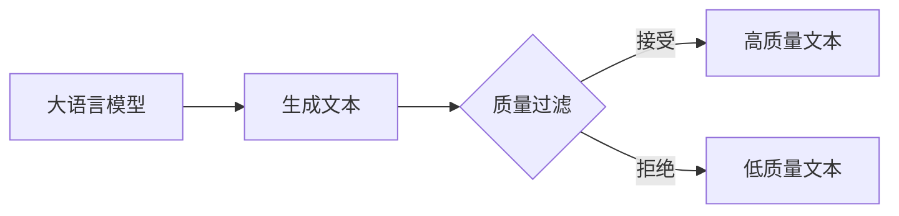

# 大语言模型原理与工程实践：质量过滤

## 1. 背景介绍
### 1.1 大语言模型的发展历程
#### 1.1.1 早期的语言模型
#### 1.1.2 Transformer的出现
#### 1.1.3 预训练语言模型的崛起

### 1.2 质量过滤的重要性
#### 1.2.1 提高生成文本的可读性和连贯性
#### 1.2.2 减少有害、不当内容的生成
#### 1.2.3 提升用户体验和满意度

### 1.3 本文的主要内容和贡献
#### 1.3.1 系统介绍质量过滤的核心概念和方法
#### 1.3.2 深入探讨质量过滤的算法原理和数学模型
#### 1.3.3 提供实践案例和代码实现

## 2. 核心概念与联系
### 2.1 大语言模型的基本原理
#### 2.1.1 语言建模任务
#### 2.1.2 自回归生成模型
#### 2.1.3 Transformer架构

### 2.2 质量过滤的定义和分类
#### 2.2.1 基于规则的过滤方法
#### 2.2.2 基于学习的过滤方法
#### 2.2.3 混合过滤方法

### 2.3 质量过滤与其他任务的关系
#### 2.3.1 与文本分类的联系
#### 2.3.2 与序列标注的联系
#### 2.3.3 与文本生成的联系



## 3. 核心算法原理具体操作步骤
### 3.1 基于规则的过滤算法
#### 3.1.1 关键词匹配
#### 3.1.2 正则表达式匹配
#### 3.1.3 语法和语义分析

### 3.2 基于学习的过滤算法 
#### 3.2.1 文本分类模型
##### 3.2.1.1 FastText
##### 3.2.1.2 TextCNN
##### 3.2.1.3 BERT

#### 3.2.2 序列标注模型
##### 3.2.2.1 BiLSTM-CRF
##### 3.2.2.2 BERT-CRF

#### 3.2.3 生成模型微调
##### 3.2.3.1 基于Perplexity的过滤
##### 3.2.3.2 基于Discriminator的过滤

### 3.3 混合过滤算法
#### 3.3.1 规则过滤+分类过滤
#### 3.3.2 分类过滤+序列标注过滤
#### 3.3.3 端到端过滤模型

## 4. 数学模型和公式详细讲解举例说明
### 4.1 FastText模型
FastText将文本表示为词嵌入的平均值，然后使用softmax进行分类：

$$ \hat{y} = \text{softmax}(W \cdot \frac{1}{N} \sum_{i=1}^N x_i) $$

其中$x_i$是第$i$个词的嵌入向量，$W$是分类矩阵。

### 4.2 TextCNN模型
TextCNN使用卷积神经网络对文本进行特征提取和分类。设卷积核为$w$，文本矩阵为$X$，卷积操作为：

$$ c_i = f(w \cdot X_{i:i+h-1} + b) $$

其中$f$是激活函数，$b$是偏置项，$h$是卷积核高度。然后使用最大池化得到文本表示，并用softmax进行分类。

### 4.3 BERT模型
BERT使用Transformer编码器对文本进行建模，其中自注意力机制为：

$$\text{Attention}(Q, K, V) = \text{softmax}(\frac{QK^T}{\sqrt{d_k}})V$$

其中$Q$,$K$,$V$分别是查询、键、值矩阵，$d_k$是键向量的维度。BERT使用掩码语言模型和下一句预测任务进行预训练，然后在下游任务上进行微调。

### 4.4 CRF模型
CRF常用于序列标注任务，其概率计算公式为：

$$ p(\mathbf{y}|\mathbf{x}) = \frac{\exp(\sum_{i=1}^n \sum_{j=1}^m \lambda_j f_j(y_{i-1}, y_i, \mathbf{x}, i))}{\sum_{\mathbf{y}' \in \mathbf{Y}(\mathbf{x})} \exp(\sum_{i=1}^n \sum_{j=1}^m \lambda_j f_j(y'_{i-1}, y'_i, \mathbf{x}, i))} $$

其中$\mathbf{x}$是输入序列，$\mathbf{y}$是标签序列，$f_j$是第$j$个特征函数，$\lambda_j$是对应的权重，$\mathbf{Y}(\mathbf{x})$是所有可能的标签序列集合。

## 5. 项目实践：代码实例和详细解释说明
下面以FastText为例，展示如何使用Python实现一个简单的文本分类器：

```python
import fasttext

# 准备训练数据
train_data = [
    ("这是一条正面评论", "positive"), 
    ("这是一条负面评论", "negative"),
    ...
]

# 将数据写入文件
with open("train.txt", "w") as f:
    for text, label in train_data:
        f.write(f"__label__{label} {text}\n")
        
# 训练模型
model = fasttext.train_supervised("train.txt")

# 对新文本进行预测
text = "这是一条新的评论"
label = model.predict(text)[0][0]
print(f"预测标签: {label}")
```

上述代码首先准备了一些训练数据，每个样本包含文本和对应的标签。然后将数据写入文件，FastText要求每行格式为"__label__标签 文本"。接着使用`fasttext.train_supervised`函数训练模型，最后调用`model.predict`对新文本进行预测。

FastText简单高效，适合快速构建基于词袋的文本分类器。对于更复杂的任务，可以考虑使用TextCNN、BERT等更强大的模型。

## 6. 实际应用场景
### 6.1 社交媒体内容审核
#### 6.1.1 过滤垃圾评论和广告
#### 6.1.2 识别和屏蔽不当言论

### 6.2 智能客服系统
#### 6.2.1 过滤无意义或重复询问
#### 6.2.2 提高回复的相关性和专业性

### 6.3 内容推荐平台
#### 6.3.1 过滤低质量和标题党内容
#### 6.3.2 提升用户体验和粘性

## 7. 工具和资源推荐
### 7.1 开源工具包
- FastText: 快速简单的文本分类库
- HuggingFace Transformers: 支持多种预训练语言模型的工具包
- Flair: 基于PyTorch的自然语言处理库

### 7.2 预训练模型
- BERT: 谷歌开源的大规模预训练语言模型
- RoBERTa: BERT的改进版，在更多数据上训练
- XLNet: 使用排列语言建模的预训练模型

### 7.3 相关数据集
- GLUE: 通用语言理解评测基准
- SWAG: 常识推理数据集
- SQuAD: 大规模阅读理解数据集

## 8. 总结：未来发展趋势与挑战
### 8.1 更大规模的预训练语言模型
#### 8.1.1 提高模型泛化能力和鲁棒性
#### 8.1.2 减少任务特定的微调数据需求

### 8.2 更细粒度的质量控制
#### 8.2.1 段落级、句子级的过滤
#### 8.2.2 针对特定属性(如流畅性、连贯性)的优化

### 8.3 人机协同的内容审核
#### 8.3.1 机器过滤+人工复核
#### 8.3.2 主动学习、增量学习的应用

### 8.4 多模态质量过滤
#### 8.4.1 文本+图像的联合过滤
#### 8.4.2 文本+语音的联合过滤

大语言模型为自然语言处理带来了革命性的变化，但如何确保其生成内容的质量仍然是一个巨大的挑战。未来的研究方向包括更大规模的预训练、更细粒度的质量控制、人机协同、多模态等，有望进一步提升大语言模型的可用性和应用价值。同时，我们也要警惕质量过滤可能带来的风险，如过度审查、数据偏见等，确保在提高质量的同时维护言论自由和公平性。

## 9. 附录：常见问题与解答
### 9.1 如何选择合适的质量过滤方法？
答：这取决于具体任务和要求。基于规则的方法简单快速，适合有明确过滤标准的场景；基于学习的方法更灵活，能适应复杂语义，但需要标注数据；端到端方法无需单独构建过滤模型，但对生成模型的要求更高。实践中可以综合考虑精度、效率、可解释性等因素。

### 9.2 质量过滤是否会影响生成文本的多样性？
答：过滤strength过大确实可能导致生成内容的同质化。一种解决思路是先采用较宽松的过滤策略生成大量候选，然后从中挑选高质量且多样化的结果。另一种思路是在生成过程中引入多样性奖励，鼓励模型生成内容丰富的文本。

### 9.3 质量过滤能否完全替代人工审核？
答：目前的技术水平下，质量过滤还无法完全取代人工审核。一方面，过滤模型难以穷尽所有低质内容的模式；另一方面，很多判断需要深层次的语义理解和常识推理。因此，质量过滤应作为人工审核的辅助和增强，二者优势互补，共同把控内容质量。

作者：禅与计算机程序设计艺术 / Zen and the Art of Computer Programming