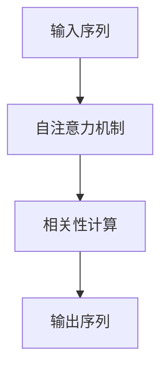
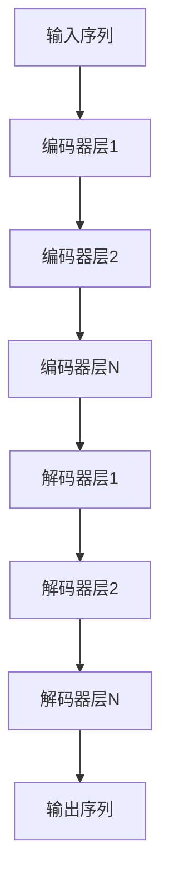

# 大语言模型原理基础与前沿 世界模型

## 1.背景介绍

大语言模型（Large Language Models, LLMs）是近年来人工智能领域的一个重要突破。它们通过深度学习技术，特别是基于变换器（Transformer）架构的模型，能够在自然语言处理（NLP）任务中表现出色。大语言模型不仅在生成文本、翻译、问答等任务中表现优异，还在许多实际应用中展现了巨大的潜力。

### 1.1 大语言模型的起源

大语言模型的起源可以追溯到早期的统计语言模型和神经网络语言模型。随着计算能力和数据量的增加，研究人员逐渐转向更复杂的模型架构，如LSTM和GRU。然而，真正的突破来自于2017年提出的Transformer架构，它通过自注意力机制（Self-Attention Mechanism）解决了序列建模中的许多问题。

### 1.2 发展历程

从最初的GPT（Generative Pre-trained Transformer）到GPT-3，再到最新的GPT-4，大语言模型经历了快速的发展。每一代模型都在参数规模、训练数据量和性能上有显著提升。以下是一些关键的里程碑：

- **GPT-1**：首次引入了预训练和微调的概念。
- **GPT-2**：显著扩大了模型规模，展示了强大的生成能力。
- **GPT-3**：参数量达到1750亿，进一步提升了模型的理解和生成能力。
- **GPT-4**：在多模态学习和更大规模数据集上进行了训练，表现更加出色。

### 1.3 研究现状

目前，大语言模型的研究主要集中在以下几个方面：

- **模型规模**：不断增加模型参数量，以提升性能。
- **数据质量**：使用更大规模和更高质量的数据进行训练。
- **多模态学习**：结合图像、音频等多种数据类型，提升模型的综合能力。
- **高效训练**：优化训练算法和硬件，加速模型训练过程。

## 2.核心概念与联系

大语言模型的核心概念包括自注意力机制、预训练和微调、生成和理解能力等。这些概念相互联系，共同构成了大语言模型的基础。

### 2.1 自注意力机制

自注意力机制是Transformer架构的核心，它允许模型在处理序列数据时关注序列中的不同位置。通过计算输入序列中每个位置与其他位置的相关性，自注意力机制能够捕捉到长距离依赖关系。



### 2.2 预训练和微调

预训练和微调是大语言模型训练的两个关键步骤。预训练阶段，模型在大规模无监督数据上进行训练，学习语言的基本结构和规律。微调阶段，模型在特定任务的数据上进行有监督训练，以适应具体任务的需求。

### 2.3 生成和理解能力

大语言模型不仅能够生成连贯的文本，还能理解上下文，回答问题，进行翻译等。这些能力使得大语言模型在各种NLP任务中表现出色。

## 3.核心算法原理具体操作步骤

大语言模型的核心算法主要包括Transformer架构、自注意力机制、预训练和微调等。以下是具体的操作步骤：

### 3.1 Transformer架构

Transformer架构由编码器和解码器组成，每个编码器和解码器包含多个层，每层由自注意力机制和前馈神经网络组成。



### 3.2 自注意力机制

自注意力机制通过计算输入序列中每个位置与其他位置的相关性，生成注意力权重矩阵。然后，将输入序列与注意力权重矩阵相乘，得到加权后的输出序列。

### 3.3 预训练

预训练阶段，模型在大规模无监督数据上进行训练，目标是最大化语言模型的似然函数。常用的预训练任务包括掩码语言模型（Masked Language Model, MLM）和自回归语言模型（Autoregressive Language Model, ALM）。

### 3.4 微调

微调阶段，模型在特定任务的数据上进行有监督训练。通过调整模型参数，使其在特定任务上表现更好。

## 4.数学模型和公式详细讲解举例说明

大语言模型的数学基础主要包括自注意力机制的计算、预训练和微调的目标函数等。

### 4.1 自注意力机制的计算

自注意力机制的计算包括以下几个步骤：

1. 计算查询（Query）、键（Key）和值（Value）矩阵：
   $$
   Q = XW_Q, \quad K = XW_K, \quad V = XW_V
   $$
   其中，$X$ 是输入序列，$W_Q, W_K, W_V$ 是可训练的权重矩阵。

2. 计算注意力权重矩阵：
   $$
   A = \text{softmax}\left(\frac{QK^T}{\sqrt{d_k}}\right)
   $$
   其中，$d_k$ 是键向量的维度。

3. 计算加权后的输出序列：
   $$
   Z = AV
   $$

### 4.2 预训练目标函数

预训练阶段，常用的目标函数包括掩码语言模型（MLM）和自回归语言模型（ALM）的似然函数。

- 掩码语言模型（MLM）：
  $$
  \mathcal{L}_{MLM} = -\sum_{i=1}^N \log P(x_i | x_{\setminus i})
  $$
  其中，$x_i$ 是被掩码的词，$x_{\setminus i}$ 是上下文。

- 自回归语言模型（ALM）：
  $$
  \mathcal{L}_{ALM} = -\sum_{i=1}^N \log P(x_i | x_{<i})
  $$
  其中，$x_{<i}$ 是前面的上下文。

### 4.3 微调目标函数

微调阶段，目标函数根据具体任务而定。例如，对于分类任务，常用的目标函数是交叉熵损失函数：

$$
\mathcal{L}_{CE} = -\sum_{i=1}^N y_i \log \hat{y}_i
$$

其中，$y_i$ 是真实标签，$\hat{y}_i$ 是预测概率。

## 5.项目实践：代码实例和详细解释说明

为了更好地理解大语言模型的原理和应用，我们将通过一个具体的代码实例来展示如何使用大语言模型进行文本生成。

### 5.1 环境准备

首先，我们需要安装必要的库和工具。这里我们使用Hugging Face的Transformers库。

```bash
pip install transformers
```

### 5.2 加载预训练模型

接下来，我们加载一个预训练的大语言模型，例如GPT-3。

```python
from transformers import GPT2LMHeadModel, GPT2Tokenizer

# 加载预训练模型和分词器
model_name = 'gpt2'
model = GPT2LMHeadModel.from_pretrained(model_name)
tokenizer = GPT2Tokenizer.from_pretrained(model_name)
```

### 5.3 文本生成

我们可以使用加载的模型进行文本生成。以下是一个简单的示例：

```python
# 输入文本
input_text = "人工智能的未来是"

# 编码输入文本
input_ids = tokenizer.encode(input_text, return_tensors='pt')

# 生成文本
output = model.generate(input_ids, max_length=50, num_return_sequences=1)

# 解码生成的文本
generated_text = tokenizer.decode(output[0], skip_special_tokens=True)

print(generated_text)
```

### 5.4 详细解释

在上述代码中，我们首先加载了预训练的GPT-2模型和对应的分词器。然后，我们将输入文本编码为模型可以处理的格式。接着，我们使用模型生成文本，并将生成的文本解码为可读的格式。

## 6.实际应用场景

大语言模型在许多实际应用中展现了巨大的潜力。以下是一些典型的应用场景：

### 6.1 文本生成

大语言模型可以生成连贯的文本，用于写作辅助、新闻生成、对话系统等。

### 6.2 机器翻译

通过预训练和微调，大语言模型可以实现高质量的机器翻译。

### 6.3 问答系统

大语言模型可以理解上下文，回答用户提出的问题，应用于智能客服、教育等领域。

### 6.4 情感分析

大语言模型可以分析文本的情感倾向，用于市场分析、舆情监控等。

## 7.工具和资源推荐

为了更好地使用和研究大语言模型，以下是一些推荐的工具和资源：

### 7.1 Hugging Face Transformers

Hugging Face的Transformers库是一个强大的工具，提供了许多预训练的大语言模型和便捷的API。

### 7.2 TensorFlow和PyTorch

TensorFlow和PyTorch是两个主流的深度学习框架，支持大语言模型的训练和推理。

### 7.3 数据集

高质量的数据集是训练大语言模型的关键。推荐使用OpenAI的WebText、Google的C4等大规模数据集。

## 8.总结：未来发展趋势与挑战

大语言模型在NLP领域取得了显著的进展，但仍面临许多挑战和发展机遇。

### 8.1 未来发展趋势

- **模型规模继续扩大**：随着计算能力的提升，模型规模将继续扩大，性能也将进一步提升。
- **多模态学习**：结合图像、音频等多