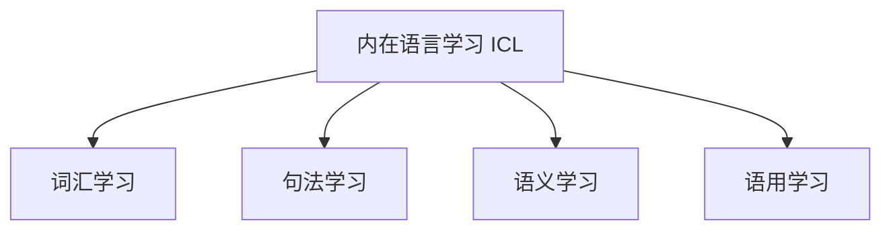
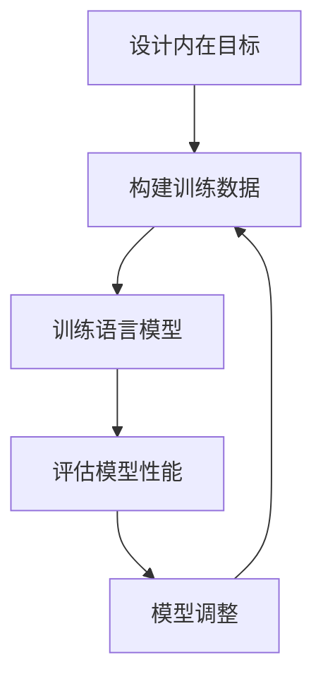

# 大语言模型原理基础与前沿: 为什么ICL有效

## 1. 背景介绍

### 1.1 大语言模型的兴起

近年来,大型语言模型(Large Language Models, LLMs)在自然语言处理(NLP)领域掀起了一场革命。这些模型通过在海量文本数据上进行预训练,学习了丰富的语言知识和上下文关系,从而在下游任务上展现出了令人惊叹的性能。

GPT-3、PanGu-Alpha等大型语言模型的出现,不仅推动了对话系统、文本生成、机器翻译等传统NLP任务的发展,更为一些全新的应用场景注入了活力,如智能辅助编程、多模态学习等。

### 1.2 ICL: 一种新颖的学习范式

在大语言模型的训练过程中,通常采用自监督学习(Self-Supervised Learning)的方式,即利用大量未标注的文本数据,通过预测被掩蔽词汇(Masked Language Modeling)或下一个词汇(Next Sentence Prediction)等任务,学习语言的内在规律。

然而,这种学习范式存在一些固有缺陷,例如缺乏明确的目标函数、难以捕捉长距离依赖等。为了解决这些问题,一种新颖的学习范式被提出——内在语言学习(Intrinsic Curriculum Learning, ICL)。

## 2. 核心概念与联系

### 2.1 内在语言学习(ICL)

内在语言学习(ICL)是一种自我驱动的学习范式,它通过设计一系列内在的学习目标,引导语言模型逐步学习更加复杂的语言现象。这些内在目标包括但不限于:

1. **词汇学习**: 学习词汇的语义和用法。
2. **句法学习**: 学习句子的结构和组成规则。
3. **语义学习**: 学习语句的含义和逻辑关系。
4. **语用学习**: 学习语言在特定场景下的使用方式。

ICL的核心思想是,通过设计一系列有序的内在目标,引导语言模型逐步掌握语言的各个方面,从而更好地理解和生成自然语言。



### 2.2 ICL与自监督学习的区别

与传统的自监督学习相比,ICL具有以下几个显著优势:

1. **明确的目标函数**: ICL设计了一系列明确的内在目标,而不是简单地预测被掩蔽的词汇或句子。
2. **渐进式学习**: ICL通过有序的内在目标,引导语言模型逐步掌握语言的各个层面,更加符合人类语言习得的过程。
3. **长距离依赖建模**: ICL中的一些内在目标(如语义学习、语用学习)需要捕捉长距离的语义和逻辑关系,有助于模型建模长距离依赖。

## 3. 核心算法原理具体操作步骤

ICL的核心算法原理可以概括为以下几个步骤:

### 3.1 设计内在目标

首先,需要设计一系列有序的内在目标,这些目标应当涵盖语言的各个层面,从词汇、句法到语义和语用。每个内在目标都应该对应一个明确的目标函数,用于评估模型的学习效果。

### 3.2 构建训练数据

针对每个内在目标,需要从大规模语料库中构建相应的训练数据。这些训练数据应当体现目标的特征,并且难度应当随着目标的复杂程度而逐渐增加。

### 3.3 训练语言模型

采用多任务学习(Multi-Task Learning)的框架,将语言模型同时训练于多个内在目标上。每个内在目标对应一个子任务,模型需要在这些子任务上共同优化。通过设计合理的损失函数和训练策略,可以实现有序、渐进式的学习过程。



### 3.4 评估模型性能

在训练过程中,需要定期评估模型在各个内在目标上的性能表现。这不仅可以监控模型的学习进度,还可以发现模型的薄弱环节,为后续的模型调整提供依据。

### 3.5 模型调整

根据模型性能评估的结果,可以对模型进行相应的调整,如调整训练数据、损失函数、训练策略等,以提高模型在薄弱环节上的表现。然后重新进入训练阶段,进行下一轮的迭代优化。

## 4. 数学模型和公式详细讲解举例说明

在ICL的训练过程中,通常需要构建多任务学习的目标函数,将多个内在目标融合在一起进行联合优化。以下是一个典型的多任务学习目标函数的数学表达式:

$$J(\theta) = \sum_{t=1}^{T} \lambda_t L_t(\theta)$$

其中:
- $\theta$ 表示模型参数
- $T$ 表示内在目标的总数
- $L_t(\theta)$ 表示第 $t$ 个内在目标的损失函数
- $\lambda_t$ 表示第 $t$ 个内在目标的权重系数

在实际应用中,不同的内在目标可能会采用不同的损失函数形式。以词汇学习为例,常用的损失函数是交叉熵损失(Cross-Entropy Loss):

$$L_{vocab}(\theta) = -\frac{1}{N}\sum_{i=1}^{N}\sum_{j=1}^{V}y_{ij}\log p(w_j|x_i;\theta)$$

其中:
- $N$ 表示训练样本数量
- $V$ 表示词汇表大小
- $x_i$ 表示第 $i$ 个训练样本的输入
- $y_{ij}$ 是一个指示变量,表示第 $i$ 个样本的目标词汇是否为 $w_j$
- $p(w_j|x_i;\theta)$ 表示模型预测第 $i$ 个样本的目标词汇为 $w_j$ 的概率

通过最小化这个损失函数,模型可以学习到准确预测词汇的能力。

对于其他内在目标,如句法学习、语义学习等,也可以设计相应的损失函数,并将它们融合到多任务学习的目标函数中进行联合优化。

## 5. 项目实践: 代码实例和详细解释说明

为了更好地理解ICL的实现细节,我们以一个简单的词汇学习任务为例,展示如何使用PyTorch构建ICL模型并进行训练。

### 5.1 准备数据

首先,我们需要准备一个小型的语料库作为训练数据。这里我们使用一些简单的英文句子:

```python
corpus = [
    "The quick brown fox jumps over the lazy dog.",
    "I am a student studying at the university.",
    "Deep learning is a subfield of machine learning.",
    "Natural language processing is an exciting field.",
    "The cat chased the mouse around the house."
]
```

然后,我们需要构建词汇表并将句子转换为数字序列:

```python
import torch

# 构建词汇表
vocab = set()
for sentence in corpus:
    vocab.update(sentence.split())
vocab = sorted(vocab)
vocab_size = len(vocab)

# 构建词汇到索引的映射
word2idx = {word: i for i, word in enumerate(vocab)}
idx2word = {i: word for i, word in enumerate(vocab)}

# 将句子转换为数字序列
corpus_ids = []
for sentence in corpus:
    ids = [word2idx[word] for word in sentence.split()]
    corpus_ids.append(torch.tensor(ids))
```

### 5.2 定义模型

我们定义一个简单的前馈神经网络作为语言模型:

```python
import torch.nn as nn

class LangModel(nn.Module):
    def __init__(self, vocab_size, embedding_dim, hidden_dim):
        super(LangModel, self).__init__()
        self.embeddings = nn.Embedding(vocab_size, embedding_dim)
        self.fc1 = nn.Linear(embedding_dim, hidden_dim)
        self.fc2 = nn.Linear(hidden_dim, vocab_size)
        self.relu = nn.ReLU()

    def forward(self, inputs):
        embeds = self.embeddings(inputs)
        out = self.fc1(embeds)
        out = self.relu(out)
        out = self.fc2(out)
        return out
```

### 5.3 定义损失函数

我们使用交叉熵损失作为词汇学习任务的损失函数:

```python
import torch.nn.functional as F

def vocab_loss(outputs, targets):
    return F.cross_entropy(outputs.view(-1, vocab_size), targets.view(-1))
```

### 5.4 训练模型

最后,我们定义训练循环并进行模型训练:

```python
import torch.optim as optim

model = LangModel(vocab_size, 64, 128)
optimizer = optim.Adam(model.parameters(), lr=0.001)

for epoch in range(100):
    total_loss = 0
    for sentence in corpus_ids:
        inputs = sentence[:-1]
        targets = sentence[1:]
        
        outputs = model(inputs)
        loss = vocab_loss(outputs, targets)
        
        optimizer.zero_grad()
        loss.backward()
        optimizer.step()
        
        total_loss += loss.item()
    
    print(f"Epoch {epoch+1}, Loss: {total_loss/len(corpus_ids)}")
```

在这个简单的示例中,我们只考虑了词汇学习任务。在实际的ICL实现中,你需要设计多个内在目标,并将它们融合到多任务学习框架中进行联合优化。

## 6. 实际应用场景

ICL作为一种新颖的语言模型学习范式,在多个领域展现出了广阔的应用前景:

### 6.1 对话系统

在对话系统中,ICL可以帮助语言模型更好地理解上下文信息、捕捉长距离依赖,从而生成更加自然、连贯的对话响应。一些基于ICL的对话模型已经展现出了优异的性能。

### 6.2 文本生成

ICL可以引导语言模型掌握更加丰富的语言知识,从而生成更加流畅、富有内涵的文本内容。这对于诸如新闻写作、故事创作等应用场景非常有价值。

### 6.3 机器翻译

在机器翻译任务中,ICL可以帮助模型更好地捕捉源语言和目标语言之间的语义对应关系,从而提高翻译质量。一些基于ICL的机器翻译系统已经展现出了令人鼓舞的成果。

### 6.4 智能辅助编程

近年来,大型语言模型在智能辅助编程领域也取得了长足进展。基于ICL的语言模型可以更好地理解编程语言的语法和语义,从而为程序员提供更加准确、高效的代码补全和错误修复建议。

## 7. 工具和资源推荐

如果你对ICL感兴趣并希望进一步探索,以下是一些值得关注的工具和资源:

### 7.1 开源框架

- **Hugging Face Transformers**: 一个流行的自然语言处理框架,支持多种预训练语言模型,包括基于ICL的模型。
- **AllenNLP**: 一个灵活的NLP研究框架,提供了多种预训练模型和训练技术,包括ICL在内。

### 7.2 预训练模型

- **T5**: 一个基于ICL训练的大型语言模型,展现出了在多个下游任务上的出色表现。
- **BERT-ICL**: 一个基于BERT模型,采用ICL范式进行预训练的语言模型。

### 7.3 论文和教程

- **"Intrinsic Curriculum Learning for Language Modeling"**: ICL的原始论文,详细阐述了这一学习范式的理论基础和实现细节。
- **"The Annotated Transformer"**: 一个深入浅出的教程,解释了Transformer模型的工作原理,对于理解基于ICL的语言模型非常有帮助。

## 8. 总结: 未来发展趋势与挑战

ICL作为一种新兴的语言模型学习范式,在提高模型性能、捕捉长距离依赖等方面展现出了巨大的潜力。然而,它也面临着一些挑战和未来发展方向:

### 8.1 内在目标的设计

设计合理、有效的内在目标是ICL成功的关键。如何系统地确定内在目标的种类、顺序和难度,仍然是一个值得深入探索的问题。

### 8.