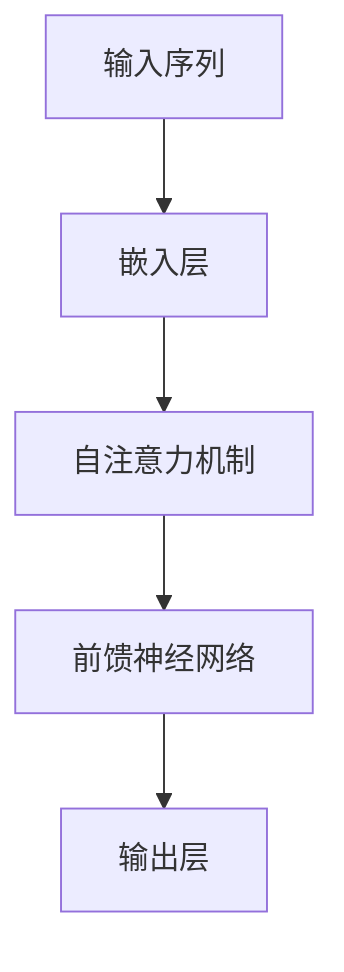

# 大语言模型原理基础与前沿 其他改进措施

## 1.背景介绍

大语言模型（Large Language Models, LLMs）是近年来人工智能领域的一个重要突破。它们通过大量的文本数据进行训练，能够生成高质量的自然语言文本，完成翻译、问答、文本生成等任务。自从OpenAI发布了GPT系列模型以来，LLMs在各个领域的应用迅速扩展。然而，随着模型规模的不断扩大，如何进一步提升其性能和应用效果成为了一个重要的研究方向。

## 2.核心概念与联系

### 2.1 大语言模型的定义

大语言模型是一种基于深度学习的自然语言处理模型，通常使用数十亿甚至上百亿的参数进行训练。其核心思想是通过大量的文本数据学习语言的统计特性，从而生成符合语法和语义的文本。

### 2.2 语言模型的演变

从最早的n-gram模型到后来的RNN、LSTM，再到如今的Transformer架构，语言模型经历了多次演变。每一次演变都带来了性能的显著提升。

### 2.3 Transformer架构

Transformer架构是当前大语言模型的主流架构。它通过自注意力机制（Self-Attention）实现了对长距离依赖的建模，解决了传统RNN在处理长序列时的瓶颈问题。



## 3.核心算法原理具体操作步骤

### 3.1 数据预处理

数据预处理是大语言模型训练的第一步。包括文本清洗、分词、去停用词等步骤。高质量的数据预处理能够显著提升模型的训练效果。

### 3.2 模型训练

模型训练是大语言模型的核心步骤。通常使用大规模的文本数据进行训练，采用自监督学习的方式。训练过程中，模型通过不断调整参数，最小化损失函数，从而提升生成文本的质量。

### 3.3 模型优化

模型优化包括超参数调优、正则化、梯度裁剪等技术手段。通过这些优化手段，可以进一步提升模型的性能和稳定性。

### 3.4 模型评估

模型评估是验证模型性能的重要步骤。常用的评估指标包括困惑度（Perplexity）、BLEU、ROUGE等。通过这些指标，可以量化模型的生成效果。

## 4.数学模型和公式详细讲解举例说明

### 4.1 自注意力机制

自注意力机制是Transformer架构的核心。其基本思想是通过计算输入序列中每个位置与其他位置的相关性，来捕捉长距离依赖关系。具体公式如下：

$$
\text{Attention}(Q, K, V) = \text{softmax}\left(\frac{QK^T}{\sqrt{d_k}}\right)V
$$

其中，$Q$、$K$、$V$分别表示查询矩阵、键矩阵和值矩阵，$d_k$表示键矩阵的维度。

### 4.2 损失函数

大语言模型通常采用交叉熵损失函数来衡量生成文本与真实文本之间的差异。具体公式如下：

$$
L = -\sum_{i=1}^{N} y_i \log(\hat{y}_i)
$$

其中，$y_i$表示真实标签，$\hat{y}_i$表示模型预测的概率。

## 5.项目实践：代码实例和详细解释说明

### 5.1 数据预处理

```python
import re
import nltk
from nltk.corpus import stopwords

# 下载停用词
nltk.download('stopwords')

def preprocess_text(text):
    # 转换为小写
    text = text.lower()
    # 去除标点符号
    text = re.sub(r'[^\w\s]', '', text)
    # 分词
    words = text.split()
    # 去除停用词
    words = [word for word in words if word not in stopwords.words('english')]
    return ' '.join(words)

sample_text = "This is a sample text for preprocessing."
cleaned_text = preprocess_text(sample_text)
print(cleaned_text)
```

### 5.2 模型训练

```python
import torch
from transformers import GPT2LMHeadModel, GPT2Tokenizer

# 加载预训练模型和分词器
model_name = 'gpt2'
model = GPT2LMHeadModel.from_pretrained(model_name)
tokenizer = GPT2Tokenizer.from_pretrained(model_name)

# 定义训练数据
train_texts = ["Hello, how are you?", "I am fine, thank you!"]
train_encodings = tokenizer(train_texts, return_tensors='pt', padding=True, truncation=True)

# 定义优化器
optimizer = torch.optim.AdamW(model.parameters(), lr=5e-5)

# 训练模型
model.train()
for epoch in range(3):
    optimizer.zero_grad()
    outputs = model(**train_encodings, labels=train_encodings['input_ids'])
    loss = outputs.loss
    loss.backward()
    optimizer.step()
    print(f"Epoch {epoch+1}, Loss: {loss.item()}")
```

### 5.3 模型评估

```python
from transformers import GPT2LMHeadModel, GPT2Tokenizer

# 加载预训练模型和分词器
model_name = 'gpt2'
model = GPT2LMHeadModel.from_pretrained(model_name)
tokenizer = GPT2Tokenizer.from_pretrained(model_name)

# 定义评估数据
eval_texts = ["What is your name?", "How old are you?"]
eval_encodings = tokenizer(eval_texts, return_tensors='pt', padding=True, truncation=True)

# 评估模型
model.eval()
with torch.no_grad():
    outputs = model(**eval_encodings, labels=eval_encodings['input_ids'])
    loss = outputs.loss
    print(f"Evaluation Loss: {loss.item()}")
```

## 6.实际应用场景

### 6.1 文本生成

大语言模型在文本生成方面表现出色，可以用于自动写作、新闻生成、对话系统等场景。例如，GPT-3可以生成高质量的文章、诗歌、代码等。

### 6.2 机器翻译

通过大规模的双语数据进行训练，大语言模型可以实现高质量的机器翻译。相比传统的统计机器翻译方法，基于大语言模型的翻译系统在流畅性和准确性方面有显著提升。

### 6.3 问答系统

大语言模型可以用于构建智能问答系统。通过对大量问答数据的学习，模型能够理解用户的问题并生成准确的回答。

### 6.4 情感分析

大语言模型可以用于情感分析，通过对文本数据的情感倾向进行分类，帮助企业了解用户的情感反馈，从而优化产品和服务。

## 7.工具和资源推荐

### 7.1 开源框架

- **Hugging Face Transformers**：一个强大的自然语言处理库，支持多种预训练模型。
- **TensorFlow**：一个广泛使用的深度学习框架，支持大规模分布式训练。
- **PyTorch**：一个灵活的深度学习框架，适合研究和开发。

### 7.2 数据集

- **Common Crawl**：一个包含大量网页数据的开源数据集，适合用于大语言模型的训练。
- **Wikipedia**：一个包含丰富知识的开源数据集，适合用于知识图谱和问答系统的训练。
- **OpenSubtitles**：一个包含大量电影字幕的开源数据集，适合用于对话系统的训练。

### 7.3 书籍和文献

- **《深度学习》**：一本经典的深度学习教材，详细介绍了深度学习的基本原理和应用。
- **《自然语言处理入门》**：一本适合初学者的自然语言处理教材，介绍了自然语言处理的基本概念和方法。
- **《Attention is All You Need》**：一篇经典的论文，详细介绍了Transformer架构的原理和应用。

## 8.总结：未来发展趋势与挑战

### 8.1 未来发展趋势

大语言模型在未来的发展中，将会朝着以下几个方向发展：

- **模型规模进一步扩大**：随着计算资源的增加和算法的优化，未来的大语言模型将会拥有更多的参数和更强的生成能力。
- **多模态融合**：未来的大语言模型将不仅限于文本数据，还会融合图像、音频