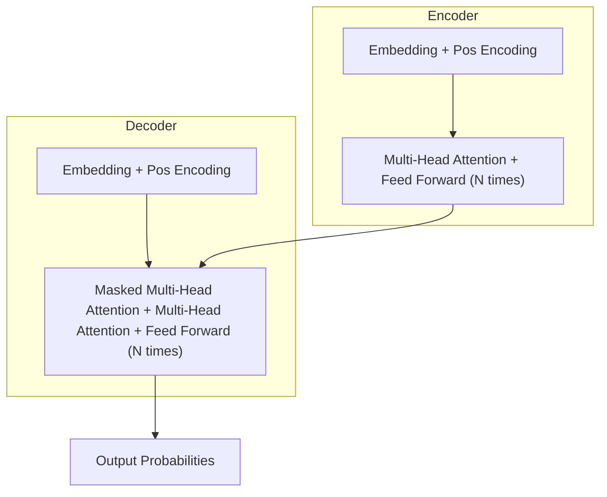

# 大语言模型原理基础与前沿 大语言模型：辩论、争议与未来发展方向

## 1.背景介绍

### 1.1 大语言模型的兴起

近年来,大型语言模型(Large Language Models, LLMs)在自然语言处理(NLP)领域取得了令人瞩目的成就。这些模型通过在海量文本数据上进行预训练,学习了丰富的语言知识和语义表示能力,可以在下游任务中表现出惊人的泛化性能。

代表性的大语言模型包括 GPT(Generative Pre-trained Transformer)、BERT(Bidirectional Encoder Representations from Transformers)、XLNet、RoBERTa、ALBERT 等。其中,GPT 系列模型由 OpenAI 提出,可以生成连贯、流畅的自然语言文本;BERT 系列模型则由谷歌提出,擅长于语言理解和表示任务。

### 1.2 大语言模型的影响

大语言模型的出现,不仅推动了 NLP 技术的飞速发展,也对人工智能的未来产生了深远影响。这些模型展现出了强大的语言生成和理解能力,在机器翻译、问答系统、文本摘要、内容创作等领域发挥着重要作用。

然而,大语言模型也引发了一系列争议和质疑,如模型的公平性、安全性、可解释性等问题。此外,训练这些庞大模型需要消耗大量的计算资源和能源,也存在一定的环境影响。

### 1.3 本文主旨

本文将深入探讨大语言模型的原理基础和前沿发展,全面剖析其核心概念、算法机制、数学模型和实践应用。同时,我们也将客观分析大语言模型所面临的争议和挑战,并展望其未来发展趋势。

通过本文,读者将全面了解大语言模型的方方面面,掌握其核心知识和实践技能,并能够洞见其潜在的风险和未来的发展方向。

## 2.核心概念与联系

### 2.1 自注意力机制(Self-Attention)

自注意力机制是大语言模型的核心基础,它允许模型捕捉输入序列中任意两个位置之间的关系,从而更好地建模长距离依赖。

在自注意力机制中,每个输入位置都会关注整个序列的所有位置,并基于它们之间的关联程度分配注意力权重。这种全局依赖性使得模型可以有效地捕捉长距离上下文信息。

自注意力机制可以形式化表示为:

$$\text{Attention}(Q, K, V) = \text{softmax}(\frac{QK^T}{\sqrt{d_k}})V$$

其中 $Q$ 表示查询(Query)、$K$ 表示键(Key)、$V$ 表示值(Value),$d_k$ 是缩放因子。

### 2.2 transformer 架构

Transformer 是一种全新的基于自注意力机制的序列到序列(Seq2Seq)模型架构,它完全摒弃了传统的循环神经网络(RNN)和卷积神经网络(CNN)结构,使用多头自注意力层和前馈神经网络层构建了一种全新的网络结构。

Transformer 架构主要由编码器(Encoder)和解码器(Decoder)两部分组成。编码器将输入序列映射为连续的表示,解码器则基于编码器的输出生成目标序列。两者均采用多头自注意力层和前馈神经网络层堆叠而成。

### 2.3 预训练与微调(Pre-training & Fine-tuning)

大语言模型通常采用两阶段策略:首先在大规模无监督文本数据上进行预训练,学习通用的语言表示;然后在特定的下游任务上进行微调(Fine-tuning),将预训练模型的知识转移到目标任务。

预训练阶段的目标是最大化模型对语料库数据的概率,常用的预训练目标包括蒙版语言模型(Masked LM)、下一句预测(Next Sentence Prediction)、因果语言模型(Causal LM)等。

微调阶段则是在预训练模型的基础上,针对特定任务进行进一步训练,通过学习任务相关的模式来提高模型在该任务上的性能表现。

### 2.4 模型规模

模型规模是大语言模型的一个关键特征。一般来说,模型规模越大,其表现能力就越强。例如 GPT-3 拥有 1750 亿个参数,是目前最大的语言模型。

然而,大规模模型也带来了诸多挑战,如训练成本昂贵、推理效率低下、环境影响等。因此,如何在模型规模和效率之间寻求平衡,是大语言模型发展的一个重要课题。

## 3.核心算法原理具体操作步骤

### 3.1 Transformer 编码器(Encoder)

Transformer 编码器的核心是多头自注意力层和前馈神经网络层。其具体操作步骤如下:

1. **输入嵌入(Input Embeddings)**: 将输入序列的每个词元(token)映射为一个连续的向量表示。

2. **位置编码(Positional Encoding)**: 由于自注意力机制没有明确的序列位置信息,因此需要添加位置编码来区分不同位置的词元。

3. **多头自注意力层(Multi-Head Attention)**: 计算输入序列中每个词元与所有其他词元之间的注意力权重,并基于这些权重对词元表示进行加权求和,获得新的序列表示。

   - 将查询(Q)、键(K)和值(V)线性投影到不同的表示空间
   - 计算 $\text{Attention}(Q, K, V)$
   - 对多个注意力头的结果进行拼接

4. **残差连接(Residual Connection)** 和 **层归一化(Layer Normalization)**: 将多头自注意力层的输出与输入相加,并进行层归一化,以保持梯度稳定性。

5. **前馈神经网络层(Feed-Forward Network)**: 对序列表示进行两次线性变换,中间使用 ReLU 激活函数。

6. **残差连接** 和 **层归一化**: 与自注意力层类似,对前馈网络的输出进行残差连接和层归一化。

7. **重复上述步骤 N 次**: 编码器由 N 个相同的子层堆叠而成。

编码器的输出是输入序列的连续表示,将被传递给解码器进行进一步处理。

### 3.2 Transformer 解码器(Decoder)

Transformer 解码器的结构与编码器类似,但增加了一个掩码多头自注意力层,用于处理序列预测任务。其具体操作步骤如下:

1. **输出嵌入(Output Embeddings)** 和 **位置编码**: 与编码器类似,将输出序列的词元映射为连续向量表示,并添加位置编码。

2. **掩码多头自注意力层(Masked Multi-Head Attention)**: 计算当前位置的词元与之前所有位置词元之间的注意力权重,但屏蔽掉之后位置的信息,以避免在生成时利用了违反因果关系的未来信息。

3. **残差连接** 和 **层归一化**

4. **编码器-解码器注意力层(Encoder-Decoder Attention)**: 计算输出序列中每个位置的词元与输入序列中所有位置词元之间的注意力权重,将编码器的输出序列表示引入解码器。

5. **残差连接** 和 **层归一化**

6. **前馈神经网络层**、**残差连接** 和 **层归一化**: 与编码器相同。

7. **生成输出概率(Output Probabilities Generation)**: 对于每个目标时间步,基于当前的解码器隐藏状态,通过线性投影和 softmax 操作生成下一个词元的概率分布。

8. **重复上述步骤 N 次**: 解码器由 N 个相同的子层堆叠而成。

解码器的输出是目标序列的概率分布,可用于生成或预测任务。

## 4.数学模型和公式详细讲解举例说明

### 4.1 自注意力机制(Self-Attention)

自注意力机制是大语言模型的核心,它允许模型捕捉输入序列中任意两个位置之间的关系。我们将详细解释自注意力机制的数学原理。

给定一个长度为 $n$ 的输入序列 $\boldsymbol{x} = (x_1, x_2, \dots, x_n)$,自注意力机制首先将其映射为三个向量组 $\boldsymbol{Q}$、$\boldsymbol{K}$ 和 $\boldsymbol{V}$,分别表示查询(Query)、键(Key)和值(Value):

$$\begin{aligned}
\boldsymbol{Q} &= \boldsymbol{x}\boldsymbol{W}^Q \\
\boldsymbol{K} &= \boldsymbol{x}\boldsymbol{W}^K \\
\boldsymbol{V} &= \boldsymbol{x}\boldsymbol{W}^V
\end{aligned}$$

其中 $\boldsymbol{W}^Q$、$\boldsymbol{W}^K$ 和 $\boldsymbol{W}^V$ 是可学习的权重矩阵。

接下来,我们计算查询 $\boldsymbol{Q}$ 与所有键 $\boldsymbol{K}$ 之间的点积,并除以缩放因子 $\sqrt{d_k}$ (其中 $d_k$ 是键向量的维度),得到注意力分数矩阵:

$$\text{Attention}(\boldsymbol{Q}, \boldsymbol{K}, \boldsymbol{V}) = \text{softmax}\left(\frac{\boldsymbol{Q}\boldsymbol{K}^\top}{\sqrt{d_k}}\right)\boldsymbol{V}$$

softmax 函数用于将注意力分数归一化为概率分布。最终,我们将注意力分数与值 $\boldsymbol{V}$ 相乘,得到输入序列的新表示。

为了捕捉不同的关系子空间,transformer 采用了多头自注意力机制。具体来说,我们将查询、键和值分别映射到 $h$ 个不同的子空间,对每个子空间分别计算自注意力,然后将所有头的结果拼接起来:

$$\begin{aligned}
\text{MultiHead}(\boldsymbol{Q}, \boldsymbol{K}, \boldsymbol{V}) &= \text{Concat}(\text{head}_1, \dots, \text{head}_h)\boldsymbol{W}^O \\
\text{where}\ \text{head}_i &= \text{Attention}(\boldsymbol{Q}\boldsymbol{W}_i^Q, \boldsymbol{K}\boldsymbol{W}_i^K, \boldsymbol{V}\boldsymbol{W}_i^V)
\end{aligned}$$

其中 $\boldsymbol{W}_i^Q$、$\boldsymbol{W}_i^K$、$\boldsymbol{W}_i^V$ 和 $\boldsymbol{W}^O$ 是可学习的线性投影矩阵。

通过多头自注意力机制,transformer 可以同时关注输入序列中不同的关系子空间,从而更好地捕捉序列的语义和结构信息。

### 4.2 transformer 损失函数

在序列生成任务中,transformer 通常采用最大似然估计(Maximum Likelihood Estimation, MLE)来优化模型参数。给定一个目标序列 $\boldsymbol{y} = (y_1, y_2, \dots, y_m)$,我们希望最大化模型生成该序列的条件概率 $P(\boldsymbol{y} | \boldsymbol{x})$,其中 $\boldsymbol{x}$ 是输入序列。

根据链式法则,我们可以将 $P(\boldsymbol{y} | \boldsymbol{x})$ 分解为:

$$P(\boldsymbol{y} | \boldsymbol{x}) = \prod_{t=1}^m P(y_t | y_{<t}, \boldsymbol{x})$$

其中 $y_{<t}$ 表示目标序列中位于时间步 $t$ 之前的所有词元。

transformer 通过softmax层计算每个时间步的词元概率分布 $P(y_t | y_{<t}, \boldsymbol{x})$。因此,我们可以将损失函数定义为交叉熵损失:

$$\mathcal{L}(\bolds