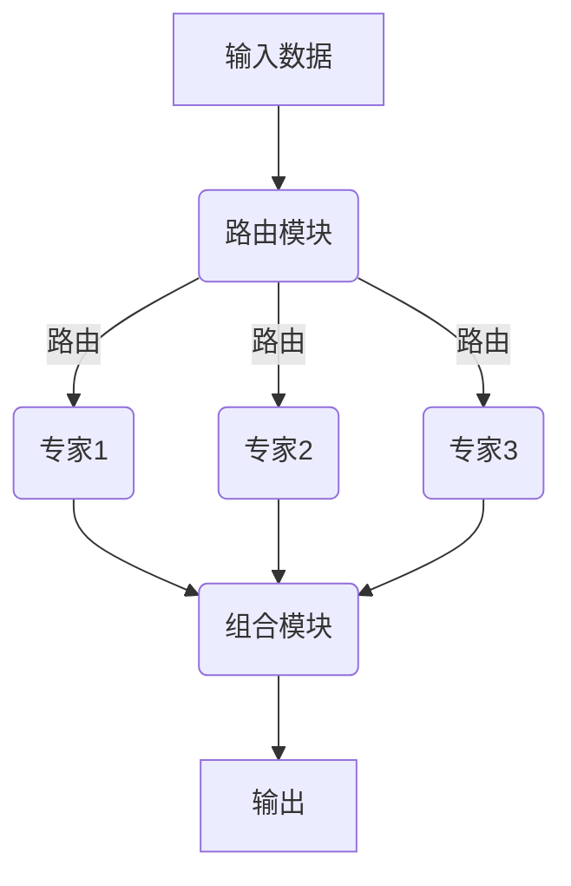

# 大语言模型原理基础与前沿 稀疏专家模型

## 1.背景介绍

### 1.1 大语言模型的兴起

近年来,大型语言模型(Large Language Models, LLMs)在自然语言处理(Natural Language Processing, NLP)领域取得了令人瞩目的成就。这些模型通过在大规模文本数据上进行预训练,学习了丰富的语言知识和上下文信息,从而能够在广泛的NLP任务中表现出惊人的性能。

代表性的大语言模型包括GPT(Generative Pre-trained Transformer)系列模型、BERT(Bidirectional Encoder Representations from Transformers)、XLNet、RoBERTa等。它们通过transformer编码器-解码器架构,捕捉长距离依赖关系,并且能够生成流畅、连贯的文本输出。

### 1.2 大语言模型的局限性

尽管大语言模型取得了巨大的成功,但它们也面临着一些挑战和局限性:

1. **参数量巨大**:大语言模型通常包含数十亿甚至上百亿的参数,导致了庞大的模型尺寸和计算资源需求。
2. **推理效率低下**:由于参数量巨大,大语言模型在推理阶段的计算效率较低,难以满足实时响应的需求。
3. **缺乏可解释性**:大语言模型的内部机制是一个黑箱,缺乏可解释性,难以理解模型的决策过程。
4. **知识一般化能力有限**:虽然大语言模型掌握了丰富的语言知识,但它们在将知识迁移到新的领域和任务上仍然存在局限性。

为了解决这些问题,研究人员提出了稀疏专家模型(Sparse Expert Models)的概念,旨在提高大语言模型的效率、可解释性和泛化能力。

## 2.核心概念与联系

### 2.1 稀疏专家模型概述

稀疏专家模型是一种新型的大语言模型架构,它将整个模型分解为多个专家(Expert)子模型。每个专家子模型都是一个较小的transformer模型,专门负责处理特定的语言模式或知识领域。通过一个路由模块(Router),输入数据将被分配给相关的专家子模型进行处理,从而实现了计算资源的高效利用和知识的模块化表示。



稀疏专家模型的核心思想是:通过将大型模型分解为多个专家子模型,每个专家子模型只需要关注特定的语言模式或知识领域,从而减小了每个子模型的参数量和计算复杂度。同时,由于专家子模型之间是相互独立的,因此可以并行计算,提高了推理效率。此外,专家子模型的模块化设计也有助于提高模型的可解释性和知识迁移能力。

### 2.2 关键组件

稀疏专家模型主要由以下三个关键组件组成:

1. **专家子模型(Expert)**:每个专家子模型都是一个独立的transformer模型,专门负责处理特定的语言模式或知识领域。
2. **路由模块(Router)**:路由模块负责将输入数据分配给相关的专家子模型进行处理。它通常采用基于注意力机制的软路由或硬路由策略。
3. **组合模块(Combiner)**:组合模块将来自不同专家子模型的输出进行融合,生成最终的输出结果。

这三个组件的有效协作是稀疏专家模型能够发挥优势的关键。路由模块需要准确地将输入数据分配给相关的专家子模型,专家子模型需要高效地处理分配给它的数据,组合模块则需要合理地融合不同专家的输出,以获得高质量的最终结果。

## 3.核心算法原理具体操作步骤

### 3.1 路由算法

路由算法是稀疏专家模型中最关键的组件之一,它决定了输入数据应该被分配给哪些专家子模型进行处理。常见的路由算法包括:

1. **软路由(Soft Routing)**:软路由算法通过注意力机制为每个输入token计算一个路由概率分布,表示该token应该被分配给每个专家子模型的概率。然后,每个token的表示将被分配给所有专家子模型,但是每个专家子模型只需要关注与其相关的token表示。

   软路由算法的优点是可以捕捉输入数据中的不确定性和模糊性,但缺点是所有专家子模型都需要参与计算,导致计算开销较大。

2. **硬路由(Hard Routing)**:硬路由算法直接将每个输入token分配给一个专家子模型进行处理,而不是计算概率分布。这种方式计算开销较小,但可能会丢失一些细微的语义信息。

   常见的硬路由算法包括基于聚类的路由、基于哈希的路由等。

3. **混合路由(Hybrid Routing)**:混合路由算法结合了软路由和硬路由的优点,首先使用软路由算法计算每个token与每个专家子模型的相关性,然后根据相关性阈值进行硬路由,将token分配给相关的专家子模型。

无论采用哪种路由算法,都需要在路由准确性和计算效率之间进行权衡。一般来说,软路由算法路由准确性更高,但计算开销也更大;硬路由算法计算开销较小,但可能会丢失一些语义信息。

### 3.2 专家子模型训练

专家子模型的训练过程通常分为两个阶段:

1. **预训练阶段**:在这个阶段,每个专家子模型都在大规模语料库上进行预训练,学习相应的语言模式和知识。预训练可以采用掩码语言模型(Masked Language Modeling)、下一句预测(Next Sentence Prediction)等任务。

2. **微调阶段**:在这个阶段,预训练好的专家子模型将被微调到特定的下游任务上,如文本分类、机器阅读理解等。在微调过程中,路由模块和组合模块也需要同步训练,以确保整个模型的端到端性能。

专家子模型的训练过程可以采用传统的监督学习方法,也可以探索元学习(Meta-Learning)、自监督学习(Self-Supervised Learning)等新兴方法,以提高模型的泛化能力和知识迁移能力。

### 3.3 组合算法

组合模块的作用是将来自不同专家子模型的输出进行融合,生成最终的输出结果。常见的组合算法包括:

1. **加权求和(Weighted Sum)**:将每个专家子模型的输出乘以对应的权重,然后求和。权重可以是静态的,也可以是动态计算的。
2. **门控机制(Gating Mechanism)**:使用门控单元(如LSTM或GRU中的门控单元)动态控制每个专家子模型输出的贡献度。
3. **注意力机制(Attention Mechanism)**:使用注意力机制为每个专家子模型的输出分配不同的注意力权重,然后加权求和。

组合算法的选择取决于具体的任务和模型架构。一般来说,加权求和算法计算开销较小,但可能无法充分利用专家子模型之间的互补性;门控机制和注意力机制则能够更好地捕捉专家子模型之间的相关性,但计算开销也相对较大。

## 4.数学模型和公式详细讲解举例说明

### 4.1 软路由算法

软路由算法是稀疏专家模型中最常用的路由算法之一。它通过注意力机制为每个输入token计算一个路由概率分布,表示该token应该被分配给每个专家子模型的概率。

假设输入序列为$X = (x_1, x_2, \dots, x_n)$,专家子模型的数量为$M$,我们需要计算每个token $x_i$与每个专家子模型$j$的相关性分数$s_{ij}$。相关性分数可以通过注意力机制计算:

$$s_{ij} = \text{Attention}(x_i, e_j)$$

其中,$e_j$是第$j$个专家子模型的表示向量。

然后,我们可以通过Softmax函数将相关性分数转换为概率分布$p_{ij}$:

$$p_{ij} = \frac{\exp(s_{ij})}{\sum_{k=1}^M \exp(s_{ik})}$$

$p_{ij}$表示token $x_i$被分配给第$j$个专家子模型的概率。

接下来,每个token的表示$x_i$将被分配给所有专家子模型,但是每个专家子模型$j$只需要关注与其相关的token表示,即$p_{ij} \cdot x_i$。专家子模型$j$的输出$y_j$可以表示为:

$$y_j = \text{Expert}_j\left(\sum_{i=1}^n p_{ij} \cdot x_i\right)$$

最后,组合模块将所有专家子模型的输出进行融合,生成最终的输出结果。

软路由算法的优点是可以捕捉输入数据中的不确定性和模糊性,但缺点是所有专家子模型都需要参与计算,导致计算开销较大。

### 4.2 硬路由算法

硬路由算法直接将每个输入token分配给一个专家子模型进行处理,而不是计算概率分布。这种方式计算开销较小,但可能会丢失一些细微的语义信息。

假设输入序列为$X = (x_1, x_2, \dots, x_n)$,专家子模型的数量为$M$,我们需要为每个token $x_i$分配一个专家子模型索引$c_i \in \{1, 2, \dots, M\}$。

一种常见的硬路由算法是基于聚类的路由。我们可以为每个专家子模型$j$定义一个聚类中心向量$c_j$,然后将每个token $x_i$分配给与其最相似的聚类中心对应的专家子模型:

$$c_i = \arg\min_j \|x_i - c_j\|$$

其中,$\|\cdot\|$表示向量范数。

另一种常见的硬路由算法是基于哈希的路由。我们可以定义一个哈希函数$h(x)$,将每个token $x_i$映射到一个专家子模型索引:

$$c_i = h(x_i) \bmod M$$

其中,$M$是专家子模型的数量。

无论采用哪种硬路由算法,每个token $x_i$都只会被分配给一个专家子模型$j=c_i$进行处理,即:

$$y_j = \text{Expert}_j\left(\{x_i | c_i = j\}\right)$$

最后,组合模块将所有专家子模型的输出进行融合,生成最终的输出结果。

硬路由算法的优点是计算开销较小,但缺点是可能会丢失一些细微的语义信息。在实际应用中,需要根据具体任务和模型架构选择合适的路由算法。

## 5.项目实践:代码实例和详细解释说明

在这一部分,我们将提供一个基于PyTorch实现的稀疏专家模型示例,并对关键代码进行详细解释。

### 5.1 导入必要的库

```python
import torch
import torch.nn as nn
import torch.nn.functional as F
```

### 5.2 定义专家子模型

我们定义一个简单的transformer编码器作为专家子模型的实现。

```python
class ExpertModel(nn.Module):
    def __init__(self, input_dim, hidden_dim, num_heads, num_layers):
        super(ExpertModel, self).__init__()
        self.embedding = nn.Linear(input_dim, hidden_dim)
        self.encoder_layer = nn.TransformerEncoderLayer(d_model=hidden_dim, nhead=num_heads)
        self.encoder = nn.TransformerEncoder(self.encoder_layer, num_layers=num_layers)

    def forward(self, x):
        x = self.embedding(x)
        x = self.encoder(x)
        return x
```

### 5.3 实现软路由算法

我们实现一个基于注意力机制的软路由算法。

```python
class SoftRouter(nn.Module):
    def __init__(self, input_dim, num_experts):
        super(SoftRouter, self).__init__()
        self.attention = nn.MultiheadAttention(embed_dim=input_dim, num_heads=8