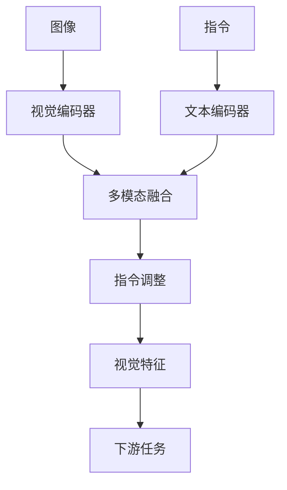

# 大语言模型原理基础与前沿 视觉指令调整

## 1. 背景介绍
### 1.1 大语言模型的发展历程
### 1.2 视觉指令调整的研究意义
### 1.3 本文的研究内容与贡献

## 2. 核心概念与联系
### 2.1 大语言模型
#### 2.1.1 定义与特点  
#### 2.1.2 主流模型架构
#### 2.1.3 训练方法
### 2.2 视觉指令调整
#### 2.2.1 概念解释
#### 2.2.2 与大语言模型的关系
#### 2.2.3 研究现状
### 2.3 多模态学习
#### 2.3.1 定义与分类
#### 2.3.2 在大语言模型中的应用
#### 2.3.3 视觉指令调整的多模态特性

## 3. 核心算法原理具体操作步骤
### 3.1 视觉指令调整的整体框架
### 3.2 视觉编码器
#### 3.2.1 卷积神经网络
#### 3.2.2 视觉 Transformer
#### 3.2.3 图像特征提取
### 3.3 文本编码器  
#### 3.3.1 Transformer 结构
#### 3.3.2 自注意力机制
#### 3.3.3 位置编码
### 3.4 多模态融合
#### 3.4.1 交叉注意力机制
#### 3.4.2 多头注意力
#### 3.4.3 残差连接与层归一化
### 3.5 指令调整
#### 3.5.1 指令表示学习
#### 3.5.2 指令-视觉对齐
#### 3.5.3 指令引导的视觉特征调整

## 4. 数学模型和公式详细讲解举例说明
### 4.1 视觉编码器的数学表示
#### 4.1.1 卷积操作
#### 4.1.2 池化操作
#### 4.1.3 视觉 Transformer 的自注意力计算
### 4.2 文本编码器的数学表示
#### 4.2.1 自注意力计算
#### 4.2.2 前馈神经网络
#### 4.2.3 残差连接与层归一化
### 4.3 多模态融合的数学表示
#### 4.3.1 交叉注意力计算
#### 4.3.2 多头注意力的并行计算
#### 4.3.3 门控机制
### 4.4 指令调整的数学表示
#### 4.4.1 指令表示学习的目标函数
#### 4.4.2 指令-视觉对齐的相似度计算
#### 4.4.3 指令引导的特征调整的数学表达

## 5. 项目实践：代码实例和详细解释说明
### 5.1 数据准备
#### 5.1.1 图像数据集
#### 5.1.2 指令数据集
#### 5.1.3 数据预处理
### 5.2 模型构建
#### 5.2.1 视觉编码器的实现
#### 5.2.2 文本编码器的实现
#### 5.2.3 多模态融合模块的实现
#### 5.2.4 指令调整模块的实现
### 5.3 模型训练
#### 5.3.1 损失函数设计
#### 5.3.2 优化器选择
#### 5.3.3 超参数调优
### 5.4 模型评估
#### 5.4.1 评估指标
#### 5.4.2 实验结果分析
#### 5.4.3 与现有方法的比较

## 6. 实际应用场景
### 6.1 图像描述生成
#### 6.1.1 应用背景
#### 6.1.2 视觉指令调整的优势
#### 6.1.3 案例展示
### 6.2 视觉问答
#### 6.2.1 应用背景
#### 6.2.2 视觉指令调整的优势 
#### 6.2.3 案例展示
### 6.3 图像检索
#### 6.3.1 应用背景
#### 6.3.2 视觉指令调整的优势
#### 6.3.3 案例展示

## 7. 工具和资源推荐
### 7.1 开源代码库
#### 7.1.1 视觉 Transformer 实现
#### 7.1.2 多模态融合模块实现  
#### 7.1.3 指令调整模块实现
### 7.2 数据集
#### 7.2.1 图像描述数据集
#### 7.2.2 视觉问答数据集
#### 7.2.3 图像检索数据集
### 7.3 学习资源
#### 7.3.1 教程与博客
#### 7.3.2 论文与综述
#### 7.3.3 视频课程

## 8. 总结：未来发展趋势与挑战
### 8.1 视觉指令调整的研究进展
### 8.2 未来发展方向
#### 8.2.1 更大规模的多模态预训练
#### 8.2.2 更精细的视觉理解与推理
#### 8.2.3 跨模态知识迁移与泛化
### 8.3 面临的挑战
#### 8.3.1 数据标注的成本与质量
#### 8.3.2 模型的可解释性与鲁棒性
#### 8.3.3 实时性与计算效率

## 9. 附录：常见问题与解答
### 9.1 视觉指令调整与传统的视觉任务有何不同？
### 9.2 视觉指令调整能否应用于视频理解？
### 9.3 如何平衡视觉信息和文本信息的重要性？
### 9.4 视觉指令调整模型的泛化能力如何？
### 9.5 如何降低视觉指令调整模型的计算开销？

大语言模型（Large Language Model，LLM）是自然语言处理领域的重要里程碑，它们在大规模文本数据上进行预训练，能够习得丰富的语言知识和常识。然而，大语言模型主要关注文本信息的处理，对于视觉信息的理解和利用还比较有限。为了进一步提升大语言模型在多模态场景下的性能，研究者们提出了视觉指令调整（Visual Instruction Tuning）的方法，旨在通过视觉信息来指导大语言模型生成更加准确、丰富的文本描述。

视觉指令调整的核心思想是利用图像中的视觉线索来调整大语言模型的输出。具体而言，给定一张图像和一个文本指令，视觉指令调整模型首先通过视觉编码器提取图像的特征表示，然后将其与文本指令的嵌入表示进行融合，得到一个多模态的上下文表示。接着，模型根据这个多模态上下文表示来调整大语言模型的输出，使其能够根据图像内容生成更加准确、丰富的文本描述。

在算法实现上，视觉指令调整通常采用编码器-解码器的架构。视觉编码器可以使用卷积神经网络（CNN）或视觉 Transformer 等模型来提取图像特征，文本编码器则使用 Transformer 等模型来编码文本指令。多模态融合模块负责将视觉特征和文本特征进行融合，常见的方法包括交叉注意力机制、多头注意力等。最后，指令调整模块根据多模态上下文表示来调整大语言模型的输出，可以通过指令表示学习、指令-视觉对齐等技术来实现。

下面我们通过数学公式来详细说明视觉指令调整的核心计算过程。假设图像经过视觉编码器得到的特征表示为 $\mathbf{v} \in \mathbb{R}^{d_v}$，文本指令经过文本编码器得到的特征表示为 $\mathbf{t} \in \mathbb{R}^{d_t}$，其中 $d_v$ 和 $d_t$ 分别表示视觉特征和文本特征的维度。

在多模态融合阶段，我们可以使用交叉注意力机制来计算视觉特征和文本特征之间的关联性。具体地，我们首先计算查询向量 $\mathbf{q}$、键向量 $\mathbf{k}$ 和值向量 $\mathbf{v}$：

$$
\mathbf{q} = \mathbf{W}_q\mathbf{t}, \quad \mathbf{k} = \mathbf{W}_k\mathbf{v}, \quad \mathbf{v} = \mathbf{W}_v\mathbf{v}
$$

其中，$\mathbf{W}_q \in \mathbb{R}^{d_t \times d_k}$，$\mathbf{W}_k \in \mathbb{R}^{d_v \times d_k}$，$\mathbf{W}_v \in \mathbb{R}^{d_v \times d_v}$ 是可学习的权重矩阵，$d_k$ 是查询向量和键向量的维度。

然后，我们计算查询向量和键向量之间的相似度得分：

$$
\mathbf{s} = \frac{\mathbf{q}\mathbf{k}^T}{\sqrt{d_k}}
$$

接着，我们对相似度得分进行 softmax 归一化，得到注意力权重：

$$
\mathbf{a} = \text{softmax}(\mathbf{s})
$$

最后，我们使用注意力权重对值向量进行加权求和，得到多模态融合后的特征表示：

$$
\mathbf{f} = \mathbf{a}\mathbf{v}
$$

在指令调整阶段，我们可以使用指令表示学习的方法来优化模型参数。具体地，我们定义一个指令表示函数 $g(\cdot)$，将文本指令 $\mathbf{t}$ 映射到一个低维的指令表示 $\mathbf{z} \in \mathbb{R}^{d_z}$：

$$
\mathbf{z} = g(\mathbf{t})
$$

然后，我们计算指令表示 $\mathbf{z}$ 与视觉特征 $\mathbf{v}$ 之间的相似度得分：

$$
s = \frac{\mathbf{z}^T\mathbf{v}}{\|\mathbf{z}\| \|\mathbf{v}\|}
$$

我们希望相似度得分 $s$ 尽可能地高，因此可以定义如下的损失函数：

$$
\mathcal{L} = -\log \frac{\exp(s)}{\exp(s) + \sum_{i=1}^N \exp(s_i)}
$$

其中，$s_i$ 表示负样本的相似度得分，$N$ 表示负样本的数量。通过最小化该损失函数，我们可以学习到一个优化的指令表示函数 $g(\cdot)$，使得指令表示与视觉特征之间的对齐性更好。

在实际应用中，视觉指令调整可以用于多种任务，如图像描述生成、视觉问答、图像检索等。以图像描述生成为例，给定一张图像和一个描述该图像的文本指令，视觉指令调整模型可以根据图像内容和指令要求生成更加准确、丰富的图像描述。与传统的图像描述生成方法相比，视觉指令调整可以更好地利用文本指令中的先验知识，生成符合人类意图的描述。

总的来说，视觉指令调整是一种将视觉信息与大语言模型相结合的有效方法，它可以显著提升大语言模型在多模态场景下的性能。未来的研究方向包括更大规模的多模态预训练、更精细的视觉理解与推理、跨模态知识迁移与泛化等。同时，视觉指令调整也面临着一些挑战，如数据标注的成本与质量、模型的可解释性与鲁棒性、实时性与计算效率等。相信通过学术界和工业界的共同努力，视觉指令调整技术会不断发展和完善，为人工智能的应用带来更多的可能性。

作者：禅与计算机程序设计艺术 / Zen and the Art of Computer Programming