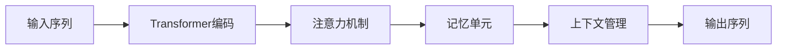

# 大语言模型应用指南：MemGPT

## 1. 背景介绍
随着人工智能技术的飞速发展，大型语言模型（Large Language Models，LLMs）已经成为了自然语言处理（NLP）领域的一个重要分支。这些模型，如GPT（Generative Pre-trained Transformer）系列，通过在大规模数据集上进行预训练，能够生成连贯、多样且有深度的文本内容。MemGPT作为其中的一种变体，通过引入记忆机制，进一步提升了模型的上下文理解能力和长期依赖关系的捕捉能力。

## 2. 核心概念与联系
MemGPT模型在GPT的基础上，引入了记忆单元（Memory Units）来存储和检索历史信息。这种设计使得模型能够更好地处理长篇文章、对话和其他需要长期记忆的场景。核心概念包括Transformer架构、注意力机制、记忆单元和上下文管理。



## 3. 核心算法原理具体操作步骤
MemGPT的核心算法原理包括序列编码、注意力分配、记忆读写和输出生成。具体操作步骤如下：

1. 序列编码：将输入序列通过词嵌入转换为向量表示。
2. 注意力分配：计算当前输入与历史信息的相关性。
3. 记忆读写：根据注意力分配的结果，从记忆单元中读取相关信息或更新记忆单元。
4. 输出生成：结合当前输入和记忆信息，生成下一个词的概率分布。

## 4. 数学模型和公式详细讲解举例说明
MemGPT的数学模型基于Transformer架构，主要涉及自注意力机制和记忆单元的更新。以自注意力为例，其计算公式如下：

$$
\text{Attention}(Q, K, V) = \text{softmax}\left(\frac{QK^T}{\sqrt{d_k}}\right)V
$$

其中，$Q$、$K$、$V$分别代表查询（Query）、键（Key）和值（Value）矩阵，$d_k$是键向量的维度。记忆单元的更新则涉及到复杂的读写机制，通常通过门控网络（如LSTM的门控）来实现。

## 5. 项目实践：代码实例和详细解释说明
在项目实践中，我们可以使用PyTorch等深度学习框架来实现MemGPT。以下是一个简化的代码实例：

```python
import torch
import torch.nn as nn

class MemGPT(nn.Module):
    def __init__(self, vocab_size, embed_dim, num_heads, num_layers, num_memory_units):
        super(MemGPT, self).__init__()
        # 初始化模型参数
        # ...

    def forward(self, input_ids, memory):
        # 模型前向传播逻辑
        # ...
        return logits, memory

# 实例化模型并进行训练
# ...
```

详细解释说明将涵盖模型的初始化、前向传播逻辑以及训练过程。

## 6. 实际应用场景
MemGPT模型可以应用于多种场景，包括但不限于：

- 长篇文章生成
- 对话系统
- 个性化推荐
- 知识图谱的构建和查询

## 7. 工具和资源推荐
为了更好地开发和应用MemGPT模型，以下是一些有用的工具和资源：

- PyTorch/TensorFlow：流行的深度学习框架。
- Hugging Face Transformers：提供预训练模型和模型组件。
- OpenAI GPT-3 API：可以直接使用或基于GPT-3进行二次开发。

## 8. 总结：未来发展趋势与挑战
MemGPT模型的发展趋势是向着更大规模、更高效率和更好的泛化能力方向发展。同时，挑战包括计算资源的消耗、模型的可解释性和伦理问题。

## 9. 附录：常见问题与解答
在附录中，我们将回答关于MemGPT模型的常见问题，如模型的训练时间、数据隐私问题等。

作者：禅与计算机程序设计艺术 / Zen and the Art of Computer Programming