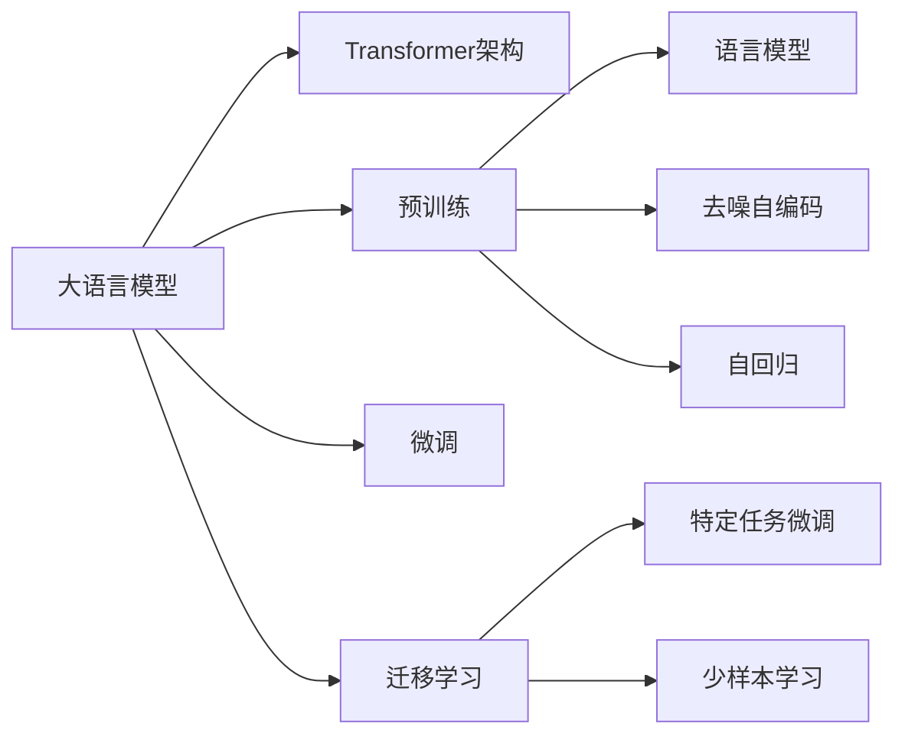

# 大语言模型应用指南：数据准备和参数微调

## 1. 背景介绍

### 1.1 大语言模型概述
大语言模型(Large Language Models, LLMs)是自然语言处理(NLP)领域近年来的重大突破。它们是在海量文本数据上训练的深度神经网络模型,具有强大的语言理解和生成能力。代表性的大语言模型有GPT系列、BERT、XLNet等。这些模型在问答、对话、文本分类、命名实体识别等NLP任务上取得了显著的性能提升。

### 1.2 预训练与微调范式
大语言模型的训练通常分为两个阶段:预训练(Pre-training)和微调(Fine-tuning)。在预训练阶段,模型在大规模无标注语料上以自监督学习的方式进行训练,学习通用的语言表征。在微调阶段,预训练模型被应用到下游任务,在特定领域的标注数据上进行参数微调,从而适应具体任务。预训练-微调范式极大降低了模型开发成本,使得大语言模型能够快速应用到各种NLP场景中。

### 1.3 数据和计算资源需求
训练大语言模型需要海量的文本数据和强大的计算资源。以GPT-3为例,其训练数据量达到了惊人的45TB,使用了超过1750亿个参数,训练成本高达460万美元。因此,对于大多数组织和个人来说,直接从头训练大语言模型是不现实的。微调预训练模型成为更加普适的应用模式。

## 2. 核心概念与关系

### 2.1 Transformer 架构
大语言模型的核心架构是 Transformer。它是一种基于自注意力机制(Self-Attention)的序列到序列模型。不同于传统的 RNN 和 CNN,Transformer 能够并行计算,大幅提升了训练效率。同时 Transformer 擅长捕捉长距离依赖,对于理解长文本具有天然优势。Transformer 包含编码器和解码器两部分,广泛应用于 NLP 各项任务中。

### 2.2 预训练目标
大语言模型的预训练通常采用自监督学习,即利用无标注语料自动构建监督信号。常见的预训练目标有:

- 语言模型:预测下一个词,如 GPT 系列模型
- 去噪自编码:随机遮蔽词语,预测被遮蔽词,如 BERT
- 自回归:随机划分句子,预测后一部分,如 XLNet

通过这些预训练任务,模型能够学习到语言的统计规律和深层次语义信息。不同的预训练目标侧重点略有不同,但都能让模型习得强大的语言理解能力。

### 2.3 迁移学习
迁移学习是大语言模型的关键思想。通过在海量语料上预训练,模型学习到通用的语言知识,形成强大的语言理解能力。在应用到下游任务时,这种先验知识可以迁移到具体任务中,大幅减少所需标注数据,提升模型性能。迁移学习分为特定任务微调和少样本学习两种模式,分别适用于不同的应用场景。

### 2.4 核心概念关系图
下面使用 Mermaid 绘制核心概念关系图:



## 3. 核心算法原理与操作步骤

### 3.1 预训练算法

#### 3.1.1 语言模型预训练
以 GPT 为例,其预训练目标是基于前文预测下一个词。给定文本序列 $x=(x_1,x_2,...,x_n)$,语言模型的目标是最大化如下似然概率:

$$\mathcal{L}(\theta)=\sum_{i=1}^{n} \log P\left(x_{i} | x_{<i} ; \theta\right)$$

其中 $\theta$ 为模型参数。训练时采用随机梯度下降,不断优化参数以最小化负对数似然损失。

#### 3.1.2 去噪自编码预训练 
BERT 采用去噪自编码进行预训练。对于输入文本序列,随机遮蔽一部分词语,然后让模型预测被遮蔽的词。
假设输入序列 $\mathbf{x}=\left(x_{1}, \ldots, x_{n}\right)$,遮蔽后的序列为 $\hat{\mathbf{x}}$,被遮蔽词的位置为 $\mathcal{C}$。BERT 的预训练损失为:

$$\mathcal{L}(\theta)=-\sum_{i \in \mathcal{C}} \log p\left(x_{i} | \hat{\mathbf{x}} ; \theta\right)$$

通过这种自编码方式,BERT 能够学习到深层次的双向语言表征。

### 3.2 微调算法

#### 3.2.1 特定任务微调
对于分类、序列标注等任务,可以在预训练模型的基础上添加任务特定的输出层,然后在标注数据上进行端到端的微调。以文本分类为例,微调时优化如下损失函数:

$$\mathcal{L}(\theta)=-\sum_{i=1}^{N} \log p\left(y_{i} | \mathbf{x}_{i} ; \theta\right)$$

其中 $\mathbf{x}_i$ 为第 $i$ 个文本,  $y_i$ 为其对应的标签, $N$ 为训练样本数。模型参数 $\theta$ 在微调过程中被更新,以适应具体任务。

#### 3.2.2 提示学习
提示学习(Prompt Learning)是一种新兴的微调方法。其核心思想是将下游任务转化为预训练模型已经擅长的形式,如自然语言问答。通过设计恰当的提示模板,可以实现少样本甚至零样本学习。例如对于情感分类任务,可以构建如下提示:

```
输入: 这部电影太棒了,我非常喜欢!
问题: 上述评论的情感倾向是什么?
回答: 积极
```

通过这种提示设计,预训练模型能够直接利用其语言理解能力进行推理,无需或很少需要标注数据。提示学习大大拓展了大语言模型的应用范围。

### 3.3 训练流程

微调大语言模型的一般流程如下:

1. 数据准备:构建任务特定的标注数据集,进行必要的数据清洗和预处理。
2. 模型选择:根据任务特点选择合适的预训练模型,如 BERT、GPT、BART 等。
3. 搭建微调层:在预训练模型上添加任务特定的输出层,如分类层、序列标注层等。 
4. 设置超参数:选择适当的学习率、batch size、epoch 数等超参数。
5. 模型微调:加载预训练参数,使用任务标注数据对模型进行微调训练。
6. 模型评估:在验证集或测试集上评估微调后的模型性能。
7. 模型部署:将微调后的模型封装为可用的服务,投入实际应用。

## 4. 数学模型与公式详解

### 4.1 Transformer 的自注意力机制

Transformer 的核心是自注意力机制。对于一个长度为 $n$ 的输入序列 $\mathbf{X} \in \mathbb{R}^{n \times d}$,自注意力计算过程如下:

1. 计算查询矩阵 $\mathbf{Q}$、键矩阵 $\mathbf{K}$ 和值矩阵 $\mathbf{V}$:

$$
\begin{aligned}
\mathbf{Q} &=\mathbf{X} \mathbf{W}^{Q} \\
\mathbf{K} &=\mathbf{X} \mathbf{W}^{K} \\
\mathbf{V} &=\mathbf{X} \mathbf{W}^{V}
\end{aligned}
$$

其中 $\mathbf{W}^Q, \mathbf{W}^K, \mathbf{W}^V \in \mathbb{R}^{d \times d_k}$ 为可学习的参数矩阵。

2. 计算注意力权重:

$$
\mathbf{A}=\operatorname{softmax}\left(\frac{\mathbf{Q K}^{T}}{\sqrt{d_{k}}}\right)
$$

其中 $\mathbf{A} \in \mathbb{R}^{n \times n}$ 为注意力权重矩阵。$\sqrt{d_k}$ 为缩放因子,用于控制点积结果的方差。

3. 计算注意力输出:

$$
\operatorname{Attention}(\mathbf{Q}, \mathbf{K}, \mathbf{V})=\mathbf{A} \mathbf{V}
$$

将注意力权重矩阵与值矩阵相乘,得到最终的注意力表征。

实际应用中,Transformer 采用多头自注意力(Multi-head Self-attention),将 $\mathbf{Q}, \mathbf{K}, \mathbf{V}$ 划分为多个子空间,并行计算多个注意力头,然后拼接得到最终输出。这种机制增强了模型的表达能力。

### 4.2 位置编码
由于 Transformer 不包含循环和卷积结构,需要显式地引入位置信息。位置编码(Positional Encoding)用于为输入序列的每个位置赋予唯一的位置表征。Transformer 中采用的是正余弦位置编码,对于第 $i$ 个位置,其位置向量 $\mathbf{p}_i \in \mathbb{R}^d$ 为:

$$
\begin{aligned}
\mathbf{p}_{i, 2 j} &=\sin \left(i / 10000^{2 j / d}\right) \\
\mathbf{p}_{i, 2 j+1} &=\cos \left(i / 10000^{2 j / d}\right)
\end{aligned}
$$

其中 $j=0,1,...,d/2-1$。将位置编码与词嵌入相加,即可为每个位置赋予唯一的位置表征。

## 5. 代码实例详解

下面以 PyTorch 为例,展示如何使用 Hugging Face 的 Transformers 库对 BERT 进行文本分类微调。

```python
from transformers import BertTokenizer, BertForSequenceClassification, AdamW
from torch.utils.data import DataLoader

# 加载预训练模型和分词器
model = BertForSequenceClassification.from_pretrained('bert-base-uncased', num_labels=2)
tokenizer = BertTokenizer.from_pretrained('bert-base-uncased')

# 准备数据集
train_texts = [...]  # 训练文本列表
train_labels = [...]  # 训练标签列表
train_encodings = tokenizer(train_texts, truncation=True, padding=True)
train_dataset = MyDataset(train_encodings, train_labels)

# 定义优化器和数据加载器  
optimizer = AdamW(model.parameters(), lr=1e-5)
train_loader = DataLoader(train_dataset, batch_size=16, shuffle=True)

# 模型微调
model.train()
for epoch in range(3):
    for batch in train_loader:
        input_ids = batch['input_ids']
        attention_mask = batch['attention_mask']
        labels = batch['labels']
        
        outputs = model(input_ids, attention_mask=attention_mask, labels=labels)
        loss = outputs.loss
        loss.backward()
        optimizer.step()
        optimizer.zero_grad()

# 模型评估
model.eval()
```

上述代码中,首先加载了预训练的 BERT 模型和对应的分词器。然后将文本数据转换为模型可接受的输入格式,并构建 PyTorch 数据集和数据加载器。接着定义优化器,并对模型进行 3 个 epoch 的微调训练。最后,可以在测试集上评估微调后的模型性能。

Transformers 库提供了统一的接口,支持绝大多数主流的预训练模型。通过几行简洁的代码,即可实现 BERT 等大语言模型在下游任务上的快速微调。

## 6. 实际应用场景

大语言模型凭借其强大的语言理解和生成能力,在 NLP 领域得到了广泛应用,主要场景包括:

### 6.1 智能问答
使用微调后的大语言模型,可以构建领域智能问答系统。以医疗领域为例,通过在医学文献和病例数据上微调 BERT,模型可以理解患者的问题,并给出专业的医疗建议。相比传统的基于规则或检索的方法,大语言模型可以生成更加自然