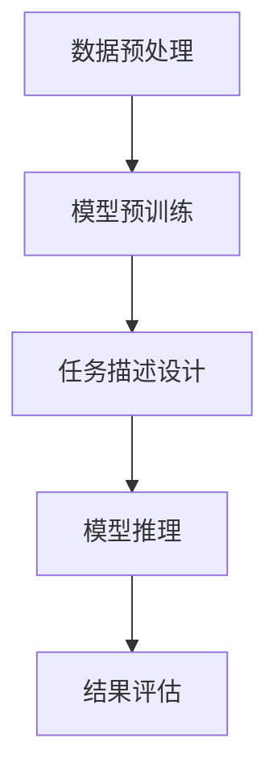

# 大语言模型的zero-shot学习原理与代码实例讲解

## 1.背景介绍

在人工智能和自然语言处理（NLP）领域，大语言模型（Large Language Models, LLMs）已经成为了研究和应用的热点。特别是zero-shot学习（零样本学习）技术，使得模型在没有见过特定任务数据的情况下，依然能够完成任务。这种能力极大地提升了模型的通用性和实用性。

### 1.1 大语言模型的崛起

大语言模型如GPT-3、BERT等，通过大规模的预训练和微调，展示了强大的语言理解和生成能力。这些模型通过在海量文本数据上进行训练，学习到了丰富的语言知识和语义表示。

### 1.2 什么是zero-shot学习

Zero-shot学习是一种机器学习方法，模型在没有见过特定任务数据的情况下，依然能够完成任务。这种能力依赖于模型在预训练阶段学习到的广泛知识和语义表示。

### 1.3 研究意义

Zero-shot学习的研究意义在于它能够大大减少对标注数据的依赖，提升模型的通用性和适应性。这对于资源有限的应用场景尤为重要。

## 2.核心概念与联系

### 2.1 预训练与微调

大语言模型的训练通常分为两个阶段：预训练和微调。预训练阶段，模型在大规模无标注文本数据上进行训练，学习语言的基本结构和语义。微调阶段，模型在特定任务的数据上进行训练，以提升在该任务上的表现。

### 2.2 语义表示

语义表示是指模型对文本中语义信息的编码方式。大语言模型通过多层神经网络结构，能够捕捉到文本中的复杂语义关系。

### 2.3 任务迁移

任务迁移是指模型在一个任务上学习到的知识，能够应用到另一个任务上。Zero-shot学习正是任务迁移的一种特殊形式。

### 2.4 Zero-shot学习的实现

Zero-shot学习的实现依赖于模型在预训练阶段学习到的广泛知识和语义表示。通过设计合适的任务描述和输入格式，模型能够在没有见过特定任务数据的情况下，完成任务。

## 3.核心算法原理具体操作步骤

### 3.1 数据预处理

数据预处理是模型训练的第一步。包括文本清洗、分词、去停用词等步骤。

### 3.2 模型预训练

模型预训练是在大规模无标注文本数据上进行的。通过自监督学习，模型学习语言的基本结构和语义。

### 3.3 任务描述设计

任务描述设计是zero-shot学习的关键。通过设计合适的任务描述和输入格式，模型能够理解并完成特定任务。

### 3.4 模型推理

模型推理是指在给定输入的情况下，模型生成输出的过程。在zero-shot学习中，模型通过任务描述和输入格式，理解并完成任务。

### 3.5 结果评估

结果评估是指对模型输出的结果进行评估。常用的评估指标包括准确率、精确率、召回率等。



## 4.数学模型和公式详细讲解举例说明

### 4.1 语言模型的基本公式

语言模型的目标是估计一个给定序列的概率。对于一个序列 $X = (x_1, x_2, ..., x_n)$，其概率可以表示为：

$$
P(X) = P(x_1, x_2, ..., x_n) = \prod_{i=1}^{n} P(x_i | x_1, x_2, ..., x_{i-1})
$$

### 4.2 自监督学习

自监督学习是一种无监督学习方法，通过构造伪标签，模型能够在无标注数据上进行训练。常见的自监督学习任务包括掩码语言模型（Masked Language Model, MLM）和自回归语言模型（Autoregressive Language Model, ARLM）。

### 4.3 任务描述设计

任务描述设计是zero-shot学习的关键。通过设计合适的任务描述和输入格式，模型能够理解并完成特定任务。例如，对于文本分类任务，可以将输入格式设计为：

$$
\text{[CLS]} \text{任务描述} \text{[SEP]} \text{输入文本} \text{[SEP]}
$$

### 4.4 模型推理

模型推理是指在给定输入的情况下，模型生成输出的过程。在zero-shot学习中，模型通过任务描述和输入格式，理解并完成任务。推理过程可以表示为：

$$
\hat{y} = \arg\max_{y} P(y | \text{任务描述}, \text{输入文本})
$$

## 5.项目实践：代码实例和详细解释说明

### 5.1 环境配置

首先，我们需要配置Python环境，并安装相关的库。

```bash
pip install transformers torch
```

### 5.2 数据预处理

数据预处理包括文本清洗、分词等步骤。以下是一个简单的示例：

```python
from transformers import BertTokenizer

tokenizer = BertTokenizer.from_pretrained('bert-base-uncased')

def preprocess(text):
    return tokenizer.encode(text, add_special_tokens=True)
```

### 5.3 模型加载

我们使用预训练的BERT模型进行zero-shot学习。

```python
from transformers import BertForSequenceClassification

model = BertForSequenceClassification.from_pretrained('bert-base-uncased')
```

### 5.4 任务描述设计

我们设计一个简单的任务描述，用于文本分类任务。

```python
task_description = "Classify the sentiment of the following text: "
input_text = "I love this product!"

input_ids = tokenizer.encode(task_description + input_text, add_special_tokens=True)
```

### 5.5 模型推理

我们进行模型推理，并输出结果。

```python
import torch

input_ids = torch.tensor([input_ids])
outputs = model(input_ids)
logits = outputs.logits

predicted_class = torch.argmax(logits, dim=1).item()
print(f"Predicted class: {predicted_class}")
```

## 6.实际应用场景

### 6.1 文本分类

Zero-shot学习可以用于文本分类任务，如情感分析、主题分类等。

### 6.2 文本生成

Zero-shot学习可以用于文本生成任务，如对话生成、文章续写等。

### 6.3 信息抽取

Zero-shot学习可以用于信息抽取任务，如命名实体识别、关系抽取等。

### 6.4 机器翻译

Zero-shot学习可以用于机器翻译任务，特别是低资源语言的翻译。

## 7.工具和资源推荐

### 7.1 工具

- **Transformers**：一个强大的NLP库，支持多种预训练模型。
- **PyTorch**：一个流行的深度学习框架，支持动态计算图。

### 7.2 资源

- **Hugging Face Model Hub**：提供了大量预训练模型，方便快速使用。
- **Kaggle**：提供了丰富的数据集和竞赛，适合进行实践和学习。

## 8.总结：未来发展趋势与挑战

### 8.1 未来发展趋势

- **更大规模的预训练模型**：随着计算资源的增加，预训练模型的规模将继续扩大，性能也将进一步提升。
- **多模态学习**：结合文本、图像、音频等多种模态的数据，提升模型的理解和生成能力。
- **自监督学习的创新**：更多创新的自监督学习方法将被提出，提升模型的预训练效果。

### 8.2 挑战

- **计算资源的需求**：大规模预训练模型需要大量的计算资源，如何高效利用资源是一个挑战。
- **模型的可解释性**：大语言模型的内部机制复杂，如何提升模型的可解释性是一个重要研究方向。
- **数据隐私和安全**：大规模数据的使用涉及数据隐私和安全问题，需要制定相应的政策和技术措施。

## 9.附录：常见问题与解答

### 9.1 Zero-shot学习的效果如何评估？

Zero-shot学习的效果可以通过准确率、精确率、召回率等指标进行评估。

### 9.2 如何提升Zero-shot学习的效果？

可以通过设计更好的任务描述和输入格式，提升Zero-shot学习的效果。

### 9.3 Zero-shot学习适用于哪些任务？

Zero-shot学习适用于文本分类、文本生成、信息抽取、机器翻译等多种任务。

### 9.4 Zero-shot学习的实现有哪些难点？

Zero-shot学习的实现难点在于任务描述的设计和模型的推理过程。

### 9.5