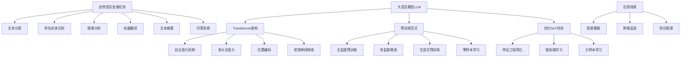

# 如何利用AI LLM优化自然语言处理任务

## 1. 背景介绍
### 1.1 人工智能与自然语言处理的发展历程
#### 1.1.1 人工智能的起源与发展
#### 1.1.2 自然语言处理的兴起
#### 1.1.3 深度学习在NLP中的应用

### 1.2 大语言模型(LLM)的崛起
#### 1.2.1 Transformer架构的提出
#### 1.2.2 GPT系列模型的发展
#### 1.2.3 ChatGPT的问世与影响

### 1.3 LLM在自然语言处理中的优势
#### 1.3.1 海量语料训练带来的知识储备
#### 1.3.2 强大的语言理解与生成能力
#### 1.3.3 多任务学习与迁移学习的便利性

## 2. 核心概念与联系
### 2.1 自然语言处理的主要任务
#### 2.1.1 文本分类
#### 2.1.2 命名实体识别
#### 2.1.3 情感分析
#### 2.1.4 机器翻译
#### 2.1.5 文本摘要
#### 2.1.6 问答系统

### 2.2 大语言模型的关键技术
#### 2.2.1 注意力机制
#### 2.2.2 自回归语言模型
#### 2.2.3 无监督预训练
#### 2.2.4 Prompt工程

### 2.3 LLM与传统NLP方法的区别
#### 2.3.1 特征工程的简化
#### 2.3.2 端到端的学习范式
#### 2.3.3 零样本和少样本学习的实现

## 3. 核心算法原理具体操作步骤
### 3.1 Transformer的核心原理
#### 3.1.1 自注意力机制
#### 3.1.2 多头注意力
#### 3.1.3 位置编码
#### 3.1.4 前馈神经网络

### 3.2 GPT模型的训练过程
#### 3.2.1 无监督预训练
#### 3.2.2 有监督微调
#### 3.2.3 生成式预训练
#### 3.2.4 零样本学习

### 3.3 利用LLM进行NLP任务的步骤
#### 3.3.1 选择合适的预训练模型
#### 3.3.2 准备任务特定的数据集
#### 3.3.3 设计Prompt模板
#### 3.3.4 对模型进行微调或零样本推理

## 4. 数学模型和公式详细讲解举例说明
### 4.1 自注意力机制的数学表示
#### 4.1.1 查询、键、值的计算
#### 4.1.2 注意力权重的计算
#### 4.1.3 注意力输出的计算

### 4.2 Transformer的前向传播过程
#### 4.2.1 输入嵌入与位置编码
#### 4.2.2 自注意力子层
#### 4.2.3 前馈神经网络子层
#### 4.2.4 残差连接与层归一化

### 4.3 语言模型的概率计算
#### 4.3.1 自回归语言模型的概率分解
#### 4.3.2 交叉熵损失函数
#### 4.3.3 困惑度评估指标

## 5. 项目实践：代码实例和详细解释说明
### 5.1 使用Hugging Face的Transformers库
#### 5.1.1 加载预训练模型
#### 5.1.2 数据预处理与Tokenization
#### 5.1.3 定义微调的数据集与数据加载器
#### 5.1.4 设置训练参数与优化器

### 5.2 基于Prompt的文本分类任务
#### 5.2.1 设计Prompt模板
#### 5.2.2 将样本转化为Prompt形式
#### 5.2.3 对模型进行零样本或少样本微调
#### 5.2.4 模型推理与结果解析

### 5.3 利用ChatGPT API实现问答系统
#### 5.3.1 注册OpenAI API并获取密钥
#### 5.3.2 构建ChatGPT请求与响应的代码逻辑
#### 5.3.3 设计人机交互界面
#### 5.3.4 结果展示与错误处理

## 6. 实际应用场景
### 6.1 智能客服
#### 6.1.1 客户意图识别
#### 6.1.2 问题自动应答
#### 6.1.3 多轮对话管理

### 6.2 舆情监测
#### 6.2.1 海量文本数据采集
#### 6.2.2 实体与事件抽取
#### 6.2.3 情感倾向分析
#### 6.2.4 热点话题挖掘

### 6.3 知识图谱构建
#### 6.3.1 实体关系抽取
#### 6.3.2 知识融合与推理
#### 6.3.3 图谱可视化展示

## 7. 工具和资源推荐
### 7.1 开源NLP库
#### 7.1.1 NLTK
#### 7.1.2 spaCy
#### 7.1.3 Gensim
#### 7.1.4 Hugging Face Transformers

### 7.2 预训练语言模型
#### 7.2.1 BERT
#### 7.2.2 GPT-2/GPT-3
#### 7.2.3 RoBERTa
#### 7.2.4 XLNet

### 7.3 NLP数据集
#### 7.3.1 GLUE基准测试
#### 7.3.2 SQuAD问答数据集
#### 7.3.3 CoNLL命名实体识别数据集
#### 7.3.4 SST情感分析数据集

## 8. 总结：未来发展趋势与挑战
### 8.1 LLM的优化方向
#### 8.1.1 模型效率提升
#### 8.1.2 鲁棒性与公平性
#### 8.1.3 知识引入与更新

### 8.2 NLP技术的发展趋势
#### 8.2.1 多模态学习
#### 8.2.2 隐私保护
#### 8.2.3 可解释性

### 8.3 面临的挑战
#### 8.3.1 数据标注成本
#### 8.3.2 模型的可控性
#### 8.3.3 落地应用的门槛

## 9. 附录：常见问题与解答
### 9.1 如何选择合适的预训练模型？
### 9.2 Prompt工程有哪些技巧？
### 9.3 零样本学习的局限性有哪些？
### 9.4 如何平衡模型性能与计算资源？
### 9.5 数据隐私和版权方面需要注意什么？

近年来，随着人工智能技术的飞速发展，自然语言处理(NLP)领域也迎来了革命性的变革。以Transformer为代表的大语言模型(Large Language Models, LLM)的出现，为NLP任务带来了全新的解决方案。这些预训练的语言模型在海量文本数据上进行无监督学习，掌握了丰富的语言知识和常识，具备强大的语言理解与生成能力。通过对LLM进行针对性的微调或利用Prompt技术进行零样本学习，可以显著提升各类NLP任务的性能，甚至在很多场景下超越传统的监督学习方法。

本文将深入探讨如何利用AI LLM优化自然语言处理任务。我们首先回顾人工智能和自然语言处理的发展历程，介绍大语言模型的崛起及其在NLP中的优势。然后，我们系统阐述LLM的核心概念和关键技术，包括Transformer架构、注意力机制、无监督预训练等，并通过数学模型和代码实例详细说明其原理和实现步骤。接着，我们展示利用LLM进行NLP任务优化的具体方法，例如Prompt工程、零样本学习等，并分析其在智能客服、舆情监测、知识图谱等实际应用场景中的价值。最后，我们总结LLM和NLP技术的未来发展趋势与面临的挑战，为读者提供前瞻性的思路。

## 1. 背景介绍

### 1.1 人工智能与自然语言处理的发展历程

人工智能(Artificial Intelligence, AI)的概念最早由约翰·麦卡锡(John McCarthy)在1956年提出，旨在研究如何让机器展现出智能行为。经过数十年的发展，AI技术已经在计算机视觉、自然语言处理、语音识别等领域取得了长足进步。

自然语言处理作为人工智能的重要分支，致力于赋予计算机理解和生成人类语言的能力。早期的NLP方法主要基于规则和统计模型，如词袋模型、条件随机场等。这些方法在简单任务上取得了一定成果，但面对复杂的语言现象时往往捉襟见肘。

2013年，Mikolov等人提出Word2Vec模型，开启了基于神经网络的NLP新时代。此后，CNN、RNN等深度学习模型被广泛应用于NLP任务，显著提升了模型性能。但这些模型仍然是针对特定任务从头训练，缺乏通用语言知识的积累。

### 1.2 大语言模型(LLM)的崛起

2017年，Google提出Transformer架构，引入自注意力机制来建模文本序列中的长距离依赖关系。基于Transformer的语言模型在机器翻译等任务上取得了突破性进展。此后，OpenAI、Google等机构相继推出了GPT、BERT等大规模预训练语言模型，掀起了NLP领域的新一轮革命。

这些大语言模型在海量无标注文本数据上进行自监督预训练，通过掩码语言建模、下一句预测等任务学习通用的语言表征。预训练阶段积累的语言知识可以通过迁移学习应用到下游NLP任务，大幅减少了任务特定数据的标注需求。

2022年，ChatGPT的问世引发了全社会对AI的广泛关注。这个基于GPT-3.5架构的对话模型展现出惊人的语言交互能力，可以自然地完成问答、写作、编程等复杂任务。ChatGPT的成功进一步证明了大语言模型的巨大潜力。

### 1.3 LLM在自然语言处理中的优势

大语言模型之所以能够在NLP领域取得瞩目成就，归因于以下几个方面的优势：

首先，LLM在海量语料上训练，积累了丰富的语言知识和世界知识。这使得模型具备强大的语义理解和逻辑推理能力，能够应对复杂多变的语言现象。

其次，LLM采用端到端的学习范式，可以直接从原始文本中学习任务所需的特征表示。这免去了传统NLP方法中繁琐的特征工程步骤，大大简化了任务流程。

此外，预训练语言模型具有很好的迁移性和泛化性。通过在下游任务上进行微调，可以快速适应新的数据分布和任务目标。LLM还支持零样本学习和少样本学习，即使在缺乏标注数据的情况下也能取得不错的效果。

综上所述，大语言模型凭借其强大的语言理解与生成能力、端到端的学习范式以及优异的迁移性能，正在深刻影响和重塑自然语言处理的研究与应用格局。

## 2. 核心概念与联系

### 2.1 自然语言处理的主要任务

自然语言处理涵盖了一系列理解和生成人类语言的任务，主要包括：

- 文本分类：将文本按照预定义的类别进行分类，如情感分析、新闻分类等