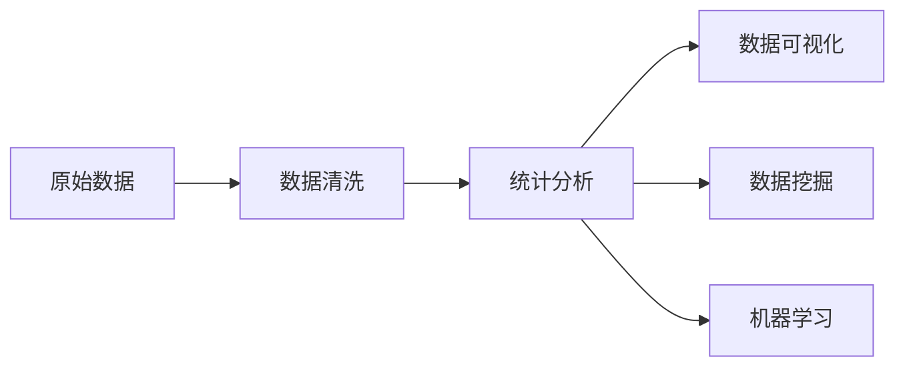

# 数据清洗与统计分析原理与代码实战案例讲解

## 1. 背景介绍
### 1.1 数据清洗的重要性
在大数据时代,企业和组织每天都会收集和处理海量的数据。然而,原始数据通常包含很多噪声、异常值、缺失值等问题,直接使用这些"脏数据"进行分析和建模,往往会得到错误的结论和决策。因此,在进行数据分析之前,必须要对原始数据进行清洗和预处理,提高数据质量,为后续的统计分析奠定良好的基础。

### 1.2 统计分析在数据科学中的地位
统计分析是数据科学的核心,贯穿于数据分析的整个流程。通过统计分析方法,我们可以探索数据的分布特征、变量之间的关联关系、因果关系等,挖掘数据背后隐藏的规律和价值,支撑数据驱动的科学决策。统计分析是数据科学家必备的基础技能。

### 1.3 本文的目标和结构安排
本文将系统地介绍数据清洗与统计分析的原理和方法,并通过Python代码实战案例进行讲解。内容安排如下:
- 第2部分:介绍数据清洗与统计分析涉及的核心概念,及其内在联系
- 第3部分:讲解数据清洗的核心算法原理和具体操作步骤
- 第4部分:介绍统计分析常用的数学模型和公式,并举例说明
- 第5部分:通过Python代码实战案例,演示数据清洗和统计分析的完整流程
- 第6部分:讨论数据清洗与统计分析在实际场景中的应用
- 第7部分:推荐数据清洗和统计分析的常用工具和学习资源
- 第8部分:展望数据清洗与统计分析技术的未来发展趋势和面临的挑战
- 第9部分:总结文章要点,并解答一些常见问题

## 2. 核心概念与联系
### 2.1 数据质量的定义和维度
数据质量是指数据的完整性、准确性、一致性、及时性、可理解性等特征的综合度量。常见的数据质量问题包括:
- 数据缺失:某些记录的特定字段值缺失
- 异常值:某些字段值明显偏离正常范围
- 不一致:同一个实体在不同数据源中的字段值不一致
- 重复数据:存在内容相同或高度相似的记录
- 非标准格式:日期、电话等字段格式不规范

### 2.2 数据清洗的定义和目标
数据清洗(Data Cleaning)是指检测并纠正数据文件中可识别的错误的过程,目的是提高数据质量,消除"脏数据"对后续分析的影响。数据清洗通常包括缺失值填充、异常值处理、不一致数据修正、重复数据删除等任务。

### 2.3 统计分析的定义和分类
统计分析是运用统计学原理和方法,收集、整理、分析数据,提取有价值信息的过程。根据分析目的,可分为:
- 描述性统计:用于总结数据的基本特征,如集中趋势、离散程度等
- 推断性统计:基于样本数据,推断总体的特征
- 预测性统计:利用历史数据,建立预测模型,对未来进行预测

### 2.4 数据清洗与统计分析的关系
数据清洗是统计分析的前提和基础。只有数据质量达标,统计分析的结果才可靠。同时,统计分析的需求也指引着数据清洗的方向和重点。二者相辅相成,缺一不可。

下图展示了数据清洗和统计分析在数据分析流程中的位置和关系:

## 3. 核心算法原理具体操作步骤
### 3.1 缺失值处理
#### 3.1.1 缺失值类型
缺失值可分为三种类型:
- 完全随机缺失(MCAR):缺失值出现与其他变量无关
- 随机缺失(MAR):缺失值出现与其他变量有关
- 非随机缺失(MNAR):缺失值出现与缺失值本身有关

#### 3.1.2 缺失值处理方法
常见的缺失值处理方法有:
- 删除记录:如果缺失值很少,可直接删除包含缺失值的记录
- 均值/中位数/众数填充:用该列的均值、中位数或众数填充缺失值
- 固定值填充:用一个固定值如0填充所有缺失值
- 最近邻填充:用与该记录最相似的其他记录的值填充
- 回归填充:根据其他变量,建立回归模型预测缺失值
- 多重插补:通过多次随机抽样估计缺失值

#### 3.1.3 缺失值填充流程
一般按以下步骤进行缺失值填充:
1. 分析缺失值的比例和分布
2. 根据业务场景选择合适的填充方法
3. 实施填充并评估填充效果

### 3.2 异常值检测
#### 3.2.1 异常值类型
异常值可分为:
- 单变量异常值:某个字段的值明显偏离该字段的常规范围
- 多变量异常值:多个字段的值组合起来明显偏离常规范围

#### 3.2.2 异常值检测方法
常用的异常值检测方法有:
- 3σ原则:超出均值±3倍标准差的值视为异常值
- 箱线图法:超出上下四分位数1.5倍四分位距的值视为异常值
- 孤立森林:通过随机选择特征构建多棵决策树,位于森林边缘的值视为异常值
- LOF局部异常因子:计算每个点相对于周围邻居的局部密度,密度明显较低的点视为异常值

#### 3.2.3 异常值处理流程
异常值处理一般按以下步骤:
1. 检测并标记异常值
2. 分析异常值产生的原因
3. 根据业务需求,选择删除异常值或调整为边界值

### 3.3 不一致数据修正
#### 3.3.1 不一致类型
数据不一致可分为:
- 代码不一致:同一含义的字段,在不同记录中用不同的代码表示
- 单位不一致:同一个度量字段,在不同记录中使用不同的度量单位
- 精度不一致:同一个连续变量字段,在不同记录中精确到小数点后不同位数

#### 3.3.2 不一致修正方法
修正数据不一致的方法包括:
- 制定统一的编码规则,对代码进行映射转换
- 统一度量单位,对数值进行换算
- 统一数值精度,对数值进行四舍五入

#### 3.3.3 不一致修正流程
不一致修正通常按以下步骤:
1. 识别不一致字段
2. 制定统一规则
3. 实施转换和修正
4. 检查修正结果

### 3.4 重复数据删除
#### 3.4.1 重复类型
重复数据可分为:
- 完全重复:所有字段的值都相同的记录
- 近似重复:大部分字段的值相同,个别字段有微小差异的记录

#### 3.4.2 重复删除方法
常用的重复删除方法有:
- 基于主键删除:设置能唯一标识一条记录的字段组合为主键,保留主键值第一次出现的记录,删除后面的重复记录
- 基于相似度删除:计算记录之间的相似度,对相似度超过阈值的记录进行去重

#### 3.4.3 重复删除流程
重复删除一般按以下步骤:
1. 确定唯一性标识
2. 标记重复记录
3. 选择保留策略
4. 删除重复记录

## 4. 数学模型和公式详细讲解举例说明
本节介绍统计分析中常用的数学模型和公式,并举例说明其应用。

### 4.1 描述性统计
#### 4.1.1 集中趋势度量
集中趋势度量反映数据的中心位置,常用指标有:
- 均值:$\bar{x}=\frac{\sum_{i=1}^n x_i}{n}$
- 中位数:将数据从小到大排列,位于中间的值
- 众数:出现频率最高的值

例如,对于数据集${1,2,2,3,4}$,其均值为$\frac{1+2+2+3+4}{5}=2.4$,中位数为2,众数为2。

#### 4.1.2 离散程度度量
离散程度度量反映数据偏离中心的程度,常用指标有:
- 极差:最大值与最小值之差,$range=x_{max}-x_{min}$
- 方差:各数据与均值差平方的均值,$s^2=\frac{\sum_{i=1}^n (x_i-\bar{x})^2}{n-1}$
- 标准差:方差的平方根,$s=\sqrt{s^2}$

例如,对于数据集${1,2,2,3,4}$,其极差为$4-1=3$,方差为$\frac{(1-2.4)^2+(2-2.4)^2+(2-2.4)^2+(3-2.4)^2+(4-2.4)^2}{4}=1.3$,标准差为$\sqrt{1.3}=1.14$ 。

### 4.2 推断性统计
#### 4.2.1 参数估计
参数估计是根据样本统计量估计总体参数的过程。设总体均值为$\mu$,方差为$\sigma^2$,样本均值为$\bar{X}$,样本方差为$S^2$,则:
- $\bar{X}$是$\mu$的无偏估计,置信度为$1-\alpha$的区间估计为:$\bar{X}\pm \frac{S}{\sqrt{n}}t_{\alpha/2}(n-1)$
- $\frac{(n-1)S^2}{\sigma^2} \sim \chi^2(n-1)$

例如,一批产品的抽样测得样本均值为100,样本标准差为15,样本量为64,求总体均值的95%置信区间。
置信度95%对应$\alpha=0.05$,查t分布表得$t_{0.025}(63)=1.998$,代入公式得区间估计为:$100\pm \frac{15}{\sqrt{64}}1.998=[96.26,103.74]$。

#### 4.2.2 假设检验
假设检验是在给定显著性水平下,根据样本信息,对总体的参数或分布作出推断。假设检验的基本步骤为:
1. 提出原假设$H_0$和备择假设$H_1$
2. 选取检验统计量,并确定其分布
3. 给定显著性水平$\alpha$,确定拒绝域
4. 计算检验统计量的值,作出推断

例如,要检验一枚硬币是否均匀,抛掷100次,正面朝上50次,设正面朝上概率为$p$,欲在显著性水平0.05下检验$H_0:p=0.5$和$H_1:p \neq 0.5$。
取检验统计量$U=\frac{Y-np}{\sqrt{np(1-p)}} \sim N(0,1)$,其中$Y$为正面朝上次数。
由于是双侧检验,拒绝域为$|U|>z_{0.025}=1.96$。
将数据代入,得$U=\frac{50-100 \times 0.5}{\sqrt{100 \times 0.5 \times 0.5}}=0$,属于接受域,故接受原假设,认为硬币是均匀的。

### 4.3 回归分析
回归分析研究变量之间的关系,常用的模型有:
- 一元线性回归:$y=\beta_0+\beta_1x+\epsilon$
- 多元线性回归:$y=\beta_0+\beta_1x_1+\beta_2x_2+...+\beta_px_p+\epsilon$
- 逻辑回归:$\ln \frac{p}{1-p}=\beta_0+\beta_1x_1+\beta_2x_2+...+\beta_px_p$

其中,$y$为响应变量,$x$为解释变量,$\beta$为回归系数,$\epsilon$为随机误差。

例如,利用一元线性回归研究员工工资