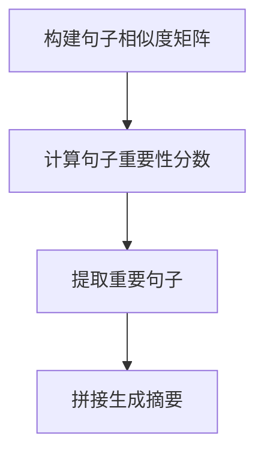
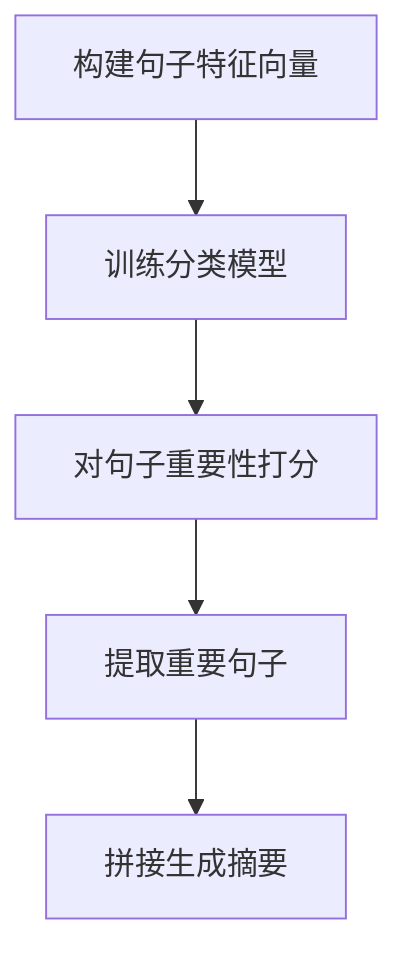

# 文本摘要(Text Summarization)原理与代码实战案例讲解

## 1.背景介绍

### 1.1 什么是文本摘要?

文本摘要(Text Summarization)是一种将长文本压缩为简短而准确的摘要的技术,旨在捕捉原始文本的核心思想和要点。随着信息时代的到来,海量的文本数据如新闻报道、科技论文、社交媒体等不断涌现,人们越来越难以从大量的文本中快速获取有价值的信息。因此,自动文本摘要技术应运而生,以帮助用户高效地获取文本的主要内容。

### 1.2 文本摘要的重要性

文本摘要技术在多个领域发挥着重要作用:

- **信息检索**: 为搜索引擎提供文档的精简版本,提高检索效率。
- **新闻媒体**: 自动生成新闻摘要,方便读者快速了解要点。
- **科研领域**: 对大量论文进行摘要,帮助研究人员掌握领域前沿。
- **智能助理**: 智能助理可通过摘要技术为用户提供信息概览。

### 1.3 文本摘要的分类

根据生成方式,文本摘要可分为**抽取式摘要**和**生成式摘要**:

- **抽取式摘要**:从原文中抽取出一些重要的句子或语句,拼接成摘要。
- **生成式摘要**:基于原文的语义表示,生成新的摘要文本。

## 2.核心概念与联系

### 2.1 文本表示

要进行文本摘要,首先需要将原始文本转换为机器可理解的数值表示形式。常用的文本表示方法包括:

1. **One-hot编码**: 将每个单词映射为一个向量,向量维度等于词典大小。
2. **Word Embedding**: 将单词映射到低维连续的向量空间,如Word2Vec、GloVe等。
3. **序列模型表示**: 使用RNN、LSTM等序列模型对文本进行编码。

### 2.2 注意力机制

注意力机制(Attention Mechanism)是文本摘要中的关键技术,它赋予模型专注于输入序列中的不同部分的能力。通过计算上下文向量与输入序列元素的相关性分数,模型可以自动分配不同的注意力权重,从而更好地捕捉文本的要点信息。

### 2.3 生成模型

生成式摘要通常采用序列生成模型,如:

1. **seq2seq + Attention**: 编码器捕获文本语义,解码器生成摘要,注意力机制引导解码器关注重要信息。
2. **Transformer**: 全注意力机制的序列生成模型,避免了循环计算,加快训练速度。
3. **指针网络(Pointer Network)**: 允许模型直接从输入文本中复制单词,生成抽取式和生成式混合摘要。

## 3.核心算法原理具体操作步骤

### 3.1 抽取式文本摘要

抽取式文本摘要的核心思想是从原文中选取最重要的句子作为摘要。常用的抽取式摘要算法包括:

1. **TextRank算法**

TextRank算法借鉴了PageRank算法的思想,将文本看作是一个加权有向图,句子作为节点,句子之间的相似度作为边的权重。通过迭代计算每个句子的重要性分数,选取分数最高的句子作为摘要。

算法步骤:

2. **基于机器学习的方法**

将句子表示为特征向量,使用分类算法(如朴素贝叶斯、支持向量机等)对句子重要性进行二分类,选取被分类为重要的句子作为摘要。

算法步骤:

### 3.2 生成式文本摘要

生成式文本摘要的目标是根据原文生成一个全新的摘要,而不是简单拼接原文句子。常用的生成式摘要算法包括:

1. **序列到序列模型(Seq2Seq)**

序列到序列模型将文本摘要任务看作是将源文本序列映射为目标摘要序列的过程。模型由编码器和解码器组成,编码器捕获源文本的语义表示,解码器根据编码器输出生成摘要。

2. **带注意力机制的Seq2Seq**

在基础Seq2Seq模型中引入注意力机制,使解码器在生成每个单词时,能够关注源文本中与当前生成内容最相关的部分,从而生成更准确的摘要。

3. **指针网络(Pointer Network)**

指针网络允许模型直接从源文本中复制单词,生成抽取式和生成式混合摘要。它通过计算注意力分数来确定是生成新单词还是复制源文本中的单词。

## 4.数学模型和公式详细讲解举例说明

### 4.1 文本表示

#### 4.1.1 One-hot编码

One-hot编码是最简单的文本表示方法,将每个单词映射为一个向量,向量维度等于词典大小。如果词典大小为$N$,单词$w_i$的One-hot向量表示为:

$$\vec{x_i} = [0, 0, \cdots, 1, \cdots, 0]^T$$

其中只有第$i$个维度为1,其余全为0。

One-hot编码的优点是简单直观,但缺点是维度过高,导致向量维度爆炸;另外无法体现单词之间的语义相似性。

#### 4.1.2 Word Embedding

Word Embedding将单词映射到低维连续的向量空间中,能够很好地捕捉单词之间的语义关系。常用的Word Embedding方法包括Word2Vec和GloVe。

以Word2Vec的CBOW模型为例,给定上下文单词$w_{t-2}$、$w_{t-1}$、$w_{t+1}$、$w_{t+2}$,模型的目标是最大化目标单词$w_t$的条件概率:

$$\max_{θ} \frac{1}{T}\sum_{t=1}^{T}\log P(w_t|w_{t-2},w_{t-1},w_{t+1},w_{t+2};θ)$$

其中$θ$为模型参数,通过梯度下降等优化算法进行学习。

#### 4.1.3 序列模型表示

序列模型(如RNN、LSTM等)可以对文本进行有序的编码,生成对应的上下文向量表示。以LSTM为例,对于文本序列$X=(x_1,x_2,...,x_T)$,在时间步$t$,LSTM的隐状态$h_t$由以下公式计算:

$$\begin{aligned}
f_t &= \sigma(W_f\cdot[h_{t-1}, x_t] + b_f) \\
i_t &= \sigma(W_i\cdot[h_{t-1}, x_t] + b_i) \\
\tilde{C}_t &= \tanh(W_C\cdot[h_{t-1}, x_t] + b_C) \\
C_t &= f_t * C_{t-1} + i_t * \tilde{C}_t \\
o_t &= \sigma(W_o\cdot[h_{t-1}, x_t] + b_o) \\
h_t &= o_t * \tanh(C_t)
\end{aligned}$$

其中$f_t$、$i_t$、$o_t$分别为遗忘门、输入门和输出门,用于控制信息的流动;$C_t$为细胞状态,负责传递长期信息。

### 4.2 注意力机制

注意力机制是序列到序列模型中的关键组成部分,它赋予模型专注于输入序列中的不同部分的能力。以编码器-解码器框架为例,在时间步$t$,注意力机制计算上下文向量$c_t$的过程如下:

1. 计算查询向量$q_t$,通常为解码器的隐状态$h_t$:

$$q_t = h_t$$

2. 计算注意力分数,衡量查询向量与编码器输出$h_i$的相关性:

$$\alpha_{ti} = \frac{\exp(e_{ti})}{\sum_{j=1}^{T_x}\exp(e_{tj})}$$

其中$e_{ti} = \text{score}(q_t, h_i)$,常用的打分函数有点积、缩放点积、多层感知机等。

3. 根据注意力分数,计算上下文向量$c_t$:

$$c_t = \sum_{i=1}^{T_x}\alpha_{ti}h_i$$

上下文向量$c_t$捕捉了输入序列中与当前查询最相关的信息,将被送入解码器以生成下一个输出。

### 4.3 生成模型

#### 4.3.1 序列到序列模型(Seq2Seq)

序列到序列模型将文本摘要任务看作是将源文本序列映射为目标摘要序列的过程。给定源文本序列$X=(x_1,x_2,...,x_{T_x})$和目标摘要序列$Y=(y_1,y_2,...,y_{T_y})$,模型的目标是最大化条件概率:

$$\max_{\theta}\prod_{t=1}^{T_y}P(y_t|y_1,...,y_{t-1},X;\theta)$$

其中$\theta$为模型参数。

编码器通过RNN或LSTM等序列模型对源文本进行编码,生成最终的上下文向量$c$:

$$h_t = f(h_{t-1}, x_t)$$
$$c = q(h_1,...,h_{T_x})$$

解码器是另一个RNN,在每个时间步$t$,根据上一个隐状态$s_{t-1}$、上下文向量$c$和上一个输出$y_{t-1}$,生成当前输出$y_t$的概率分布:

$$s_t = f(s_{t-1}, y_{t-1}, c)$$
$$P(y_t|y_1,...,y_{t-1},X) = g(s_t, y_{t-1}, c)$$

其中$f$和$g$分别为解码器的递归函数和输出函数。

#### 4.3.2 带注意力机制的Seq2Seq

在基础Seq2Seq模型中引入注意力机制,使解码器在生成每个单词时,能够关注源文本中与当前生成内容最相关的部分。具体来说,在每个时间步$t$,解码器计算查询向量$q_t$,通过注意力机制获得上下文向量$c_t$,然后将$c_t$与解码器隐状态$s_t$结合,生成当前输出$y_t$:

$$q_t = s_t$$
$$c_t = \text{Attention}(q_t, h_1,...,h_{T_x})$$
$$P(y_t|y_1,...,y_{t-1},X) = g(s_t, y_{t-1}, c_t)$$

其中$\text{Attention}$函数根据查询向量$q_t$和编码器输出$h_i$计算注意力分数,进而得到上下文向量$c_t$。

#### 4.3.3 指针网络(Pointer Network)

指针网络允许模型直接从源文本中复制单词,生成抽取式和生成式混合摘要。它通过计算注意力分数来确定是生成新单词还是复制源文本中的单词。

具体来说,在每个时间步$t$,指针网络计算两个概率分布:

1. 生成新单词的概率分布$P_{\text{vocab}}$:

$$P_{\text{vocab}}(w) = \text{softmax}(V^T\tanh(W_1s_t + W_2c_t))$$

2. 复制源文本单词的概率分布$P_{\text{copy}}$:

$$P_{\text{copy}}(w) = \sum_{i:x_i=w}\alpha_{ti}$$

其中$\alpha_{ti}$为注意力分数,表示复制第$i$个源单词