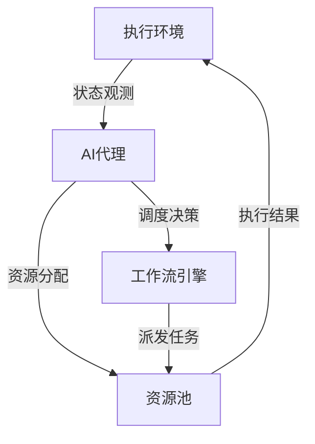

# 智能调度与资源分配：AI代理的工作流优化

## 1. 背景介绍

### 1.1 工作流调度与资源分配的重要性

在现代企业和组织中,工作流调度和资源分配是至关重要的任务。高效的工作流调度可以最大限度地提高生产力,减少等待时间和资源浪费。合理的资源分配可以确保任务按时完成,并在不同任务之间实现负载均衡。然而,随着业务流程的日益复杂和动态变化,传统的调度方法难以满足实时优化的需求。

### 1.2 人工智能在工作流优化中的应用前景

人工智能(AI)技术的快速发展为解决复杂调度问题提供了新的思路。AI代理可以通过机器学习算法,自主学习工作流特征,实时感知系统状态变化,并根据优化目标动态调整调度策略。将AI应用于工作流调度和资源分配,有望显著提升系统的适应性、鲁棒性和优化性能,从而推动企业效率的持续提升。

### 1.3 本文的研究目标与贡献

本文旨在探讨AI代理在工作流调度与资源分配中的应用,重点研究智能调度算法、资源分配策略以及工作流优化的系统架构。通过理论分析和实验验证,展示AI驱动的工作流优化方法的有效性和优势。本文的主要贡献包括:

1. 提出一种基于强化学习的智能工作流调度算法,能够自适应地优化调度决策;
2. 设计多目标资源分配模型,在满足任务QoS约束的同时,最小化系统的总体运行成本;  
3. 构建了一个支持AI代理的工作流管理系统原型,实现了智能调度和资源分配的自动化;
4. 通过仿真实验和真实业务数据的案例分析,验证了所提出方法的可行性和优越性。

## 2. 核心概念与联系

### 2.1 工作流的定义与特征

工作流(Workflow)是对业务流程的抽象和建模,由一系列按照预定规则执行的活动(Activity)组成。每个活动代表流程中的一个任务或操作,活动之间通过数据和控制依赖关系连接,形成有向无环图(DAG)结构。工作流的主要特征包括:

- 结构化:工作流具有清晰的结构,活动之间的执行顺序和依赖关系是预先定义好的;
- 数据驱动:活动之间通过数据对象传递信息,数据的可用性决定了活动的触发条件;
- 异常处理:工作流需要定义异常情况下的处理策略,如超时、资源不足等;
- 动态性:工作流的结构和参数可能在运行时发生变化,需要支持动态调整。

### 2.2 工作流调度的任务与目标

工作流调度(Workflow Scheduling)是指根据工作流模型,合理安排活动的执行顺序和时间,将活动映射到适当的资源上执行,从而使整个工作流高效、可靠地完成。工作流调度的主要任务包括:

- 活动选择:根据活动的就绪状态,决定下一步执行哪些活动;
- 资源映射:为每个就绪活动分配合适的执行资源,如服务器、容器等;
- 时间安排:确定每个活动的开始时间和完成期限,尽可能提高并发度。

调度的目标通常包括最小化工作流的总执行时间(Makespan)、最小化资源使用成本、负载均衡、满足活动的QoS约束等。由于不同目标之间可能存在冲突,需要在多个目标之间进行权衡优化。

### 2.3 资源分配的模型与策略

资源分配(Resource Allocation)是指如何将有限的计算、存储、网络等资源分配给工作流的各个活动,使其能够高效执行。资源分配需要考虑资源的异构性、共享性和动态性,合理建模资源与任务之间的约束关系。常见的资源分配模型包括:

- 固定资源模型:每个活动使用专属的资源,资源不能在活动之间共享;
- 共享资源模型:多个活动可以共享同一资源,但同一时间只能由一个活动使用; 
- 弹性资源模型:资源可以按需动态调整,如云计算中的弹性伸缩。

资源分配策略定义了如何选择资源来满足活动的需求,常见的策略有:

- 贪心策略:每次为活动分配局部最优的资源,如最快或最便宜的资源;
- 启发式策略:根据经验法则,选择性能和成本相对平衡的资源组合;
- 整数规划:将资源分配建模为整数规划问题,通过求解器得到最优解;
- 强化学习:通过试错和反馈不断优化资源分配策略,自适应地应对动态变化。

### 2.4 AI代理在工作流优化中的角色

AI代理是一种智能化的自主实体,通过感知环境状态,运用机器学习算法进行决策和规划,并通过执行器(Actuator)对系统进行优化控制。将AI代理引入工作流管理,可以实现智能化的调度和资源分配功能,主要优势包括:

- 自学习能力:AI代理可以通过不断试错和反馈,自主学习工作流的特征和调度策略;
- 自适应性:AI代理能够实时感知系统状态变化,动态调整优化决策以应对波动;
- 全局优化:AI代理能够考虑长期收益,在局部和全局目标之间进行均衡,避免贪心决策;
- 泛化能力:AI代理学习到的调度知识具有一定的泛化能力,可以应用于不同的工作流。

下图展示了AI代理在工作流管理系统中的角色和交互关系:

AI代理通过观测执行环境的状态,结合工作流的结构和资源约束,运用智能算法生成调度决策和资源分配方案,指导工作流引擎和资源管理模块进行任务派发和资源配置,最终驱动工作流在执行环境中高效运行。同时,执行环境返回的反馈信息又被AI代理用于学习和优化调度策略,形成闭环控制。

## 3. 核心算法原理与操作步骤

### 3.1 基于强化学习的智能调度算法

#### 3.1.1 强化学习的基本原理

强化学习(Reinforcement Learning)是一种重要的机器学习范式,旨在使智能体(Agent)通过与环境的交互,学习最优的决策序列以获得最大的累积奖励。强化学习的基本要素包括:

- 状态(State):表示智能体所处的环境状态,如工作流的执行进度、资源使用情况等;
- 动作(Action):表示智能体可以采取的决策,如选择下一个执行的活动、为活动分配资源等;
- 奖励(Reward):表示智能体采取动作后,环境返回的即时反馈,用以评估动作的好坏;
- 策略(Policy):表示智能体的决策函数,将状态映射为动作的概率分布。

强化学习的目标是找到最优策略 $\pi^*$,使得在该策略下智能体能够获得最大的期望累积奖励:

$$\pi^* = \arg\max_\pi \mathbb{E}[\sum_{t=0}^{\infty} \gamma^t r_t | \pi]$$

其中,$r_t$ 表示第 $t$ 步获得的即时奖励,$\gamma \in [0,1]$ 为折扣因子,用于平衡短期和长期收益。

#### 3.1.2 工作流调度的MDP建模

将工作流调度问题建模为马尔可夫决策过程(Markov Decision Process, MDP),可以直接应用强化学习算法进行求解。MDP由四元组 $(S, A, P, R)$ 定义:

- 状态空间 $S$:表示工作流的所有可能状态,包括每个活动的执行状态、资源的使用情况等;
- 动作空间 $A$:表示调度器可以采取的所有调度决策,如选择下一个执行的活动、为活动分配资源等;
- 转移概率 $P(s'|s,a)$:表示在状态 $s$ 下采取动作 $a$ 后,转移到状态 $s'$ 的概率;
- 奖励函数 $R(s,a)$:表示在状态 $s$ 下采取动作 $a$ 后,获得的即时奖励值。

奖励函数的设计需要结合调度优化目标,例如可以使用工作流的执行时间、资源利用率、QoS满意度等指标来定义奖励函数,引导智能体学习最优调度策略。

#### 3.1.3 基于Q-learning的工作流调度算法

Q-learning是一种经典的无模型(Model-Free)强化学习算法,通过值函数逼近的方式,直接学习最优动作价值函数 $Q^*(s,a)$。Q函数表示在状态 $s$ 下采取动作 $a$ 后,获得的期望累积奖励:

$$Q^*(s,a) = \mathbb{E}[\sum_{t=0}^{\infty} \gamma^t r_t | s_0=s, a_0=a, \pi^*]$$

Q-learning算法通过不断更新Q函数的估计值,最终收敛到最优值函数 $Q^*$。给定状态 $s$ 和动作 $a$,Q函数的更新公式为:

$$Q(s,a) \leftarrow Q(s,a) + \alpha [r + \gamma \max_{a'}Q(s',a') - Q(s,a)]$$

其中,$\alpha \in (0,1]$ 为学习率,$s'$ 为采取动作 $a$ 后转移到的下一个状态。

将Q-learning应用于工作流调度,可以得到如下的智能调度算法:

1. 初始化Q函数为全零矩阵,设置学习率 $\alpha$ 和折扣因子 $\gamma$;
2. 对每个调度决策时间步 $t$:
   1. 观测当前工作流状态 $s_t$,包括活动状态、资源使用情况等;
   2. 根据 $\epsilon$-greedy 策略选择调度动作 $a_t$:
      - 以 $\epsilon$ 的概率随机选择动作,以 $1-\epsilon$ 的概率选择 $Q(s_t,\cdot)$ 最大的动作;
   3. 执行动作 $a_t$,观测下一状态 $s_{t+1}$ 和即时奖励 $r_t$;
   4. 更新Q函数:
      $$Q(s_t,a_t) \leftarrow Q(s_t,a_t) + \alpha [r_t + \gamma \max_a Q(s_{t+1},a) - Q(s_t,a_t)]$$
   5. 更新状态 $s_t \leftarrow s_{t+1}$;
3. 重复步骤2,直到工作流执行完成。

在算法的运行过程中,调度器通过不断尝试不同的调度决策,并根据环境反馈的奖励信号更新Q函数,逐步学习到最优的调度策略。随着训练的进行,调度器的决策会变得越来越智能,能够根据工作流的动态特性自适应地调整调度方案,最大化长期收益。

### 3.2 多目标资源分配优化

#### 3.2.1 资源分配的多目标优化模型

在实际的工作流调度中,资源分配需要同时考虑多个性能指标,如任务执行时间、资源利用率、经济成本等。这些指标之间往往存在冲突,难以同时达到最优。因此,需要建立多目标优化模型,在不同目标之间进行权衡。

考虑一个由 $n$ 个活动组成的工作流,每个活动 $i$ 有一个计算工作量 $w_i$,需要在 $m$ 个可用资源中选择一个资源 $j$ 执行。令决策变量 $x_{ij} \in \{0,1\}$ 表示是否将活动 $i$ 分配给资源 $j$ 执行。目标函数可以定义为:

1. 最小化工作流的总执行时间(Makespan):

$$f_1 =