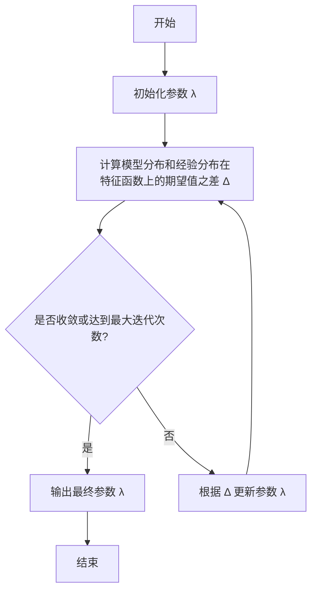

# 最大熵模型原理与代码实战案例讲解

## 1.背景介绍

### 1.1 什么是最大熵模型

最大熵模型(Maximum Entropy Model)是一种基于信息论原理的机器学习模型,广泛应用于自然语言处理、语音识别、信息检索等领域。它的核心思想是在满足已知约束条件的前提下,选择熵值最大的概率模型,即在所有可能的概率模型中,选择符合已知数据分布的最为"平坦"或"随机"的模型。

### 1.2 最大熵模型的优势

相比于其他传统模型,最大熵模型具有以下优势:

- **无偏估计**: 最大熵模型不做任何其他假设,只基于已有的训练数据进行概率估计,避免了人为主观假设带来的偏差。
- **灵活性强**: 最大熵模型可以轻松地引入各种特征,捕捉输入数据的复杂性质,适用于多种任务。
- **理论基础扎实**: 最大熵模型基于信息论和概率理论,有着坚实的理论基础。

### 1.3 最大熵模型的应用场景

最大熵模型在自然语言处理领域有着广泛的应用,包括但不限于:

- 文本分类
- 词性标注
- 命名实体识别
- 机器翻译
- 信息抽取
- 语音识别

## 2.核心概念与联系

### 2.1 熵(Entropy)的概念

在信息论中,熵是用来衡量随机变量不确定性的度量。对于一个离散随机变量 $X$ ,其熵 $H(X)$ 定义为:

$$H(X) = -\sum_{x \in \mathcal{X}} P(x)\log P(x)$$

其中 $\mathcal{X}$ 是 $X$ 的取值空间, $P(x)$ 是 $X=x$ 的概率。熵越大,表明随机变量的不确定性越高。

在最大熵模型中,我们希望在满足已知约束条件的前提下,选择熵值最大的概率模型,即最为"随机"的模型。

### 2.2 最大熵原理(Maximum Entropy Principle)

最大熵原理是指在满足已知约束条件的情况下,选择熵值最大的概率模型。形式化地,给定一个训练数据集 $T$ 和一个特征函数集 $\{f_1, f_2, \dots, f_n\}$,我们希望找到一个概率模型 $P$ ,使得:

$$P = \arg\max\limits_{P \in \mathcal{P}} H(P)$$

其中 $\mathcal{P}$ 是满足约束条件的所有概率模型的集合,即:

$$\mathcal{P} = \left\{P: E_P[f_i] = E_{\tilde{P}}[f_i], i=1,2,\dots,n\right\}$$

这里 $E_P[\cdot]$ 表示关于概率分布 $P$ 的期望, $E_{\tilde{P}}[\cdot]$ 表示经验分布在特征函数上的期望值。

### 2.3 最大熵模型的形式

根据最大熵原理,最大熵模型的形式可以表示为:

$$P(y|x) = \frac{1}{Z(x)}\exp\left(\sum_{i=1}^n\lambda_if_i(x,y)\right)$$

其中:

- $x$ 是输入特征向量
- $y$ 是输出标记或类别
- $f_i(x,y)$ 是定义在 $(x,y)$ 上的特征函数
- $\lambda_i$ 是对应的特征权重
- $Z(x)$ 是归一化因子,确保概率和为1

$$Z(x) = \sum_y\exp\left(\sum_{i=1}^n\lambda_if_i(x,y)\right)$$

通过最大熵模型,我们可以计算出给定输入 $x$ 时,输出 $y$ 的条件概率 $P(y|x)$。

### 2.4 最大熵模型与逻辑回归的关系

当特征函数是二值函数时,最大熵模型等价于逻辑回归模型。具体来说,如果特征函数 $f_i(x,y)$ 的取值只有 0 或 1,那么最大熵模型就可以写成:

$$P(y=1|x) = \frac{1}{1+\exp\left(-\sum_{i=1}^n\lambda_if_i(x,1)\right)}$$

$$P(y=0|x) = \frac{1}{1+\exp\left(\sum_{i=1}^n\lambda_if_i(x,1)\right)}$$

这就是逻辑回归模型的形式。因此,逻辑回归可以看作是最大熵模型在特征函数为二值函数时的一个特例。

## 3.核心算法原理具体操作步骤

### 3.1 目标函数

为了求解最大熵模型的参数 $\lambda = (\lambda_1, \lambda_2, \dots, \lambda_n)$,我们需要最大化模型的对数似然函数:

$$L(\lambda) = \sum_{(x,y) \in T}\log P(y|x)$$

其中 $T$ 是训练数据集。将最大熵模型的形式代入,我们得到:

$$L(\lambda) = \sum_{(x,y) \in T}\left(\sum_{i=1}^n\lambda_if_i(x,y) - \log Z(x)\right)$$

为了最大化对数似然函数,我们需要对 $\lambda$ 求导,并令导数等于 0。由于对数似然函数是凸函数,所以求得的驻点就是全局最大值点。

### 3.2 改进的迭代尺度法(IIS)

求解最大熵模型参数的经典算法是改进的迭代尺度法(Improved Iterative Scaling, IIS)。IIS 算法的基本思路是:

1. 初始化参数 $\lambda$ 为 0 向量
2. 计算模型分布和经验分布在特征函数上的期望值之差
3. 根据期望值之差更新参数 $\lambda$
4. 重复步骤 2 和 3,直到收敛或达到最大迭代次数

具体来说,在第 $k$ 次迭代中,对于第 $i$ 个特征函数 $f_i$,我们计算模型分布和经验分布在该特征函数上的期望值之差:

$$\Delta_i^{(k)} = E_{\tilde{P}}[f_i] - E_{P_\lambda^{(k)}}[f_i]$$

其中 $E_{\tilde{P}}[f_i]$ 是经验分布在 $f_i$ 上的期望值, $E_{P_\lambda^{(k)}}[f_i]$ 是当前模型分布在 $f_i$ 上的期望值。

然后,我们根据期望值之差更新参数 $\lambda_i$:

$$\lambda_i^{(k+1)} = \lambda_i^{(k)} + \alpha_k\Delta_i^{(k)}$$

其中 $\alpha_k$ 是第 $k$ 次迭代的步长,可以通过线搜索等方法确定。

重复上述过程,直到收敛或达到最大迭代次数。

### 3.3 算法流程图



## 4.数学模型和公式详细讲解举例说明

### 4.1 最大熵模型的形式

回顾一下最大熵模型的形式:

$$P(y|x) = \frac{1}{Z(x)}\exp\left(\sum_{i=1}^n\lambda_if_i(x,y)\right)$$

其中:

- $x$ 是输入特征向量
- $y$ 是输出标记或类别
- $f_i(x,y)$ 是定义在 $(x,y)$ 上的特征函数
- $\lambda_i$ 是对应的特征权重
- $Z(x)$ 是归一化因子,确保概率和为1

$$Z(x) = \sum_y\exp\left(\sum_{i=1}^n\lambda_if_i(x,y)\right)$$

这个形式看起来可能有些抽象,让我们通过一个具体的例子来解释它的含义。

### 4.2 文本分类示例

假设我们要构建一个文本分类器,将文本分为"正面"或"负面"两类。我们可以定义以下特征函数:

- $f_1(x,y)$: 如果文本 $x$ 包含单词"好",且标记为正面 $(y=1)$,则取值为 1,否则为 0
- $f_2(x,y)$: 如果文本 $x$ 包含单词"差",且标记为负面 $(y=0)$,则取值为 1,否则为 0
- $f_3(x,y)$: 如果文本 $x$ 长度大于 10,且标记为正面 $(y=1)$,则取值为 1,否则为 0

假设我们已经通过训练得到了特征权重 $\lambda_1=0.8$, $\lambda_2=1.2$, $\lambda_3=0.5$。那么,对于一个包含单词"好"且长度为 15 的文本 $x$,我们可以计算它被分类为正面 $(y=1)$ 的概率:

$$\begin{aligned}
P(y=1|x) &= \frac{1}{Z(x)}\exp\left(\lambda_1f_1(x,1) + \lambda_2f_2(x,1) + \lambda_3f_3(x,1)\right) \\
&= \frac{1}{Z(x)}\exp(0.8 \times 1 + 1.2 \times 0 + 0.5 \times 1) \\
&= \frac{1}{Z(x)}\exp(1.3)
\end{aligned}$$

同理,我们可以计算它被分类为负面 $(y=0)$ 的概率:

$$\begin{aligned}
P(y=0|x) &= \frac{1}{Z(x)}\exp\left(\lambda_1f_1(x,0) + \lambda_2f_2(x,0) + \lambda_3f_3(x,0)\right) \\
&= \frac{1}{Z(x)}\exp(0.8 \times 0 + 1.2 \times 0 + 0.5 \times 0) \\
&= \frac{1}{Z(x)}
\end{aligned}$$

由于 $P(y=1|x) + P(y=0|x) = 1$,我们可以求出归一化因子 $Z(x) = \exp(1.3) + 1$。

最终,我们得到:

$$P(y=1|x) = \frac{\exp(1.3)}{\exp(1.3) + 1} \approx 0.79$$

$$P(y=0|x) = \frac{1}{\exp(1.3) + 1} \approx 0.21$$

因此,根据最大熵模型,这个文本更有可能被分类为"正面"。

通过这个例子,我们可以看到最大熵模型是如何利用特征函数和对应的权重来计算输出标记的条件概率的。特征函数的设计对模型性能有着至关重要的影响。

## 5.项目实践:代码实例和详细解释说明

在这一部分,我们将通过一个实际的代码示例,演示如何使用 Python 和 scikit-learn 库实现最大熵模型,并应用于文本分类任务。

### 5.1 准备数据

首先,我们需要准备一些文本数据,并将其标注为"正面"或"负面"。为了简单起见,我们将使用一个小型的电影评论数据集。

```python
import pandas as pd

# 加载数据
data = pd.read_csv('movie_reviews.csv')
texts = data['text'].tolist()
labels = data['label'].tolist()
```

### 5.2 特征提取

接下来,我们需要从文本中提取特征。在这个例子中,我们将使用 scikit-learn 中的 `CountVectorizer` 来提取词袋(Bag of Words)特征。

```python
from sklearn.feature_extraction.text import CountVectorizer

# 创建向量化器
vectorizer = CountVectorizer(binary=True)

# 提取特征
X = vectorizer.fit_transform(texts)
```

### 5.3 训练最大熵模型

现在,我们可以使用 scikit-learn 中的 `LogisticRegression` 类来训练最大熵模型。由于最大熵模型和逻辑回归在特征函数为二值函数时等价,因此我们可以直接使用逻辑回归的实现。

```python
from sklearn.linear_model import LogisticRegression

# 创建最大熵模型
maxent = LogisticRegression(solver='lbfgs', multi_class='multinomial')

# 训练模型