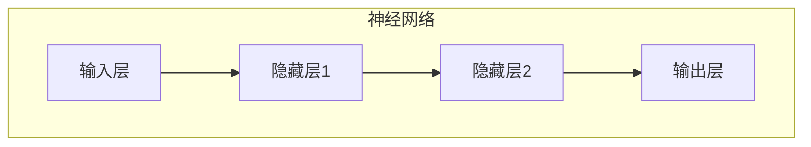
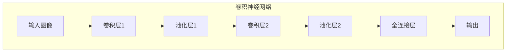
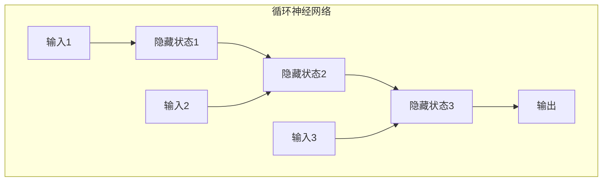
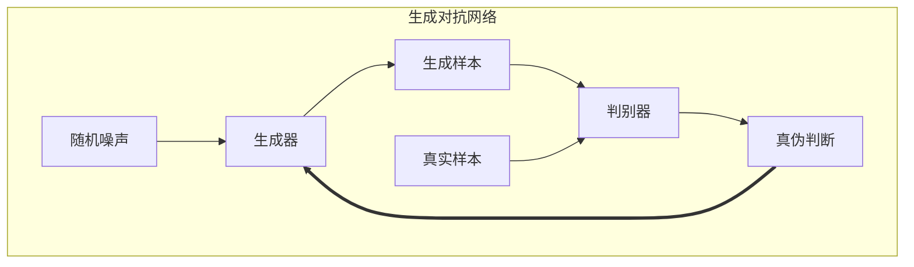

# 深度学习(Deep Learning)原理与代码实战案例讲解

## 1.背景介绍

### 1.1 什么是深度学习?

深度学习(Deep Learning)是机器学习的一个新兴热门领域,是一种基于对数据的表示学习特征的机器学习算法。它模仿人脑对信息的处理方式,通过构建神经网络对海量数据进行训练,自动学习数据特征表示,并用于检测、分类、预测等诸多领域。

### 1.2 深度学习的重要性

随着大数据时代的到来,传统的人工设计特征方法已难以满足实际需求。深度学习能够自动从原始数据中学习特征表示,在计算机视觉、自然语言处理、语音识别等领域取得了突破性进展,成为人工智能领域的核心驱动力量。

### 1.3 深度学习发展历程

深度学习的理论基础可以追溯到20世纪80年代提出的神经网络模型。21世纪初,受限玻尔兹曼机(Restricted Boltzmann Machines, RBM)和深度置信网络(Deep Belief Networks, DBN)的提出推动了深度学习的发展。2012年,基于卷积神经网络(Convolutional Neural Networks, CNN)的ImageNet大规模视觉识别挑战的成功,使得深度学习在计算机视觉领域获得了广泛关注。

## 2.核心概念与联系

### 2.1 神经网络

神经网络是深度学习的核心模型,它由神经元(节点)和连接它们的权重组成。每个神经元接收来自前一层的输入,并通过激活函数产生输出,传递给下一层。通过反向传播算法对网络进行训练,使其能够从数据中学习特征表示。



### 2.2 卷积神经网络

卷积神经网络(CNN)是一种常用的深度神经网络,它在计算机视觉领域表现出色。CNN由卷积层、池化层和全连接层组成,能够自动学习图像的局部特征,并对其进行组合和抽象,最终完成分类或检测任务。



### 2.3 循环神经网络

循环神经网络(Recurrent Neural Networks, RNN)是一种用于处理序列数据(如文本、语音)的深度学习模型。它通过将当前输入与前一时间步的隐藏状态相结合,从而捕获序列数据中的上下文信息。



### 2.4 生成对抗网络

生成对抗网络(Generative Adversarial Networks, GAN)由一个生成器网络和一个判别器网络组成。生成器网络从随机噪声中生成样本,而判别器网络则判断生成的样本是真实的还是伪造的。通过生成器和判别器的对抗训练,GAN可以学习到数据的真实分布,并生成新的、逼真的样本。



## 3.核心算法原理具体操作步骤

### 3.1 前向传播

前向传播是神经网络的基本运算过程,它将输入数据通过网络层层传递,最终得到输出结果。每一层的输出都是上一层输出与权重相乘,再通过激活函数进行非线性变换。

1. 初始化网络权重
2. 输入数据进入输入层
3. 对于每一隐藏层:
    - 计算加权输入: $z = \sum_{i} w_i x_i + b$
    - 通过激活函数计算输出: $a = f(z)$
4. 输出层得到最终输出

### 3.2 反向传播

反向传播是深度学习模型训练的核心算法,它通过计算损失函数对权重的梯度,并使用优化算法(如随机梯度下降)更新网络权重,从而最小化损失函数。

1. 计算输出层损失
2. 反向传播误差:
    - 对于每一层:
        - 计算该层误差: $\delta = \frac{\partial L}{\partial z} \odot f'(z)$
        - 计算权重梯度: $\frac{\partial L}{\partial w} = a \delta^T$
        - 计算偏置梯度: $\frac{\partial L}{\partial b} = \delta$
        - 反向传播误差: $\delta^{l-1} = (w^l)^T \delta^l \odot f'^{l-1}(z^{l-1})$
3. 使用优化算法更新权重

### 3.3 卷积运算

卷积运算是卷积神经网络的核心操作,它通过在输入数据上滑动滤波器核,提取局部特征。

1. 初始化滤波器核权重
2. 在输入数据上滑动滤波器核
3. 在每个位置,计算滤波器核与输入的元素wise乘积之和
4. 通过激活函数获得特征映射

### 3.4 池化操作

池化操作用于降低特征维度,减少计算量和防止过拟合。常见的池化操作有最大池化和平均池化。

1. 将输入分割为重叠的子区域
2. 对于每个子区域:
    - 最大池化: 输出子区域中的最大值
    - 平均池化: 输出子区域中的平均值

## 4.数学模型和公式详细讲解举例说明

### 4.1 神经网络模型

神经网络模型可以表示为一个函数 $f(x; \theta)$,其中 $x$ 是输入, $\theta$ 是网络参数(权重和偏置)。对于一个具有 $L$ 层的神经网络,其输出可以表示为:

$$f(x; \theta) = f^{(L)}(f^{(L-1)}(...f^{(1)}(x; \theta^{(1)}); \theta^{(2)})...; \theta^{(L)})$$

其中 $f^{(l)}$ 表示第 $l$ 层的激活函数, $\theta^{(l)}$ 表示该层的参数。

在训练过程中,我们需要最小化损失函数 $\mathcal{L}(y, f(x; \theta))$,其中 $y$ 是期望输出。通过反向传播算法,我们可以计算损失函数关于参数 $\theta$ 的梯度:

$$\frac{\partial \mathcal{L}}{\partial \theta} = \frac{\partial \mathcal{L}}{\partial f} \frac{\partial f}{\partial \theta}$$

然后使用优化算法(如随机梯度下降)更新参数:

$$\theta \leftarrow \theta - \eta \frac{\partial \mathcal{L}}{\partial \theta}$$

其中 $\eta$ 是学习率。

### 4.2 卷积神经网络模型

卷积神经网络中的卷积操作可以表示为:

$$s(i, j) = (I * K)(i, j) = \sum_{m} \sum_{n} I(i+m, j+n)K(m, n)$$

其中 $I$ 是输入特征图, $K$ 是卷积核, $s(i, j)$ 是输出特征图在位置 $(i, j)$ 处的值。

池化操作通常采用最大池化或平均池化。最大池化可以表示为:

$$\text{max}(B) = \max_{(i,j) \in B} I(i, j)$$

其中 $B$ 是池化区域, $\text{max}(B)$ 是该区域中的最大值。

### 4.3 循环神经网络模型

循环神经网络的核心思想是将当前输入与前一时间步的隐藏状态相结合,形成新的隐藏状态。对于一个简单的RNN,在时间步 $t$ 处的隐藏状态 $h_t$ 可以表示为:

$$h_t = f_W(x_t, h_{t-1})$$

其中 $x_t$ 是当前输入, $h_{t-1}$ 是前一时间步的隐藏状态, $f_W$ 是由权重矩阵 $W$ 参数化的函数。

常见的RNN变体包括长短期记忆网络(LSTM)和门控循环单元(GRU),它们通过引入门控机制来解决传统RNN的梯度消失问题。

### 4.4 生成对抗网络模型

生成对抗网络由生成器 $G$ 和判别器 $D$ 组成。生成器的目标是从噪声分布 $p_z(z)$ 生成逼真的样本 $G(z)$,使其无法与真实样本 $x$ 区分开来。判别器则需要判断样本是真实的还是生成的。

生成器和判别器的目标函数可以表示为:

$$\min_G \max_D V(D, G) = \mathbb{E}_{x \sim p_{\text{data}}(x)}[\log D(x)] + \mathbb{E}_{z \sim p_z(z)}[\log (1 - D(G(z)))]$$

通过生成器和判别器的对抗训练,生成器可以学习到真实数据的分布,从而生成逼真的样本。

## 5.项目实践: 代码实例和详细解释说明

### 5.1 构建简单神经网络

```python
import numpy as np

# sigmoid 激活函数
def sigmoid(x):
    return 1 / (1 + np.exp(-x))

# 输入数据
X = np.array([[0, 0], [0, 1], [1, 0], [1, 1]])
# 期望输出
y = np.array([[0], [1], [1], [0]])

# 初始化权重
W1 = np.random.randn(2, 2)
W2 = np.random.randn(2, 1)

# 前向传播
for epoch in range(10000):
    layer1 = sigmoid(np.dot(X, W1.T))
    layer2 = sigmoid(np.dot(layer1, W2.T))

    # 计算误差
    loss = np.mean((y - layer2) ** 2)

    # 反向传播
    layer2_delta = (y - layer2) * layer2 * (1 - layer2)
    layer1_delta = layer2_delta.dot(W2) * layer1 * (1 - layer1)

    # 更新权重
    W2 += layer1.T.dot(layer2_delta)
    W1 += X.T.dot(layer1_delta)

print(layer2)
```

在这个简单的示例中,我们构建了一个两层神经网络,用于学习逻辑与运算。首先,我们定义了 sigmoid 激活函数。然后,我们初始化输入数据 `X` 和期望输出 `y`,以及权重矩阵 `W1` 和 `W2`。

接下来,我们进入训练循环。在每次迭代中,我们执行前向传播计算输出,并计算损失函数(均方误差)。然后,我们进行反向传播,计算每层的误差项,并使用这些误差项更新权重矩阵。

经过 10000 次迭代后,我们的神经网络就学会了逻辑与运算,并能够正确预测输出。

### 5.2 构建卷积神经网络进行图像分类

```python
import tensorflow as tf
from tensorflow.keras.datasets import mnist
from tensorflow.keras.models import Sequential
from tensorflow.keras.layers import Dense, Flatten, Conv2D, MaxPooling2D
from tensorflow.keras.optimizers import Adam

# 加载 MNIST 数据集
(X_train, y_train), (X_test, y_test) = mnist.load_data()

# 数据预处理
X_train = X_train.reshape(-1, 28, 28, 1) / 255.0
X_test = X_test.reshape(-1, 28, 28, 1) / 255.0

# 构建模型
model = Sequential([
    Conv2D(32, (3, 3), activation='relu', input_shape=(28, 28, 1)),
    MaxPooling2D((2, 2)),
    Conv2D(64, (3, 3), activation='relu'),
    MaxPooling2D((2