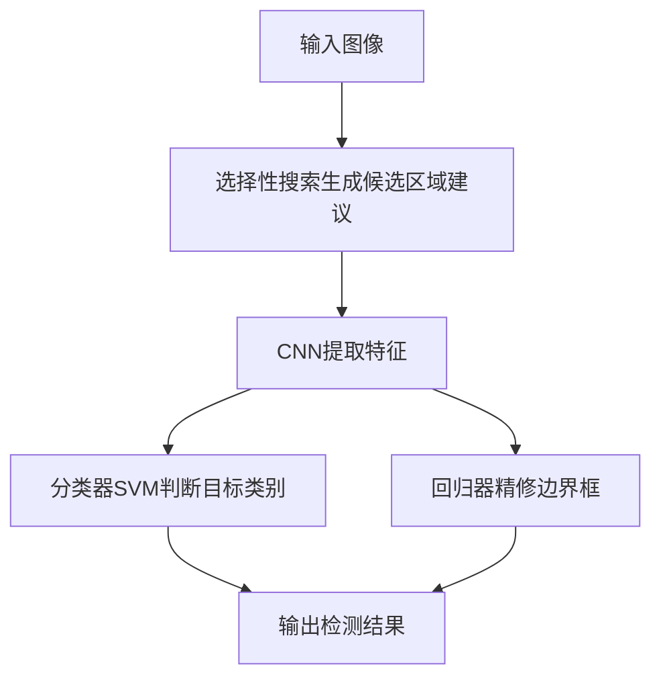
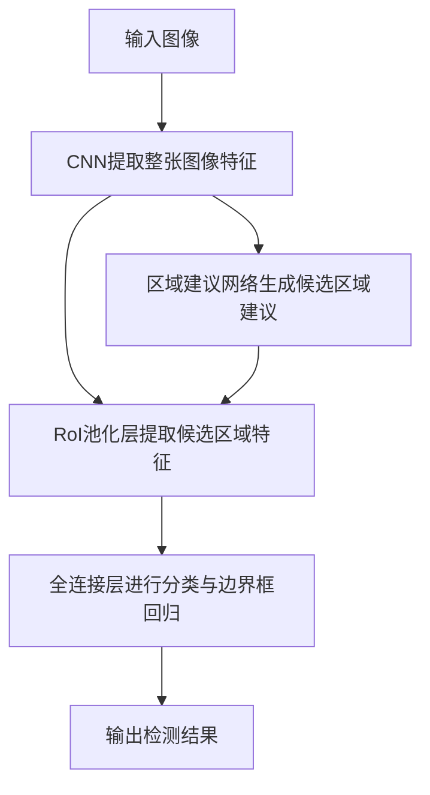
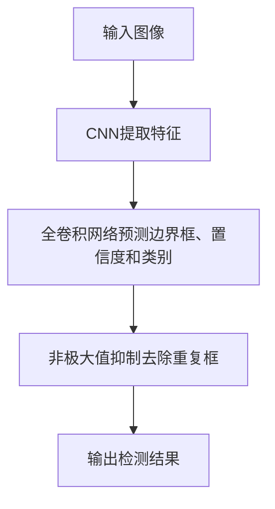
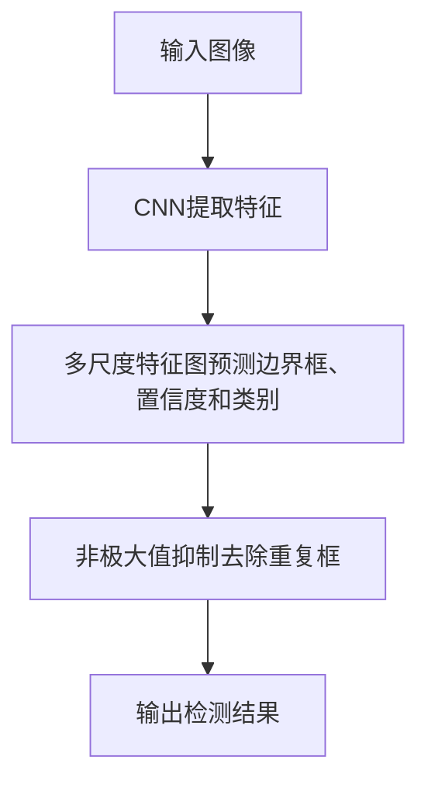

# 目标检测(Object Detection)原理与代码实战案例讲解

## 1.背景介绍

在计算机视觉领域,目标检测(Object Detection)是一项极具挑战的基础任务。它旨在从图像或视频中定位并识别出感兴趣的目标物体。目标检测技术广泛应用于安防监控、自动驾驶、机器人视觉等诸多领域,对于实现智能系统具有重要意义。

随着深度学习的兴起,基于卷积神经网络(CNN)的目标检测算法取得了长足进展,在准确率和速度上都有了大幅提升。经典算法如R-CNN、Fast R-CNN、Faster R-CNN等奠定了基于区域建议的两阶段检测框架。而后续的一阶段检测器(One-Stage Detector)如YOLO、SSD则在保持较高精度的同时,极大提高了推理速度。

## 2.核心概念与联系

目标检测任务的核心概念包括:

1. **边界框(Bounding Box)**: 用于定位目标物体的矩形框。
2. **置信度(Confidence Score)**: 表示该预测边界框内存在目标物体的概率。
3. **分类(Classification)**: 确定边界框内目标的类别。

目标检测算法通常将上述任务合并为一个统一的端到端(End-to-End)网络,对图像进行一次前向传播即可同时获得目标的位置和类别预测。

## 3.核心算法原理具体操作步骤

目标检测算法主要分为两大类:两阶段检测器(Two-Stage Detector)和一阶段检测器(One-Stage Detector)。

### 3.1 两阶段检测器

两阶段检测器的核心思路是:先生成候选区域建议,再对这些区域进行分类和精修。典型的两阶段算法包括R-CNN系列。

1. **R-CNN(Region-based CNN)**



R-CNN算法首先使用底层视觉模块(如选择性搜索)生成候选区域建议,然后将这些区域作为输入,通过CNN提取特征,最后使用SVM分类器和边界框回归器进行分类和精修。

2. **Fast R-CNN**



Fast R-CNN算法将整个检测过程统一到一个网络中,先使用CNN提取整张图像特征,再通过区域建议网络(RPN)生成候选区域,然后使用RoI池化层提取候选区域特征,最后通过全连接层进行分类和边界框回归。

3. **Faster R-CNN**


Faster R-CNN算法的结构与Fast R-CNN类似,但将区域建议网络(RPN)与CNN特征提取部分共享卷积特征,从而进一步提高了计算效率。

### 3.2 一阶段检测器

一阶段检测器直接对密集的先验边界框(Anchor Box)进行分类和回归,避免了生成候选区域的过程,因此速度更快。典型的一阶段检测器包括YOLO和SSD等。

1. **YOLO(You Only Look Once)**



YOLO算法将输入图像划分为SxS个网格,每个网格预测B个边界框以及对应的置信度和类别概率。最后使用非极大值抑制(NMS)去除重复的预测框。

2. **SSD(Single Shot MultiBox Detector)**  



SSD算法在不同尺度的特征图上同时预测边界框、置信度和类别,能够检测不同尺寸的目标。同样使用非极大值抑制(NMS)去除重复预测框。

## 4.数学模型和公式详细讲解举例说明

目标检测算法的核心数学模型是基于卷积神经网络的分类和回归任务。

### 4.1 分类任务

分类任务旨在判断边界框内是否存在目标物体,以及目标的类别。通常使用逻辑回归或softmax交叉熵损失函数进行优化:

$$
L_{cls} = -\sum_{i=1}^{N}\sum_{j=1}^{M}y_{ij}^{true}\log(y_{ij}^{pred})
$$

其中$N$为批大小,$M$为类别数,$y_{ij}^{true}$为真实标签,$y_{ij}^{pred}$为预测概率。

### 4.2 回归任务

回归任务旨在精修预测的边界框,使其尽可能贴合真实的目标边界框。常用的损失函数是平滑L1损失:

$$
L_{reg} = \sum_{i=1}^{N}\sum_{m\in\{cx,cy,w,h\}}x_{ij}^{smooth_L1}(v_i^{true_m}-v_i^{pred_m})
$$

$$
x_{ij}^{smooth_L1}(x) = 
\begin{cases}
0.5x^2, & \text{if }|x| < 1\\
|x| - 0.5, & \text{otherwise}
\end{cases}
$$

其中$v_i^{true_m}$和$v_i^{pred_m}$分别表示真实边界框和预测边界框的中心坐标(cx,cy)、宽度(w)和高度(h)。

### 4.3 总体损失函数

总体损失函数为分类损失和回归损失的加权和:

$$
L = \alpha L_{cls} + \beta L_{reg}
$$

其中$\alpha$和$\beta$为平衡两个损失的超参数。

在训练过程中,通过反向传播和梯度下降算法优化网络参数,最小化总体损失函数。

## 5.项目实践:代码实例和详细解释说明

以下是使用PyTorch实现YOLO v3目标检测算法的代码示例,包括模型定义、数据加载、训练和测试等模块。

### 5.1 模型定义

```python
import torch
import torch.nn as nn

# 定义卷积模块
def conv_bn(in_channels, out_channels, kernel_size, stride, padding, groups=1):
    return nn.Sequential(
        nn.Conv2d(in_channels, out_channels, kernel_size, stride, padding, groups=groups, bias=False),
        nn.BatchNorm2d(out_channels),
        nn.LeakyReLU(0.1, inplace=True)
    )

# 定义残差模块
class ResidualBlock(nn.Module):
    def __init__(self, channels, use_residual=True, num_repeats=1):
        super().__init__()
        self.layers = nn.ModuleList()
        for repeat in range(num_repeats):
            self.layers += [
                nn.Sequential(
                    conv_bn(channels, channels // 2, 1, 1, 0),
                    conv_bn(channels // 2, channels, 3, 1, 1)
                )
            ]
        self.use_residual = use_residual
        self.num_repeats = num_repeats

    def forward(self, x):
        for layer in self.layers:
            x = layer(x) + x if self.use_residual else layer(x)
        return x

# 定义YOLO层
class YOLOLayer(nn.Module):
    def __init__(self, anchors, num_classes, img_dim):
        super().__init__()
        self.anchors = anchors
        self.num_anchors = len(anchors)
        self.num_classes = num_classes
        self.bbox_attrs = 5 + num_classes
        self.img_dim = img_dim
        self.ignore_thres = 0.5

    def forward(self, x):
        # 输出张量的维度为 (batch_size, num_anchors * (5 + num_classes), grid_size, grid_size)
        batch_size, _, grid_size = x.size(0), x.size(2), x.size(3)
        prediction = (
            x.view(batch_size, self.num_anchors, self.bbox_attrs, grid_size, grid_size)
            .permute(0, 1, 3, 4, 2)
            .contiguous()
        )

        # 获取边界框中心坐标、宽高、置信度和类别概率
        x = torch.sigmoid(prediction[..., 0])
        y = torch.sigmoid(prediction[..., 1])
        w = prediction[..., 2]
        h = prediction[..., 3]
        conf = torch.sigmoid(prediction[..., 4])
        cls_pred = torch.sigmoid(prediction[..., 5:])

        # 计算边界框左上角和右下角坐标
        grid_x = torch.arange(grid_size).repeat(grid_size, 1).view([1, 1, grid_size, grid_size]).type(x.type())
        grid_y = torch.arange(grid_size).repeat(grid_size, 1).t().view([1, 1, grid_size, grid_size]).type(x.type())
        anchor_w = torch.Tensor(self.anchors)[:, 0].view(self.num_anchors, 1).type(x.type())
        anchor_h = torch.Tensor(self.anchors)[:, 1].view(self.num_anchors, 1).type(x.type())

        pred_boxes = torch.zeros(batch_size, self.num_anchors, grid_size, grid_size, 4).type(x.type())
        pred_boxes[..., 0] = x.data + grid_x
        pred_boxes[..., 1] = y.data + grid_y
        pred_boxes[..., 2] = torch.exp(w.data) * anchor_w
        pred_boxes[..., 3] = torch.exp(h.data) * anchor_h

        # 调整边界框坐标范围
        pred_boxes[..., 0] /= grid_size
        pred_boxes[..., 1] /= grid_size
        pred_boxes[..., 2] /= self.img_dim
        pred_boxes[..., 3] /= self.img_dim

        output = torch.cat(
            (
                pred_boxes.view(batch_size, -1, 4) * self.img_dim,
                conf.view(batch_size, -1, 1),
                cls_pred.view(batch_size, -1, self.num_classes),
            ),
            -1,
        )

        return output

# 定义YOLO v3模型
class YOLOv3(nn.Module):
    def __init__(self, num_classes, img_dim):
        super().__init__()
        self.num_classes = num_classes
        self.img_dim = img_dim

        # 定义backbone网络
        self.backbone = nn.ModuleList([
            conv_bn(3, 32, 3, 1, 1),
            conv_bn(32, 64, 3, 2, 1),
            ResidualBlock(64, num_repeats=1),
            conv_bn(64, 128, 3, 2, 1),
            ResidualBlock(128, num_repeats=2),
            conv_bn(128, 256, 3, 2, 1),
            ResidualBlock(256, num_repeats=8),
            conv_bn(256, 512, 3, 2, 1),
            ResidualBlock(512, num_repeats=8),
            conv_bn(512, 1024, 3, 2, 1),
            ResidualBlock(1024, num_repeats=4)
        ])

        # 定义YOLO层
        self.yolo_layers = nn.ModuleList([
            YOLOLayer([[116, 90], [156, 198], [373, 326]], num_classes, img_dim),
            YOLOLayer([[30, 61], [62, 45], [59, 119]], num_classes, img_dim),
            YOLOLayer([[10, 13], [16, 30], [33, 23]], num_classes, img_dim)
        ])

    def forward(self, x):
        outputs = []
        route_layers = []

        for layer in self.backbone:
            x = layer(x)
            if isinstance(layer, ResidualBlock) and layer.num_repeats == 8:
                route_layers.append(x)

        for i, layer in enumerate(self.yolo_layers):
            if i > 0:
                x = torch.cat((x, route_layers[-i]), dim=1)
            output = layer(x)
            outputs.append(output)

        return outputs
```

上述代码定义了YOLO v3模型的核心组件,包括卷积模块、残差模块和YOLO层。模型首先使用卷积