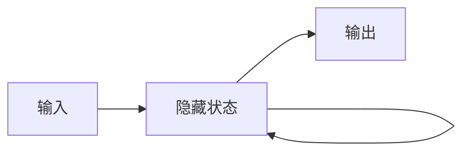

# 神经网络 (Neural Network)

## 1. 背景介绍

神经网络是一种模仿生物神经系统结构和功能的数学模型,广泛应用于模式识别、自然语言处理、图像处理等领域。它由大量的节点(或称神经元)通过连接组成网络,通过调整节点之间的连接权重,不断学习和优化,从而对输入数据进行分类、预测等任务。

### 1.1 神经网络的起源与发展

#### 1.1.1 早期神经网络模型
- 1943年,McCulloch和Pitts提出了MP神经元模型
- 1958年,Rosenblatt提出了感知机(Perceptron)模型
- 1969年,Minsky和Papert指出了感知机的局限性

#### 1.1.2 反向传播算法的提出
- 1974年,Werbos首次提出反向传播算法
- 1986年,Rumelhart等人将反向传播应用于多层感知机

#### 1.1.3 深度学习的兴起
- 2006年,Hinton等人提出了深度信念网络(DBN) 
- 2012年,Krizhevsky等人使用卷积神经网络AlexNet在ImageNet比赛中大幅领先
- 近年来,神经网络和深度学习在各领域取得了突破性进展

### 1.2 神经网络的应用领域

#### 1.2.1 计算机视觉
- 图像分类、目标检测、语义分割等

#### 1.2.2 自然语言处理  
- 机器翻译、情感分析、文本生成等

#### 1.2.3 语音识别
- 语音转文本、说话人识别等

#### 1.2.4 其他领域
- 推荐系统、金融预测、自动驾驶等

## 2. 核心概念与联系

### 2.1 人工神经元

人工神经元是神经网络的基本组成单元,模拟生物神经元的结构和功能。它接收一组输入信号,通过加权求和和激活函数处理后输出结果。

#### 2.1.1 感知机
- 二分类模型,由输入层和输出层组成
- 使用阶跃函数作为激活函数

#### 2.1.2 Sigmoid神经元
- 相比感知机更平滑,梯度不为0
- 常用Sigmoid函数和双曲正切函数作为激活函数

### 2.2 神经网络架构

#### 2.2.1 前馈神经网络(FNN)
- 单层感知机、多层感知机(MLP)
- 信息单向传播,无反馈回路


#### 2.2.2 卷积神经网络(CNN)
- 局部连接、权重共享,适合处理网格化数据
- 由卷积层、池化层、全连接层组成


#### 2.2.3 循环神经网络(RNN) 
- 存在循环连接,适合处理序列数据
- 简单RNN、LSTM、GRU等变体



### 2.3 神经网络训练

#### 2.3.1 损失函数
- 衡量预测值与真实值的差异
- 均方误差、交叉熵损失等

#### 2.3.2 优化算法  
- 梯度下降法及其变体(随机梯度下降、小批量梯度下降)
- 自适应学习率算法(AdaGrad、RMSProp、Adam等)

#### 2.3.3 正则化方法
- L1/L2正则化,限制权重大小
- Dropout,随机丢弃部分神经元
- 早停法,防止过拟合

## 3. 核心算法原理具体操作步骤

### 3.1 前馈神经网络

#### 3.1.1 前向传播
1. 输入层接收输入数据
2. 隐藏层通过加权求和和激活函数计算
3. 输出层给出预测结果

#### 3.1.2 反向传播
1. 计算输出层误差
2. 计算隐藏层误差
3. 更新权重和偏置

### 3.2 卷积神经网络

#### 3.2.1 卷积层
1. 输入图像与卷积核进行卷积运算
2. 加上偏置,通过激活函数处理
3. 得到输出特征图

#### 3.2.2 池化层
1. 对输入特征图进行下采样
2. 最大池化或平均池化
3. 降低特征图尺寸,提取主要特征

### 3.3 循环神经网络

#### 3.3.1 简单RNN前向传播
1. 输入向量与隐藏状态向量拼接
2. 与权重矩阵相乘,加上偏置
3. 通过激活函数处理,得到新的隐藏状态
4. 隐藏状态与输出权重相乘,得到输出

#### 3.3.2 BPTT算法
1. 计算每个时间步的输出误差
2. 计算每个时间步的隐藏状态误差
3. 更新权重矩阵

## 4. 数学模型和公式详细讲解举例说明

### 4.1 感知机模型

$$
\begin{aligned}
&\text{输入:} \quad \boldsymbol{x} = (x_1, \ldots, x_n) \\
&\text{权重:} \quad \boldsymbol{w} = (w_1, \ldots, w_n) \\
&\text{偏置:} \quad b \\
&\text{加权求和:} \quad z = \boldsymbol{w} \cdot \boldsymbol{x} + b = \sum_{i=1}^n w_i x_i + b \\  
&\text{激活函数:} \quad f(z) = \begin{cases}
   1 & \text{if } z \geq 0 \\
   0 & \text{otherwise}
\end{cases} \\
&\text{感知机模型:} \quad y = f(\boldsymbol{w} \cdot \boldsymbol{x} + b)
\end{aligned}
$$

例如,对于二维输入 $\boldsymbol{x} = (x_1, x_2)$,权重 $\boldsymbol{w} = (w_1, w_2)$,偏置 $b$。感知机模型为:

$$
y = f(w_1 x_1 + w_2 x_2 + b) = \begin{cases}
   1 & \text{if } w_1 x_1 + w_2 x_2 + b \geq 0 \\
   0 & \text{otherwise}
\end{cases}
$$

### 4.2 Sigmoid函数与交叉熵损失

Sigmoid函数定义为:

$$
\sigma(x) = \frac{1}{1 + e^{-x}}
$$

交叉熵损失函数定义为:

$$
J(\boldsymbol{w}, b) = -\frac{1}{m} \sum_{i=1}^m [y^{(i)} \log(\hat{y}^{(i)}) + (1 - y^{(i)}) \log(1 - \hat{y}^{(i)})]
$$

其中,$m$为样本数,$y^{(i)}$为第$i$个样本的真实标签,$\hat{y}^{(i)}$为预测值。

例如,对于二分类问题,真实标签为0或1。假设有3个样本,预测值分别为0.8, 0.3, 0.6,真实标签为1, 0, 1。则交叉熵损失为:

$$
J = -\frac{1}{3} [1 \log(0.8) + (1-0) \log(1-0.3) + 1 \log(0.6)] \approx 0.363
$$

### 4.3 卷积运算

对于输入图像 $\boldsymbol{I}$ 和卷积核 $\boldsymbol{K}$,卷积运算定义为:

$$
(\boldsymbol{I} * \boldsymbol{K})(i, j) = \sum_m \sum_n \boldsymbol{I}(i+m, j+n) \boldsymbol{K}(m, n)
$$

例如,对于3x3的输入图像和2x2的卷积核:

$$
\boldsymbol{I} = \begin{bmatrix}
1 & 2 & 3\\
4 & 5 & 6\\
7 & 8 & 9
\end{bmatrix}, \quad
\boldsymbol{K} = \begin{bmatrix}
1 & 0\\
0 & 1
\end{bmatrix}
$$

卷积结果为:

$$
\boldsymbol{I} * \boldsymbol{K} = \begin{bmatrix}
1\times1 + 2\times0 + 4\times0 + 5\times1 & 2\times1 + 3\times0 + 5\times0 + 6\times1\\
4\times1 + 5\times0 + 7\times0 + 8\times1 & 5\times1 + 6\times0 + 8\times0 + 9\times1
\end{bmatrix} = \begin{bmatrix}
6 & 8\\
12 & 14
\end{bmatrix}
$$

## 5. 项目实践：代码实例和详细解释说明

以下使用Python和TensorFlow实现一个简单的多层感知机,对MNIST手写数字数据集进行分类。

```python
import tensorflow as tf
from tensorflow import keras

# 加载MNIST数据集
(x_train, y_train), (x_test, y_test) = keras.datasets.mnist.load_data()

# 数据预处理
x_train = x_train.reshape((60000, 28 * 28)) / 255.0
x_test = x_test.reshape((10000, 28 * 28)) / 255.0
y_train = keras.utils.to_categorical(y_train)
y_test = keras.utils.to_categorical(y_test)

# 构建模型
model = keras.Sequential([
    keras.layers.Dense(128, activation='relu', input_shape=(28 * 28,)),
    keras.layers.Dense(10, activation='softmax')
])

# 编译模型
model.compile(optimizer='adam',
              loss='categorical_crossentropy',
              metrics=['accuracy'])

# 训练模型
model.fit(x_train, y_train, epochs=5, batch_size=32, validation_split=0.1)

# 评估模型
test_loss, test_acc = model.evaluate(x_test, y_test)
print(f'Test accuracy: {test_acc:.3f}')
```

代码解释:

1. 加载MNIST数据集,包含60000个训练样本和10000个测试样本,每个样本为28x28的灰度图像。

2. 对数据进行预处理,将图像像素值归一化到[0, 1]范围,并将标签转换为one-hot编码。

3. 构建多层感知机模型,包含一个128个单元的隐藏层和一个10个单元的输出层。隐藏层使用ReLU激活函数,输出层使用Softmax激活函数进行多分类。

4. 编译模型,指定优化器为Adam,损失函数为交叉熵,评估指标为准确率。  

5. 训练模型,设置迭代轮数为5,批量大小为32,验证集比例为10%。

6. 在测试集上评估模型性能,输出测试准确率。

运行结果:

```
Epoch 1/5
1688/1688 [==============================] - 3s 2ms/step - loss: 0.2591 - accuracy: 0.9249 - val_loss: 0.1401 - val_accuracy: 0.9585
Epoch 2/5
1688/1688 [==============================] - 3s 2ms/step - loss: 0.1153 - accuracy: 0.9650 - val_loss: 0.1008 - val_accuracy: 0.9688
Epoch 3/5
1688/1688 [==============================] - 3s 2ms/step - loss: 0.0798 - accuracy: 0.9753 - val_loss: 0.0900 - val_accuracy: 0.9725
Epoch 4/5
1688/1688 [==============================] - 3s 2ms/step - loss: 0.0601 - accuracy: 0.9811 - val_loss: 0.0789 - val_accuracy: 0.9763
Epoch 5/5
1688/1688 [==============================] - 3s 2ms/step - loss: 0.0470 - accuracy: 0.9850 - val_loss: 0.0740 - val_accuracy: 0.9778
313/313 [==============================] - 0s 1ms/step - loss: 0.0720 - accuracy: 0.9771
Test accuracy: 0.977
```

可以看到,经过5轮迭代训练后,在测试集上达到了97.7%的分类准确率,说明该多层感知机模型在MNIST数据集上表现良好。

## 6. 实际应用场景

### 6.1 图像分类

使用卷积神经网络对图像进行分类,如识别手写数字、物体检测、人脸识别等。著名的CNN模型有LeNet、AlexNet、VG