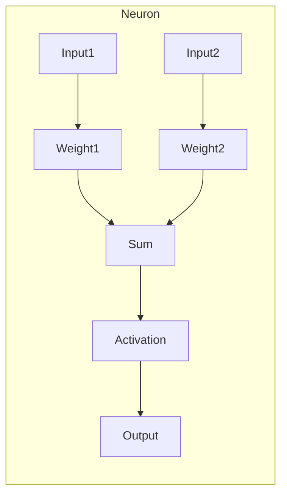
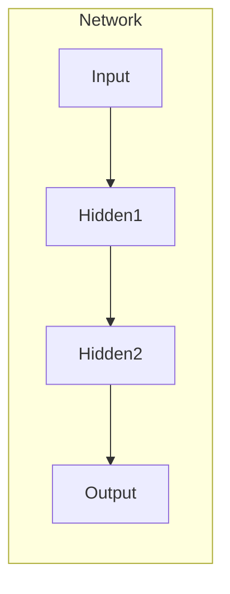

# 神经网络原理与代码实例讲解

## 1.背景介绍

### 1.1 人工智能的兴起

人工智能(Artificial Intelligence, AI)是当代科技发展的前沿领域,近年来受到了前所未有的关注和重视。人工智能技术的快速发展正在深刻影响和改变着人类社会的方方面面,从工业制造、医疗诊断到交通运输、国防安全等诸多领域都已广泛应用人工智能技术。

### 1.2 神经网络在人工智能中的地位

在人工智能的多种技术路线中,神经网络(Neural Network)因其在模式识别、数据挖掘、自然语言处理等领域展现出的卓越性能,成为人工智能研究的核心和热点。神经网络是一种模拟生物神经网络进行信息处理的数学模型,具有自组织自适应的能力,可以从大量数据中自主学习,并对新数据进行预测和决策。

### 1.3 神经网络的应用前景

随着大数据时代的到来和计算能力的不断提高,神经网络在语音识别、图像识别、自然语言处理等领域的应用越来越广泛。未来,神经网络必将成为推动人工智能技术发展的核心动力,对经济社会的发展产生深远影响。

## 2.核心概念与联系

### 2.1 神经元(Neuron)

神经元是神经网络的基本单元,它接收来自其他神经元或外部输入的信号,经过加权求和和激活函数的处理后,将输出信号传递给下一层神经元。每个神经元都有自己的权重和偏置值,这些参数在训练过程中不断调整,以最小化损失函数。



### 2.2 网络层次结构

神经网络通常由输入层、隐藏层和输出层组成。输入层接收外部输入数据,隐藏层对数据进行非线性转换和特征提取,输出层则给出最终的输出结果。多层神经网络可以通过堆叠多个隐藏层来增强网络的表达能力。



### 2.3 前向传播(Forward Propagation)

前向传播是神经网络的基本工作原理。在这个过程中,输入数据经过网络的各层传递,每个神经元根据其权重和偏置对输入进行加权求和,然后通过激活函数进行非线性转换,产生该神经元的输出。最终,输出层给出对应的输出结果。

### 2.4 反向传播(Backpropagation)

反向传播是神经网络训练的核心算法,用于调整网络中每个神经元的权重和偏置值,使得网络的输出结果逐渐接近期望输出。该算法利用链式法则计算损失函数相对于每个权重的梯度,然后通过优化算法(如梯度下降)来更新权重,从而最小化损失函数。

## 3.核心算法原理具体操作步骤  

### 3.1 前向传播算法步骤

1) 初始化网络权重和偏置
2) 对于每个输入样本:
    - 计算输入层到隐藏层的加权和
    - 对加权和应用激活函数(如ReLU),得到隐藏层输出
    - 重复上述过程,计算隐藏层到输出层的加权和和激活值
    - 计算输出层与期望输出之间的损失(如均方误差)
3) 返回累积损失

### 3.2 反向传播算法步骤 

1) 初始化网络权重和偏置
2) 对于每个输入样本:
    - 执行前向传播,计算每层输出和累积损失
    - 计算输出层误差(输出层输出与期望输出之差)
    - 从输出层开始,利用链式法则反向传播误差
    - 计算每个权重相对于损失函数的梯度
    - 使用优化算法(如梯度下降)更新权重和偏置
3) 重复上述过程,直至收敛或满足停止条件

## 4.数学模型和公式详细讲解举例说明

### 4.1 神经元数学模型

对于单个神经元,其数学模型可表示为:

$$
y = \phi\left(\sum_{i=1}^{n}w_ix_i + b\right)
$$

其中:
- $x_i$是第i个输入
- $w_i$是与第i个输入相关的权重
- $b$是神经元的偏置值
- $\phi$是激活函数,如Sigmoid、ReLU等

### 4.2 激活函数

激活函数引入了神经网络的非线性,使其能够拟合复杂的函数。常用的激活函数包括:

1) Sigmoid函数:
   $$\sigma(x) = \frac{1}{1+e^{-x}}$$

2) Tanh函数: 
   $$\tanh(x) = \frac{e^x - e^{-x}}{e^x + e^{-x}}$$

3) ReLU函数:
   $$\text{ReLU}(x) = \max(0, x)$$

### 4.3 损失函数

损失函数用于衡量神经网络的输出与期望输出之间的差异,是训练过程中需要最小化的目标函数。常用的损失函数有:

1) 均方误差(Mean Squared Error, MSE):
   $$\text{MSE} = \frac{1}{n}\sum_{i=1}^{n}(y_i - \hat{y}_i)^2$$

2) 交叉熵损失(Cross-Entropy Loss):
   $$\text{CE} = -\frac{1}{n}\sum_{i=1}^{n}\left[y_i\log(\hat{y}_i) + (1-y_i)\log(1-\hat{y}_i)\right]$$

其中$y_i$是期望输出,$\hat{y}_i$是实际输出。

### 4.4 梯度下降

梯度下降是神经网络训练中常用的优化算法,用于更新权重和偏置。其基本思想是沿着损失函数梯度的反方向更新参数,从而最小化损失函数。

对于单个权重$w$,其更新公式为:

$$w \leftarrow w - \eta\frac{\partial L}{\partial w}$$

其中$L$是损失函数,$\eta$是学习率,决定了每次更新的步长大小。

## 5.项目实践:代码实例和详细解释说明

为了更好地理解神经网络的原理和实现,我们将使用Python和流行的深度学习框架PyTorch构建一个简单的前馈神经网络,并在MNIST手写数字识别任务上进行训练和测试。

### 5.1 导入必要的库

```python
import torch
import torchvision
import torch.nn as nn
import torch.optim as optim
import torch.nn.functional as F
```

### 5.2 定义神经网络模型

我们定义一个包含两个隐藏层的前馈神经网络,用于对MNIST数据集中的手写数字图像进行分类。

```python
class Net(nn.Module):
    def __init__(self):
        super(Net, self).__init__()
        self.fc1 = nn.Linear(28 * 28, 512)  # 输入层到第一隐藏层
        self.fc2 = nn.Linear(512, 256)  # 第一隐藏层到第二隐藏层
        self.fc3 = nn.Linear(256, 10)  # 第二隐藏层到输出层

    def forward(self, x):
        x = x.view(-1, 28 * 28)  # 将输入图像展平为一维向量
        x = F.relu(self.fc1(x))  # 第一隐藏层使用ReLU激活函数
        x = F.relu(self.fc2(x))  # 第二隐藏层使用ReLU激活函数
        x = self.fc3(x)  # 输出层不使用激活函数
        return x
```

### 5.3 加载数据集和预处理

```python
# 加载MNIST数据集
train_set = torchvision.datasets.MNIST(root='./data', train=True, download=True)
test_set = torchvision.datasets.MNIST(root='./data', train=False, download=True)

# 定义数据加载器
train_loader = torch.utils.data.DataLoader(train_set, batch_size=64, shuffle=True)
test_loader = torch.utils.data.DataLoader(test_set, batch_size=64, shuffle=False)
```

### 5.4 训练模型

```python
# 初始化模型、损失函数和优化器
model = Net()
criterion = nn.CrossEntropyLoss()
optimizer = optim.SGD(model.parameters(), lr=0.01)

# 训练循环
for epoch in range(10):
    running_loss = 0.0
    for inputs, labels in train_loader:
        # 前向传播
        outputs = model(inputs)
        loss = criterion(outputs, labels)

        # 反向传播和优化
        optimizer.zero_grad()
        loss.backward()
        optimizer.step()

        running_loss += loss.item()

    print(f'Epoch {epoch + 1}, Loss: {running_loss / len(train_loader):.4f}')
```

### 5.5 测试模型

```python
# 测试循环
correct = 0
total = 0
with torch.no_grad():
    for inputs, labels in test_loader:
        outputs = model(inputs)
        _, predicted = torch.max(outputs.data, 1)
        total += labels.size(0)
        correct += (predicted == labels).sum().item()

print(f'测试准确率: {100 * correct / total:.2f}%')
```

通过上述代码实例,我们可以更好地理解神经网络的实现细节,包括模型定义、前向传播、反向传播、优化器更新等关键步骤。同时,也展示了如何使用PyTorch这样的深度学习框架来简化神经网络的构建和训练过程。

## 6.实际应用场景

神经网络在现实世界中有着广泛的应用,下面列举了一些典型的应用场景:

### 6.1 计算机视觉

- 图像分类: 通过卷积神经网络(CNN)对图像进行分类,广泛应用于面部识别、手势识别、医学图像诊断等领域。
- 目标检测: 在图像或视频中定位并识别特定目标,如行人检测、车辆检测等。
- 语义分割: 对图像中的每个像素进行分类,常用于无人驾驶、增强现实等场景。

### 6.2 自然语言处理

- 机器翻译: 使用序列到序列(Seq2Seq)模型实现不同语言之间的自动翻译。
- 文本分类: 根据文本内容对其进行分类,如新闻分类、垃圾邮件过滤等。
- 情感分析: 分析文本中蕴含的情感倾向,广泛应用于社交媒体监测、客户服务等领域。

### 6.3 语音识别

通过递归神经网络(RNN)或长短期记忆网络(LSTM)对语音信号进行建模和识别,实现语音转文本、语音助手等应用。

### 6.4 推荐系统

利用神经网络对用户行为数据进行建模,为用户推荐感兴趣的商品、新闻、视频等内容,广泛应用于电商、社交媒体等领域。

### 6.5 金融预测

使用神经网络对历史金融数据进行分析和建模,预测股票走势、外汇汇率等,为投资决策提供参考。

## 7.工具和资源推荐

### 7.1 深度学习框架

- PyTorch: 由Facebook人工智能研究院开发的深度学习框架,具有动态计算图、良好的可扩展性和Python友好的接口。
- TensorFlow: 由Google开发的开源深度学习框架,支持多种编程语言,具有强大的分布式计算能力。
- Keras: 基于TensorFlow或Theano的高级神经网络API,简化了深度学习模型的构建过程。

### 7.2 数据集

- MNIST: 经典的手写数字识别数据集,常作为深度学习入门任务。
- ImageNet: 大规模的图像数据集,包含了超过1400万张图像和20000个类别,是计算机视觉领域的标准数据集。
- Penn Treebank: 用于自然语言处理任务的语料库,包含了标注的英语句子和词性标记。

### 7.3 在线课程和教程

- Deep Learning Specialization (Coursera): 由Andrew Ng教授开设的深度学习专项课程,全面系统地介绍了神经网络的理论基础和实践应用。
- Neural Networks and Deep Learning (Neuralnet): 由Michael Nielsen撰写的在线书籍,通过生动形象的解释和示