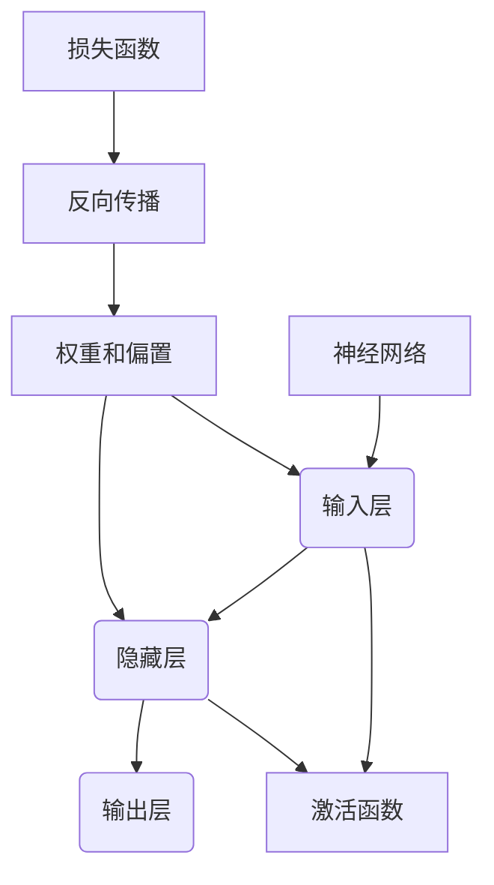

# 神经网络可视化原理与代码实战案例讲解

## 1.背景介绍

### 1.1 神经网络的重要性

神经网络是当前人工智能领域最热门和最具影响力的技术之一。它模仿生物神经系统的工作原理,通过对大量数据的训练,自动学习数据的内在规律和特征,从而对新的输入数据进行预测和决策。神经网络已广泛应用于图像识别、自然语言处理、推荐系统等诸多领域,展现出了强大的数据建模和模式识别能力。

### 1.2 神经网络可视化的必要性

尽管神经网络取得了巨大的成功,但它的"黑箱"本质一直受到诟病。神经网络内部的工作机制对人类来说是不可解释和不透明的,这不仅影响了人们对神经网络的信任度,也阻碍了对神经网络内部行为的理解和优化。为了解决这一问题,神经网络可视化技术应运而生。

神经网络可视化旨在通过直观的图形化方式展现神经网络内部的计算过程和数据流动,帮助人类理解神经网络的工作原理,分析网络行为,诊断潜在问题,并优化网络结构和参数。可视化技术为神经网络开发者提供了一扇通往"黑箱"内部的窗口,使得这种强大而神秘的技术变得更加透明和可解释。

## 2.核心概念与联系

### 2.1 神经网络基本概念



神经网络是由多层神经元组成的网络结构,包括输入层、隐藏层和输出层。每个神经元接收来自前一层的输入,通过激活函数进行非线性转换,并将结果传递给下一层。整个网络由大量的权重和偏置参数控制,这些参数通过反向传播算法和损失函数进行调整和优化。

### 2.2 神经网络可视化的核心概念

神经网络可视化的核心概念包括:

1. **网络结构可视化**: 直观展示神经网络的层级结构、神经元数量和连接方式。
2. **激活可视化**: 展现每个神经元在不同输入下的激活状态,有助于理解网络的内部计算过程。
3. **特征可视化**: 可视化神经网络在不同层次学习到的特征表示,揭示网络对输入数据的理解。
4. **权重可视化**: 直观展示权重矩阵或核的结构和分布,分析网络参数的作用。
5. **梯度可视化**: 可视化梯度在反向传播过程中的流动,帮助诊断和优化网络训练。

这些核心概念相互关联,共同构建了对神经网络内部行为的全面理解。

## 3.核心算法原理具体操作步骤

### 3.1 网络结构可视化

网络结构可视化的主要步骤如下:

1. 获取神经网络的层级信息,包括层数、每层的神经元数量等。
2. 使用图形库(如Matplotlib、Plotly等)绘制网络结构图。
3. 在图中用节点表示每个神经元,用边表示神经元之间的连接。
4. 根据需要,在图中标注层级信息、连接权重等细节。

示例代码(使用Matplotlib):

```python
import matplotlib.pyplot as plt
import networkx as nx

# 定义网络结构
layer_sizes = [784, 128, 64, 10]  # 输入层、两个隐藏层、输出层
G = nx.Graph()

# 添加神经元节点
for l, layer in enumerate(layer_sizes):
    prefix = f"layer{l}"
    layer_nodes = [f"{prefix}_{i}" for i in range(layer)]
    G.add_nodes_from(layer_nodes)

# 添加连接边
for l in range(len(layer_sizes) - 1):
    src = f"layer{l}"
    dest = f"layer{l+1}"
    for node_src in [f"{src}_{i}" for i in range(layer_sizes[l])]:
        for node_dest in [f"{dest}_{i}" for i in range(layer_sizes[l+1])]:
            G.add_edge(node_src, node_dest)

# 绘制网络结构图
pos = nx.spring_layout(G)
nx.draw(G, pos, with_labels=True, font_weight='bold')
plt.show()
```

### 3.2 激活可视化

激活可视化的主要步骤如下:

1. 在神经网络的前向传播过程中,记录每个神经元的激活值。
2. 将激活值映射到颜色或灰度值上,形成一个热力图或灰度图。
3. 可视化不同层次、不同输入下的激活图,分析网络的内部计算过程。

示例代码(使用Matplotlib):

```python
import matplotlib.pyplot as plt

# 获取网络的激活值
activations = model(input_data)

# 可视化第一隐藏层的激活值
fig, axs = plt.subplots(1, len(activations), figsize=(20, 4))
for i, ax in enumerate(axs):
    ax.imshow(activations[i][0].detach().numpy(), cmap='viridis')
    ax.set_title(f"Layer {i+1}")
    ax.axis('off')
plt.show()
```

### 3.3 特征可视化

特征可视化的主要步骤如下:

1. 获取神经网络在不同层次学习到的特征表示。
2. 将高维特征投影到二维或三维空间中,使用散点图或其他可视化技术展示特征分布。
3. 对于图像数据,可以通过反卷积等技术将特征可视化为图像,直观展现网络对图像的理解。

示例代码(使用t-SNE投影和Matplotlib):

```python
import matplotlib.pyplot as plt
from sklearn.manifold import TSNE

# 获取网络的特征表示
features = model.get_features(input_data)

# 使用t-SNE将高维特征投影到二维空间
tsne = TSNE(n_components=2, random_state=0)
features_2d = tsne.fit_transform(features.detach().numpy())

# 可视化特征分布
plt.scatter(features_2d[:, 0], features_2d[:, 1], c=labels, cmap='viridis')
plt.colorbar()
plt.show()
```

### 3.4 权重可视化

权重可视化的主要步骤如下:

1. 获取神经网络的权重矩阵或卷积核权重。
2. 将权重值映射到颜色或灰度值上,形成热力图或灰度图。
3. 对于卷积神经网络,可以直接将卷积核可视化为图像。

示例代码(使用Matplotlib):

```python
import matplotlib.pyplot as plt

# 获取第一个卷积层的权重
weights = model.conv1.weight.detach().numpy()

# 可视化卷积核权重
fig, axs = plt.subplots(4, 8, figsize=(12, 6))
for i, ax in enumerate(axs.flat):
    ax.imshow(weights[i, 0], cmap='viridis')
    ax.axis('off')
plt.show()
```

### 3.5 梯度可视化

梯度可视化的主要步骤如下:

1. 在神经网络的反向传播过程中,记录每个神经元的梯度值。
2. 将梯度值映射到颜色或灰度值上,形成一个热力图或灰度图。
3. 可视化不同层次、不同输入下的梯度图,分析梯度在网络中的流动情况。

示例代码(使用Matplotlib):

```python
import matplotlib.pyplot as plt

# 获取网络的梯度值
gradients = model.get_gradients(input_data, labels)

# 可视化第一个卷积层的梯度
fig, axs = plt.subplots(4, 8, figsize=(12, 6))
for i, ax in enumerate(axs.flat):
    ax.imshow(gradients[0][i, 0], cmap='viridis')
    ax.axis('off')
plt.show()
```

## 4.数学模型和公式详细讲解举例说明

### 4.1 神经网络的数学模型

神经网络的数学模型可以表示为一系列的函数组合,描述了输入数据在网络中的前向传播和反向传播过程。

对于一个具有$L$层的全连接神经网络,第$l$层的输出$a^{(l)}$可以表示为:

$$a^{(l)} = g^{(l)}(z^{(l)})$$

其中$z^{(l)}$是第$l$层的加权输入,定义为:

$$z^{(l)} = W^{(l)}a^{(l-1)} + b^{(l)}$$

$W^{(l)}$是第$l$层的权重矩阵,$b^{(l)}$是第$l$层的偏置向量,$g^{(l)}$是第$l$层的激活函数,通常使用非线性函数如ReLU或Sigmoid。

在训练过程中,神经网络通过最小化损失函数$J$来学习权重和偏置参数。对于给定的输入$x$和期望输出$y$,损失函数可以定义为:

$$J(W, b; x, y) = \frac{1}{m}\sum_{i=1}^{m}L(a^{(L)}(x^{(i)}), y^{(i)})$$

其中$L$是损失函数(如均方误差或交叉熵),$m$是训练样本数量。

通过反向传播算法,可以计算出损失函数相对于权重和偏置的梯度:

$$\frac{\partial J}{\partial W^{(l)}} = \frac{\partial J}{\partial z^{(l)}}\frac{\partial z^{(l)}}{\partial W^{(l)}}$$
$$\frac{\partial J}{\partial b^{(l)}} = \frac{\partial J}{\partial z^{(l)}}\frac{\partial z^{(l)}}{\partial b^{(l)}}$$

然后使用优化算法(如梯度下降)更新权重和偏置:

$$W^{(l)} := W^{(l)} - \alpha\frac{\partial J}{\partial W^{(l)}}$$
$$b^{(l)} := b^{(l)} - \alpha\frac{\partial J}{\partial b^{(l)}}$$

其中$\alpha$是学习率。通过反复迭代,神经网络可以逐步减小损失函数,从而学习到最优的参数。

### 4.2 卷积神经网络的数学模型

对于卷积神经网络(CNN),输入数据通常是二维或三维的图像或序列数据。卷积层的作用是提取局部特征,通过卷积核在输入数据上滑动,捕捉局部模式。

设输入数据为$X$,卷积核为$K$,卷积层的输出$Y$可以表示为:

$$Y(i, j) = (X * K)(i, j) = \sum_{m}\sum_{n}X(i+m, j+n)K(m, n)$$

其中$*$表示卷积操作,$(i, j)$是输出特征图的坐标,$(m, n)$是卷积核的坐标。

池化层通常在卷积层之后使用,目的是降低特征维度和计算量。最大池化和平均池化是两种常见的池化方法,它们分别取池化窗口内的最大值或平均值作为输出。

$$Y(i, j) = \max_{(m, n) \in R}X(i+m, j+n)$$
$$Y(i, j) = \frac{1}{|R|}\sum_{(m, n) \in R}X(i+m, j+n)$$

其中$R$是池化窗口的范围。

通过多个卷积层和池化层的组合,CNN可以逐层提取更高级的特征表示,最终输出到全连接层进行分类或回归任务。

## 5.项目实践:代码实例和详细解释说明

在本节中,我们将通过一个实际的项目案例,演示如何使用Python和相关库(如PyTorch、Matplotlib等)实现神经网络可视化。我们将构建一个简单的卷积神经网络模型,并对其进行可视化分析。

### 5.1 导入所需库

```python
import torch
import torch.nn as nn
import torch.optim as optim
from torchvision import datasets, transforms
import matplotlib.pyplot as plt
```

### 5.2 定义神经网络模型

```python
class ConvNet(nn.Module):
    def __init__(self):
        super(ConvNet, self).__init__()
        self.conv1 = nn.Conv2d(1, 10, kernel_size=5)
        self.conv2 = nn.Conv2d(10, 20, kernel_size=5)
        self.pool = nn.MaxPool2d(2, 2)
        self.fc1 = nn.Linear(320, 50)
        self.fc2 = nn.Linear(50, 10)

    def forward(self, x