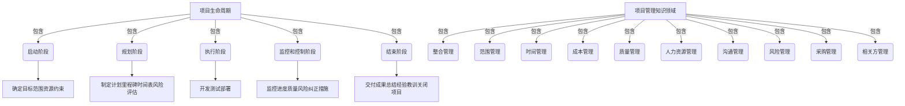

# 组织和指导项目的开发、测试、维护、升级、更新，解决开发中的技术问题

## 1. 背景介绍

在当今快节奏的软件开发环境中，有效地组织和指导项目的各个阶段对于确保高质量的产品交付至关重要。无论是初创公司还是大型企业,都面临着管理复杂项目的挑战,需要采用系统化的方法来协调开发、测试、维护、升级和更新等活动。同时,在项目执行过程中,技术问题随时可能出现,需要专业人员及时解决。本文将探讨如何有效地组织和指导这些关键活动,并分享解决技术问题的经验和最佳实践。

## 2. 核心概念与联系

### 2.1 项目生命周期

项目生命周期是指项目从启动到结束的一系列有序阶段。典型的项目生命周期包括以下阶段:

1. **启动阶段**: 确定项目目标、范围、资源和约束条件。
2. **规划阶段**: 制定详细的项目计划,包括里程碑、时间表、风险评估等。
3. **执行阶段**: 实施项目计划,进行开发、测试、部署等活动。
4. **监控和控制阶段**: 持续监控项目进度、质量和风险,并采取必要的纠正措施。
5. **结束阶段**: 正式交付项目成果,总结经验教训,并正式关闭项目。

### 2.2 项目管理知识领域

项目管理知识领域是指项目管理所涉及的各个方面,包括:

1. **整合管理**: 协调项目各个方面的活动,确保一致性。
2. **范围管理**: 确定和控制项目的工作范围。
3. **时间管理**: 制定和控制项目时间表。
4. **成本管理**: 估算和控制项目成本。
5. **质量管理**: 确保项目成果满足既定的质量标准。
6. **人力资源管理**: 组建高效的项目团队,并有效利用人力资源。
7. **沟通管理**: 规划和执行项目沟通活动。
8. **风险管理**: 识别、分析和应对项目风险。
9. **采购管理**: 获取所需的外部资源和服务。
10. **相关方管理**: 识别和管理项目相关方的期望和影响。

这些知识领域相互关联,需要全面考虑和平衡,以确保项目的成功。



## 3. 核心算法原理具体操作步骤

### 3.1 项目启动

1. **明确项目目标和范围**:与利益相关方讨论,确定项目的目的、预期成果和边界。
2. **评估可行性**:分析技术、财务、资源等方面的可行性,确保项目可以成功执行。
3. **识别和分析风险**:提前识别潜在的风险因素,并制定应对策略。
4. **组建项目团队**:根据项目需求,选择合适的项目经理和团队成员。
5. **获取必要资源**:确保项目所需的人力、财力、设备等资源可用。

### 3.2 项目规划

1. **制定工作分解结构(WBS)**:将项目分解为可管理的工作包,明确每个工作包的交付物。
2. **估算工作量和成本**:基于WBS,估算每个工作包所需的工作量和成本。
3. **制定项目时间表**:根据工作量和资源约束,安排每个工作包的开始和结束时间。
4. **制定质量计划**:确定质量标准、测试策略和质量保证活动。
5. **制定沟通计划**:规划与利益相关方的沟通频率、方式和内容。
6. **制定风险应对计划**:针对已识别的风险,制定预防和缓解措施。

### 3.3 项目执行

1. **分配资源**:根据计划,为每个工作包分配所需的人力、设备等资源。
2. **实施质量保证活动**:执行测试、审查、检查等质量保证活动。
3. **进行项目沟通**:与利益相关方进行有效沟通,报告进度和处理问题。
4. **管理变更**:评估变更请求的影响,并决定是否批准变更。
5. **监控进度和成本**:持续跟踪工作进度和成本支出,识别偏差并采取纠正措施。

### 3.4 项目监控和控制

1. **跟踪项目进度**:定期审查实际进度与计划进度的偏差,并分析原因。
2. **监控项目成本**:跟踪实际成本支出与预算的差异,并采取必要的成本控制措施。
3. **管理项目风险**:持续监控已识别的风险,并根据需要执行应对计划。
4. **实施纠正措施**:当发现偏差或问题时,及时采取纠正或预防措施。
5. **进行绩效报告**:向利益相关方报告项目绩效,包括进度、成本、质量等方面。

### 3.5 项目结束

1. **验收项目成果**:与利益相关方一起验收项目交付物,确保满足要求。
2. **转移项目产品**:将项目产品正式移交给最终用户或运维团队。
3. **总结经验教训**:回顾整个项目过程,总结成功经验和需改进的地方。
4. **关闭项目**:正式结束项目,释放剩余资源,归档项目文档。

```mermaid
graph TD
    A[项目启动] -->|包含| B(明确目标范围)
    A -->|包含| C(评估可行性)
    A -->|包含| D(识别分析风险)
    A -->|包含| E(组建项目团队)
    A -->|包含| F(获取必要资源)
    
    G[项目规划] -->|包含| H(制定工作分解结构)
    G -->|包含| I(估算工作量和成本)
    G -->|包含| J(制定项目时间表)
    G -->|包含| K(制定质量计划)
    G -->|包含| L(制定沟通计划)
    G -->|包含| M(制定风险应对计划)
    
    N[项目执行] -->|包含| O(分配资源)
    N -->|包含| P(实施质量保证活动)
    N -->|包含| Q(进行项目沟通)
    N -->|包含| R(管理变更)
    N -->|包含| S(监控进度和成本)
    
    T[项目监控和控制] -->|包含| U(跟踪项目进度)
    T -->|包含| V(监控项目成本)
    T -->|包含| W(管理项目风险)
    T -->|包含| X(实施纠正措施)
    T -->|包含| Y(进行绩效报告)
    
    Z[项目结束] -->|包含| AA(验收项目成果)
    Z -->|包含| AB(转移项目产品)
    Z -->|包含| AC(总结经验教训)
    Z -->|包含| AD(关闭项目)
```



## 4. 数学模型和公式详细讲解举例说明

在项目管理中,有许多数学模型和公式可以帮助我们更好地规划和控制项目。以下是一些常用的模型和公式:

### 4.1 工期估算模型

工期估算是项目规划的关键步骤。常用的工期估算模型包括:

1. **PERT(Program Evaluation and Review Technique)**:基于三个时间估计值(乐观时间、最可能时间和悲观时间)计算活动的预期持续时间。

   $$预期持续时间 = \frac{乐观时间 + 4 \times 最可能时间 + 悲观时间}{6}$$

2. **CPM(Critical Path Method)**:通过识别关键路径来计算项目的最短完成时间。

   $$项目持续时间 = \sum_{活动 i \in 关键路径} 活动持续时间_i$$

### 4.2 成本估算模型

准确估算项目成本对于控制预算非常重要。常用的成本估算模型包括:

1. **参数估算模型**:根据历史数据和项目特征(如规模、复杂度等)估算成本。

   $$成本估计 = a + b \times 规模参数 + c \times 复杂度参数 + \cdots$$

   其中,a、b、c等系数需要基于历史数据进行回归分析得出。

2. **自下而上估算**:将项目分解为工作包,对每个工作包进行详细的成本估算,然后汇总得到总成本估计。

   $$总成本估计 = \sum_{工作包 i} 工作包成本估计_i$$

### 4.3 资源平衡模型

资源平衡是确保项目资源充分利用的关键。常用的资源平衡模型包括:

1. **资源平滑模型**:通过调整活动的开始时间,尽量减少资源需求的波动。

   $$目标函数: \min \sum_{t} (资源需求_t - 资源可用量_t)^2$$

   其中,t表示时间段,目标是最小化资源需求与可用量的差异平方和。

2. **资源约束模型**:在满足资源约束的前提下,寻找项目的最短完成时间。

   $$目标函数: \min 项目持续时间$$
   $$约束条件: \sum_{活动 i \in S_t} 资源需求_{i,r} \leq 资源可用量_{t,r}, \forall t, r$$

   其中,S_t表示时间段t内的活动集合,r表示资源类型。

以上模型和公式可以帮助项目经理更好地规划和控制项目,提高项目的成功率。在实际应用中,还需要结合具体情况进行调整和优化。

## 5. 项目实践:代码实例和详细解释说明

在项目管理中,有许多工具和技术可以帮助我们更好地组织和指导项目的各个阶段。以下是一些常用的工具和技术,以及相关的代码实例和详细解释。

### 5.1 项目管理工具

#### 5.1.1 Microsoft Project

Microsoft Project是一款广泛使用的项目管理软件,可以帮助我们创建和管理项目计划、资源分配、进度跟踪等。以下是一个简单的示例,展示如何在Microsoft Project中创建一个新项目:

```vb
' 创建新项目
Dim oProject As Project = New Project

' 设置项目属性
oProject.Name = "新项目"
oProject.Start = New DateTime(2023, 6, 1)
oProject.Finish = New DateTime(2023, 12, 31)

' 创建任务
Dim oTask1 As Task = oProject.Tasks.Add("任务1")
oTask1.Start = New DateTime(2023, 6, 1)
oTask1.Finish = New DateTime(2023, 6, 15)

Dim oTask2 As Task = oProject.Tasks.Add("任务2")
oTask2.Start = New DateTime(2023, 6, 16)
oTask2.Finish = New DateTime(2023, 7, 31)

' 保存项目
oProject.Save("新项目.mpp")
```

在这个示例中,我们首先创建了一个新的Project对象,然后设置了项目的名称、开始日期和结束日期。接下来,我们添加了两个任务,并为每个任务设置了开始日期和结束日期。最后,我们将项目保存到一个文件中。

#### 5.1.2 Jira

Jira是一款广泛使用的敏捷项目管理工具,特别适合软件开发团队。以下是一个使用Jira REST API创建新问题的Python示例:

```python