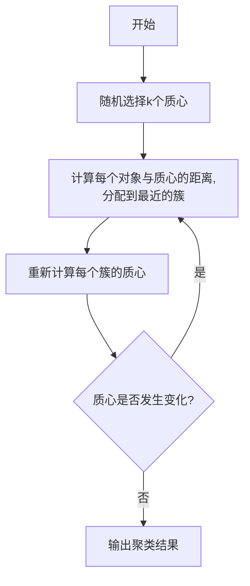
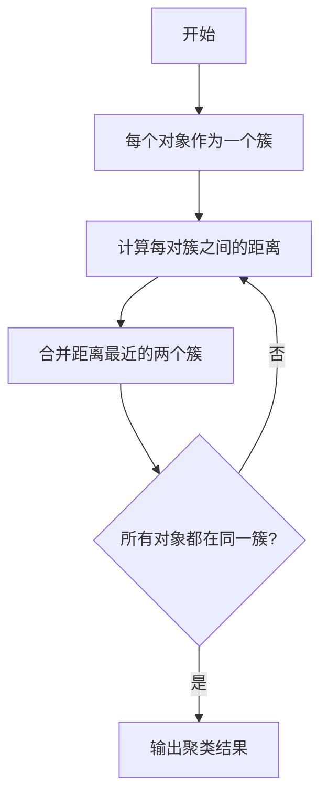
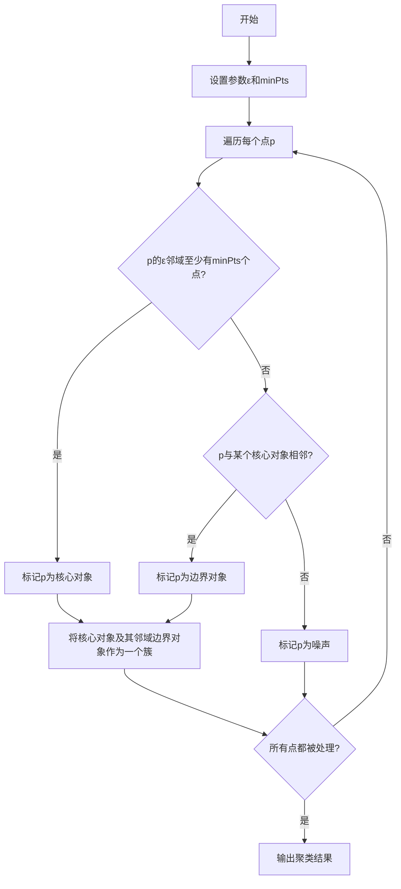

# 聚类 (Clustering) 原理与代码实例讲解

## 1.背景介绍

聚类是一种无监督学习技术,旨在将数据集中的对象划分为多个"簇"或组。聚类的目标是确保同一个簇中的对象相似度很高,而不同簇之间的对象相似度很低。这种技术在许多领域有着广泛的应用,例如计算机视觉、生物信息学、市场细分、社交网络分析等。

聚类算法可以帮助我们从大量看似杂乱无章的数据中发现内在结构和模式。这种无需人工标注的无监督学习方法,对于探索性数据分析和数据可视化非常有用。

## 2.核心概念与联系

聚类涉及以下几个核心概念:

1. **簇(Cluster)**: 由相似对象组成的数据子集。
2. **质心(Centroid)**: 簇中所有对象的中心点或平均值。
3. **相似度(Similarity)**: 衡量两个对象相似程度的指标,通常使用距离度量(如欧几里得距离)。
4. **内聚力(Intra-cluster cohesion)**: 同一簇内部对象之间的相似度。
5. **耦合度(Inter-cluster coupling)**: 不同簇之间对象的差异程度。

聚类算法通常试图最大化内聚力和最小化耦合度。这意味着同一簇内的对象应该尽可能相似,而不同簇之间的对象应该尽可能不同。

聚类与分类(Classification)的主要区别在于,分类是一种有监督学习,需要已标记的训练数据;而聚类则是无监督的,不需要任何标记数据。

## 3.核心算法原理具体操作步骤

聚类算法可分为多种类型,包括分区聚类、层次聚类、密度聚类、基于模型的聚类等。以下是几种常见聚类算法的原理和操作步骤:

### 3.1 K-Means 聚类

K-Means 是最广为人知的分区聚类算法之一。其基本思想是将 n 个对象划分为 k 个簇,每个对象属于离它最近的簇的质心。算法步骤如下:

1. 随机选择 k 个对象作为初始质心。
2. 将每个对象分配给最近的质心所对应的簇。
3. 重新计算每个簇的质心。
4. 重复步骤 2 和 3,直到质心不再发生变化。



### 3.2 层次聚类

层次聚类按照对象之间的距离，通过迭代的方式将对象划分到不同的簇中。可以分为自底向上(Agglomerative)和自顶向下(Divisive)两种方式。

**自底向上层次聚类:**

1. 将每个对象视为一个簇。
2. 计算每对簇之间的距离。
3. 将距离最近的两个簇合并为一个新簇。
4. 重复步骤 2 和 3,直到所有对象归为一个簇。



### 3.3 DBSCAN 密度聚类

DBSCAN 是一种基于密度的聚类算法,它将高密度区域视为簇,低密度区域视为噪声。算法步骤如下:

1. 设置两个参数:邻域半径 ε 和最小点数 minPts。
2. 对每个点 p:
   - 如果 p 的 ε-邻域至少有 minPts 个点,则 p 为核心对象。
   - 如果 p 不是核心对象,但它与某个核心对象相邻,则 p 为边界对象。
   - 否则 p 为噪声。
3. 所有核心对象和与它们相邻的边界对象形成一个簇。
4. 重复步骤 2 和 3,直到所有点被处理。



## 4.数学模型和公式详细讲解举例说明

聚类算法通常涉及到距离度量和相似度计算。以下是一些常用的距离度量公式:

**1. 欧几里得距离(Euclidean Distance)**

对于 n 维空间中的两个点 $\vec{x} = (x_1, x_2, \ldots, x_n)$ 和 $\vec{y} = (y_1, y_2, \ldots, y_n)$,它们之间的欧几里得距离定义为:

$$d(\vec{x}, \vec{y}) = \sqrt{\sum_{i=1}^{n}(x_i - y_i)^2}$$

例如,在二维平面上,两点 $(1, 3)$ 和 $(4, 5)$ 之间的欧几里得距离为:

$$d((1, 3), (4, 5)) = \sqrt{(1 - 4)^2 + (3 - 5)^2} = \sqrt{9 + 4} = \sqrt{13}$$

**2. 曼哈顿距离(Manhattan Distance)**

曼哈顿距离也称为城市街区距离,它是两个点在每个维度上绝对差值的总和。对于 n 维空间中的两个点 $\vec{x}$ 和 $\vec{y}$,曼哈顿距离定义为:

$$d(\vec{x}, \vec{y}) = \sum_{i=1}^{n}|x_i - y_i|$$

例如,在二维平面上,两点 $(1, 3)$ 和 $(4, 5)$ 之间的曼哈顿距离为:

$$d((1, 3), (4, 5)) = |1 - 4| + |3 - 5| = 3 + 2 = 5$$

**3. 余弦相似度(Cosine Similarity)**

余弦相似度用于计算两个非零向量之间的相似度。对于两个向量 $\vec{x}$ 和 $\vec{y}$,它们的余弦相似度定义为:

$$\text{sim}(\vec{x}, \vec{y}) = \frac{\vec{x} \cdot \vec{y}}{||\vec{x}|| \cdot ||\vec{y}||} = \frac{\sum_{i=1}^{n}x_i y_i}{\sqrt{\sum_{i=1}^{n}x_i^2} \cdot \sqrt{\sum_{i=1}^{n}y_i^2}}$$

余弦相似度的值域为 $[-1, 1]$,值越接近 1 表示两个向量越相似。

例如,对于向量 $\vec{x} = (1, 2, 3)$ 和 $\vec{y} = (4, 5, 6)$,它们的余弦相似度为:

$$\text{sim}((1, 2, 3), (4, 5, 6)) = \frac{1 \cdot 4 + 2 \cdot 5 + 3 \cdot 6}{\sqrt{1^2 + 2^2 + 3^2} \cdot \sqrt{4^2 + 5^2 + 6^2}} \approx 0.9798$$

## 5.项目实践：代码实例和详细解释说明

以下是使用 Python 和 scikit-learn 库实现 K-Means 聚类的示例代码:

```python
from sklearn.datasets import make_blobs
from sklearn.cluster import KMeans
import matplotlib.pyplot as plt

# 生成样本数据
X, y = make_blobs(n_samples=500, centers=4, n_features=2, random_state=0)

# 创建 K-Means 聚类器
kmeans = KMeans(n_clusters=4, random_state=0)

# 训练聚类器
kmeans.fit(X)

# 获取每个样本点的簇标签
labels = kmeans.labels_

# 可视化结果
plt.scatter(X[:, 0], X[:, 1], c=labels, s=50, cmap='viridis')
plt.scatter(kmeans.cluster_centers_[:, 0], kmeans.cluster_centers_[:, 1], c='red', s=100)
plt.title('K-Means Clustering')
plt.xlabel('X')
plt.ylabel('Y')
plt.show()
```

代码解释:

1. 首先使用 `make_blobs` 函数生成了一个包含 500 个样本点的数据集,这些样本点分布在 4 个不同的簇中。
2. 创建一个 `KMeans` 对象,并设置簇的数量为 4。
3. 调用 `fit` 方法训练聚类器,将数据集 `X` 作为输入。
4. 获取每个样本点的簇标签,存储在 `labels` 中。
5. 使用 `matplotlib` 库可视化聚类结果。`scatter` 函数绘制样本点,使用不同颜色表示不同簇。另外,还绘制了每个簇的质心。

运行上述代码,你将看到一个散点图,其中不同颜色的点代表不同簇,红色大点代表每个簇的质心。

接下来,我们使用 Python 实现 DBSCAN 密度聚类算法:

```python
from sklearn.datasets import make_blobs
from sklearn.cluster import DBSCAN
import matplotlib.pyplot as plt

# 生成样本数据
X, y = make_blobs(n_samples=500, centers=4, n_features=2, random_state=0)

# 创建 DBSCAN 聚类器
dbscan = DBSCAN(eps=0.5, min_samples=10)

# 训练聚类器
dbscan.fit(X)

# 获取每个样本点的簇标签
labels = dbscan.labels_

# 可视化结果
plt.scatter(X[:, 0], X[:, 1], c=labels, s=50, cmap='viridis')
plt.title('DBSCAN Clustering')
plt.xlabel('X')
plt.ylabel('Y')
plt.show()
```

代码解释:

1. 与上一个示例类似,首先生成了一个包含 500 个样本点的数据集。
2. 创建一个 `DBSCAN` 对象,设置邻域半径 `eps=0.5` 和最小点数 `min_samples=10`。
3. 调用 `fit` 方法训练聚类器,将数据集 `X` 作为输入。
4. 获取每个样本点的簇标签,存储在 `labels` 中。
5. 使用 `matplotlib` 库可视化聚类结果。不同颜色表示不同簇,噪声点用黑色表示。

运行上述代码,你将看到一个散点图,其中不同颜色的点代表不同簇,黑色点代表噪声。

这些代码示例展示了如何使用 scikit-learn 库实现常见的聚类算法。你可以根据实际需求调整参数,并尝试使用其他聚类算法。

## 6.实际应用场景

聚类技术在许多领域都有广泛的应用,以下是一些典型的应用场景:

1. **客户细分(Customer Segmentation)**: 通过对客户数据进行聚类,可以将具有相似特征和行为模式的客户划分为不同的群组,从而实现精准营销和个性化服务。

2. **图像分割(Image Segmentation)**: 在计算机视觉领域,聚类算法可用于将图像像素划分为不同的区域或对象,这对于目标检测、图像分类等任务非常有用。

3. **基因表达分析(Gene Expression Analysis)**: 在生物信息学中,聚类可用于分析基因表达数据,识别具有相似表达模式的基因簇,从而揭示潜在的功能关联。

4. **异常检测(Anomaly Detection)**: 聚类可用于检测数据集中的异常值或离群点,这在欺诈检测、网络安全等领域有重要应用。

5. **推荐系统(Recommendation Systems)**: 通过对用户数据和商品数据进行聚类,可以发现具有相似