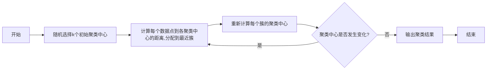
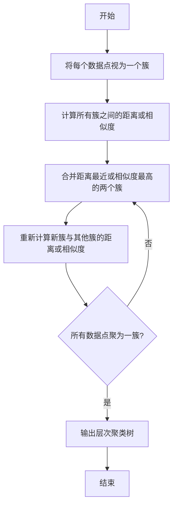
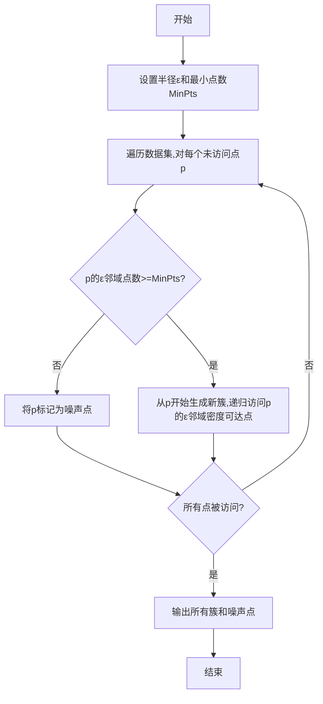

# 聚类(Clustering) - 原理与代码实例讲解

## 1.背景介绍

聚类是一种无监督学习技术,旨在将数据集中的对象划分为多个组(簇),使得同一簇中的对象相似度较高,而不同簇之间的对象相似度较低。聚类分析广泛应用于数据挖掘、模式识别、图像分析、计算机视觉、生物信息学等诸多领域。

聚类算法的主要目标是发现数据内在的结构和规律,对数据进行合理的分组。它不需要事先标注的训练数据,而是根据数据对象之间的相似性自动发现数据的本质结构。常用的聚类算法包括K-Means、层次聚类、DBSCAN、高斯混合模型等。

## 2.核心概念与联系

### 2.1 相似度度量

相似度度量是聚类分析的基础,用于计算数据对象之间的相似程度。常用的相似度度量包括:

- 欧几里得距离: $\sqrt{\sum_{i=1}^{n}(x_i-y_i)^2}$
- 曼哈顿距离: $\sum_{i=1}^{n}|x_i-y_i|$
- 余弦相似度: $\frac{\vec{x} \cdot \vec{y}}{|\vec{x}||\vec{y}|}$

### 2.2 聚类质量评估

聚类质量评估是衡量聚类结果好坏的重要指标,常用的评估指标有:

- 簇内平方和(Intra-Cluster Distance): $\sum_{i=1}^{k}\sum_{x \in C_i}||x-\mu_i||^2$
- 实力度(Silhouette Coefficient): $(b(i)-a(i))/\max(a(i),b(i))$
- calinski-Harabasz指数: $\frac{trace(B_k)}{trace(W_k)}*\frac{N-k}{k-1}$

### 2.3 聚类算法分类

根据聚类过程,聚类算法可分为:

- 分区聚类: 将数据集划分为k个互不相交的子集,如K-Means。
- 层次聚类: 构建层次聚类树,可分为自底向上(AGNES)和自顶向下(DIANA)两种策略。
- 密度聚类: 根据数据密度分布进行聚类,如DBSCAN。
- 基于模型的聚类: 基于数据符合某种数学模型的假设,如高斯混合模型(GMM)。

## 3.核心算法原理具体操作步骤

### 3.1 K-Means算法

K-Means是最经典的分区聚类算法,其核心思想是通过迭代最小化聚类质量函数(簇内平方和)来确定聚类中心和数据分配。算法步骤如下:

1. 随机选择k个初始聚类中心
2. 计算每个数据点到各个聚类中心的距离,将其分配到最近的聚类中心所在的簇
3. 重新计算每个簇的聚类中心
4. 重复步骤2-3,直到聚类中心不再发生变化



### 3.2 层次聚类

层次聚类按照聚类过程可分为自底向上(AGNES)和自顶向下(DIANA)两种策略。以AGNES为例,算法步骤如下:

1. 将每个数据点视为一个簇
2. 计算所有簇之间的距离或相似度
3. 合并距离最近(或相似度最高)的两个簇
4. 重新计算新簇与其他簇的距离或相似度
5. 重复步骤3-4,直到所有数据点聚为一簇



### 3.3 DBSCAN算法

DBSCAN是一种基于密度的聚类算法,其核心思想是将高密度区域视为簇,低密度区域视为噪声。算法步骤如下:

1. 设置半径$\epsilon$和最小点数MinPts
2. 遍历数据集,对每个未访问的点p:
   - 如果p的$\epsilon$邻域点数小于MinPts,则将p标记为噪声点
   - 否则,从p开始生成一个新簇,递归访问p的$\epsilon$邻域所有密度可达点
3. 重复步骤2,直到所有点被访问
4. 输出所有簇和噪声点



## 4.数学模型和公式详细讲解举例说明

### 4.1 K-Means聚类质量函数

K-Means算法的目标是最小化聚类质量函数,即簇内平方和(Intra-Cluster Distance):

$$J = \sum_{i=1}^{k}\sum_{x \in C_i}||x-\mu_i||^2$$

其中,$k$是簇的数量,$C_i$是第$i$个簇,$\mu_i$是第$i$个簇的聚类中心,$||x-\mu_i||^2$是数据点$x$到聚类中心$\mu_i$的欧几里得距离的平方。

该函数反映了数据点到其所属簇聚类中心的距离之和,值越小,表示聚类质量越好。

### 4.2 层次聚类距离计算

在层次聚类中,需要计算两个簇之间的距离或相似度,常用的方法有:

- 单链接(Single Linkage): $d(C_i,C_j)=\min_{x\in C_i,y\in C_j}d(x,y)$
- 完全链接(Complete Linkage): $d(C_i,C_j)=\max_{x\in C_i,y\in C_j}d(x,y)$
- 均值链接(Average Linkage): $d(C_i,C_j)=\frac{1}{|C_i||C_j|}\sum_{x\in C_i}\sum_{y\in C_j}d(x,y)$

其中,$d(x,y)$表示数据点$x$和$y$之间的距离。

### 4.3 DBSCAN核心对象和密度可达

在DBSCAN算法中,引入了核心对象和密度可达的概念:

- 核心对象: 如果一个对象$p$的$\epsilon$邻域中包含至少MinPts个对象,则称$p$为核心对象。
- 密度可达: 对象$q$相对于对象$p$是密度可达的,如果存在一个由核心对象组成的链,使得$p$和$q$都属于该链上某个核心对象的$\epsilon$邻域。

基于这两个概念,DBSCAN算法可以有效发现任意形状的簇,并将噪声点剔除。

### 4.4 高斯混合模型

高斯混合模型(GMM)是一种基于概率模型的聚类方法,它假设数据由多个高斯分布组成的混合模型生成。GMM的概率密度函数为:

$$p(x|\pi,\mu,\Sigma)=\sum_{k=1}^K\pi_k\mathcal{N}(x|\mu_k,\Sigma_k)$$

其中,$K$是高斯分布的个数,$\pi_k$是第$k$个分布的混合系数,$\mu_k$和$\Sigma_k$分别是第$k$个分布的均值和协方差矩阵。

通过期望最大化(EM)算法,可以估计出模型参数$\pi,\mu,\Sigma$,并将数据点分配到对应的高斯分布簇中。

## 5.项目实践:代码实例和详细解释说明

以下是使用Python中的scikit-learn库实现K-Means聚类的代码示例:

```python
from sklearn.cluster import KMeans
import numpy as np

# 生成样本数据
X = np.array([[1, 2], [1, 4], [1, 0],
              [10, 2], [10, 4], [10, 0]])

# 初始化KMeans
kmeans = KMeans(n_clusters=2, random_state=0)

# 执行聚类
labels = kmeans.fit_predict(X)

# 输出聚类结果
print("Cluster labels:", labels)
print("Cluster centers:", kmeans.cluster_centers_)
```

代码解释:

1. 导入KMeans类和numpy库
2. 生成样本数据X,包含6个二维数据点
3. 初始化KMeans对象,设置簇的数量为2,随机种子为0
4. 调用fit_predict()方法执行聚类,返回每个数据点的簇标签
5. 输出簇标签和簇中心

运行结果:

```
Cluster labels: [1 1 1 0 0 0]
Cluster centers: [[10.          2.        ]
                  [ 1.          2.        ]]
```

可以看到,数据点被正确分为两个簇,簇中心分别为(10,2)和(1,2)。

## 6.实际应用场景

聚类分析在现实世界中有广泛的应用,例如:

- 客户细分: 根据客户特征和购买行为对客户进行分组,为不同群体提供个性化服务和营销策略。
- 图像分割: 将图像像素根据颜色、纹理等特征划分为不同的区域,用于图像压缩、目标识别等任务。
- 基因表达分析: 根据基因表达水平对基因或样本进行聚类,发现具有相似表达模式的基因或样本。
- 网络入侵检测: 对网络流量数据进行聚类,识别异常行为模式,发现潜在的网络攻击。
- 推荐系统: 根据用户的浏览记录、购买历史等数据对用户进行聚类,为不同用户群提供个性化推荐。

## 7.工具和资源推荐

- scikit-learn: Python中流行的机器学习库,提供了多种聚类算法的实现。
- Clustering基础教程: https://www.datanovia.com/en/lessons/clustering-in-python-basics/
- 层次聚类算法详解: https://www.analyticsvidhya.com/blog/2019/05/introduction-to-hierarchical-clustering/
- DBSCAN算法原理及实现: https://www.datanovia.com/en/lessons/dbscan-density-based-clustering-basics/
- 高斯混合模型(GMM)详解: https://jakevdp.github.io/PythonDataScienceHandbook/05.12-gaussian-mixtures.html

## 8.总结:未来发展趋势与挑战

聚类分析作为一种重要的数据挖掘和模式识别技术,在未来仍将有广阔的发展空间和应用前景。但同时,也面临一些挑战和难题:

- 高维数据聚类: 当数据维度很高时,传统聚类算法的性能和效果会下降,需要设计更高效的高维聚类算法。
- 大规模数据聚类: 随着数据量的激增,如何在可接受的时间和空间复杂度内对大规模数据进行聚类,是一个亟待解决的问题。
- 数据流聚类: 对于动态变化的数据流,需要开发增量式聚类算法,能够及时捕捉数据分布的变化并更新聚类结果。
- 异构数据聚类: 现实数据通常是异构的,包含不同类型的属性,如何有效地集成不同的相似度度量,是一个值得探索的方向。
- 聚类结果解释: 除了获得高质量的聚类结果,如何解释和可视化聚类结果,使其具有更好的可解释性,也是一个重要的研究