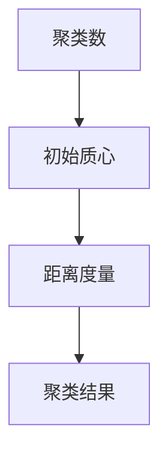

## 1.背景介绍

聚类算法是一种无监督学习方法，它将相似的对象通过静态分类的方法分成不同的组或者子集，使得同一个子集下的成员对象都有相似的一些属性，常见的包括空间距离相似、时间性质相似等。

聚类算法在各个领域都有广泛的应用，如生物信息学、图像分析、社交网络、市场研究、地理信息系统等。聚类的目标是将数据集划分成几个组别，使得同一组别的样本之间的相似度尽可能大且不同组别的样本之间的相似度尽可能小。

## 2.核心概念与联系

聚类算法主要包含以下几个核心概念：

- **聚类数（Cluster Number）**：预设的聚类的组别数量。
- **初始质心（Initial Centroids）**：在开始聚类过程时，预设的每个聚类的中心点。
- **距离度量（Distance Measure）**：用于计算样本之间相似度的度量，常见的包括欧氏距离、曼哈顿距离等。
- **聚类结果（Clustering Result）**：聚类过程结束后，每个样本所属的聚类。

这些概念之间的关系可以通过以下Mermaid流程图进行说明：



## 3.核心算法原理具体操作步骤

以k-means聚类算法为例，其主要操作步骤如下：

1. **初始化**：选择k个样本作为初始质心。
2. **分配样本**：计算每个样本到每个质心的距离，将样本分配到距离最近的质心所在的聚类。
3. **更新质心**：对每个聚类，计算聚类中所有样本的均值，更新质心。
4. **检查收敛**：如果质心的更新量小于预设阈值，或者达到预设的最大迭代次数，结束算法；否则，返回第2步。

## 4.数学模型和公式详细讲解举例说明

k-means聚类算法的目标是最小化所有样本到其所属聚类质心的距离之和，可以用以下公式表示：

$$
J = \sum_{i=1}^{k} \sum_{x \in C_i} ||x - \mu_i||^2
$$

其中，$C_i$表示第i个聚类，$\mu_i$表示第i个聚类的质心，$||\cdot||$表示欧氏距离。

## 5.项目实践：代码实例和详细解释说明

下面是一个使用Python的sklearn库进行k-means聚类的代码实例：

```python
from sklearn.cluster import KMeans
import numpy as np

# 创建数据
X = np.array([[1, 2], [1, 4], [1, 0], [10, 2], [10, 4], [10, 0]])

# 初始化KMeans
kmeans = KMeans(n_clusters=2, random_state=0).fit(X)

# 输出聚类结果
print(kmeans.labels_)
```

这段代码首先导入了需要的库，然后创建了一个简单的数据集。接下来，初始化了KMeans对象，并调用fit方法进行聚类。最后，输出了每个样本的聚类结果。

## 6.实际应用场景

聚类算法在实际中有很多应用场景，例如：

- **市场细分**：企业可以通过聚类算法对客户进行细分，以便进行精细化营销。
- **社交网络分析**：通过聚类算法可以发现社交网络中的社区结构，帮助理解用户的社交行为。
- **异常检测**：聚类算法可以用于检测数据中的异常值，例如信用卡欺诈检测、网络入侵检测等。

## 7.工具和资源推荐

- **Python的sklearn库**：提供了丰富的聚类算法实现，包括k-means、DBSCAN、谱聚类等。
- **R的cluster包**：提供了丰富的聚类算法实现，包括k-means、层次聚类、模糊聚类等。
- **WEKA**：一个包含了大量机器学习算法的开源工具箱，包括聚类、分类、回归等算法。

## 8.总结：未来发展趋势与挑战

聚类算法在未来的发展趋势包括：

- **大数据聚类**：随着数据量的增长，如何有效地对大数据进行聚类成为了一个重要的研究方向。
- **高维数据聚类**：在高维空间中，数据的分布和距离度量等都有很大的不同，如何有效地进行高维数据聚类也是一个重要的研究方向。

同时，聚类算法也面临着一些挑战，例如：

- **初始化问题**：聚类结果往往依赖于初始化，不同的初始化可能会得到不同的聚类结果。
- **选择聚类数**：在实际应用中，往往需要人工选择聚类数，这对于用户来说是一个困难的任务。

## 9.附录：常见问题与解答

1. **Q: 如何选择聚类数？**
   A: 可以通过一些评价指标来选择聚类数，例如轮廓系数、Calinski-Harabasz指数等。也可以通过肘部法则来选择。

2. **Q: 如何处理高维数据聚类？**
   A: 可以通过一些降维技术来处理高维数据，例如PCA、t-SNE等。

3. **Q: k-means算法有什么缺点？**
   A: k-means算法的主要缺点是对初始化敏感，不同的初始化可能会得到不同的聚类结果。此外，k-means算法也不能处理非凸形状的聚类。

作者：禅与计算机程序设计艺术 / Zen and the Art of Computer Programming