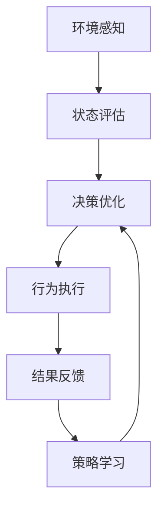

# 自适应与智能调整：AI代理工作流的动态管理

## 1.背景介绍

在当今快节奏的商业环境中，组织面临着不断变化的需求、动态的工作负载和复杂的业务流程。为了有效应对这些挑战,人工智能(AI)代理的应用越来越受到重视。AI代理是一种智能软件实体,能够自主地执行任务、做出决策并与其他系统和人员协作。然而,传统的工作流管理系统通常是静态的,无法灵活应对不断变化的环境。因此,需要一种动态的工作流管理方法,能够实时调整和优化AI代理的行为,以提高整体效率和效果。

## 2.核心概念与联系

### 2.1 AI代理

AI代理是一种具有自主性和智能的软件实体,能够感知环境、处理信息、做出决策并执行相应的行为。AI代理通常具有以下几个核心特征:

1. **感知能力**:能够从环境中获取信息和数据。
2. **决策能力**:基于感知到的信息和预定义的目标,做出合理的决策。
3. **行为能力**:根据决策执行相应的行为,影响环境。
4. **学习能力**:通过经验和反馈,不断优化决策和行为策略。

### 2.2 工作流管理

工作流管理是一种组织和协调业务流程的方法,将任务分解为一系列有序的步骤,并指定每个步骤的执行者、时间和资源。传统的工作流管理系统通常是静态的,无法灵活应对动态变化的环境。

### 2.3 动态工作流管理

动态工作流管理是一种新兴的范式,旨在实现工作流的自适应和智能调整。它允许工作流在运行时根据环境变化、性能反馈和新需求动态调整流程、资源分配和决策逻辑。这种动态性使得工作流能够更好地应对复杂和不确定的情况。

### 2.4 自适应与智能调整

自适应和智能调整是动态工作流管理的核心概念。自适应指的是系统能够根据环境变化自动调整行为,而智能调整则是基于学习和优化算法,主动改进系统的决策和行为策略。这两个概念的结合使得AI代理能够在动态环境中高效运行。

## 3.核心算法原理具体操作步骤

实现AI代理工作流的动态管理需要综合多种算法和技术,包括规划、优化、机器学习和自适应控制等。下面将介绍一种常见的方法:



1. **环境感知**:AI代理通过各种传感器获取环境数据,包括工作流的当前状态、资源利用率、任务队列等。
2. **状态评估**:基于获取的数据,评估当前工作流的执行情况,识别潜在的瓶颈和问题。
3. **决策优化**:根据评估结果,运用规划和优化算法,调整工作流的执行路径、资源分配和任务调度策略。
4. **行为执行**:将优化后的决策应用于实际的工作流执行,指派任务、分配资源等。
5. **结果反馈**:监测工作流执行的结果,包括完成时间、资源利用率、任务质量等指标。
6. **策略学习**:基于反馈数据,使用机器学习算法不断优化决策和行为策略,提高系统的自适应能力。

这种闭环的自适应过程使得AI代理能够持续优化工作流的执行,提高整体效率和质量。

## 4.数学模型和公式详细讲解举例说明

在动态工作流管理中,常用的数学模型包括马尔可夫决策过程(MDP)、约束优化问题(COP)和强化学习(RL)等。

### 4.1 马尔可夫决策过程(MDP)

马尔可夫决策过程是一种描述序列决策问题的数学框架,常用于规划和决策优化。在工作流管理中,可以将工作流的执行过程建模为一个MDP,其中:

- 状态 $s \in S$ 表示工作流的当前状态,包括已完成的任务、剩余任务、资源利用情况等。
- 行为 $a \in A(s)$ 表示可以采取的行动,如分配任务、调整资源等。
- 转移函数 $P(s'|s,a)$ 给出在状态 $s$ 采取行为 $a$ 后,转移到状态 $s'$ 的概率。
- 奖励函数 $R(s,a)$ 定义了在状态 $s$ 采取行为 $a$ 所获得的即时奖励。

目标是找到一个策略 $\pi: S \rightarrow A$,使得期望的累积奖励最大化:

$$
\max_\pi \mathbb{E}\left[\sum_{t=0}^\infty \gamma^t R(s_t, \pi(s_t))\right]
$$

其中 $\gamma \in [0,1]$ 是折现因子,用于权衡即时奖励和长期奖励。

通过动态规划或强化学习算法,可以求解出最优策略 $\pi^*$,指导工作流的执行决策。

### 4.2 约束优化问题(COP)

在工作流管理中,我们常常需要在满足各种约束条件的情况下,优化某些目标函数,如最小化完成时间、最大化资源利用率等。这可以建模为一个约束优化问题:

$$
\begin{aligned}
\min_x &\quad f(x) \\
\text{s.t.} &\quad g_i(x) \leq 0, \quad i = 1, \ldots, m \\
&\quad h_j(x) = 0, \quad j = 1, \ldots, p
\end{aligned}
$$

其中 $x$ 是决策变量,如任务分配、资源分配等; $f(x)$ 是要优化的目标函数; $g_i(x)$ 和 $h_j(x)$ 分别表示不等式和等式约束,如时间约束、资源约束等。

通过各种优化算法,如线性规划、整数规划、启发式搜索等,可以求解出满足约束条件的最优解 $x^*$,指导工作流的执行决策。

### 4.3 强化学习(RL)

强化学习是一种基于试错和反馈的机器学习范式,非常适合于解决序列决策问题。在动态工作流管理中,可以将AI代理视为一个强化学习智能体,通过与环境的交互不断优化其决策策略。

强化学习的核心思想是智能体在与环境交互的过程中,根据获得的奖励信号调整其行为策略,以最大化预期的长期累积奖励。具体来说,在时间步 $t$,智能体处于状态 $s_t$,采取行为 $a_t$,然后转移到新状态 $s_{t+1}$,并获得即时奖励 $r_{t+1}$。智能体的目标是学习一个策略 $\pi$,使得预期的长期累积奖励最大化:

$$
\max_\pi \mathbb{E}\left[\sum_{t=0}^\infty \gamma^t r_{t+1}\right]
$$

常用的强化学习算法包括 Q-Learning、策略梯度等。这些算法可以通过探索和利用的过程,逐步优化智能体的策略,使其能够在动态环境中做出合理的决策。

以上数学模型和算法为动态工作流管理提供了理论基础和实现方法。在实际应用中,还需要结合具体的场景和需求,选择合适的模型和算法,并进行必要的调整和扩展。

## 5.项目实践:代码实例和详细解释说明

为了更好地理解动态工作流管理的实现,我们将使用 Python 和 OpenAI Gym 环境构建一个简单的示例项目。在这个项目中,我们将模拟一个包裹配送中心的工作流程,并使用强化学习算法训练一个AI代理,以动态调度配送任务。

### 5.1 环境设置

首先,我们需要定义环境和相关的状态、行为和奖励函数。在这个示例中,我们将使用 OpenAI Gym 的 `MultiDiscrete` 环境,它可以处理离散的状态和行为空间。

```python
import gym
from gym import spaces

class PackageDeliveryEnv(gym.Env):
    def __init__(self):
        # 定义状态空间
        self.observation_space = spaces.MultiDiscrete([10, 10, 10])  # (num_packages, num_vehicles, time)
        
        # 定义行为空间
        self.action_space = spaces.MultiDiscrete([3, 10])  # (action, package_id)
        
        # 初始化状态
        self.state = (5, 3, 0)  # 初始有 5 个包裹, 3 辆车, 时间为 0
        
        # 其他初始化操作...
        
    def step(self, action):
        # 执行行为并更新状态
        # ...
        
        # 计算奖励
        reward = self.calculate_reward()
        
        # 返回新状态、奖励、是否终止、其他信息
        return self.state, reward, done, {}
        
    def calculate_reward(self):
        # 根据状态计算奖励
        # ...
        return reward
        
    def reset(self):
        # 重置环境状态
        # ...
        return self.state
```

在这个环境中,状态由三个离散值组成:包裹数量、车辆数量和当前时间。行为由两个离散值组成:要执行的操作(如装载包裹、派送包裹等)和包裹编号。奖励函数根据包裹的及时送达情况和资源利用率等因素计算得到。

### 5.2 强化学习算法

接下来,我们将使用 Stable Baselines3 库中的 A2C 算法(Advantage Actor-Critic)训练一个AI代理。A2C 算法结合了策略梯度和值函数估计,能够高效地学习序列决策问题的最优策略。

```python
from stable_baselines3 import A2C
from stable_baselines3.common.env_util import make_vec_env

# 创建并包装环境
env = make_vec_env(PackageDeliveryEnv, n_envs=4)

# 初始化A2C模型
model = A2C('MlpPolicy', env, verbose=1)

# 训练模型
model.learn(total_timesteps=100000)

# 保存模型
model.save("package_delivery_model")
```

在训练过程中,AI代理将与环境进行大量的交互,尝试不同的行为序列,并根据获得的奖励信号调整其策略。经过足够的训练,AI代理将学会一种近似最优的策略,能够动态地调度配送任务,提高整体效率。

### 5.3 策略评估和部署

训练完成后,我们可以评估训练好的模型,并将其部署到实际的配送中心系统中。

```python
# 加载训练好的模型
model = A2C.load("package_delivery_model")

# 评估模型性能
mean_reward, std_reward = evaluate_policy(model, env, n_eval_episodes=10)
print(f"Mean reward: {mean_reward:.2f} +/- {std_reward:.2f}")

# 部署模型
deploy_model(model, delivery_center_system)
```

在部署之前,我们可以通过评估函数测试模型在模拟环境中的表现,了解其平均奖励和稳定性。一旦性能满意,就可以将模型集成到实际的配送中心系统中,用于动态调度配送任务。

需要注意的是,在实际应用中,我们可能需要对环境和奖励函数进行更加精细的建模,并根据实际需求调整算法和超参数。同时,还需要考虑模型的在线更新、容错性和安全性等问题,以确保系统的稳定运行。

## 6.实际应用场景

动态工作流管理技术在许多领域都有广泛的应用前景,包括但不限于:

1. **供应链管理**: 动态优化物流配送路线、调度车辆和人员,提高运输效率和响应速度。
2. **制造业**: 根据订单变化和资源限制动态调整生产计划和工序安排,提高产能利用率。
3. **医疗保健**: 根据病人状况和医疗资源动态调整诊疗流程,提高医疗质量和效率。
4. **智能建筑**: 根据环境和使用情况动态调整楼宇设备的运行策略,实现节能和舒适性的平