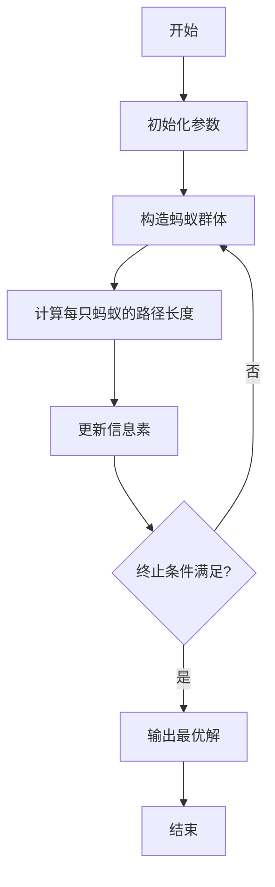

# 蚁群算法(Ant Colony Optimization) - 原理与代码实例讲解

## 1. 背景介绍

### 1.1 什么是蚁群算法?

蚁群算法(Ant Colony Optimization, ACO)是一种基于蚂蚁群体智能行为的概率型元启发式优化算法。它源于对蚂蚁在寻找食物路径过程中相互协作行为的模拟,并将这种自然界的智能行为应用于求解复杂优化问题。

蚁群算法最早由意大利学者Marco Dorigo于1992年提出,旨在寻求好的路径来解决离散优化问题,如旅行商问题(Traveling Salesman Problem, TSP)、网络路由选择、作业调度等。

### 1.2 蚁群算法的启发

蚁群算法的灵感来源于蚂蚁在寻找食物过程中的集体行为。蚂蚁在寻找食物时,会在路径上留下一种称为"信息素"的化学物质。其他蚂蚁可以嗅到这些信息素,并倾向于选择信息素浓度较高的路径前进。随着时间推移,路径上的信息素会逐渐挥发,但较短路径上的信息素由于蚂蚁往返次数多,因此浓度会更高。最终,大部分蚂蚁会选择最短路径。

这种基于正反馈机制的协作行为,使得蚂蚁群体能够有效地解决复杂的路径优化问题。蚁群算法就是模拟并应用了这种自然界中的智能行为。

### 1.3 蚁群算法的特点

蚁群算法具有以下几个主要特点:

1. **正反馈机制**: 通过信息素的正反馈机制,算法能够快速收敛到较优解。
2. **分布式计算**: 蚁群算法是一种分布式的并行计算模型,适合解决复杂的组合优化问题。
3. **构造性启发式算法**: 算法通过构造性的方式逐步构建解,而不是从一个完整的解开始。
4. **无损耗性**: 算法在搜索过程中不会丢失任何潜在的最优解。
5. **鲁棒性**: 算法对数据的微小变化具有较强的鲁棒性。

## 2. 核心概念与联系

### 2.1 蚁群算法的核心概念

蚁群算法中包含以下几个核心概念:

1. **蚂蚁(Ant)**: 代表一个简单的计算单元,用于构造问题的解。
2. **信息素(Pheromone)**: 模拟蚂蚁在路径上留下的化学物质,用于引导蚂蚁选择路径。
3. **信息素更新(Pheromone Update)**: 根据算法迭代的结果,对信息素进行增加或者挥发。
4. **启发式信息(Heuristic Information)**: 一些额外的启发式信息,用于指导蚂蚁选择路径。
5. **状态转移规则(State Transition Rule)**: 蚂蚁根据信息素和启发式信息选择下一步路径的概率规则。

### 2.2 蚁群算法与其他算法的联系

蚁群算法与其他一些算法有一定的联系:

1. **模拟退火算法(Simulated Annealing)**: 两者都借鉴了自然界的现象,并采用概率方法进行搜索。
2. **遗传算法(Genetic Algorithm)**: 两者都属于启发式算法,并具有一定的相似之处,如种群、选择、变异等。
3. **粒子群优化算法(Particle Swarm Optimization)**: 两者都属于群智能算法,都是通过个体之间的协作来寻找最优解。

尽管存在一些联系,但蚁群算法也有自己独特的特点,如正反馈机制、分布式计算等。

## 3. 核心算法原理具体操作步骤

蚁群算法的基本思想是,通过模拟蚂蚁在寻找食物路径时的行为,来解决组合优化问题。算法的具体操作步骤如下:



1. **初始化参数**

   初始化算法所需的各项参数,包括:
   - 蚂蚁数量
   - 信息素浓度矩阵
   - 启发式信息矩阵
   - 信息素挥发系数
   - 最大迭代次数等

2. **构造蚂蚁群体**

   根据问题的规模,生成一定数量的蚂蚁。每只蚂蚁按照状态转移规则独立地构造一条可行解。

3. **计算每只蚂蚁的路径长度**

   对于每只蚂蚁构造的解,计算其对应的路径长度或目标函数值。

4. **更新信息素**

   根据所有蚂蚁构造的解的质量,对信息素进行更新。通常包括两个步骤:
   - 信息素挥发: 所有路径上的信息素浓度会按照一定的挥发率降低。
   - 信息素增加: 对于较优质的解,沿着其路径增加一定量的信息素。

5. **终止条件检查**

   检查是否满足终止条件,如最大迭代次数或目标函数值达到预期。如果满足,输出当前最优解;否则,返回第2步,继续下一轮迭代。

以上是蚁群算法的基本操作步骤。在具体实现时,还需要根据问题的特点对算法进行一定的改进和调整。

## 4. 数学模型和公式详细讲解举例说明

### 4.1 蚂蚁选择路径的状态转移规则

蚂蚁选择下一个城市的概率,由信息素浓度和启发式信息共同决定。具体来说,对于蚂蚁 $k$ 当前所在城市 $r$,选择下一个城市 $s$ 的概率 $p_k(r,s)$ 由以下公式给出:

$$
p_k(r,s) = \begin{cases}
\frac{[\tau(r,s)]^\alpha \cdot [\eta(r,s)]^\beta}{\sum\limits_{u \in J_k(r)}[\tau(r,u)]^\alpha \cdot [\eta(r,u)]^\beta} & \text{if }s \in J_k(r)\\
0 & \text{otherwise}
\end{cases}
$$

其中:

- $\tau(r,s)$ 表示城市 $r$ 到城市 $s$ 的信息素浓度
- $\eta(r,s)$ 表示城市 $r$ 到城市 $s$ 的启发式信息,通常取 $\frac{1}{d(r,s)}$,即两城市间距离的倒数
- $\alpha$ 和 $\beta$ 分别是信息素浓度和启发式信息的相对重要程度
- $J_k(r)$ 表示蚂蚁 $k$ 当前所在城市 $r$ 可选择的下一个城市集合

该公式体现了蚂蚁选择路径时,既考虑了信息素浓度(历史积累的经验),也考虑了启发式信息(对当前状态的评估)。

### 4.2 信息素更新规则

在每一代迭代结束后,需要对信息素进行更新。更新规则分为两个部分:

1. **信息素挥发**

   所有边上的信息素浓度会按照一定的挥发率 $\rho$ 进行衰减,模拟信息素的逐渐挥发:

   $$\tau(r,s) \leftarrow (1-\rho) \cdot \tau(r,s), \quad \forall (r,s) \in L$$

   其中 $L$ 表示所有边的集合。

2. **信息素增加**

   对于本次迭代中找到的最优解 $T^+$,沿着其路径增加一定量的信息素:

   $$\tau(r,s) \leftarrow \tau(r,s) + \sum\limits_{k=1}^{m} \Delta\tau_k(r,s), \quad \forall (r,s) \in T^+$$

   其中 $\Delta\tau_k(r,s)$ 表示第 $k$ 只蚂蚁在边 $(r,s)$ 上留下的信息素增量,通常取:

   $$\Delta\tau_k(r,s) = \begin{cases}
   \frac{Q}{L_k} & \text{if }(r,s) \in T_k\\
   0 & \text{otherwise}
   \end{cases}$$

   这里 $Q$ 是一个常数,表示信息素的总量; $L_k$ 是第 $k$ 只蚂蚁构造的解的长度。

通过不断地信息素挥发和增加,算法可以逐渐收敛到较优的解。

### 4.3 算法收敛性分析

蚁群算法的收敛性可以通过马尔可夫链理论进行分析。具体来说,如果满足以下条件,则算法将以概率 1 收敛到最优解:

1. 信息素矩阵中所有元素的值都是正数。
2. 对于任意一条路径,如果它是最优解,那么在无限次迭代后,它被选择的概率将趋近于 1。
3. 当算法持续迭代时,所有可能的路径都有被选择的机会(即存在持续性)。

通过合理设置算法参数,如信息素挥发率、信息素增量等,可以满足上述条件,从而保证算法的收敛性。

## 5. 项目实践: 代码实例和详细解释说明

下面给出一个使用 Python 实现的蚁群算法求解旅行商问题(TSP)的示例代码,并对关键部分进行详细解释。

```python
import numpy as np
import matplotlib.pyplot as plt

# 城市坐标
coords = np.array([[565.0, 575.0], [25.0, 185.0], [345.0, 750.0], [945.0, 685.0], [835.0, 655.0],
                   [880.0, 660.0], [25.0, 230.0], [525.0, 1000.0], [580.0, 1175.0], [650.0, 1130.0],
                   [1605.0, 620.0], [1220.0, 580.0], [1465.0, 200.0], [1530.0, 5.0], [845.0, 680.0],
                   [725.0, 370.0], [145.0, 665.0], [415.0, 635.0], [510.0, 875.0], [560.0, 365.0],
                   [300.0, 465.0], [520.0, 585.0], [480.0, 415.0], [835.0, 625.0], [975.0, 580.0],
                   [1215.0, 245.0], [1320.0, 315.0], [1510.0, 630.0], [875.0, 920.0], [700.0, 500.0],
                   [555.0, 815.0], [830.0, 785.0], [485.0, 845.0], [1170.0, 65.0], [830.0, 610.0],
                   [605.0, 625.0], [595.0, 360.0], [1340.0, 725.0], [685.0, 610.0], [770.0, 610.0],
                   [610.0, 380.0], [365.0, 240.0], [510.0, 415.0], [145.0, 30.0], [840.0, 570.0],
                   [480.0, 285.0], [660.0, 180.0], [305.0, 450.0], [455.0, 260.0], [285.0, 285.0],
                   [440.0, 625.0], [375.0, 290.0], [90.0, 180.0], [480.0, 585.0], [625.0, 610.0],
                   [595.0, 330.0], [510.0, 800.0], [800.0, 480.0], [830.0, 90.0], [490.0, 335.0],
                   [925.0, 240.0], [700.0, 165.0], [580.0, 305.0], [195.0, 410.0], [375.0, 585.0],
                   [210.0, 60.0], [470.0, 240.0], [555.0, 180.0], [990.0, 155.0], [90.0, 290.0],
                   [955.0, 355.0], [550.0, 965.0], [965.0, 835.0], [1125.0, 920.0], [285.0, 735.0],
                   [975.0, 805.0], [875.0, 130.0], [625.0, 835