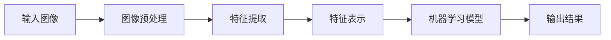

# 计算机视觉CV原理与代码实例讲解

## 1.背景介绍
### 1.1 计算机视觉的定义与发展历程
计算机视觉(Computer Vision,简称CV)是一门研究如何使计算机能够"看懂"数字图像或视频,从而对图像内容进行分析和理解的学科。它是人工智能领域中的一个重要分支,旨在赋予计算机类似人眼的视觉能力。

计算机视觉的研究始于20世纪60年代,经历了从理论探索到实际应用的发展过程。早期主要侧重于图像处理的基本算法,如边缘检测、图像分割等。随着机器学习尤其是深度学习的兴起,CV得到了飞速发展。2012年,Alex Krizhevsky等人提出的AlexNet在ImageNet图像分类竞赛中以远超第二名的成绩夺冠,掀起了深度学习在CV领域的浪潮。此后,CNN、R-CNN、YOLO等一系列卷积神经网络模型不断刷新着性能记录。

如今,计算机视觉已广泛应用于人脸识别、自动驾驶、医学影像分析、工业缺陷检测等诸多领域,极大地改变了人们的生产生活方式。未来,随着算法模型的进一步发展和计算硬件的升级,CV将在更多场景发挥重要作用。

### 1.2 计算机视觉的主要任务
计算机视觉主要涉及以下几类任务:

1. 图像分类(Image Classification):对输入图像进行类别标注,如判断图片中是猫还是狗。
2. 目标检测(Object Detection):在图像中定位并识别出感兴趣的目标,常见的如行人检测、车辆检测等。
3. 语义分割(Semantic Segmentation):对图像的每个像素进行类别标注,可用于背景虚化、自动驾驶等。  
4. 实例分割(Instance Segmentation):在语义分割的基础上区分不同的个体,如分别标注出图中的不同人。
5. 姿态估计(Pose Estimation):检测图像中人体关键点(如头、肩、肘等)的位置,应用于行为分析、人机交互等。
6. 人脸识别(Face Recognition):识别图像或视频中的特定人物。
7. 光学字符识别(OCR):从图片中检测并识别出文字内容。

除此之外,还有图像风格迁移、图像超分辨率、视频目标跟踪等衍生任务。随着研究的不断深入,计算机视觉的应用领域也在不断扩展。

## 2.核心概念与联系
### 2.1 计算机视觉的核心概念
计算机视觉中有几个核心概念贯穿其中:

1. 图像:计算机视觉处理的基本对象,本质上是一个二维或三维矩阵。常见的图像格式有RGB、灰度图、二值图等。

2. 特征:从图像中提取出的对分类、检测等任务有判别性的信息,可分为手工设计特征(如SIFT、HOG等)和深度学习特征。

3. 卷积:一种特殊的矩阵乘法运算,是提取图像局部特征的重要手段。卷积神经网络通过逐层堆叠卷积、池化等操作来提取高层语义特征。

4. 损失函数:衡量模型预测结果与真实标签之间差异的函数,模型训练过程就是通过最小化损失函数来调整网络参数。常见的有交叉熵损失、L1/L2损失等。

5. 迁移学习:将一个领域学习到的知识迁移到新的相似领域。在CV中,通常采用在大型数据集(如ImageNet)上预训练的模型作为基础,针对新任务进行微调。

6. 数据增强:通过对图像进行平移、旋转、缩放、翻转、添加噪声等变换,从而扩充训练集的方法。可提高模型的泛化性能。

### 2.2 计算机视觉的关键技术
计算机视觉发展至今,形成了一套完整的技术体系,主要包括:

1. 图像处理:对图像进行变换与分析,如滤波、锐化、形态学运算等,是后续任务的基础。  

2. 特征工程:研究如何从图像中提取和表示特征,代表方法有SIFT、HOG、Haar等。深度学习出现后,更多采用数据驱动的端到端学习方式。

3. 机器学习:将提取到的特征输入分类器进行训练与预测。支持向量机(SVM)、随机森林等是常用的分类器。

4. 深度学习:通过构建多层神经网络,自动学习图像的层次化特征表示。卷积神经网络(CNN)及其变体是主流的深度学习模型。

5. 目标检测:采用滑动窗口、选择性搜索、区域建议网络(RPN)等方法产生候选区域,再进行分类与回归。代表模型有R-CNN系列、YOLO系列等。

6. 图像分割:基于图论、聚类、深度学习等方法对图像进行像素级标注。全卷积网络(FCN)开创了端到端的语义分割模型。

7. 注意力机制:通过引入注意力模块,让模型自动关注图像中的重要区域,提升模型性能。代表方法有Squeeze-and-Excitation(SE)、Non-local等。

### 2.3 计算机视觉的技术架构
下图展示了一个典型的计算机视觉处理流程:

1. 输入图像:可以是RGB图像、灰度图像、视频帧等。

2. 图像预处理:对输入图像进行归一化、去噪、增强等操作,为后续步骤做准备。

3. 特征提取:从图像中提取对任务有判别性的特征,可以手工设计,也可以采用学习的方式。

4. 特征表示:对提取到的特征进行编码与融合,常见的有向量表示、矩阵表示、张量表示等。

5. 机器学习模型:将特征输入到分类、检测、分割等模型中进行训练与推理。深度学习模型通常采用端到端的方式,将特征提取、表示、决策集成在一个网络中。

6. 输出结果:根据任务的不同,输出图像的类别、检测框坐标、分割掩码等预测结果。

## 3.核心算法原理具体操作步骤
下面以图像分类和目标检测两个任务为例,介绍其核心算法的原理与步骤。

### 3.1 图像分类
图像分类旨在判断输入图像的类别标签,如猫、狗、飞机等。以经典的卷积神经网络LeNet为例,其算法步骤如下:

1. 输入图像:将图像缩放到固定尺寸,如32x32。

2. 卷积层:对图像进行卷积操作,提取局部特征。LeNet包含2个卷积层:
   - 第一层:6个5x5卷积核,stride=1,pad=0
   - 第二层:16个5x5卷积核,stride=1,pad=0

3. 池化层:对卷积结果进行下采样,减小特征图尺寸。LeNet采用2x2最大池化,stride=2。

4. 全连接层:将特征图展平为向量,送入MLP进行分类。LeNet包含3个全连接层:
   - 第一层:120个神经元
   - 第二层:84个神经元
   - 第三层:10个神经元(对应10个类别)

5. 输出层:使用Softmax函数将最后一层的输出转化为概率分布。

6. 训练:采用反向传播算法和梯度下降法最小化交叉熵损失函数,学习网络参数。

7. 推理:使用训练好的模型对新图像进行预测,输出其所属类别。

### 3.2 目标检测
目标检测不仅要判断图像中是否存在某个目标,还要给出其位置。以YOLO算法为例,其步骤如下:

1. 输入图像:将图像缩放到固定尺寸,如416x416。

2. 骨干网络:使用卷积神经网络提取图像特征,常用的有VGG、ResNet等。

3. 检测头:在骨干网络的输出上附加检测头,由1x1卷积实现:
   - 将特征图划分为SxS个网格
   - 每个网格预测B个边界框,每个边界框包含5个值:中心坐标、宽高、置信度
   - 每个网格预测C个类别概率
   
4. 损失函数:由定位损失、置信度损失、分类损失三部分组成:
   - 定位损失:使用L2损失,衡量预测框与真实框中心坐标和宽高的差异
   - 置信度损失:使用二元交叉熵,衡量预测框是否包含目标
   - 分类损失:使用多元交叉熵,衡量预测类别与真实类别的差异
   
5. 训练:使用反向传播和梯度下降法最小化总损失,更新网络参数。

6. 后处理:对预测框进行阈值过滤和非极大值抑制,得到最终的检测结果。

7. 推理:使用训练好的模型对新图像进行预测,输出目标的位置和类别。

## 4.数学模型和公式详细讲解举例说明
计算机视觉中的很多算法都有着深厚的数学基础,下面对其中的几个关键数学模型进行讲解。

### 4.1 卷积运算
卷积是提取图像特征的重要手段,其数学定义为:

$$ (f*g)(x) = \int_{-\infty}^{\infty} f(t)g(x-t)dt $$

其中,$f$为输入信号,$g$为卷积核,$*$表示卷积操作。

对于离散的二维图像$I$和卷积核$K$,其卷积公式为:

$$ (I*K)(i,j) = \sum_m \sum_n I(i-m,j-n)K(m,n) $$

其中,$i,j$为图像坐标,$m,n$为卷积核坐标。

举例来说,假设有一个3x3的图像I和一个2x2的卷积核K:

$$
I=
\begin{bmatrix}
1 & 2 & 3\\
4 & 5 & 6\\
7 & 8 & 9
\end{bmatrix},
K=
\begin{bmatrix}
1 & 0\\
0 & 1
\end{bmatrix}
$$

则它们的卷积结果为:

$$
(I*K)(0,0) = 1\times1 + 2\times0 + 4\times0 + 5\times1 = 6 \\
(I*K)(0,1) = 2\times1 + 3\times0 + 5\times0 + 6\times1 = 8 \\
(I*K)(1,0) = 4\times1 + 5\times0 + 7\times0 + 8\times1 = 12 \\
(I*K)(1,1) = 5\times1 + 6\times0 + 8\times0 + 9\times1 = 14
$$

可见,卷积运算可以提取图像的局部特征。在卷积神经网络中,通过学习卷积核的参数,可以自动提取出有判别性的特征。

### 4.2 池化运算
池化是对特征图进行下采样的常用方法,可以减小特征图的尺寸,同时保留重要的特征。常见的有最大池化和平均池化两种。

假设有一个4x4的特征图X:

$$
X=
\begin{bmatrix}
1 & 2 & 3 & 4\\
5 & 6 & 7 & 8\\
9 & 10 & 11 & 12\\
13 & 14 & 15 & 16
\end{bmatrix}
$$

对其进行2x2最大池化,步长为2,则结果为:

$$
MaxPool(X)=
\begin{bmatrix}
6 & 8\\
14 & 16
\end{bmatrix}
$$

而2x2平均池化的结果为:

$$
AvgPool(X)=
\begin{bmatrix}
3 & 5\\
11 & 13
\end{bmatrix}
$$

最大池化提取了特征的最大值,平均池化提取了特征的平均值。通过池化操作,可以降低特征图的分辨率,减小计算量,同时保留关键特征。