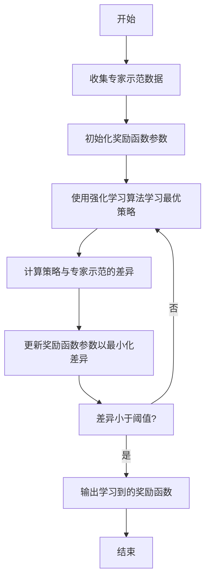

# 逆强化学习 (Inverse Reinforcement Learning) 原理与代码实例讲解

## 1. 背景介绍

### 1.1 强化学习的挑战

强化学习是一种基于环境交互的机器学习范式,其目标是找到一个策略,使智能体在给定环境中获得最大的累积奖励。传统的强化学习算法需要精确定义奖励函数,但在复杂的现实世界问题中,设计合适的奖励函数往往是一项艰巨的挑战。

### 1.2 逆强化学习的产生

为了解决这一难题,逆强化学习(Inverse Reinforcement Learning, IRL)应运而生。逆强化学习旨在从专家示范中推断出隐含的奖励函数,从而无需手动设计奖励函数。这种方法具有广泛的应用前景,如机器人控制、对话系统、游戏AI等领域。

## 2. 核心概念与联系

### 2.1 马尔可夫决策过程

逆强化学习建立在马尔可夫决策过程(Markov Decision Process, MDP)的基础之上。MDP是一种数学框架,用于描述一个完全可观测的环境,其中智能体通过执行动作来影响环境状态的转移,并获得相应的奖励。

### 2.2 奖励函数

奖励函数是MDP中的关键组成部分,它定义了智能体在每个状态下执行特定动作所获得的即时奖励。传统的强化学习算法需要事先指定奖励函数,而逆强化学习则旨在从专家示范中推断出隐含的奖励函数。

### 2.3 专家示范

专家示范是逆强化学习的核心输入,它是一系列由专家执行的状态-动作对。这些示范反映了专家在解决特定问题时的行为模式和偏好。逆强化学习算法的目标是从这些示范中推断出最能解释专家行为的奖励函数。

## 3. 核心算法原理具体操作步骤

逆强化学习算法的核心思想是将奖励函数建模为一个参数化的函数,然后通过优化该函数的参数,使得在该奖励函数下学习到的最优策略能够尽可能地匹配专家示范。下面是一种常见的逆强化学习算法的具体操作步骤:



1. **收集专家示范数据**:首先需要收集一组由专家执行的状态-动作对作为示范数据。这些示范数据应该反映出专家在解决特定问题时的行为模式和偏好。

2. **初始化奖励函数参数**:将奖励函数建模为一个参数化的函数,例如线性组合函数或神经网络。初始化这些参数的值,通常采用随机初始化或基于先验知识的初始化。

3. **使用强化学习算法学习最优策略**:在当前的奖励函数参数下,使用强化学习算法(如Q-Learning、策略梯度等)来学习一个最优策略。

4. **计算策略与专家示范的差异**:将学习到的最优策略在专家示范数据上执行,计算其与专家示范之间的差异。常用的差异度量包括最大似然估计、最小化状态-动作频率差异等。

5. **更新奖励函数参数以最小化差异**:使用优化算法(如梯度下降、进化算法等)来更新奖励函数的参数,使得在新的奖励函数下学习到的最优策略能够最小化与专家示范之间的差异。

6. **重复步骤3-5**:重复执行步骤3-5,直到策略与专家示范之间的差异小于预设的阈值或达到最大迭代次数。

7. **输出学习到的奖励函数**:当算法收敛时,输出学习到的奖励函数参数及其对应的函数形式。

通过上述步骤,逆强化学习算法可以从专家示范中推断出一个能够解释专家行为的奖励函数,从而无需手动设计奖励函数。

## 4. 数学模型和公式详细讲解举例说明

### 4.1 马尔可夫决策过程

马尔可夫决策过程(MDP)是一种用于描述决策序列的数学框架,它由以下五元组组成:

$$\mathcal{M} = \langle \mathcal{S}, \mathcal{A}, \mathcal{P}, \mathcal{R}, \gamma \rangle$$

其中:

- $\mathcal{S}$ 是有限的状态集合
- $\mathcal{A}$ 是有限的动作集合
- $\mathcal{P}: \mathcal{S} \times \mathcal{A} \times \mathcal{S} \rightarrow [0, 1]$ 是状态转移概率函数,表示在状态 $s$ 执行动作 $a$ 后转移到状态 $s'$ 的概率
- $\mathcal{R}: \mathcal{S} \times \mathcal{A} \rightarrow \mathbb{R}$ 是奖励函数,定义了在状态 $s$ 执行动作 $a$ 所获得的即时奖励
- $\gamma \in [0, 1)$ 是折现因子,用于平衡即时奖励和长期累积奖励的权重

在传统的强化学习中,奖励函数 $\mathcal{R}$ 是已知的,目标是找到一个策略 $\pi: \mathcal{S} \rightarrow \mathcal{A}$,使得在该策略下的期望累积奖励最大化。而在逆强化学习中,奖励函数 $\mathcal{R}$ 是未知的,需要从专家示范中推断出来。

### 4.2 最大熵逆强化学习

最大熵逆强化学习(Maximum Entropy Inverse Reinforcement Learning, MaxEnt IRL)是一种常用的逆强化学习算法,它将奖励函数建模为一个线性组合函数:

$$\mathcal{R}(s, a) = \theta^{\top} \phi(s, a)$$

其中 $\theta$ 是待学习的参数向量,而 $\phi(s, a)$ 是一个特征函数,将状态-动作对映射到特征空间。

在最大熵逆强化学习中,我们假设专家的策略 $\pi^{*}$ 是一个最大熵分布,即在满足与专家示范相匹配的约束条件下,具有最大熵:

$$\pi^{*} = \arg\max_{\pi} -\sum_{s, a} \pi(a|s) \log \pi(a|s)$$
$$\text{s.t. } \sum_{s, a} \pi(a|s) \phi(s, a) = \sum_{s, a} \pi^{E}(a|s) \phi(s, a)$$

其中 $\pi^{E}$ 是专家示范的状态-动作频率分布。通过最大熵原理,我们可以得到最优策略的解析形式:

$$\pi^{*}(a|s) = \frac{1}{Z(s)} \exp(\theta^{\top} \phi(s, a))$$

其中 $Z(s)$ 是归一化因子。

接下来,我们可以使用最大似然估计或最小化状态-动作频率差异等方法来优化参数 $\theta$,使得在该奖励函数下学习到的最优策略 $\pi^{*}$ 能够最大程度地匹配专家示范。

### 4.3 基于最大熵的算法示例

下面是一个基于最大熵逆强化学习的算法示例:

```python
import numpy as np

def maxent_irl(expert_demos, feature_map, lr, num_iters):
    # 初始化奖励函数参数
    theta = np.zeros(feature_map.shape[1])
    
    for i in range(num_iters):
        # 使用当前奖励函数学习最优策略
        policy = learn_policy(theta, feature_map)
        
        # 计算策略与专家示范的差异
        grad = compute_grad(policy, expert_demos, feature_map)
        
        # 更新奖励函数参数
        theta += lr * grad
    
    return theta

def learn_policy(theta, feature_map):
    # 使用强化学习算法学习最优策略
    # ...
    return policy

def compute_grad(policy, expert_demos, feature_map):
    # 计算策略与专家示范的差异梯度
    # ...
    return grad
```

在这个示例中,我们首先初始化奖励函数参数 `theta`。然后在每次迭代中,我们使用当前的奖励函数参数 `theta` 和特征函数 `feature_map` 来学习一个最优策略 `policy`。接下来,我们计算该策略与专家示范之间的差异梯度 `grad`。最后,我们使用梯度下降法更新奖励函数参数 `theta`。

需要注意的是,这只是一个简化的示例,实际应用中可能需要考虑更多的细节和优化技巧,如特征工程、正则化、替代优化算法等。

## 5. 项目实践:代码实例和详细解释说明

为了更好地理解逆强化学习的原理和实现,我们将通过一个简单的网格世界示例来演示逆强化学习的实现过程。

### 5.1 问题描述

考虑一个 4x4 的网格世界,智能体的目标是从起点移动到终点。每次移动,智能体可以选择上下左右四个方向,并会获得相应的奖励。我们假设专家已经提供了一组示范轨迹,表明了从起点到终点的最佳路径。我们的目标是从这些示范轨迹中推断出隐含的奖励函数。

### 5.2 环境设置

首先,我们定义网格世界的状态和动作空间:

```python
import numpy as np

# 定义网格世界的大小
GRID_SIZE = 4

# 定义状态空间
STATE_SPACE = np.arange(GRID_SIZE ** 2)

# 定义动作空间
ACTION_SPACE = np.array([0, 1, 2, 3])  # 上、右、下、左

# 定义起点和终点
START_STATE = 0
GOAL_STATE = GRID_SIZE ** 2 - 1
```

接下来,我们定义状态转移函数和奖励函数:

```python
def transition_func(state, action):
    """状态转移函数"""
    row = state // GRID_SIZE
    col = state % GRID_SIZE
    
    if action == 0:  # 上
        next_state = max(state - GRID_SIZE, 0)
    elif action == 1:  # 右
        next_state = min(state + 1, GRID_SIZE * (row + 1) - 1)
    elif action == 2:  # 下
        next_state = min(state + GRID_SIZE, GRID_SIZE ** 2 - 1)
    else:  # 左
        next_state = max(state - 1, GRID_SIZE * row)
    
    reward = -1  # 默认奖励为 -1
    if next_state == GOAL_STATE:
        reward = 0  # 到达终点奖励为 0
    
    return next_state, reward

def reward_func(state, action, theta):
    """奖励函数"""
    next_state, reward = transition_func(state, action)
    return reward + theta[state, action]
```

在这个示例中,我们假设默认奖励为 -1,到达终点时奖励为 0。我们还定义了一个参数化的奖励函数 `reward_func`,它将状态-动作对映射到一个参数矩阵 `theta`。我们的目标是从专家示范中学习这个参数矩阵 `theta`。

### 5.3 生成专家示范

为了简化问题,我们手动构造一组专家示范轨迹:

```python
expert_demos = [
    [0, 1, 2, 3, 7, 11, 15, 19],  # 最短路径示范
    [0, 4, 8, 12, 16, 17, 18, 19]  # 次优路径示范
]
```

这些示范轨迹表示了从起点到终点的不同路径。在实际应用中,专家示范通常是由人类专家或高质量策略生成的。

### 5.4 特征函数

为了将状态-动作对映射到特征空间,我们定义以下特征函数:

```python
def feature_map(state, action):
    """特征函数"""
    features = np.zeros((GRID_SIZE ** 2, 4))
    
    row = state // GRID_SIZE
    col = state % GRID_SIZE
    
    features[state, action] = 1.