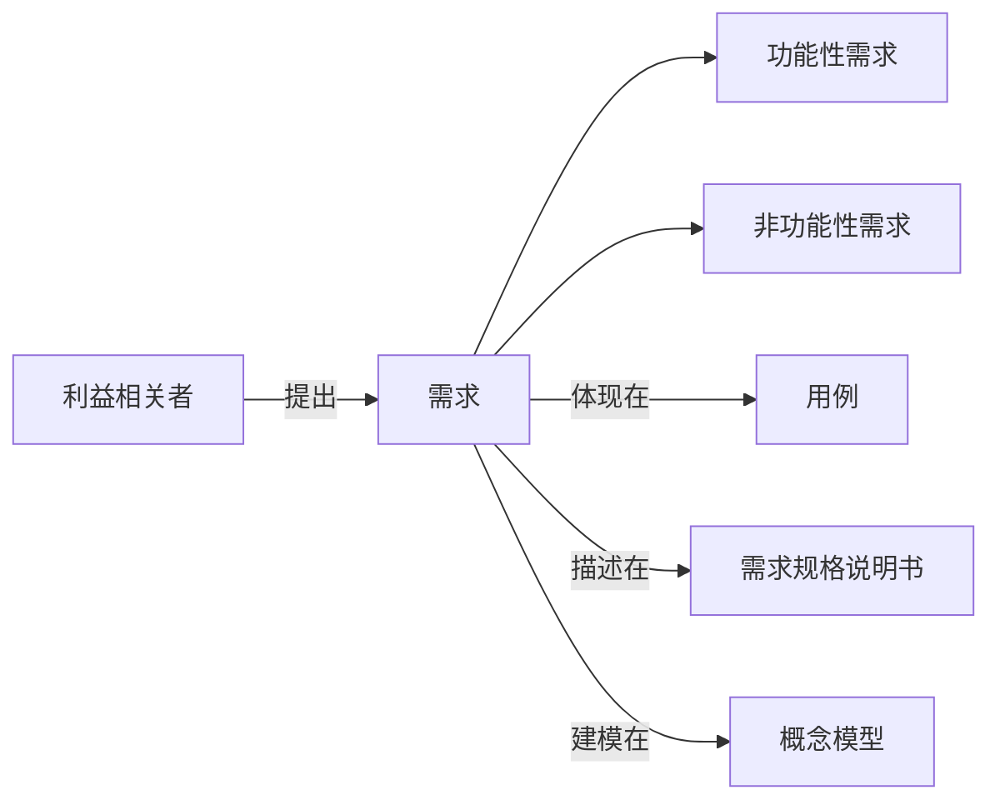

# 需求分析与问题定义原理与代码实战案例讲解

## 1. 背景介绍
### 1.1 需求分析与问题定义的重要性
在软件开发过程中,需求分析与问题定义是至关重要的环节。它决定了整个项目的方向和成败。如果需求分析不到位,问题定义不清晰,那么后续的设计、编码、测试等环节都会受到影响,最终导致项目失败。因此,需求分析与问题定义是软件开发的基石,必须高度重视。

### 1.2 需求分析与问题定义面临的挑战
需求分析与问题定义看似简单,但实际操作中却面临诸多挑战:

1. 需求不明确:客户提出的需求往往比较笼统和模糊,需要开发人员深入挖掘和分析。
2. 需求变更频繁:在开发过程中,客户的需求可能会不断变化,给需求分析带来困难。  
3. 各方利益相关者诉求不一致:不同的利益相关者对系统有不同的期望,需要平衡和协调。
4. 对领域知识缺乏了解:开发人员对业务领域知识的欠缺,会影响对需求的理解。
5. 沟通不畅:需求分析需要开发人员与客户、用户等进行大量沟通,但现实中往往沟通不畅。

### 1.3 需求分析与问题定义的目标
需求分析与问题定义的目标是明确系统的范围、目的、功能需求和非功能需求,并对其进行系统化的描述。具体来说,需要达成以下目标:

1. 识别所有利益相关者,了解他们的诉求。
2. 明确系统的边界和上下文环境。
3. 定义系统的目标和愿景。
4. 挖掘和分析功能性需求和非功能性需求。
5. 建立需求的优先级,确定迭代开发计划。
6. 识别和分析系统面临的风险与挑战。

只有实现了上述目标,才能为后续的软件开发奠定坚实的基础。

## 2. 核心概念与联系
### 2.1 需求(Requirements)
需求是指用户对系统的期望和要求,描述了系统应该做什么。需求可分为功能性需求和非功能性需求两大类。

#### 2.1.1 功能性需求(Functional Requirements)
功能性需求指系统应该提供的服务和功能,是系统的核心要素。比如用户注册、登录、搜索商品、下订单等。

#### 2.1.2 非功能性需求(Non-functional Requirements)  
非功能性需求指系统应该满足的质量属性和约束,如性能、安全性、可用性、可维护性等。它们不直接体现系统的功能,但对系统的成败至关重要。

### 2.2 利益相关者(Stakeholders)
利益相关者指的是所有对系统的开发和运行有影响或受其影响的个人或组织。利益相关者的识别和分析是需求获取的基础。常见的利益相关者有:

- 最终用户:使用系统的人。
- 客户:花钱购买系统的人或组织。
- 开发人员:负责设计和开发系统的技术人员。
- 维护人员:负责系统上线后的维护。
- 项目管理人员:负责协调各方,控制进度和预算。
- 监管机构:对系统有合规性要求的政府部门等。

不同的利益相关者对系统有不同的期望,需要全面了解和平衡他们的诉求。

### 2.3 用例(Use Case)
用例是从用户的视角对系统功能的描述,反映了用户使用系统完成某项任务的场景。用例由参与者、前置条件、后置条件、基本事件流、备选事件流等要素构成。通过编写用例,可以帮助厘清系统的功能需求。

### 2.4 需求规格说明书(Requirements Specification)
需求规格说明书是以文档形式对系统需求进行系统性描述的产物。它详细定义了系统的目标、范围、功能需求、非功能需求、约束等,是开发人员的重要参考依据。需求规格说明书要求描述准确、无歧义、可验证、可跟踪。

### 2.5 概念模型(Conceptual Model)
概念模型使用图形化的方式对系统的核心概念及其之间的关系进行建模,常用的模型有实体关系图(ER图)、类图、状态图等。概念建模有助于理清系统的业务逻辑,是需求分析的重要工具。

下图展示了这些核心概念之间的关系:



## 3. 核心算法原理与具体操作步骤
需求分析与问题定义虽然不像算法那样有严格的步骤,但仍然可以遵循一定的方法和流程。下面介绍几种常用的需求分析方法。

### 3.1 结构化分析方法
结构化分析是一种自顶向下逐步求精的需求分析方法。其基本步骤如下:

1. 确定系统的上下文和范围。
2. 绘制数据流图(DFD),识别系统的外部实体、数据流、加工、数据存储。
3. 编写数据字典,定义数据流、数据存储、加工逻辑。
4. 细化数据流图,绘制子层次的DFD。
5. 识别约束条件,如控制条件、时间约束等。
6. 建立系统的功能模型。

### 3.2 面向对象分析方法
面向对象分析以对象为中心,采用UML建模语言。其基本步骤如下:

1. 识别系统中的关键对象。
2. 定义类及其属性和方法。
3. 定义类之间的关系,如关联、聚合、继承等。
4. 绘制用例图,描述用户与系统的交互。
5. 细化用例,编写详细的用例描述。
6. 根据用例绘制序列图或协作图,展示对象之间的交互。
7. 绘制状态图,描述对象的生命周期。
8. 绘制活动图,描述系统的工作流程。

### 3.3 原型法
原型法通过快速构建系统的原型,与用户进行交互,从而发现和细化需求。其基本步骤如下:

1. 快速构建系统原型。可以使用线框图、流程图等方式,或者直接编写代码。
2. 与用户一起评审原型,收集反馈意见。
3. 根据反馈修改和完善原型。
4. 重复步骤2和3,直到用户满意为止。
5. 根据原型编写需求规格说明书。

### 3.4 用户故事映射(User Story Mapping)
用户故事映射由Jeff Patton提出,是一种可视化的需求分析技术。其基本步骤如下:

1. 确定产品的核心用户活动。
2. 将活动分解为任务,即具体的用户故事(User Story)。
3. 将用户故事排列在二维坐标上。横轴代表用户活动的时间顺序,纵轴代表用户故事的优先级。
4. 确定迭代开发计划。将用户故事分配到各个迭代。
5. 将用户故事分解为开发任务。

## 4. 数学模型和公式详细讲解举例说明
需求分析与问题定义虽然不像自然科学那样有大量数学公式,但仍然可以使用一些简单的数学模型。

### 4.1 优先级矩阵(Priority Matrix)
优先级矩阵是一种确定需求优先级的定量分析方法。假设我们有n个需求$R_1,R_2,...,R_n$,以及m个评估准则$C_1,C_2,...,C_m$。每个准则都有一个权重$w_j(1≤j≤m)$,满足:

$$
\sum_{j=1}^{m} w_j = 1
$$

对于需求$R_i$在准则$C_j$下的得分为$s_{ij}(1≤i≤n, 1≤j≤m)$,则$R_i$的最终得分$S_i$为:

$$
S_i = \sum_{j=1}^{m} w_j \times s_{ij}
$$

最终根据$S_i$的大小确定需求的优先级。

例如,我们对一个在线商城系统的5个功能需求$R_1$~$R_5$进行优先级排序。使用的准则有3个:重要性($C_1$)、紧迫性($C_2$)、实现难度($C_3$),权重分别为0.5、0.3、0.2。经过打分,得到下表:

|   | $C_1$ | $C_2$ | $C_3$ |
|---|-------|-------|-------|
| $R_1$ | 5 | 4 | 3 |
| $R_2$ | 4 | 4 | 4 |  
| $R_3$ | 3 | 2 | 5 |
| $R_4$ | 4 | 5 | 2 |
| $R_5$ | 2 | 3 | 4 |

则每个需求的最终得分为:

$$
\begin{aligned}
S_1 &= 0.5 \times 5 + 0.3 \times 4 + 0.2 \times 3 = 4.3 \\
S_2 &= 0.5 \times 4 + 0.3 \times 4 + 0.2 \times 4 = 4.0 \\
S_3 &= 0.5 \times 3 + 0.3 \times 2 + 0.2 \times 5 = 3.1 \\
S_4 &= 0.5 \times 4 + 0.3 \times 5 + 0.2 \times 2 = 3.9 \\  
S_5 &= 0.5 \times 2 + 0.3 \times 3 + 0.2 \times 4 = 2.7
\end{aligned}
$$

因此,需求的优先级从高到低依次为$R_1$、$R_2$、$R_4$、$R_3$、$R_5$。

### 4.2 模糊集(Fuzzy Set)
在需求分析中,有些需求属性是模糊的,很难用精确的数值表示,如"系统要有较好的性能""界面要美观友好"等。这时可以用模糊集来建模。

模糊集是指那些元素的隶属度在0到1之间连续变化的集合。形式化定义为:设$U$为论域,$A$为$U$上的模糊集,则$A$可表示为:

$$
A = \{(x, \mu_A(x)) | x \in U\}
$$

其中,$\mu_A(x)$称为元素$x$对模糊集$A$的隶属度,是一个0到1之间的实数。$\mu_A(x)$越接近1,表示$x$越属于$A$;越接近0,表示$x$越不属于$A$。

例如,对于需求"系统响应要快",我们可以用模糊集来表示"快"这一模糊概念:

$$
快 = \{(0.1, 0), (0.5, 0.5), (1, 1), (2, 0.8), (5, 0.2), (10, 0)\}
$$

其中,每个元组的第一个元素表示响应时间(单位:秒),第二个元素表示隶属度。可以看出,0.1秒响应属于"快"的程度为0,1秒属于"快"的程度为1,2秒属于"快"的程度为0.8,以此类推。

## 5. 项目实践:代码实例和详细解释说明
下面我们用Python代码来实现上述的两个数学模型。

### 5.1 优先级矩阵代码实现

```python
def priority_matrix(requirements, criteria, weights, scores):
    """
    计算需求的优先级
    :param requirements: 需求列表
    :param criteria: 评估准则列表
    :param weights: 各准则的权重
    :param scores: 需求在各准则下的得分
    :return: 需求的优先级列表
    """
    n = len(requirements)
    m = len(criteria)
    
    # 检查输入是否合法
    assert len(weights) == m, "权重数量与准则数量不一致"
    assert all(0 <= w <= 1 for w in weights), "权重必须在0到1之间"  
    assert abs(sum(weights) - 1) < 1e-6, "权重之和必须为1"
    assert len(scores) == n, "需求数