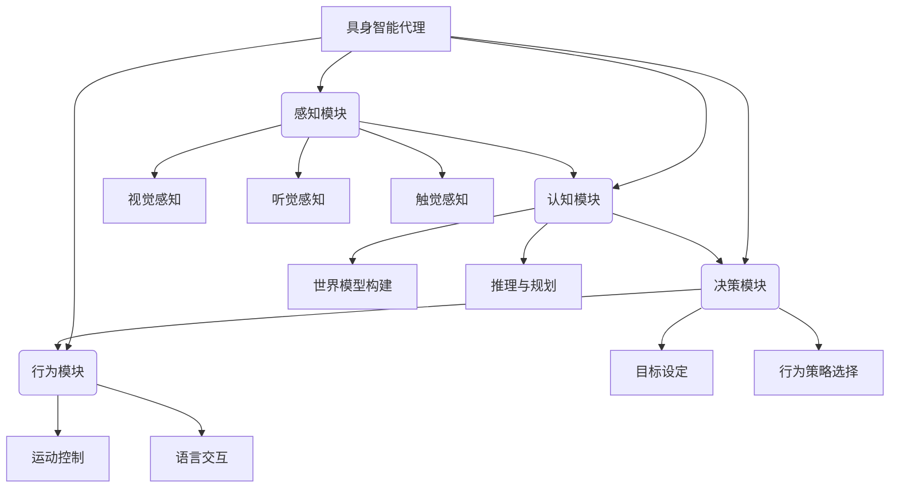

# AI Agent: AI的下一个风口 具身智能的核心与未来

## 1. 背景介绍

### 1.1 人工智能的发展历程

人工智能(Artificial Intelligence, AI)是当代科技领域最具革命性和颠覆性的技术之一。自20世纪50年代AI概念被正式提出以来,经历了几个重要的发展阶段。

- **早期阶段(1950s-1960s)**: 这一时期的AI主要集中在基础理论研究,如逻辑推理、知识表示等领域。
- **知识驱动时期(1970s-1980s)**: 这一阶段的AI系统主要基于专家系统和知识库,试图模拟人类专家的推理过程。
- **统计学习时期(1990s-2010s)**: 随着计算能力和数据量的不断增长,机器学习和神经网络等统计学习方法开始在AI领域大显身手。
- **深度学习时代(2010s至今)**: 深度学习算法的兴起,使得AI在计算机视觉、自然语言处理等领域取得了突破性进展。

### 1.2 具身智能(Embodied AI)的兴起

尽管传统的AI系统在特定领域取得了令人瞩目的成就,但它们大多局限于狭窄的任务范畴,缺乏对真实世界的理解和交互能力。为了克服这一缺陷,具身智能(Embodied AI)应运而生。

具身智能旨在赋予AI系统身体和感知能力,使其能够像人类一样感知、理解并与真实世界进行自然交互。具身智能代理(Embodied AI Agent)是具身智能的核心,它是一种拥有身体形态、感知器官和行为能力的智能体,能够在物理世界或虚拟环境中自主地感知、学习、推理和行动。

## 2. 核心概念与联系

### 2.1 具身智能代理的构成

一个典型的具身智能代理通常包括以下几个核心组成部分:

- **感知模块**:通过视觉、听觉、触觉等传感器获取环境信息,为认知模块提供原始数据输入。
- **认知模块**:基于感知数据构建对环境的理解(世界模型),并进行推理和规划,为决策模块提供建议。
- **决策模块**:根据认知模块的输出,设定行为目标并选择合适的策略。
- **行为模块**:执行决策模块的指令,通过运动控制和语言交互等方式与环境进行交互。

### 2.2 具身智能与传统AI的关系

具身智能代理与传统的AI系统存在一些显著差异:

- **交互方式**:传统AI系统通常基于静态数据进行离线训练和推理,而具身智能代理需要在动态环境中持续感知、学习和决策。
- **认知能力**:传统AI系统侧重于特定任务的解决,而具身智能代理需要具备综合的感知、推理和规划能力。
- **embodiment**:传统AI系统缺乏物理实体,而具身智能代理拥有虚拟或真实的身体形态,能够与环境进行自然交互。

同时,具身智能也继承并发展了传统AI的诸多理论和技术,如机器学习、计算机视觉、自然语言处理等,使这些技术能够在动态环境中发挥作用。因此,具身智能可以被视为传统AI向更加通用、智能和人性化方向发展的必然趋势。

## 3. 核心算法原理具体操作步骤

### 3.1 感知模块

感知模块的主要任务是从环境中获取原始数据,并对这些数据进行预处理,为后续的认知和决策过程提供输入。常见的感知算法包括:

1. **计算机视觉算法**:如目标检测、语义分割、视觉SLAM等,用于从视觉数据中提取有用信息。
2. **语音识别算法**:如隐马尔可夫模型、神经网络等,用于从语音数据中识别出文本内容。
3. **传感器融合算法**:如卡尔曼滤波、粒子滤波等,用于将来自不同传感器的数据进行融合。

这些算法的具体操作步骤因算法而异,但通常包括数据预处理、特征提取、模型训练和预测等环节。

### 3.2 认知模块

认知模块的核心任务是根据感知数据构建对环境的理解(世界模型),并基于世界模型进行推理和规划。常见的认知算法包括:

1. **机器学习算法**:如深度学习、强化学习等,用于从数据中学习世界模型。
2. **规划算法**:如A*、RRT*等,用于在已知的世界模型下规划出行为路径。
3. **推理算法**:如逻辑推理、概率图模型推理等,用于对不确定的世界模型进行推理。

这些算法的操作步骤因算法而异,但通常包括数据预处理、模型训练、推理和规划等环节。

### 3.3 决策模块

决策模块的主要任务是根据认知模块的输出,设定行为目标并选择合适的策略。常见的决策算法包括:

1. **强化学习算法**:如Q-Learning、策略梯度等,用于学习在给定环境下的最优行为策略。
2. **规划算法**:如POMDP、MDP等,用于在已知的环境模型下规划出最优行为序列。
3. **多智能体决策算法**:如博弈论、协作过滤等,用于在多个智能体之间协调行为。

这些算法的操作步骤因算法而异,但通常包括环境建模、策略学习、策略优化等环节。

### 3.4 行为模块

行为模块的主要任务是执行决策模块的指令,通过运动控制和语言交互等方式与环境进行交互。常见的行为算法包括:

1. **运动控制算法**:如PID控制、轨迹规划等,用于控制机器人或虚拟化身的运动。
2. **语言生成算法**:如序列到序列模型、注意力机制等,用于根据上下文生成自然语言。
3. **人机交互算法**:如对话系统、手势识别等,用于实现自然的人机交互。

这些算法的操作步骤因算法而异,但通常包括数据预处理、模型训练、预测和执行等环节。

## 4. 数学模型和公式详细讲解举例说明

具身智能涉及多个领域的数学模型和公式,本节将重点介绍其中几个核心模型。

### 4.1 马尔可夫决策过程(MDP)

马尔可夫决策过程(Markov Decision Process, MDP)是描述决策序列问题的数学框架,广泛应用于强化学习和规划算法中。一个MDP可以用一个五元组 $\langle\mathcal{S}, \mathcal{A}, \mathcal{P}, \mathcal{R}, \gamma\rangle$ 来表示:

- $\mathcal{S}$ 是状态集合,表示环境的所有可能状态。
- $\mathcal{A}$ 是动作集合,表示智能体可以执行的所有动作。
- $\mathcal{P}$ 是状态转移概率函数,即 $\mathcal{P}(s'|s, a) = \Pr(s_{t+1}=s'|s_t=s, a_t=a)$,表示在状态 $s$ 执行动作 $a$ 后,转移到状态 $s'$ 的概率。
- $\mathcal{R}$ 是奖励函数,即 $\mathcal{R}(s, a, s') = \mathbb{E}[r_{t+1}|s_t=s, a_t=a, s_{t+1}=s']$,表示在状态 $s$ 执行动作 $a$ 并转移到状态 $s'$ 时,获得的期望奖励。
- $\gamma \in [0, 1)$ 是折现因子,用于权衡未来奖励的重要性。

在 MDP 中,智能体的目标是找到一个策略 $\pi: \mathcal{S} \rightarrow \mathcal{A}$,使得期望的累积折现奖励最大化:

$$
\max_\pi \mathbb{E}_\pi\left[\sum_{t=0}^\infty \gamma^t r_t\right]
$$

其中 $r_t$ 是在时刻 $t$ 获得的奖励。

### 4.2 深度强化学习

深度强化学习(Deep Reinforcement Learning)是将深度神经网络应用于强化学习任务的一种方法。其核心思想是使用神经网络来近似策略函数 $\pi(a|s; \theta)$ 或者值函数 $V(s; \theta)$,其中 $\theta$ 表示网络的参数。

以 Deep Q-Network (DQN) 为例,它使用一个卷积神经网络来近似 Q 值函数 $Q(s, a; \theta)$,即在状态 $s$ 执行动作 $a$ 后,期望获得的累积折现奖励。网络的输入是当前状态 $s$,输出是所有可能动作的 Q 值。在训练过程中,通过minimizing以下损失函数来更新网络参数 $\theta$:

$$
\mathcal{L}(\theta) = \mathbb{E}_{(s, a, r, s')\sim D}\left[\left(r + \gamma \max_{a'} Q(s', a'; \theta^-) - Q(s, a; \theta)\right)^2\right]
$$

其中 $D$ 是经验回放池,用于存储之前的状态转移样本 $(s, a, r, s')$; $\theta^-$ 表示目标网络的参数,用于估计 $\max_{a'} Q(s', a')$ 以提高训练稳定性。

通过不断地与环境交互并优化上述损失函数,DQN 可以逐步学习到最优的 Q 值函数,并据此选择最优动作。

### 4.3 变分自编码器(VAE)

变分自编码器(Variational Autoencoder, VAE)是一种生成模型,广泛应用于构建具身智能代理的世界模型。VAE 的基本思想是将观测数据 $\mathbf{x}$ 映射到一个连续的潜在变量 $\mathbf{z}$,再从 $\mathbf{z}$ 重构出原始数据 $\mathbf{x}$。

具体来说,VAE 包含一个编码器网络 $q_\phi(\mathbf{z}|\mathbf{x})$ 和一个解码器网络 $p_\theta(\mathbf{x}|\mathbf{z})$。编码器将观测数据 $\mathbf{x}$ 编码为潜在变量 $\mathbf{z}$ 的概率分布 $q_\phi(\mathbf{z}|\mathbf{x})$,而解码器则从 $\mathbf{z}$ 重构出原始数据 $\mathbf{x}$ 的概率分布 $p_\theta(\mathbf{x}|\mathbf{z})$。

在训练过程中,VAE 通过最大化以下证据下界(Evidence Lower Bound, ELBO)来优化网络参数 $\phi$ 和 $\theta$:

$$
\mathcal{L}(\phi, \theta; \mathbf{x}) = \mathbb{E}_{q_\phi(\mathbf{z}|\mathbf{x})}\left[\log p_\theta(\mathbf{x}|\mathbf{z})\right] - D_\text{KL}\left(q_\phi(\mathbf{z}|\mathbf{x}) \| p(\mathbf{z})\right)
$$

其中第一项是重构项,用于最小化重构误差;第二项是KL散度项,用于约束潜在变量分布 $q_\phi(\mathbf{z}|\mathbf{x})$ 接近先验分布 $p(\mathbf{z})$。

通过训练得到的 VAE 模型,可以从任意潜在变量 $\mathbf{z}$ 生成新的数据样本 $\mathbf{x}$,也可以将观测数据 $\math