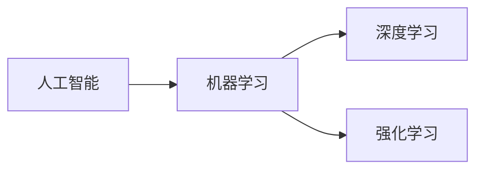

## 1. 背景介绍

人工智能（Artificial Intelligence, AI）作为计算机科学的一个分支，已经渗透到我们生活的方方面面。从简单的自动化工具到复杂的决策系统，AI的应用范围不断扩大，其影响力日益增强。随着技术的进步，AI的发展已经从规则引擎和专家系统，演变到现在的深度学习和强化学习。本文将深入探讨AI的核心原理，并通过代码实例帮助读者更好地理解和应用这些原理。

## 2. 核心概念与联系

在深入研究AI之前，我们需要理解几个核心概念及其之间的联系：

- **机器学习（Machine Learning, ML）**：是AI的一个子集，指的是让机器通过数据学习知识或技能。
- **深度学习（Deep Learning, DL）**：是机器学习的一个分支，通过模拟人脑神经网络结构的深层神经网络来学习数据的表示。
- **强化学习（Reinforcement Learning, RL）**：是机器学习的另一个分支，通过与环境的交互来学习最优策略。

这些概念之间的联系可以用以下Mermaid流程图表示：



## 3. 核心算法原理具体操作步骤

以深度学习中的卷积神经网络（Convolutional Neural Network, CNN）为例，其核心算法原理的操作步骤包括：

1. 输入数据预处理
2. 卷积层提取特征
3. 池化层降维
4. 全连接层分类
5. 反向传播优化参数

## 4. 数学模型和公式详细讲解举例说明

以CNN中的卷积操作为例，其数学模型可以表示为：

$$
f_{ij} = \sum_m \sum_n I_{(i+m)(j+n)} K_{mn}
$$

其中，$f_{ij}$ 是卷积后的特征图在位置 $(i, j)$ 的值，$I$ 是输入图像，$K$ 是卷积核，$m$ 和 $n$ 是卷积核的尺寸。

## 5. 项目实践：代码实例和详细解释说明

以TensorFlow框架为例，实现一个简单的CNN模型：

```python
import tensorflow as tf

model = tf.keras.models.Sequential([
    tf.keras.layers.Conv2D(32, (3, 3), activation='relu', input_shape=(28, 28, 1)),
    tf.keras.layers.MaxPooling2D((2, 2)),
    tf.keras.layers.Flatten(),
    tf.keras.layers.Dense(64, activation='relu'),
    tf.keras.layers.Dense(10, activation='softmax')
])

model.compile(optimizer='adam',
              loss='sparse_categorical_crossentropy',
              metrics=['accuracy'])

# 这里省略了数据加载和模型训练的代码
```

## 6. 实际应用场景

AI技术在许多领域都有广泛的应用，例如：

- 医疗诊断：利用深度学习进行医学图像分析，辅助诊断疾病。
- 自动驾驶：通过机器学习算法处理传感器数据，实现车辆的自动驾驶。
- 推荐系统：使用机器学习模型根据用户行为推荐相关内容。

## 7. 工具和资源推荐

- **TensorFlow**：一个开源的机器学习框架，适合进行深度学习项目。
- **PyTorch**：另一个流行的开源机器学习库，以其动态计算图而闻名。
- **Scikit-learn**：一个简单高效的数据挖掘和数据分析工具。

## 8. 总结：未来发展趋势与挑战

AI技术的未来发展趋势包括更深层次的神经网络、更智能的自适应系统以及更广泛的应用领域。同时，我们也面临着数据隐私、算法偏见和模型解释性等挑战。

## 9. 附录：常见问题与解答

- **Q1**: 深度学习模型的训练需要哪些资源？
- **A1**: 主要需要大量的标注数据和强大的计算资源。

- **Q2**: 如何评估AI模型的性能？
- **A2**: 通常使用准确率、召回率、F1分数等指标进行评估。

- **Q3**: AI模型如何避免过拟合？
- **A3**: 可以使用数据增强、正则化、Dropout等技术来减少过拟合。

作者：禅与计算机程序设计艺术 / Zen and the Art of Computer Programming