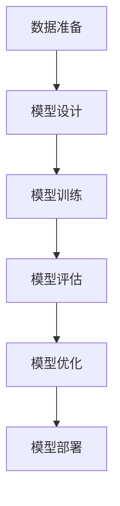
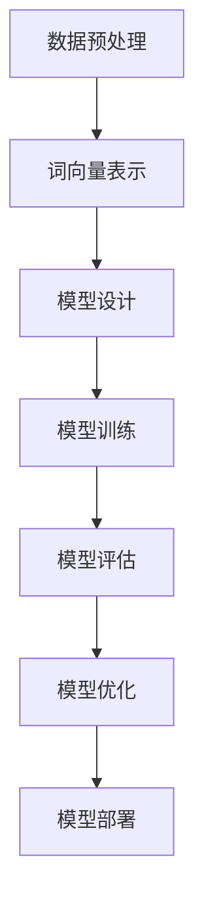
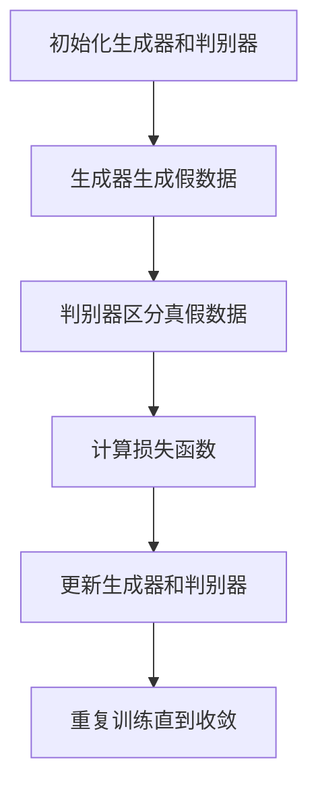

# AIGC从入门到实战：可能消失的职业和新出现的机会

## 1.背景介绍

人工智能生成内容（AIGC，Artificial Intelligence Generated Content）是近年来迅速崛起的技术领域。它利用深度学习、自然语言处理和计算机视觉等技术，自动生成文本、图像、音频和视频等多种形式的内容。AIGC的出现不仅改变了内容创作的方式，也对许多传统职业产生了深远影响，同时也带来了新的职业机会。

## 2.核心概念与联系

### 2.1 人工智能生成内容（AIGC）

AIGC是指利用人工智能技术自动生成各种形式的内容。其核心技术包括深度学习、自然语言处理（NLP）、计算机视觉（CV）和生成对抗网络（GANs）等。

### 2.2 深度学习

深度学习是机器学习的一个分支，利用多层神经网络来模拟人脑的工作方式。它在图像识别、语音识别和自然语言处理等领域取得了显著成果。

### 2.3 自然语言处理（NLP）

NLP是人工智能的一个重要分支，旨在使计算机能够理解、解释和生成人类语言。NLP技术在文本生成、情感分析和机器翻译等方面有广泛应用。

### 2.4 计算机视觉（CV）

计算机视觉是研究如何使计算机能够“看见”和理解图像和视频的技术。它在图像生成、图像识别和视频分析等领域有重要应用。

### 2.5 生成对抗网络（GANs）

GANs是一种深度学习模型，由生成器和判别器两个部分组成。生成器负责生成新的数据，判别器则负责区分生成的数据和真实数据。通过相互对抗，GANs能够生成高质量的图像、音频和视频等内容。

## 3.核心算法原理具体操作步骤

### 3.1 深度学习模型的训练

深度学习模型的训练过程包括数据准备、模型设计、训练和评估等步骤。以下是一个典型的深度学习模型训练流程：



### 3.2 自然语言处理的关键技术

NLP的关键技术包括词向量表示、序列到序列模型和注意力机制等。以下是一个典型的NLP模型训练流程：



### 3.3 生成对抗网络的训练

GANs的训练过程包括生成器和判别器的交替训练。以下是一个典型的GANs训练流程：



## 4.数学模型和公式详细讲解举例说明

### 4.1 深度学习中的反向传播算法

反向传播算法是深度学习模型训练的核心。其基本思想是通过计算损失函数的梯度，反向传播误差并更新模型参数。以下是反向传播算法的数学公式：

$$
\frac{\partial L}{\partial w} = \frac{\partial L}{\partial y} \cdot \frac{\partial y}{\partial w}
$$

其中，$L$ 是损失函数，$w$ 是模型参数，$y$ 是模型输出。

### 4.2 自然语言处理中的词向量表示

词向量表示是NLP中的重要技术。通过将词语映射到高维向量空间，可以捕捉词语之间的语义关系。以下是词向量表示的数学公式：

$$
\text{Word2Vec}(w) = \frac{1}{|C(w)|} \sum_{c \in C(w)} \text{context}(c)
$$

其中，$w$ 是目标词，$C(w)$ 是目标词的上下文，$\text{context}(c)$ 是上下文词的向量表示。

### 4.3 生成对抗网络中的损失函数

GANs的损失函数包括生成器的损失和判别器的损失。以下是GANs的损失函数公式：

$$
L_D = -\left( \mathbb{E}_{x \sim p_{data}(x)}[\log D(x)] + \mathbb{E}_{z \sim p_z(z)}[\log(1 - D(G(z)))] \right)
$$

$$
L_G = -\mathbb{E}_{z \sim p_z(z)}[\log D(G(z))]
$$

其中，$D$ 是判别器，$G$ 是生成器，$x$ 是真实数据，$z$ 是噪声向量。

## 5.项目实践：代码实例和详细解释说明

### 5.1 深度学习项目实例

以下是一个使用TensorFlow实现的简单深度学习模型的代码示例：

```python
import tensorflow as tf
from tensorflow.keras import layers, models

# 数据准备
(train_images, train_labels), (test_images, test_labels) = tf.keras.datasets.mnist.load_data()
train_images = train_images / 255.0
test_images = test_images / 255.0

# 模型设计
model = models.Sequential([
    layers.Flatten(input_shape=(28, 28)),
    layers.Dense(128, activation='relu'),
    layers.Dense(10, activation='softmax')
])

# 模型编译
model.compile(optimizer='adam',
              loss='sparse_categorical_crossentropy',
              metrics=['accuracy'])

# 模型训练
model.fit(train_images, train_labels, epochs=5)

# 模型评估
test_loss, test_acc = model.evaluate(test_images, test_labels)
print(f'Test accuracy: {test_acc}')
```

### 5.2 自然语言处理项目实例

以下是一个使用Transformers库实现的文本生成模型的代码示例：

```python
from transformers import GPT2LMHeadModel, GPT2Tokenizer

# 加载预训练模型和分词器
model = GPT2LMHeadModel.from_pretrained('gpt2')
tokenizer = GPT2Tokenizer.from_pretrained('gpt2')

# 输入文本
input_text = "Once upon a time"
input_ids = tokenizer.encode(input_text, return_tensors='pt')

# 生成文本
output = model.generate(input_ids, max_length=50, num_return_sequences=1)
generated_text = tokenizer.decode(output[0], skip_special_tokens=True)
print(generated_text)
```

### 5.3 生成对抗网络项目实例

以下是一个使用PyTorch实现的简单GANs的代码示例：

```python
import torch
import torch.nn as nn
import torch.optim as optim
from torchvision import datasets, transforms

# 定义生成器
class Generator(nn.Module):
    def __init__(self):
        super(Generator, self).__init__()
        self.main = nn.Sequential(
            nn.Linear(100, 256),
            nn.ReLU(True),
            nn.Linear(256, 512),
            nn.ReLU(True),
            nn.Linear(512, 1024),
            nn.ReLU(True),
            nn.Linear(1024, 28*28),
            nn.Tanh()
        )

    def forward(self, x):
        return self.main(x).view(-1, 1, 28, 28)

# 定义判别器
class Discriminator(nn.Module):
    def __init__(self):
        super(Discriminator, self).__init__()
        self.main = nn.Sequential(
            nn.Linear(28*28, 1024),
            nn.LeakyReLU(0.2, inplace=True),
            nn.Linear(1024, 512),
            nn.LeakyReLU(0.2, inplace=True),
            nn.Linear(512, 256),
            nn.LeakyReLU(0.2, inplace=True),
            nn.Linear(256, 1),
            nn.Sigmoid()
        )

    def forward(self, x):
        return self.main(x.view(-1, 28*28))

# 数据准备
transform = transforms.Compose([transforms.ToTensor(), transforms.Normalize((0.5,), (0.5,))])
train_dataset = datasets.MNIST(root='./data', train=True, transform=transform, download=True)
train_loader = torch.utils.data.DataLoader(dataset=train_dataset, batch_size=64, shuffle=True)

# 初始化生成器和判别器
G = Generator()
D = Discriminator()

# 定义损失函数和优化器
criterion = nn.BCELoss()
optimizer_G = optim.Adam(G.parameters(), lr=0.0002)
optimizer_D = optim.Adam(D.parameters(), lr=0.0002)

# 训练GANs
for epoch in range(50):
    for i, (images, _) in enumerate(train_loader):
        # 训练判别器
        real_labels = torch.ones(images.size(0), 1)
        fake_labels = torch.zeros(images.size(0), 1)
        outputs = D(images)
        d_loss_real = criterion(outputs, real_labels)
        real_score = outputs

        z = torch.randn(images.size(0), 100)
        fake_images = G(z)
        outputs = D(fake_images.detach())
        d_loss_fake = criterion(outputs, fake_labels)
        fake_score = outputs

        d_loss = d_loss_real + d_loss_fake
        optimizer_D.zero_grad()
        d_loss.backward()
        optimizer_D.step()

        # 训练生成器
        z = torch.randn(images.size(0), 100)
        fake_images = G(z)
        outputs = D(fake_images)
        g_loss = criterion(outputs, real_labels)

        optimizer_G.zero_grad()
        g_loss.backward()
        optimizer_G.step()

    print(f'Epoch [{epoch+1}/50], d_loss: {d_loss.item()}, g_loss: {g_loss.item()}, D(x): {real_score.mean().item()}, D(G(z)): {fake_score.mean().item()}')
```

## 6.实际应用场景

### 6.1 内容创作

AIGC在内容创作领域有广泛应用，包括自动生成新闻报道、小说、诗歌和广告文案等。通过利用NLP技术，AIGC可以生成高质量的文本内容，极大地提高了内容创作的效率。

### 6.2 图像生成

AIGC在图像生成领域也有重要应用，包括生成艺术作品、设计图案和虚拟现实内容等。通过利用GANs技术，AIGC可以生成逼真的图像，满足不同领域的需求。

### 6.3 音频和视频生成

AIGC在音频和视频生成领域的应用也越来越广泛，包括生成音乐、配音和视频剪辑等。通过利用深度学习和GANs技术，AIGC可以生成高质量的音频和视频内容，极大地丰富了多媒体内容的创作。

### 6.4 数据增强

AIGC还可以用于数据增强，通过生成新的数据样本来扩展训练数据集，提高模型的泛化能力。例如，在医学影像分析中，AIGC可以生成新的医学图像，帮助提高模型的诊断准确率。

## 7.工具和资源推荐

### 7.1 深度学习框架

- TensorFlow：一个开源的深度学习框架，支持多种平台和语言，广泛应用于学术研究和工业界。
- PyTorch：一个开源的深度学习框架，具有灵活的动态计算图和强大的GPU加速能力，广泛应用于学术研究和工业界。

### 7.2 自然语言处理工具

- Transformers：一个开源的NLP库，提供了多种预训练模型和工具，支持文本生成、情感分析和机器翻译等任务。
- SpaCy：一个开源的NLP库，提供了高效的文本处理工具和预训练模型，支持多种语言和任务。

### 7.3 生成对抗网络工具

- GANs：一个开源的GANs库，提供了多种GANs模型和工具，支持图像生成、音频生成和视频生成等任务。
- StyleGAN：一个开源的GANs模型，能够生成高质量的图像，广泛应用于艺术创作和虚拟现实等领域。

## 8.总结：未来发展趋势与挑战

AIGC技术在内容创作、图像生成、音频和视频生成等领域展现了巨大的潜力。然而，AIGC技术的发展也面临一些挑战，包括数据隐私、伦理问题和技术瓶颈等。未来，随着技术的不断进步和应用的不断扩展，AIGC将会在更多领域发挥重要作用，同时也需要我们不断探索和解决面临的挑战。

## 9.附录：常见问题与解答

### 9.1 AIGC技术的核心是什么？

AIGC技术的核心是利用深度学习、自然语言处理和生成对抗网络等技术，自动生成各种形式的内容。

### 9.2 AIGC技术的应用场景有哪些？

AIGC技术的应用场景包括内容创作、图像生成、音频和视频生成、数据增强等。

### 9.3 如何学习AIGC技术？

学习AIGC技术可以从学习深度学习、自然语言处理和生成对抗网络等基础知识开始，利用开源的深度学习框架和工具进行实践，并不断探索和应用新的技术和方法。

### 9.4 AIGC技术的发展面临哪些挑战？

AIGC技术的发展面临数据隐私、伦理问题和技术瓶颈等挑战。