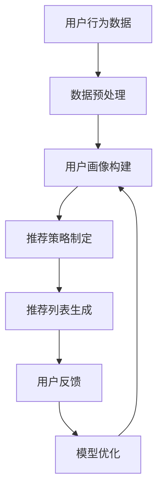

# AI人工智能 Agent：在个性化推荐中的应用

## 1.背景介绍

随着信息时代的到来,数据的爆炸式增长使得人们面临着信息过载的困扰。在这种背景下,个性化推荐系统应运而生,旨在从海量信息中为用户挑选出最感兴趣的内容。个性化推荐系统已广泛应用于电子商务、在线视频、新闻推送等多个领域,显著提高了用户体验。

传统的推荐系统主要基于协同过滤算法,通过分析用户的历史行为数据(如浏览记录、购买记录等)来发现用户的兴趣偏好,从而为其推荐感兴趣的物品。然而,这种方法存在一些缺陷,如冷启动问题、数据稀疏性问题等,难以充分挖掘用户的深层次需求。

近年来,人工智能技术的迅猛发展为个性化推荐系统带来了新的契机。基于深度学习的人工智能 Agent 能够自主学习用户行为模式,并根据上下文环境做出智能化决策,从而更好地满足用户的个性化需求。

## 2.核心概念与联系

### 2.1 人工智能 Agent

人工智能 Agent 是一种能够感知环境、处理信息、做出决策并执行行为的自主系统。在个性化推荐场景中,AI Agent 可以被视为一个虚拟助手,通过与用户交互来学习其偏好,并提供个性化的推荐服务。

AI Agent 通常由以下几个核心模块组成:

- **感知模块**:用于获取用户行为数据、上下文信息等输入。
- **学习模块**:基于输入数据,利用机器学习算法构建用户画像模型。
- **决策模块**:根据学习到的用户偏好,结合推荐策略,输出推荐列表。
- **交互模块**:与用户进行自然语言交互,获取反馈并优化推荐策略。

### 2.2 个性化推荐

个性化推荐旨在为每个用户推荐最感兴趣的物品,包括商品、新闻、视频等。推荐系统需要解决以下两个关键问题:

1. **用户建模**:如何准确描述用户的兴趣偏好?
2. **物品匹配**:如何为用户匹配最合适的物品?

传统的协同过滤算法主要利用用户的历史行为数据(如浏览记录、购买记录等)来建模用户兴趣,然后基于相似用户或相似物品进行推荐。而AI Agent则可以通过与用户交互、分析上下文信息等方式,更深入地挖掘用户的潜在需求,从而提供更加个性化的推荐服务。

## 3.核心算法原理具体操作步骤  

基于AI Agent的个性化推荐系统通常采用以下流程:



1. **数据预处理**:对用户行为日志、上下文信息等原始数据进行清洗、标准化、特征提取等预处理,为后续的模型训练做好准备。

2. **用户画像构建**:基于预处理后的数据,利用机器学习算法(如深度学习、协同过滤等)构建用户画像模型,描述用户的兴趣偏好。常用的用户画像表示方法包括:
   - 隐语义模型(如矩阵分解、Word2Vec等)
   - 深度神经网络模型(如自编码器、递归神经网络等)

3. **推荐策略制定**:根据推荐场景的特点,结合用户画像信息,制定合理的推荐策略。常见的推荐策略包括:
   - 基于内容的推荐:根据物品内容特征与用户画像的相似度进行推荐
   - 协同过滤推荐:基于相似用户或相似物品进行推荐
   - 上下文推荐:结合用户的时间、地点、心情等上下文信息进行推荐
   - 多策略融合:综合多种推荐策略,提高推荐效果

4. **推荐列表生成**:将制定的推荐策略应用于候选物品集,根据排序算法生成个性化的推荐列表。

5. **用户反馈**:监测用户对推荐结果的反馈(如点击、购买、评分等行为),作为优化模型的重要依据。

6. **模型优化**:基于用户反馈,通过强化学习、在线学习等技术,持续优化用户画像模型和推荐策略,提高推荐质量。

上述流程是一个闭环过程,AI Agent 会不断地从用户交互中学习,并对推荐策略进行动态调整,从而实现更加精准的个性化推荐。

## 4.数学模型和公式详细讲解举例说明

在个性化推荐系统中,常用的数学模型和公式包括:

### 4.1 隐语义模型

隐语义模型旨在将高维稀疏的用户-物品交互数据映射到低维的潜在因子空间,从而发现用户和物品的隐含模式。常用的隐语义模型包括:

1. **矩阵分解**

矩阵分解将用户-物品交互矩阵 $R$ 分解为用户潜在因子矩阵 $U$ 和物品潜在因子矩阵 $V$ 的乘积:

$$R \approx U^TV$$

其中 $U \in \mathbb{R}^{m \times k}$, $V \in \mathbb{R}^{n \times k}$, $k$ 为潜在因子的维数。通过优化损失函数:

$$\min_{U,V} \sum_{i,j} \left(R_{ij} - U_i^TV_j\right)^2 + \lambda\left(\|U\|_F^2 + \|V\|_F^2\right)$$

可以学习到最优的 $U$ 和 $V$,从而预测用户对物品的兴趣程度。

2. **Word2Vec**

Word2Vec 是一种将词映射到低维向量空间的语言模型,在推荐系统中也可用于学习用户和物品的向量表示。对于用户 $u$ 和物品 $i$,Word2Vec 试图最大化目标函数:

$$\max_{\theta} \frac{1}{|D|} \sum_{(u,i) \in D} \log P(i|u;\theta)$$

其中 $D$ 为用户-物品交互数据集, $\theta$ 为模型参数。通过优化该目标函数,可以获得用户向量 $\vec{u}$ 和物品向量 $\vec{i}$,从而计算它们的相似度作为推荐依据。

### 4.2 深度神经网络模型

除了隐语义模型,深度神经网络也被广泛应用于个性化推荐系统,用于构建复杂的用户画像和预测模型。

1. **自编码器(AutoEncoder)**

自编码器是一种无监督学习模型,可用于学习数据的紧致表示。在推荐系统中,自编码器常被用于从高维稀疏的用户行为数据中提取低维密集的用户画像向量。

对于用户 $u$ 的行为向量 $\vec{x}_u$,自编码器将其映射到隐藏层 $\vec{h}_u$,再重构为输出向量 $\vec{y}_u$:

$$\vec{h}_u = f_\theta(\vec{x}_u)$$
$$\vec{y}_u = g_\phi(\vec{h}_u)$$

其中 $f_\theta$ 为编码器, $g_\phi$ 为解码器,通过优化重构损失:

$$\mathcal{L}(\vec{x}_u, \vec{y}_u) = \|\vec{x}_u - \vec{y}_u\|^2$$

可以学习到最优的编码器参数 $\theta$,从而将原始的高维稀疏数据 $\vec{x}_u$ 映射到低维紧致的用户画像向量 $\vec{h}_u$。

2. **递归神经网络(RNN)**

递归神经网络擅长处理序列数据,在推荐系统中可用于建模用户的行为序列,捕捉用户的动态兴趣偏移。

对于用户 $u$ 的行为序列 $\{x_u^1, x_u^2, \cdots, x_u^T\}$,RNN 在每个时间步 $t$ 读入当前输入 $x_u^t$,并结合上一时间步的隐藏状态 $h_u^{t-1}$,计算当前隐藏状态 $h_u^t$:

$$h_u^t = \phi(W_hx_u^t + U_hh_u^{t-1} + b_h)$$

其中 $W_h$、$U_h$ 和 $b_h$ 为模型参数,通过反向传播算法可以学习到最优的参数值。最终,可以将最后一个隐藏状态 $h_u^T$ 作为用户 $u$ 的画像向量,用于个性化推荐。

## 5.项目实践:代码实例和详细解释说明

为了更好地理解基于AI Agent的个性化推荐系统,我们提供了一个基于深度学习的电影推荐系统的实例代码。该系统采用自编码器和RNN相结合的混合模型,用于学习用户的动态画像,并为其推荐感兴趣的电影。

### 5.1 数据预处理

我们使用了MovieLens 100K数据集,包含10万条电影评分记录。首先,我们对原始数据进行预处理:

```python
import pandas as pd

# 加载数据
ratings = pd.read_csv('ml-100k/u.data', delimiter='\t', names=['user_id', 'movie_id', 'rating', 'timestamp'])

# 将用户ID和电影ID映射为连续值
user_ids = ratings['user_id'].unique().tolist()
user2user_encoded = {x: i for i, x in enumerate(user_ids)}
userencoded2user = {i: x for i, x in enumerate(user_ids)}

movie_ids = ratings['movie_id'].unique().tolist()
movie2movie_encoded = {x: i for i, x in enumerate(movie_ids)}
movieencoded2movie = {i: x for i, x in enumerate(movie_ids)}

ratings['user'] = ratings['user_id'].apply(lambda x: user2user_encoded[x])
ratings['movie'] = ratings['movie_id'].apply(lambda x: movie2movie_encoded[x])

# 划分训练集和测试集
from sklearn.model_selection import train_test_split
X = ratings[['user', 'movie']].values
y = ratings['rating'].values
X_train, X_test, y_train, y_test = train_test_split(X, y, test_size=0.2, random_state=42)
```

### 5.2 模型构建

我们使用PyTorch构建了一个基于自编码器和RNN的混合模型:

```python
import torch
import torch.nn as nn

class AutoEncoder(nn.Module):
    def __init__(self, num_users, num_movies, embedding_size):
        super().__init__()
        self.user_embedding = nn.Embedding(num_users, embedding_size)
        self.movie_embedding = nn.Embedding(num_movies, embedding_size)
        self.encoder = nn.Linear(2 * embedding_size, embedding_size)
        self.decoder = nn.Linear(embedding_size, 2 * embedding_size)

    def forward(self, users, movies):
        user_embeds = self.user_embedding(users)
        movie_embeds = self.movie_embedding(movies)
        inputs = torch.cat([user_embeds, movie_embeds], dim=1)
        encoded = self.encoder(inputs)
        decoded = self.decoder(encoded)
        return encoded, decoded

class RNNModel(nn.Module):
    def __init__(self, num_users, num_movies, embedding_size, hidden_size):
        super().__init__()
        self.autoencoder = AutoEncoder(num_users, num_movies, embedding_size)
        self.rnn = nn.GRU(2 * embedding_size, hidden_size, batch_first=True)
        self.output = nn.Linear(hidden_size, 1)

    def forward(self, users, movies, hidden=None):
        encoded, decoded = self.autoencoder(users, movies)
        inputs = torch.cat([decoded, encoded], dim=2)
        outputs, hidden = self.rnn(inputs, hidden)
        predictions = self.output(outputs)
        return predictions, hidden

# 模型参数
num_users = len(user_ids)
num_movies = len(movie_ids)
embedding_size = 32
hidden_size = 64

# 实例化模型
model = RNNModel(num_users, num_movies, embedding_size, hidden_size)
```

该模型首先使用自编码器学习用户和电影的embedding向量,然后将这些向量作为输入,通过RNN捕捉用户的动态兴趣偏移,最终输出对应的评分预测值。

### 5.3 模型训练